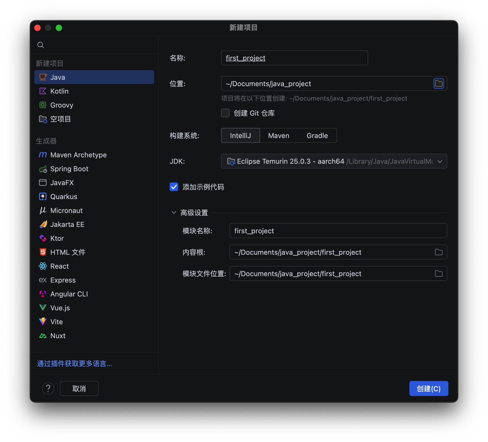
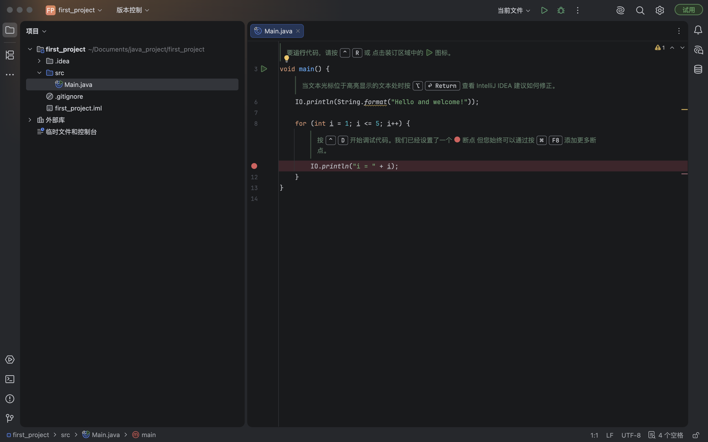
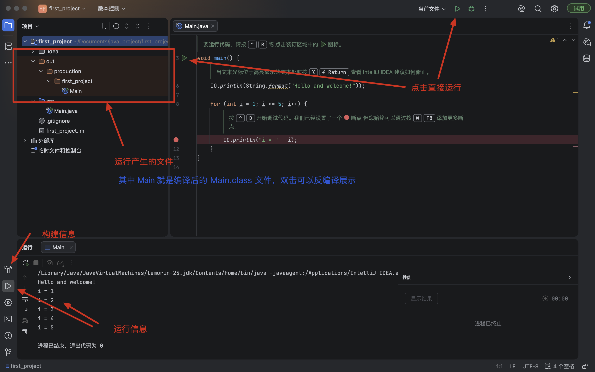
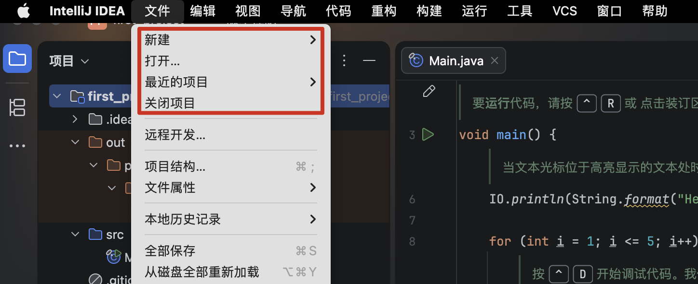
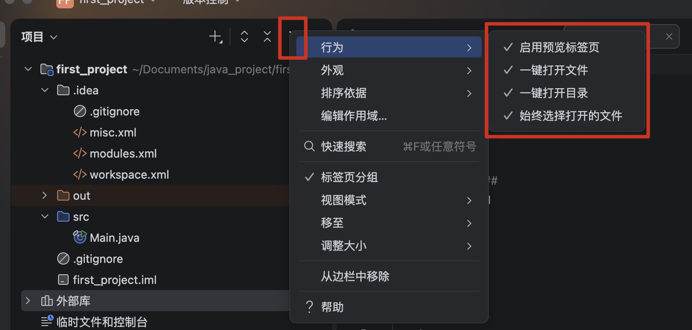
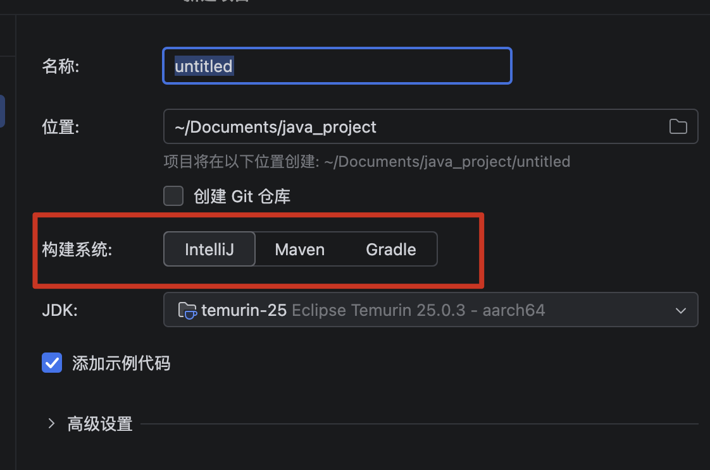
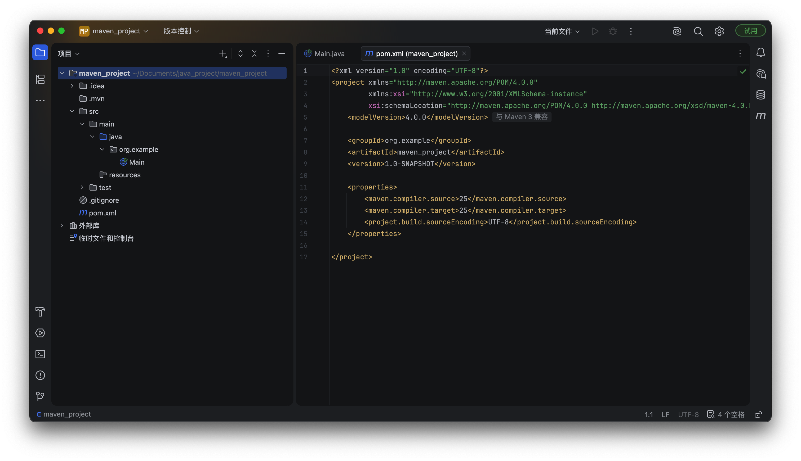
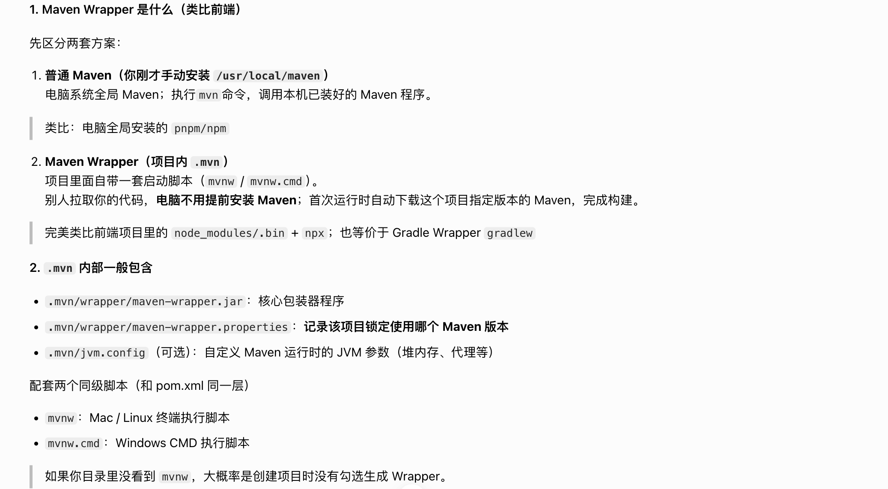
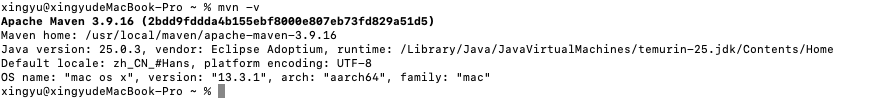
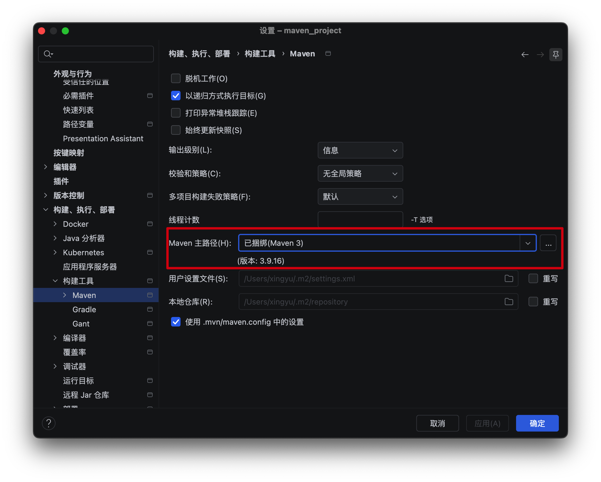

### 一、相关术语

- 与前端对应映射表

| Java 后端名词 | 前端等价类比 | 通俗解释 |
| --- | --- | --- |
| Java SE / JDK(SDK) | JavaScript 语言 + 浏览器原生 API / Node.js | 最底层基础语言。JS=Java；浏览器 DOM/BOM ≈ JDK 提供的基础类库。没有它，上层框架全部无法运行。 |
| Spring Framework（Spring） | Vue 核心库（vue.js 裸框架，不带 vue-cli） | 基础核心框架，提供核心能力（响应式 / IOC），但是原生使用配置麻烦，需要自己手动搭路由、webpack、各类库整合。 |
| Spring Boot | Vue CLI / Vite + Vue 项目模板 | 基于 Vue 封装好的脚手架。内置打包工具、默认配置，一键创建项目，不用从零搭建 Webpack。👉 用来开发单个前端单体项目（对应后端单体 Boot 服务） |
| Spring Cloud | 前端微前端方案（qiankun、module federation） | 把多个独立 Vue 项目（一个个 Spring Boot）整合起来，做成大型分布式系统。多个独立应用互相通信、统一调度。 |
| Maven | npm / yarn / pnpm | 依赖管理 + 项目构建工具 |
| pom.xml | package.json | 项目配置文件，声明依赖与脚本命令 |
| Maven 本地仓库～/.m2/repository | node_modules | 存放下载好的第三方库 |
| Maven 中央仓库 / 阿里云镜像 | npm 官方源 / 淘宝 npmmirror | 第三方包服务器 |
| mvn package | npm run build | 编译打包产出最终程序 |

### 二、开发环境搭建

#### 2.1 安装 JDK

- 访问 [Adoptium](https://adoptium.net/zh-CN) 下载 JDK，目前最新是 JDK 25 LTS

- 下载完成后，双击安装完成操作，查看 JDK 安装路径 `/usr/libexec/java_home -V`，类似下面

```bash
Matching Java Virtual Machines (1):
    25.0.3 (arm64) "Eclipse Adoptium" - "OpenJDK 25.0.3" /Library/Java/JavaVirtualMachines/temurin-25.jdk/Contents/Home
/Library/Java/JavaVirtualMachines/temurin-25.jdk/Contents/Home
```

- 配置环境变量

```bash
#打开配置文件（使用 zsh）
open ~/.zshrc
#添加内容
export JAVA_HOME=/Library/Java/JavaVirtualMachines/temurin-25.jdk/Contents/Home
export PATH=$JAVA_HOME/bin:$PATH
#保存并关闭文件后，运行以下命令
source ~/.zshrc
#验证安装
java -version   # 应显示安装的版本
```

- 验证安装

  - 本地创建一个 java 文件 `HelloWorld.java`，内容如下

```java
public class HelloWorld {
    public static void main(String[] args) {
        System.out.println("Hello World!");
    }
}
```

- 终端使用 `javac HelloWorld.java` 编译，应输出 `HelloWorld.class` 文件

- 再使用 `java HelloWorld` 运行，应输出 `Hello World!`


#### 2.2 下载 IDEA

- 访问 [IntelliJ IDEA](https://www.jetbrains.com.cn/idea/) 下载 IDEA

- 然后创建一个 java 项目




- 点击运行

    - `.idea` 目录下是 IDEA 项目的配置文件，包括项目名称、路径、依赖等。一般不提交到 git 仓库。

    - `src` 目录下是项目的源代码目录，包括 java 文件、资源文件等。

    - `out` 目录下是项目的输出目录，包括编译后的 class 文件等。

    - 外部库目录下是项目的外部依赖库，包括 jar 文件等。

   

::: tip
- IDEA是以项目为单位进行管理的，如果我们想写一个新的Java项目，可以退出当前项目重新创建



- 和 vscode 有本质区别，vscode 是一个基于文件的编辑器，而 IDEA 是一个以文件为单位进行管理的编辑器

    - 所以，vscode 可以打开多个项目，而 IDEA 只能打开一个项目
:::

- 为了有更好的开发体验，建议下面的配置都选上




### 三、MAVEN

#### 3.1 使用介绍

- 术语部分有说，MAVEN 是一个基于 XML 的项目构建工具，用于管理项目的依赖、构建项目、运行测试等。

    - 类似于前端的 npm，用于管理项目的依赖、构建项目、运行测试等。

- 新建项目时，有让选构建系统




- 目前默认是使用 IntelliJ ，但一般情况下，建议使用 Maven 来管理项目的依赖、构建项目、运行测试等

    - 初始学习仍使用 IntelliJ ，后续根据项目需求选择是否使用 Maven

- 测试选择 Maven 后创建项目



- 多了几个初始目录和文件

    - `pom.xml` 是 Maven 项目的配置文件，声明项目的依赖与脚本命令。

    - `.mvn` 是 Maven Wrapper 的配套目录，也就是「Maven 包装器」。作用是让项目脱离本机预先安装好的 Maven，独立自带一套 Maven 运行环境。




- 已经手动在 Mac 上装好了独立 Maven（/usr/local/maven），日常开发可以直接用全局 `mvn` 命令。比如 `mvn package` 、`mvn test` 等。

- 很多开源 SpringBoot 项目默认自带 Maven Wrapper，拉下来直接运行 `./mvnw clean package` 即可，不用强制修改本机环境


::: tip
- 很多新手混淆两个概念：

    - Maven：构建工具本体（你手动安装的）

    - Maven Wrapper：一个启动脚本工具，用来自动下载、调用 Maven；.mvn 就是它的配置目录。
:::

#### 3.2 安装 Maven

- 访问 [Maven 官方](https://maven.apache.org/download.cgi) 下载 Maven（如 apache-maven-3.9.16-bin.tar.gz）

- 解压到指定目录（如 /usr/local/maven）

```bash
#先创建目录在解压
sudo mkdir -p /usr/local/maven
sudo tar -xzvf ~/Downloads/apache-maven-3.9.6-bin.tar.gz -C /usr/local/maven
#打开配置文件（使用 zsh）
open ~/.zshrc
#添加内容
export MAVEN_HOME=/usr/local/maven/apache-maven-3.9.16  # 手动安装路径
export PATH=$MAVEN_HOME/bin:$PATH
#保存并关闭文件后，运行以下命令
source ~/.zshrc
#验证安装
mvn -v  # 应显示安装的版本
```



- 可以在 IDEA 中配置 Maven，选择自己下载的版本，当前已经是最新的了




- 有些时候，一些公司有自己的用户设置文件 `settings.xml`，下面也要跟着更改配置

- 配置这个文件，主要是四个作用

    - 定义本地仓库路径 `<localRepository>`

    - 配置远程仓库镜像（最常用，个人开发必配）

    - 公司私服，绝大多数中大型公司搭建 Maven 私服，存放公司内部开发的私有 jar 包（不能公开到互联网）

    - 其他通用配置，如代理、超时时间等


