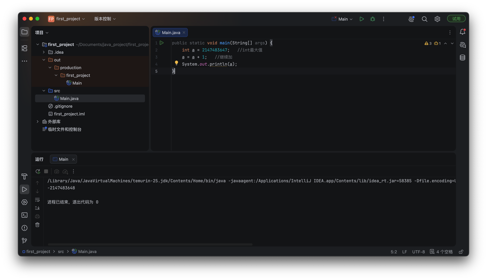
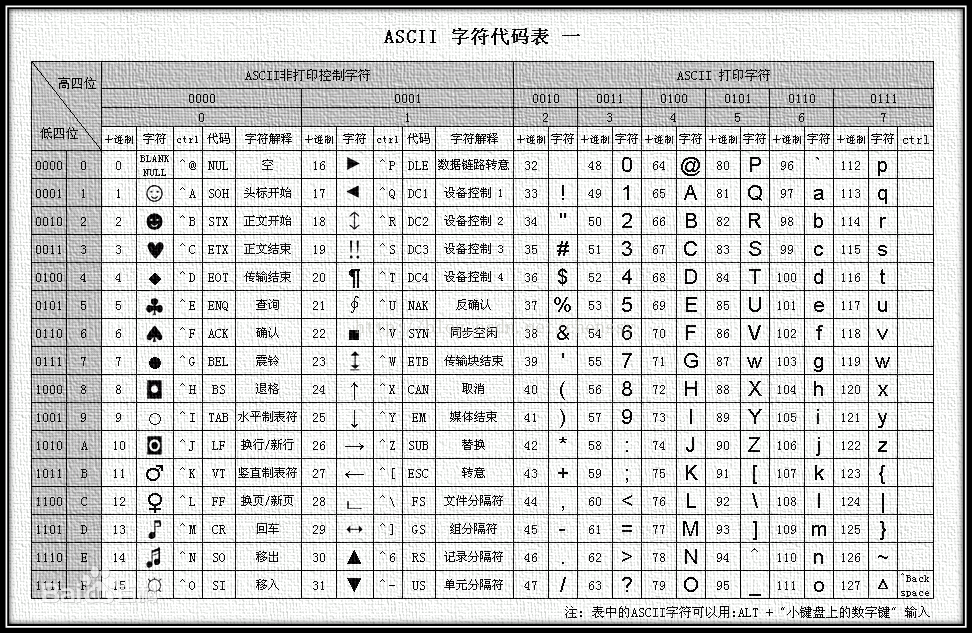

### 一、程序基础

```java
public class Main {
    public static void main(String[] args) {
        System.out.println("Hello World!");
        System.out.println("YYDS!");
    }
}
```

- 这是一个简单的 Java 程序，用于输出 "Hello World!" 和 "YYDS!"。

  - `public static void main(String[] args)` 就是程序的入口方法，必须有，不能省略。也可以称为主方法

::: info
- 在 java 25 中，可以省略 `public class Main` 和 `public`

```java
void main() {
    System.out.println("Hello World!");
    System.out.println("YYDS!");
}
```

- 但是目前，大部分公司还是 java 8，有些到 java 11 甚至 java 17，但肯定不是最新的 25

  - 所以建议还是用老的写法
:::

#### 1.1 注释

- 和前端一样，单行注释用 `//`，多行注释用 `/* ... */`，或者 `/** ... */`

::: info
- 在 java 23 之后，可以使用三斜杠来表示，当然目前也是不推荐

```java
/// # 这个是主类
/// - 主类是执行程序的入口
/// - 主类里面有主方法
public class Main { 
}
```
:::

#### 1.2 变量和常量

- 格式：`变量类型 变量名 = 值;`，或者只声明变量，不赋值 `变量类型 变量名;`

  - **变量必须要有类型声明，但不能重复声明**

- 有时希望变量第一次赋值后不能更改，可以使用 `final` 关键字来声明常量。类似前端的 const

```java
public static void main(String[] args) {
    final int a = 666;   // 在变量前面添加final关键字，表示这是一个常量
    a = 777;    // 常量的值不允许发生修改，编译时会报错

    final int b;
    b = 777;   // 第一次赋值
}
```

### 二、数据类型

- **8 种基本数据类型**：int, long, float, double, char, boolean, byte, short

| 类型名 | 关键字 | 占用字节 | 取值范围 | 作用说明 |
| --- | --- | --- | --- | --- |
| 布尔型 | boolean | 1bit（虚拟机规范，无固定字节） | true / false | 逻辑判断，只有两个值 |
| 字节型 | byte | 1 字节（1 字节对应 8 bit） | -128 ~ 127 | 小范围整数、文件字节流 |
| 短整型 | short | 2 字节 | -32768 ~ 32767 | 较少使用 |
| 整型 | int | 4 字节 | −2³¹ ~ 2³¹−1 | ✅最常用整数类型 |
| 长整型 | long | 8 字节 | −2⁶³ ~ 2⁶³−1 | 超大整数，字面量末尾加 L<br/>`long num = 1000L;` |
| 单精度浮点 | float | 4 字节 | 小数，精度较低 | 字面量末尾加 F<br/>`float f = 3.14F;` |
| 双精度浮点 | double | 8 字节 | 小数，精度更高 | ✅默认小数类型<br/>`double d = 3.14;` |
| 字符型 | char | 2 字节 | Unicode 字符 | 单个字符，单引号包裹<br/>`char c = 'A';` |

::: tip
- 区分重点
  - 'A' → char（单个字符）
  - "A" → String（字符串，属于引用类型，不是基本类型）
:::

- **引用数据类型**：存储的是内存地址，不是值本身，例如类、接口、数组等，

  - 引用类型是开发、可无限扩展的，所以数量是不固定的

  - 字符串 String 是其中一个引用类型，`String s = "2121";`


#### 2.1 整数类型

- byte 字节型 （8个bit，也就是1个字节）范围：-128~+127

- short 短整形（16个bit，也就是2个字节）范围：-32768~+32767
- int 整形（32个bit，也就是4个字节）最常用的类型：-2147483648 ~ +2147483647
- long 长整形（64个bit，也就是8个字节）范围：-9223372036854775808 ~ +9223372036854775807

```java
public static void main(String[] args) {
    short a = 10;
    int b = a;   // 小的类型可以直接传递给表示范围更大的类型
    System.out.println(b);

    long c = 922337203685477580L;   // 字面量末尾加 L 表示 long 类型
    System.out.println(c);
}
```

- 注意：在进行类型转换时，要小心数据丢失和精度损失。这是**隐式类型转换**

::: tip
- 实际上在为变量赋一个常量数值时，也发生了隐式类型转换

```java
public static void main(String[] args) {
   byte b = 10;    // 这里的整数常量10，实际上默认情况下是int类型，但是由于正好在对应类型可以表示的范围内，所以说直接转换为了byte类型的值
}
```

- 但是，`long a = 922337203685477580;` 会报错，因为字面量末尾没有 L，所以默认是 int 类型，而 int 类型的范围是 -2³¹ ~ 2³¹−1，所以会报错
:::


- 字面量可以有多种写法，比如下划线、8进制、16进制

```java
public static void main(String[] args) {
    int a = 1_000_000;    // 当然这里依然表示的是1000000，没什么区别，但是辨识度会更高
    System.out.println(0xA);
    System.out.println(012);
}
```

- 有一个特殊情况，可以看看，当是 int 最大值时，再 + 1，会得到最小值

  - 因为这里是二进制计算




#### 2.2 浮点类型

- 用来表示小数的

  - float 单精度浮点型 （32bit，4字节）

  - double 双精度浮点型（64bit，8字节）

```java
public static void main(String[] args) {
    double a = 10.5, b = 66;   // 整数类型常量也可以隐式转换到浮点类型
}
```

- 注意，跟整数类型常量一样，小数类型常量默认都是 `double` 类型，所以说如果我们直接给一个float类型赋值：

```java
public static void main(String[] args) {
    float f = 9.9;   // 错误，因为默认是double类型，而float类型只能表示38位有效数字

    float f = 9.9F;   // 这样就可以正常编译通过了

    double a = f;    // 隐式类型转换为double值
    System.out.println(a);    // 由于精度问题，输出 9.899999618530273
}
```

::: tip
- 了解就行，下面这个是可以编译通过的，虽然会丢失精度
```java
public static void main(String[] args) {
    long l = 21731371236768L;
    float f = l;
    System.out.println(f);
}
```

- **总结一下隐式类型转换规则：byte → short(char) → int → long → float → double**
:::


#### 2.3 字符类型

- 可以表示计算机中的任意一个字符（包括中文、英文、标点等一切可以显示出来的字符）

  - 注意，是只能表示单个字符，不能表示字符串，字符串是引用类型，不是基本类型

- `char` 字符型（16个bit，也就是2字节，它不带符号）范围是0 ~ 65535



```java
public static void main(String[] args) {
    char a = 65;
    System.out.println(a);  // 输出 A

    char c = 'A';    // 字符常量值需要使用单引号囊括，并且内部只能有一个字符
    System.out.println(c);

    char d = '中';

    char d = "A"; // 错误，因为字符串是引用类型，不是基本类型
}
```

::: tip
- java 中单引号 ' ' 和双引号 " " 完全不是一回事，不能混用

  - 单引号 '字符' → 代表 char（单个字符）

  - 双引号 "内容" → 代表 String（字符串，可以 0 个、1 个、多个字符）
:::

::: info
- 有一个转译字符，就是反斜杠 \ ，用来表示一些特殊字符
  - `\\` → 示反斜杠
  - `\'` → 表示单引号
  - `\"` → 表示双引号
  - `\n` → 表示换行
  - `\t` → 表示制表符
  - `\r` → 表示回车
  - `\f` → 表示换页符

```java
public static void main(String[] args) {
    String a = "ABC\'d\'";
    System.out.println(a);  // 输出 ABC'd'
}
:::


#### 2.4 布尔类型

- 不是存放数字，而是状态：true 或 false

```java
public static void main(String[] args) {
    boolean b = true;   // 值只能是true或false，不像前端可以传其他值后自动转换为布尔值
    System.out.println(b);
}
```

#### 2.5 局部变量类型推断

- Java 10 引入了 `var` 关键字，可以在局部变量声明时自动推断变量类型，从而简化代码

  - 和前端有点类似，不需要手动指定类型，直接根据赋值的表达式自动推断类型

```java
public static void main(String[] args) {
    var b = true;
    System.out.println(b);
}
```

- 不建议大量使用，因为这样会隐藏类型信息，导致代码可读性下降。主要是该功能出的太晚了


### 三、运算符

#### 3.1 赋值运算符

```java
public static void main(String[] args) {
    int a;
    int b = a = 777;
    int c = 111;
    System.out.println(a);  // 777
    System.out.println(b);  // 777
    System.out.println(c);  // 111
}
```

#### 3.2 算数运算符

- 整数与整数之间的运算，得到的结果也是整数

  - 注意，两个整数在进行除法运算时，得到的结果也是整数（会直接砍掉小数部分，注意不是四舍五入）

- 浮点数与整数之间的运算，得到的结果也是浮点数

```java
public static void main(String[] args) {
    int a = 8, b = 5;
    System.out.println(a / b);  // 1
}
```

- 加法可以实现字符串的拼接

```java
public static void main(String[] args) {
    String str = "伞兵" + true + 1.5 + 'A';
    System.out.println(str);  // 伞兵true1.5A
}
```

#### 3.3 括号运算符

- 括号运算符可以改变运算的优先级，不讲了

- 还可以用来**强制类型转换**

```java
public static void main(String[] args) {
    int a = 10;

    short b = a;   // 错误，因为int类型不能直接赋值给short类型

    short b = (short) a;   // 在括号中填写上强制转换的类型，就可以强制转换到对应的类型了
}
```

- 上面能成功，是因为 a 是10，而10在short类型范围内，所以可以强制转换为short类型。

```java
public static void main(String[] args) {
    int a = 128;   // 已经超出byte的范围了
    byte b = (byte) a;  // 值失真
    System.out.println(b);  // -128
}
```

- 快速得到小数结果

```java
public static void main(String[] args) {
    int a = 8, b = 5;
    double c = (double) (a/b);
    System.out.println(c);  // 1.6
}
```

#### 3.4 自增自减运算符

- `a = a + 1` 等价于 `a++`
- `a = a - 1` 等价于 `a--` 

- 看两个特殊例子: `a++` 和 `++a`，自减等同

```java
public static void main(String[] args) {
    int a = 8;
    int b = a++;   // 先出结果，再自增
    System.out.println(b);  // b得到的是a自增前的值

    int c = 8;
    int d = ++c;   // 先自增，再出结果
    System.out.println(d);   // d得到的是c自增之后的结果
}
```

- 在看一个例子

```java
public static void main(String[] args) {
    int a = 8;
    int b = -a++ + ++a; 
  	// 我们首先来看前面的a，因为正负号和自增是同一个优先级，结合性是从右往左，所以说先计算a++
  	// a++的结果还是8，然后是负号，得到-8
  	// 接着是后面的a，因为此时a已经经过前面变成9了，所以说++a就是先自增，再得到10
  	// 最后得到的结果为 -8 + 10 = 2
    System.out.println(b);  // 2
    System.out.println(a);  // 10
}
```

- 除自增自减玩，还有其他运算符，比如 `+=`、`-=`、`*=`、`/=` 等，都和自增自减运算符类似，只是操作数是两个变量

```java
public static void main(String[] args) {
    int a = 8;
    int b = a += 4;   // +=的运算结果就是自增之后的结果
    System.out.println(b);  // 所以b就是12
}
```

#### 3.5 位运算符

- 位运算符包括：`&` `|` `^` `~`

- `&` → 与操作，两个操作数都为1时，结果为1，否则为0
- `|` → 或操作，两个操作数有一个为1时，结果为1，否则为0
- `^` → 异或操作，两个操作数不同为1，相同为0
- `~` → 取反操作，对操作数的每个位取取反，


```java
public static void main(String[] args) {
    int a = 9, b = 3;
    int c = a & b;    // 进行按位与运算
    int d = a | b;    // 进行按位或运算
    int e = a ^ b;    // 进行按位异或运算
    int f = ~a;    // 进行按位取反运算，得到-9，因为9的二进制是1001，取反后是0110，再加1就是-9
    
    System.out.println(c);  // 1
    System.out.println(d);  // 11
    System.out.println(e);  // 10
    System.out.println(f);  // -10
}
```

- 转换为二进制计算

  - a = 9 = 1001

  - b = 3 = 0011

  - c = a & b = 1001 & 0011 = 0001 = 1
  - d = a | b = 1001 | 0011 = 1011 = 11
  - e = a ^ b = 1001 ^ 0011 = 1010 = 10
  - f = ~a = ~1001 = -9 = -10

- 还有位移运算符，包括：`<<` `>>` `>>>`


#### 3.6 关系运算符

```txt
>   大于
<   小于
==  等于（注意是两个等号连在一起，不是一个等号，使用时不要搞混了）
!=  不等于
>=  大于等于
<=  小于等于
```

- 没有前端里面的 `===` 运算符

```java
public static void main(String[] args) {
    int a = 10, b = 20;
    boolean c = a > b;   //进行判断，如果a > b那么就会得到true，否则会得到false
}
```

#### 3.7 逻辑运算符

- 只有三个：`&&` `||` `!`

- 大部分都会用，看下面这个例子

```java
public static void main(String[] args) {
    int a = 10;
    boolean b = a++ > 10 && ++a == 12;
    System.out.println("a = "+a + ", b = "+b);  // a = 11, b = false
}
```

- 为什么 a 是 11，而不是 12？

  - 因为这是与操作，a++ > 10 位 false 后，直接给出结果，不会再去计算 ++a == 12

- 还有一个三元预算符： `判断语句 ? 结果1 : 结果2`。大部分语言都有，不介绍了


### 四、流程控制

#### 4.1 代码块与作用域

- 大部分语言都有这个，只讲一些 java 语言要注意的

- **Java 不允许嵌套局部变量重名**：内层代码块不能声明与外层局部变量同名的变量

```java
public static void main(String[] args) {
    int a = 1;
    {
        int a = 2; // 编译错误：已在方法中定义变量a
    }
}
```
- **无大括号的 if/for 后不能直接声明变量**：如果 if/for 不写 {}，仅紧跟的第一条语句属于分支；但变量声明不能作为单条分支语句，因为作用域仅一行毫无意义，编译器会直接禁止

```java
public static void main(String[] args) {
    if (flag)
        int a = 1; // 编译错误：此处不允许使用变量声明
}
```

- 变量的使用范围，仅限于其定义时所处的代码块，一旦超出对应的代码块区域，那么就相当于没有这个变量了

```java
public static void main(String[] args) {
    int a = 10;   //此时变量在最外层定义
    {
        int b = 11;
        System.out.println(a);   //处于其作用域内部的代码块可以使用
    }
    System.out.println(a);   //这里肯定也可以使用

    System.out.println(b);   // 编译错误：b在代码块外部，所以不能使用
}
```

#### 4.2 选择结构

- 一种是常用的 `if` `else if` `else` 结构

- 一种是 `switch` 结构

- 嵌套使用

```java
public static void main(String[] args) {
    char c = 'A';
    int score =  2;

    switch (c) {
        case 'A':
            System.out.println("去尖子班！");
            break;
        case 'B':
            if(score >= 90)    //90分以上才是优秀
                System.out.println("优秀");
            else if (score >= 70)    //当上一级if判断失败时，会继续判断这一级
                System.out.println("良好");
            else    //当之前所有的if都判断失败时，才会进入到最后的else语句中
                System.out.println("不及格");
            break;
        default:   //其他情况一律就是下面的代码了
            System.out.println("去读职高，分流");
    }
}
```

::: info
- 在 Java 14 中，官方对 `switch` 进行了增强，下面是语法规则

```java
var res = switch (obj) {   //这里和之前的switch语句是一样的，但是注意这样的switch是有返回值的，所以可以被变量接收
    case [匹配值, ...] -> "优秀";   //case后直接添加匹配值，匹配值可以存在多个，需要使用逗号隔开，使用 -> 来返回如果匹配此case语句的结果
    case ...   //根据不同的分支，可以存在多个case
    default -> "不及格";   //注意，表达式要求必须涵盖所有的可能，所以是需要添加default的
};
```
- 仍是了解即可，不建议使用
:::
:::code-group

```java [原版]
int score = 9;
char grade;
switch (score) {
    case 10:
    case 9:
        grade = 'A';
        break;
    case 8:
        grade = 'B';
        break;
    case 7:
    case 6:
        grade = 'C';
        break;
    default:
        grade = 'D';
}
System.out.println("学生等级为: " + grade);
```
```java [增强版]
int score = 9;
//直接让grade接受switch的结果
char grade = switch (score) {
    case 10, 9 -> 'A';   //case后面直接使用->来指定返回结果
    case 8 -> 'B';
    case 6, 7 -> 'C';  //当存在多个匹配条件时，使用逗号分隔
    default -> 'D';
};  //别忘了这种写法相当于赋值，最后需要加分号
System.out.println("学生等级为: " + grade);
```
:::


#### 4.3 循环结构

- `for (表达式1;表达式2;表达式3) 循环体;`

```java
public static void main(String[] args) {
  	//比如我们希望让刚刚的打印执行3次
    for (int i = 0; i < 3; i++)    //这里我们在for语句中定义一个变量i，然后每一轮i都会自增，直到变成3为止
        System.out.println("伞兵一号卢本伟准备就绪！");   //这样，就会执行三轮循环，每轮循环都会执行紧跟着的这一句打印
}
```

- 可以使用 `continue` 关键字来跳过本轮循环，也可以使用 `break` 来提前终止整个循环

  - 注意在多重循环嵌套下，它们只对离它最近的循环生效（就近原则）

```java
for (int i = 1; i < 4; ++i) {
    for (int j = 1; j < 4; ++j) {
        if(i == j) continue;    //当i == j时加速循环
        System.out.println(i+", "+j);
    }
}
```

- 如果一个代码块中存在多个循环，那么直接对当前代码块的标记执行 `break` 时会直接跳出整个代码块

```java
public static void main(String[] args) {
    outer: {    //直接对整个代码块打标签
        for (int i = 0; i < 10; i++) {
            System.out.println("1");
            if (i == 7){
                System.out.println("2");
                break outer;   // 执行break时，会直接跳出整个代码块，而不是第一个循环
            }
        }

        System.out.println("？？？");   // 不会执行
    }
}
```

- `while(循环条件) 循环体;`

```java
public static void main(String[] args) {
    int i = 100;
    while (i > 0) {
        if(i < 10) break;
        System.out.println(i);
        i /= 2;
    }
}
```

- `do-while`

```java
public static void main(String[] args) {
    int i = 0;
    do {  // 无论满不满足循环条件，先执行循环体里面的内容
        System.out.println("Hello World!");
        i++;
    } while (i < 10);   // 再做判断，如果判断成功，开启下一轮循环，否则结束
}
```


