### 一、类与对象

- 除了面向过程编程，Java 还支持面向对象编程。

- 可以先定义一个类，然后创建许多这个类的实例对象。像这种编程方式就是**面向对象编程**。

#### 1.1 类的定义与对象创建

```java
public class Main {
    ...
}
```
- 这就是定义一个类的代码。之前一直看到的 demo

- 在 IDEA 中，可以有件文件夹新创建一个类。类的命名首字母大写

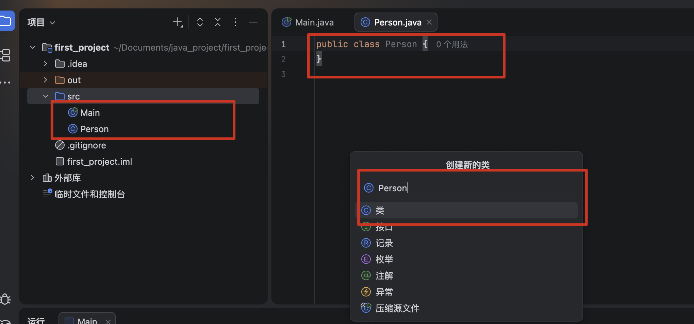

- 这样目录下有了两个 `.java` 文件

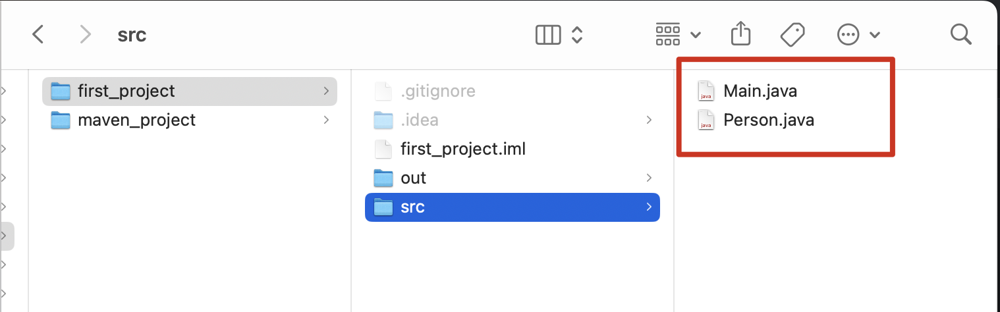

- 类是一系列实物的抽象，所有类会有一些自己的属性和方法

  - 属性就是类的成员变量

  - 属性和方法命名时，一般使用驼峰命名法，即第一个单词小写，后续单词首字母大写


```java
public class Person {   // 这里定义的人类具有三个属性，名字、年龄、性别
    String name;   // 直接在类中定义变量，表示类具有的属性
    int age;
    String sex;

    // 输出方法，接受一个参数，将属性与参数拼接后返回
    public String say(String message) {
        return "我是" + name + "，今年" + age + "岁，性别" + sex + "。" + message;
    }
}
```

:::tip
- 提问：这个为什么是 String say，不是void say ？

  - String say() — 返回数据，由调用者决定怎么用

  - void say() — 直接在方法内部输出，不返回数据

  - 选择根据实际情况来决定，返回数据还是直接输出。void say() 只能打印
:::

- 对象创建就是根据类的定义，创建一个具体的实例：`new 类名()`

```java
public static void main(String[] args) {
    new Person();   // 我们可以使用new关键字来创建某个类的对象，注意new后面需要跟上 类名()
  	// 这里创建出来的，就是一个具体的人了
}
```

#### 1.2 对象的使用

- 对象的使用就是调用对象的方法，或者访问对象的属性。

```java
public void main(String[] args) {
    Person p1 = new Person();
    Person p2 = p1;
    p1.name = "小明";   // 这个修改的是第一个对象的属性
    System.out.println(p2.name);  // 输出小明

    String message = p2.say("你好");
    System.out.println(message);  // 我是小明，今年0岁，性别null。你好
}
```

- 这段代码注意三个事情

  - 创建对象的实例时，需要使用 类名 作为变量类型

  - 对象是应用类型，p1 和 p2 是指向同一个对象的引用变量，也就是在内存中的存储地址。所以修改任意一个变量的属性，另一个变量的属性也会被修改

  - 当对象属性没有初始化时，属性会有初始值。比如整数默认是 `0`，引用类型默认是 `null`，布尔类型默认是 `false`

#### 1.3 方法的创建和使用

```java
返回值类型 方法名称() {
		方法体...
}
```

- 如果方法有返回值，就有定义具体的返回值类型，如果没有返回值，就是用 `void` 作为返回值类型

```java
public class Person {
    String name;
    int age;
    String sex;

    public String say(String message) {
        return "我是" + name + "，今年" + age + "岁，性别" + sex + "。" + message;
    }

    int sum(int a, int b) {
        return a + b;
    }
}

public void main(String[] args) {
    Person p1 = new Person();

    String message = p1.say("你好");
    System.out.println(message);

    int c = p1.sum(2, 4);
    System.out.println(c);
}
```

- 注意：**当方法返回值类型不是 void 时，方法必须有返回值（也就是 return 语句）。否则编译会报错**


#### 1.4 构造方法

- 每个类都有一个默认的构造方法，没有参数，也没有方法体。当对象创建时，会自动调用这个默认的构造方法。

  - 但是构造方法也可以手动定义，手动定义的构造方法会覆盖默认的构造方法。

  - 一般用来做些类的属性初始化工作。

```java
public class Person {
    String name;
    int age;
    String sex;

    Person(){    // 构造方法不需要指定返回值，并且方法名称与类名相同
        name = "小明";
        age = 18;
        sex = "男";
    }
}
```

- 也可以为构造方法设定参数

```java
public class Person {
    String name;
    int age;
    String sex;

    Person(String name, int age, String sex){   //跟普通方法是一样的
        this.name = name;
        this.age = age;
        this.sex = sex;
    }
}
```

- 创建对象实例时，就可以快速初始化对象的属性：`Person p1 = new Person("小明", 18, "男");`


#### 1.5 方法的重载

- 同一个类中，方法名相同，参数列表不同，就构成方法重载

  - 必须满足：方法名完全一样

  - 必须满足：参数列表不一样（三选一即可）

    - 参数个数不同

    - 参数类型不同
    - 参数顺序不同

- **返回值类型不同 ≠ 重载**

```java
public class Test {
    // ①无参
    public void say() {
        System.out.println("你好");
    }
    // ②1个int参数
    public void say(int num) {
        System.out.println("数字：" + num);
    }
    // ③1个String参数
    public void say(String msg) {
        System.out.println("消息：" + msg);
    }
    // ④两个参数，顺序不同
    public void say(int a, String b) {}
    public void say(String b, int a) {} // ✅合法重载
    
    public static void main(String[] args) {
        Test t = new Test();
        t.say();
        t.say(666);
        t.say("重载测试");
    }
}
```

#### 1.6 this 关键字

- `this` 是 Java 中指向**当前实例对象**的引用变量，可以简单理解为：**谁正在调用这个方法 / 构造器，this 就代表谁**

  - 只能在**实例方法、构造方法**中使用

  - 静态方法、静态代码块中不能使用（静态内容属于类，不绑定具体对象）

- 区分成员变量与局部变量（最常用）

  - 当方法的形参 / 局部变量名，和类的成员变量名重名时，必须用 `this.成员变量` 明确指代类的成员变量

```java
public class Person {
    // 成员变量
    private String name;
    private int age;

    // 带参构造：形参名和成员变量名完全相同
    public Person(String name, int age) {
        this.name = name;  // 左边 this.name = 成员变量；右边 name = 方法形参
        this.age = age;
    }

    // setter 方法同理
    public void setName(String name) {
        this.name = name;
    }
}
```
- 调用本类的普通成员方法（常用），但一般可以直接写方法名，不需要 `this.` 前缀

```java
public class Person {
    public void eat() {
        System.out.println("吃饭");
    }

    public void dailyLife() {
        this.eat();   // 等价于直接写 eat();
        System.out.println("睡觉");
    }
}
```

- 调用本类的其他构造方法：可以用 `this(参数列表)` 调用本类的其他重载构造方法，实现代码复用

```java
public class Person {
    private String name;
    private int age;
    private String gender;

    // 无参构造
    public Person() {
        this("未知姓名"); // 调用 1 个参数的构造方法，必须在第一行
        System.out.println("无参构造执行");
    }

    // 1 个参数的构造
    public Person(String name) {
        this(name, 0, "未知"); // 调用全参构造方法
    }

    // 全参构造
    public Person(String name, int age, String gender) {
        this.name = name;
        this.age = age;
        this.gender = gender;
    }
}
```

- 作为返回值，返回当前对象（链式调用核心）

```java
public class Calculator {
    private int result = 0;

    // 加法方法，返回当前对象本身
    public Calculator add(int num) {
        result += num;
        return this;
    }

    public int getResult() {
        return result;
    }

    public static void main(String[] args) {
        Calculator cal = new Calculator();
        // 链式调用：连续多次调用 add 方法
        int sum = cal.add(1).add(2).add(3).getResult();
        System.out.println(sum); // 输出 6
    }
}
```

- 作为参数，传递当前对象

```java
// 辅助类
class Printer {
    public void printInfo(Person p) {
        System.out.println("人物姓名：" + p.getName());
    }
}

public class Person {
    private String name = "张三";

    public void showInfo() {
        Printer printer = new Printer();
        printer.printInfo(this); // 把当前 Person 对象作为参数传入
    }

    public String getName() {
        return name;
    }
}
```

#### 1.7 静态变量和静态方法

- 就是类中被 `static` 关键字修饰的变量和方法，不依赖于具体的对象实例，而是属于类本身

```java
public class Person {
    String name;
    static String info;    //这里我们定义一个info静态变量

    static void test(){
        System.out.println("静态变量的值为："+info);
    }
}
```

- 静态属性和方法的使用：直接用**类名.属性名 / 类名.方法名** 调用

  - 上面静态方法 test 能直接访问静态变量 info，是因为静态方法和静态变量都属于类本身。如果直接访问 name，会报错，因为 name 是实例变量，**静态方法中不能直接访问实例变量**，因为静态方法中不能使用 `this` 关键字。

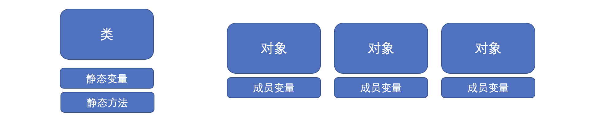

- 静态内容在对象构造之前的就完成了初始化，实际上就是类初始化时完成的

  - 也就是说，静态变量和静态方法在**类加载时**就完成了初始化，不会因为对象的创建而改变


### 二、包的访问和控制

#### 2.1 包声明和导入

- `包` 其实就是用来区分类位置的东西，也可以用来将所有类进行分类

  - 比如前端，一个文件下组件过多后，都需要进行划分，创建不用的业务文件夹，然后将对应的组件放到对应的文件夹下

  - 不过，java 中有个特殊的定义，就是 `包` ，它有一定的规范，不能随意创建

- 先在 IDEA 创建一个 `包` ，比如 `com.test`

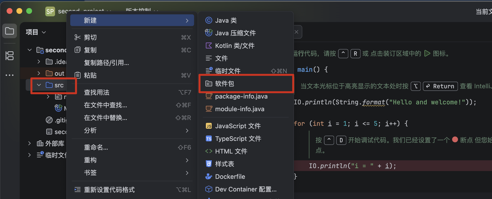
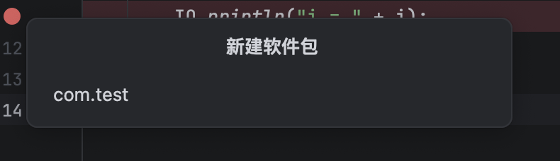
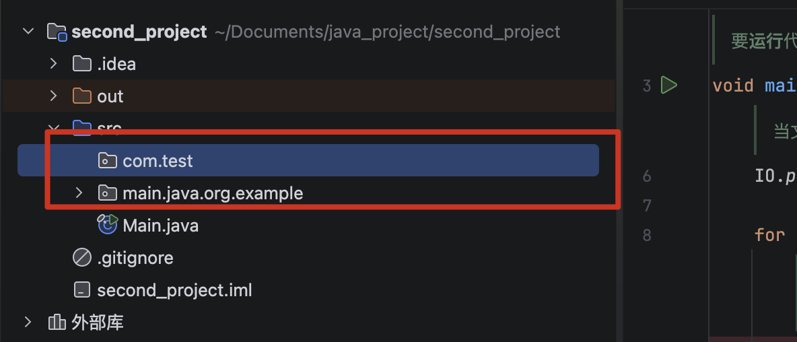

- 去文件系统查看，发现 `com.test` 其实就是文件路径，只是路径中的斜杠被替换为点
- 可以在包中创建一个类，比如 `Person`

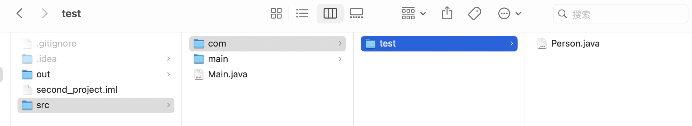
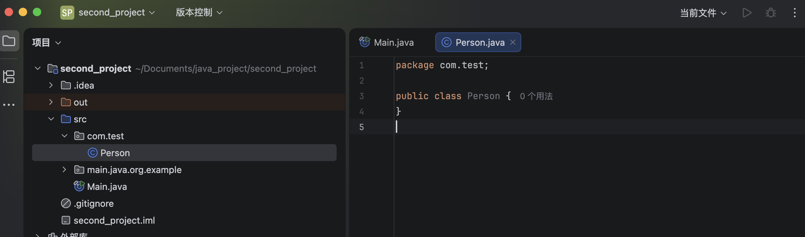

::: tip
- 这里会发现在包里创建的类文件，顶部有个 `package com.test;` 这行代码，这就是 `包` 的定义

  - 区别于 Main.java 文件，因为该文件在 src 根目录下，是默认包，不需要 package 声明 （**但是项目开发中不建议使用默认包**）

  - `package com.test;` 后面的 `com.test` 就是包名，必须和文件路径一一对应

- 声明后，相当于是告诉 java 编译器，这个文件里的类都属于 `com.test` 包。便于后续其他包的访问
:::

- 同一个包中的类之间可以直接访问，但当需要再一个包中使用其他包中的类时，需要先使用 `import` 语句导入该类，才能使用该类的成员变量和方法。

::: code-group
```java [Main.java]
import com.test.Person;   //使用import关键字导入其他包中的类

public class Main {
    public static void main(String[] args) {
        Person person = new Person();   //只有导入之后才可以使用，否则编译器不知道这个类从哪来的

        System.out.println(person.name);
    }
}
```
```java [Person.java]
package com.test;

public class Person {
    String name;
    int age;
    String sex;

    Person(){
        name = "小明";
        age = 18;
        sex = "男";
    }
}
```
:::

- 当一个包中有多个类时，可以分别导入每个类，也可以使用 `import com.test.*;` 导入所有类

- 上面的代码，直接运行会报错，这个就是下面要讲的访问权限控制

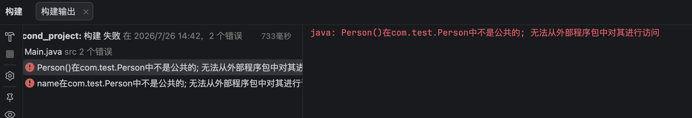

::: info
- 当我们定义的类和系统再带的类冲突时，比如 `String` 类，需要在类名前添加包名，比如 `com.test.String`，才能正常访问

```java
public class Main {
    public static void main(java.lang.String[] args) {   //主方法的String参数是java.lang包下的，我们需要明确指定一下，只需要在类名前面添加包名就行了
				com.test.String string = new com.test.String();
    }
}
```
:::

#### 2.2 访问权限控制

- 类中的属性和方法都是有访问权限控制的，相信大家都不陌生

- 一共四种访问权限

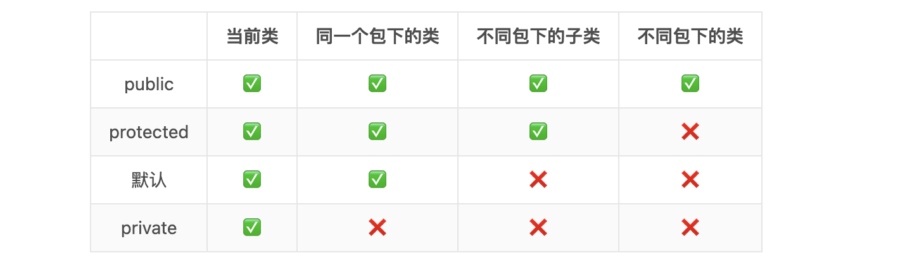

- 上面的报错，可以通过加上 public 来解决

```java
package com.test;

public class Person {
    public String name;
    int age;
    String sex;

    public Person(){
        name = "小明";
        age = 18;
        sex = "男";
    }
}
```

- 包括类的定义也是，也可以加上访问权限，比如 `public class Person {`，不能是protected或是private权限

- 类里静态方法的导入使用要麻烦些

::: code-group
```java [Main.java]
import static com.test.Person.test;    //静态导入test方法

public class Main {
    public static void main(String[] args) {
        test();    //直接使用就可以，就像在这个类定义的方法一样
    }
}
```
```java [Person.java]
package com.test;

public class Person {
    String name;
    int age;
    String sex;
    
    public static void test(){
        System.out.println("我是静态方法！");
    }
}
```
:::


### 三、封装、继承和多态

- 封装、继承和多态是面向对象编程的三大特性

> 封装，把对象的属性和方法结合成一个独立的整体，隐藏实现细节，并提供对外访问的接口。

> 继承，从已知的一个类中派生出一个新的类，叫子类。子类实现了父类所有非私有化的属性和方法，并根据实际需求扩展出新的行为。

> 多态，多个不同的对象对同一消息作出响应，同一消息根据不同的对象而采用各种不同的方法。

#### 3.1 类的封装

- 比如下面，禁止外部直接访问类里面的属性，只能通过方法来访问

```java
package com.test;

public class Person {
    private String name;    //现在类的属性只能被自己直接访问
    private int age;
    private String sex;

    public Person(String name, int age, String sex) {   //构造方法也要声明为公共，否则对象都构造不了
        this.name = name;
        this.age = age;
        this.sex = sex;
    }

    public String getName() {
        return name;    //想要知道这个对象的名字，必须通过getName()方法来获取，并且得到的只是名字值，外部无法修改
    }

    public void setName(String name) {
        this.name = name;
    }
}
```

- 上面是对外提供方法，也可以将构造方法也私有

```java
public class Person {
    private String name;
    private int age;
    private String sex;

    private Person(){}   //不允许外部使用new关键字创建对象
    
    public static Person getInstance() {   //而是需要使用我们的独特方法来生成对象并返回
        return new Person();
    }
}
```

- 使用 `Person.getInstance();` 方法来获取单列对象，而不是直接使用 `new Person();`

- 也可以实现单列模式

```java
public class Test {
 private static Test instance;

 private Test(){}

 public static Test getInstance() {
     if(instance == null) 
         instance = new Test();
     return instance;
 }
}
```


#### 3.2 类的继承

- 在定义不同类的时候存在一些相同属性，为了方便使用可以将这些共同属性抽象成一个**父类**，在定义其他**子类**时可以继承自该父类，减少代码的重复定义

- 子类可以使用父类中非私有的成员属性和方法，也可以重写父类的方法，实现自己的行为

- 想要继承一个类，只需要使用 `extends` 关键字即可

::: code-group
```java [Main.java]
import com.test.*;   //使用import关键字导入其他包中的类

public class Main {
    public static void main(String[] args) {
        Student student = new Student("李四", 12, "男");   //只有导入之后才可以使用，否则编译器不知道这个类从哪来的

        student.hello();

        Teacher teacher = new Teacher("王五", 26, "女");

        teacher.hello();
    }
}
```
```java [父类 Person]
package com.test;

public class Person {
    protected String name;   //因为子类需要用这些属性，所以说我们就将这些变成protected，外部不允许访问
    protected int age;
    protected String sex;
    protected String profession;

    //构造方法也改成protected，只能子类用
    protected Person(String name, int age, String sex, String profession) {
        this.name = name;
        this.age = age;
        this.sex = sex;
        this.profession = profession;
    }

    public void hello(){
        System.out.println("["+profession+"] 我叫 "+name+"，今年 "+age+" 岁了!");
    }
}
```
```java [子类 Student]
package com.test;

public class Student extends Person{
    public Student(String name, int age, String sex) {    //因为学生职业已经确定，所以说学生直接填写就可以了
        super(name, age, sex, "学生");   //使用super代表父类，父类的构造方法就是super()
    }

    public void study(){
        System.out.println("我的名字是 "+name+"，我在学习！");
    }
}

```
```java [子类 Teacher]
package com.test;

public class Teacher extends Person {
    public Teacher(String name, int age, String sex) {    //因为学生职业已经确定，所以说学生直接填写就可以了
        super(name, age, sex, "老师");   //使用super代表父类，父类的构造方法就是super()
    }

    public void hello(){
        System.out.println("我是老师");
    }
}
```
:::

::: tip
- 子类继承父类时，如果父类有构造方法，那么子类必须在构造方法中调用 `super()` 方法，否则会报错

- 类的继承可以不断向下，但是同时只能继承一个类，同时，标记为 `final` 的类不允许被继承

```java
public final class Person {  // class前面添加final关键字表示这个类已经是最终形态，不能继承
  
}
```
:::

- 在使用子类时，可以将其当做父类来使用

```java
public static void main(String[] args) {
    Person person = new Student("小明", 18, "男");    // 这里使用父类类型的变量，去引用一个子类对象（向上转型）
    person.hello();    // 父类对象的引用相当于当做父类来使用，只能访问父类对象的内容
}
```

- 也可以使用强制类型转换，将一个被当做父类使用的子类对象

```java
public static void main(String[] args) {
    Person person = new Student("小明", 18, "男");
    Student student = (Student) person;   //使用强制类型转换（向下转型）
    student.study();
}
```

- 可以通过 `instanceof` 运算符来判断一个对象是否是某个类的实例对象

  - 下面两个都输出，也就是多为 true

```java
public static void main(String[] args) {
    Person person = new Student("小明", 18, "男");
    if(person instanceof Student) {   //我们可以使用instanceof关键字来对类型进行判断
        System.out.println("对象是 Student 类型的");
    }
    if(person instanceof Person) {
        System.out.println("对象是 Person 类型的");
    }
}
```

::: info
- 在Java 14，instanceof 迎来了一波小更新

- 新版本在使用 `instanceof` 判断类型成立后，会自动强制转换类型为指定类型，简化了手动转换的步骤

  - 下面的代码在老版本时，一般要先判断类型，再使用对应的方法，但这里直接强制转换后使用了

```java
private static void test(Person person) {
    if(person instanceof Student student) {  //直接在instanceof后写变量名称，作为判断成功之后转换的此类型变量名称
        student.study();
    }
}
```
:::

::: tip
- 子类是可以定义和父类同名的属性的

  - 那怎么区分是哪个属性的呢？
    - 可以使用 `super` 关键字来表示父类，父类的属性就是 `super.属性名`

    - 可以使用 `this` 关键字来表示当前类，当前类的属性就是 `this.属性名`（也可以直接使用属性名，不用 `this.`）
:::


#### 3.3 顶层 Object 类

- 实际上所有类都默认继承自**Object类**，除非手动指定继承的类型，但是依然改变不了最顶层的父类是**Object类**

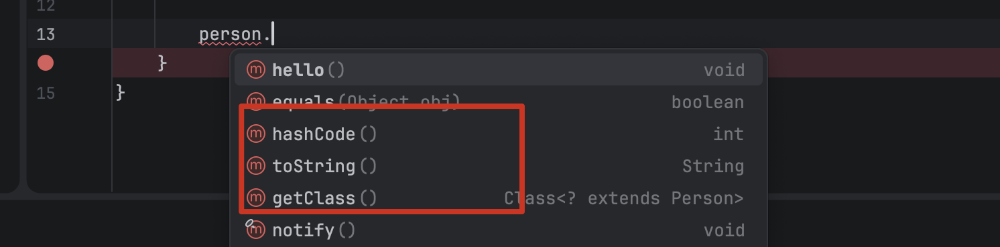

- 自动提示的这些方法都来在**Object类**中，是可以直接使用的


#### 3.4 方法的重写

- 其实就是子类对父类的方法进行重新实现，实现不同的功能

- 如果不像被重写，可以使用 `final` 关键字来标记这个方法，防止被重写

```java
public final void exam(){
    System.out.println("我是考试方法");
}
```

- 如果子类重写父类方法后，仍想调用父类原本的方法，可以使用 `super` 关键字来表示父类，父类的方法就是 `super.方法名`

```java
@Override
public void exam() {
    super.exam();   //调用父类的实现
    System.out.println("我是工人，做题我并不擅长，只能得到 D");
}
```

- 对于访问权限的问题，子类在重写父类方法时，不能降低父类方法中的可见性

```java
public void exam(){
    System.out.println("我是考试方法");
}
```
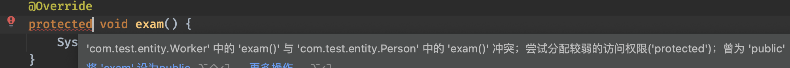


#### 3.5 抽象类

- 抽象类比类还要抽象

- 抽象类由于不是具体的类定义（它是类的抽象）可能会存在某些方法没有实现，**因此无法直接通过 new 关键字来直接创建对象**

  - 要使用抽象类，只能去创建它的**子类对象**，也就是说抽象类也能被当做父类来使用

  - 抽象类一般只用作继承使用，当然，抽象类的子类也可以是一个抽象类

- 抽象类的定义其实和普通类的定义是一致的，只是在定义时，要添加 `abstract` 关键字，表示这是一个抽象类，不能直接创建对象

```java
public abstract class Person {   //通过添加abstract关键字，表示这个类是一个抽象类
    protected String name;   //大体内容其实普通类差不多
    protected int age;
    protected String sex;
    protected String profession;

    protected Person(String name, int age, String sex, String profession) {
        this.name = name;
        this.age = age;
        this.sex = sex;
        this.profession = profession;
    }

    public abstract void exam();   //抽象类中可以具有抽象方法，也就是说这个方法只有定义，没有方法体
}
```


#### 3.6 接口

- 接口甚至比抽象类还抽象，他只代表某个确切的功能！也就是只包含方法的定义，甚至都不是一个类！

- 接口一般只代表某些功能的抽象，接口包含了一些列方法的定义，类可以实现这个接口，表示类支持接口代表的功能

- 在 IDEA 中创建一个接口

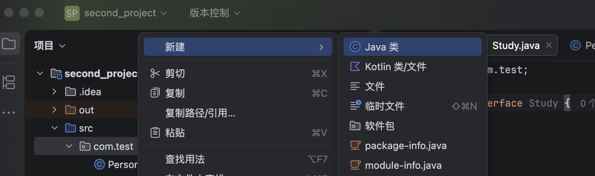
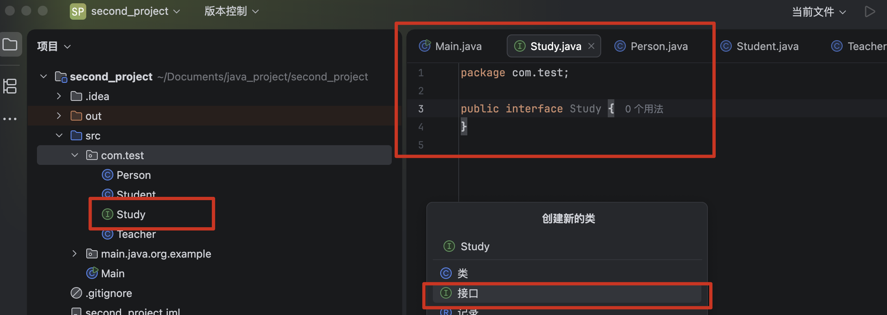


```java
public interface Study {    // 使用interface表示这是一个接口
    void study();    // 接口中只能定义访问权限为public抽象方法，其中public和abstract关键字可以省略
}
```

- 可以让类实现这个接口

```java
public class Student extends Person implements Study {   //使用implements关键字来实现接口
    public Student(String name, int age, String sex) {
        super(name, age, sex, "学生");
    }

    @Override
    public void study() {    //实现接口时，同样需要将接口中所有的抽象方法全部实现
        System.out.println("我会学习！");
    }
}
```

- 接口不同于继承，接口可以同时实现多个：

```java
public class Student extends Person implements Study, A, B, C {  //多个接口的实现使用逗号隔开
  
}
```

- `@Override` 是 Java 的一个 注解，用于表示一个方法是重写父类的方法，而不是定义一个新的方法

  - 不是必须的，但强烈建议写

- 两个作用：

  - 告诉编译器 ：请帮我检查，我下面这个方法是不是真的重写了父类/接口的方法

  - 可读性 ：让别人一眼看出这是"重写的方法"，不是新方法

- 接口同样支持向下转型

```java
public static void main(String[] args) {
    Study study = new Teacher("小王", 27, "男");
    if(study instanceof Teacher) {   // 直接判断引用的对象是不是Teacher类型
        Teacher teacher = (Teacher) study;   // 强制类型转换
        teacher.study();
    }
}
```

::: tip
- 接口里可以定义多个方法，但是在实现接口时，必须实现接口中所有的方法，否则会报错

```java
public interface Study {
    void study();
    void takeExam();
    void submitHomework();
}

public class Student implements Study {
    @Override
    public void study() {
        System.out.println("我会学习！");
    }

    @Override
    public void takeExam() {
        System.out.println("我会考试！");
    }

    @Override
    public void submitHomework() {
        System.out.println("我会交作业！");
    }
}
```
:::

::: tip
- 接口不同于类，正常情况下，接口中不允许存在成员变量和成员方法，它是一个非常纯粹的定义，所以它相比抽象类来说还要更抽象

- 不过和类一样，接口是可以继承自其他接口的

```java
public interface A exetnds B {
  
}
```
```java
public interface A exetnds B, C, D {
  
}
```
:::

- Object类中提供的克隆接口 `Cloneable()`

```java
package java.lang;

public interface Cloneable {    //这个接口中什么都没定义
}
```

- 尝试实现 `Cloneable` 接口

::: code-group
```java [Main]
import com.test.*;   //使用import关键字导入其他包中的类

public class Main {
    public static void main(String[] args) throws CloneNotSupportedException {
        Student student = new Student("小明", 18, "男");

        Student clone = (Student) student.clone();   //调用clone方法，得到一个克隆的对象
        System.out.println(student);
        System.out.println(clone);
        System.out.println(student == clone);
    }
}
```
```java [Student]
package com.test;

public class Student extends Person implements Study, Cloneable {   //首先实现Cloneable接口，表示这个类具有克隆的功能
    public Student(String name, int age, String sex) {
        super(name, age, sex, "学生");
    }

    @Override
    public Object clone() throws CloneNotSupportedException {   //提升clone方法的访问权限
        return super.clone();   //因为底层是C++实现，我们直接调用父类的实现就可以了
    }

    @Override
    public void study() {
        System.out.println("我会学习！");
    }
}
```

- 该拷贝方式是**浅拷贝**，只拷贝了对象的引用，而不是对象的内容
:::


#### 3.7 Java8 接口默认和静态方法

- 从Java8开始，接口中可以存在方法的默认实现：

```java
public interface Study {
    void study();

    default void test() {   // 使用default关键字为接口中的方法添加默认实现
        System.out.println("我是默认实现");
    }
}
```
- 如果方法在接口中存在默认实现，那么实现类中不强制要求进行实现

- 除此外，静态变量和静态方法也可以写了

```java
public interface Study {
    public static final int a = 10;   //接口中定义的静态变量可以是public static final的
  
  	public static void test(){    //接口中定义的静态方法只能是public的
        System.out.println("我是静态方法");
    }
    
    void study();
}
```

- 跟普通的类一样，可以直接通过 `接口名.` 的方式使用静态内容： `Study.a` 或 `Study.test()`


#### 3.8 Java9 接口中的 private 方法

- 有些时候可能希望接口中有一些不愿意暴露出去的私有实现，比如：

```java
interface Study {
    default void study() {
        System.out.println("我要狠狠学习");
        inner();
        inner2();
    }
    private void inner() {   // Java 9开始支持使用private声明了，仅供接口内部使用
        System.out.println("我是私有的内部实现，不要让外部直接访问我，我不想让别人知道我私底下怎么学习的");
    }

    private static void inner2() {
        System.out.println("我是私有的内部实现，不要让外部直接访问我，我不想让别人知道我私底下怎么学习的");
    }
}
```


### 四、其他类型


#### 4.1 枚举类型

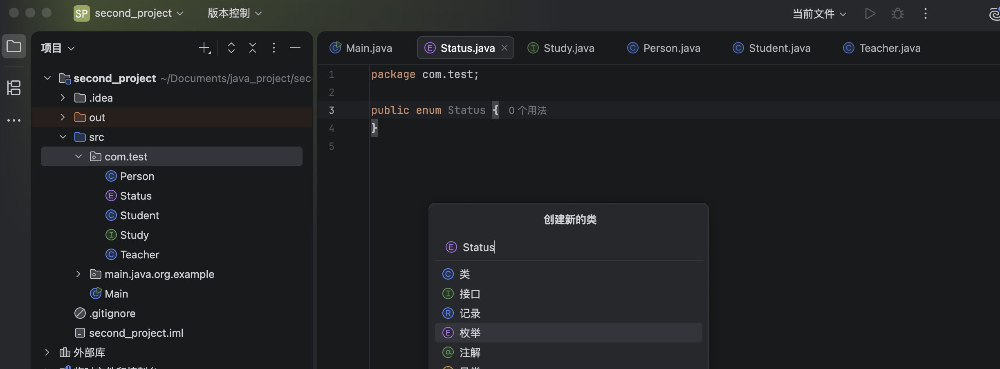

```java
public enum Status {   // enum表示这是一个枚举类，枚举类的语法稍微有一些不一样
    RUNNING, STUDY, SLEEP;    // 直接写每个状态的名字即可，最后面分号可以不打，但是推荐打上
}
```
- 使用

```java
public class Student extends Person implements Study {

    private Status status;   //状态，可以是跑步、学习、睡觉这三个之中的其中一种

    public Status getStatus() {
        return status;
    }

    public void setStatus(Status status) {
        this.status = status;
    }
}
```

- 这样使用时就有提示了


- 枚举类型是普通的类，可以给枚举类型添加独有的成员方法

```java
public enum Status {
    RUNNING("睡觉"), STUDY("学习"), SLEEP("睡觉");   //无参构造方法被覆盖，创建枚举需要添加参数（本质就是调用的构造方法）

    private final String name;    //枚举的成员变量
    Status(String name){    //覆盖原有构造方法（默认private，只能内部使用！）
        this.name = name;
    }

    public String getName() {   //获取封装的成员变量
        return name;
    }
}
```

#### 4.2 Java16 记录类型

- 专用于一些保存不可变的数据的类。记录类需要使用 `record` 而非 `class` 关键字声明。

- 记录类型与前面说的枚举类型类似，本质上在编译之后也是一个普通的类，不过是 `final` 且继承自 `java.lang.Record` 抽象类的

- 要为记录类型添加成员变量

```java
public record Order(int id, String product, String address) {
}
```
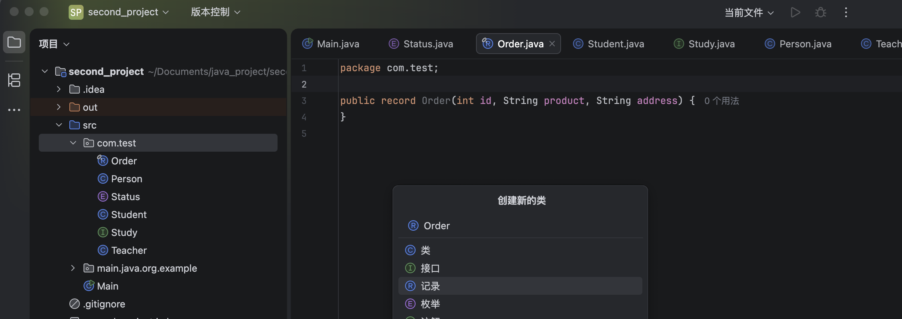

- 然后在使用时，会发现声明的变量本身直接自带了获取内部成员数据的同名方法

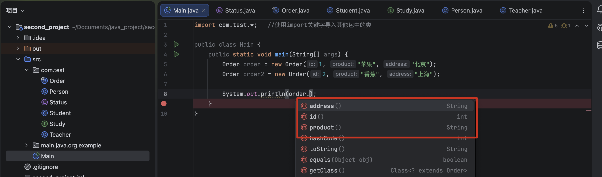

- 记录里可以添加方法，也可以重写方法

```java
public record TestData(int number, String string) {
    @Override
    public boolean equals(Object obj) {
        return false;
    }
}
```

- 它也可以实现接口，但是不能继承

```java
public record TestData(int number, String string) implements Cloneable {
}
```

#### 4.3 Java17 密封类型

- `final` 关键字表示该类不能被继承，只能被实现

  - 无论是谁，包括我们自己也是没办法实现继承的

```java
public final class A{   //添加final关键字后，不允许对此类继承
    
}
```

- 现在有一个需求，只允许自己写的类继承A，但是不允许别人写的类继承A

  - 可以使用 `sealed` 关键字来实现

```java
public sealed class A permits B{   
//在class关键字前添加sealed关键字，表示此类为密封类型，permits后面跟上允许继承的类型，多个子类使用逗号隔开

}
```

::: tip
- 密封类型有以下要求：

  - 可以基于普通类、抽象类、接口，也可以是继承自其他接抽象类的子类或是实现其他接口的类等。

  - 必须有子类继承，且不能是匿名内部类或是lambda的形式（这些内容会在下一章介绍）
  - sealed 关键字写在原来final的位置，但是不能和final、non-sealed关键字同时出现，只能选择其一。
  - 继承的子类必须显式标记为final、sealed或是non-sealed类型。 

```java
public sealed class A  permits B{   //指定B继承A

}
```
```java
public final class B extends A {   //在子类final，彻底封死

}
```
:::


