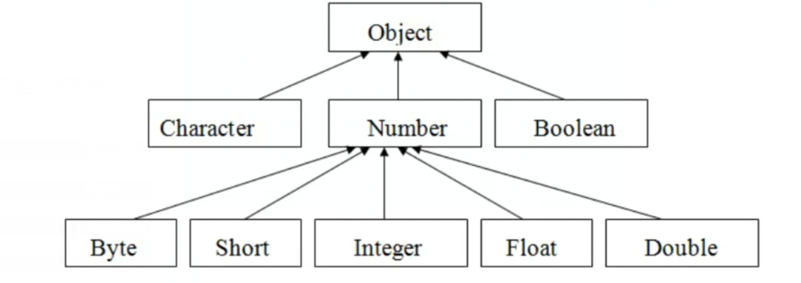
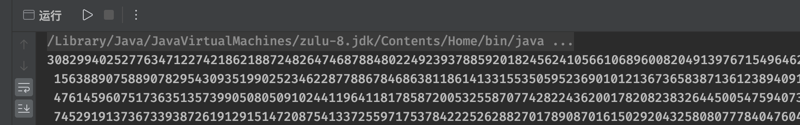
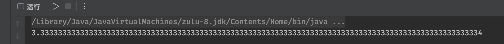
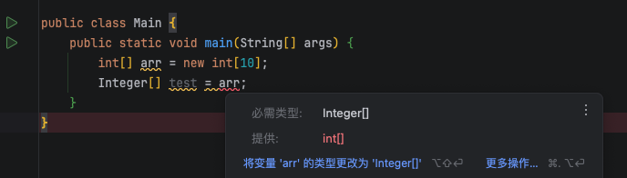
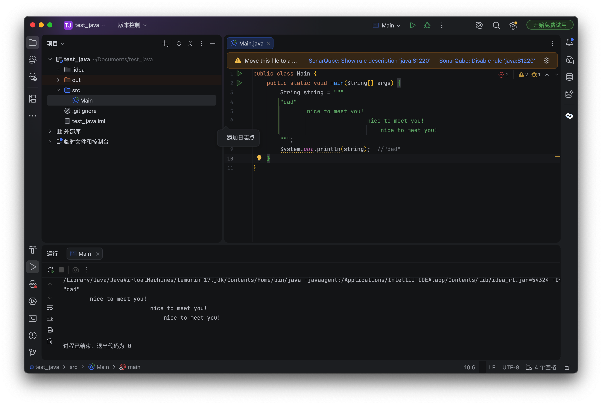
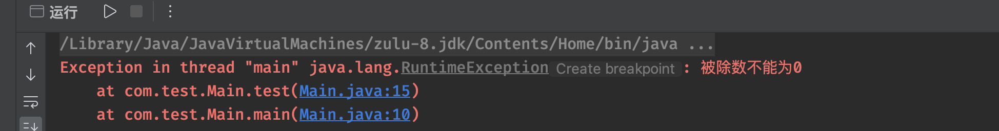
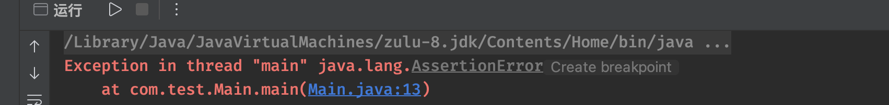
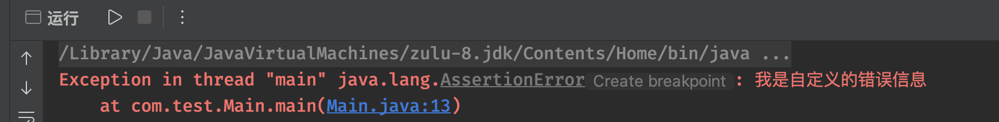

### 一、基本类型包装类

- Java 中的**基本类型**，如果想通过对象的形式去使用他们，Java 提供的**基本类型包装类**，使得Java能够更好的体现面向对象的思想，同时也使得基本类型能够支持对象操作

#### 1.1 包装类介绍

- 所有的包装类层次结构如下：



- 以 `Integer` 类为例

```java
public static void main(String[] args) {
    Integer i = new Integer(10);    // 将10包装为一个Integer类型的变量
}
```

- 包装类实际上就是将基本数据类型，封装成一个类（运用了封装的思想），可以来看看 Integer 类中是怎么写的：

```java
private final int value;  // 类中实际上就靠这个变量在存储包装的值

public Integer(int value) {
    this.value = value;
}
```

- 包装类型支持**自动装箱**，可以直接将一个对应的基本类型值作为对应包装类型引用变量的值

```java
public static void main(String[] args) {
    Integer i = 10;    // 将int类型值作为包装类型使用，这里就是运用了自动装箱，本质上就是被自动包装成了一个 Integer 类型的对象

    Integer i = Integer.valueOf(10);    // 上面的写法跟这里是等价的
}
```

- 既然能装箱，也是支持拆箱的

```java
public static void main(String[] args) {
    Integer i = 10;
    int a = i;
}

// 本质上就是
public static void main(String[] args) {
    Integer i = 10;
    int a = i.intValue();   // 通过此方法变成基本类型 int 值
}
```
::: info
自动装箱/拆箱 ：Java 自动在基本类型和包装类型之间转换，比如 `Integer i = 10` 实际是调用了 `Integer.valueOf(10)` ， `int a = i` 实际是调用了 `i.intValue()`
:::

- 得益于自动装箱/拆箱，可以让包装类型轻松地参与到基本类型的运算中：

```java
public static void main(String[] args) {
    Integer a = 10, b = 20;
    int c = a * b; 
    System.out.println(c);
}
```
::: tip
- 因为包装类是一个类，不是基本类型，所以说两个不同的对象，那么是不相等的
```java
public static void main(String[] args) {
    Integer a = new Integer(10);
    Integer b = new Integer(10);

    System.out.println(a == b);    //虽然a和b的值相同，但是并不是同一个对象，所以说==判断为假
}
```

- 但是自动装箱后，两个包装类型的值相同，那么就是相等的
```java
public static void main(String[] args) {
    Integer a = 10;
    Integer b = 10;

    System.out.println(a == b);    // true
}
```
- 那是因为 IntegerCache 会默认缓存-128~127之间的所有值，所以这两个对象是同一个对象

- 如果超出这个缓存范围的话，就会得到不同的对象了

```java
public static void main(String[] args) {
    Integer a = 128;
    Integer b = 128;

    System.out.println(a == b);    // false
}
```
:::

- 包装类支持字符串直接转换
```java
public static void main(String[] args) {
    Integer i = new Integer("666");
    // Integer i = Integer.valueOf("666");
    // Integer i = Integer.parseInt("666");

    System.out.println(i);    // 666
}
```
- 也支持对十六进制和八进制的字符串进行解码，得到对应的int值
```java
public static void main(String[] args) {
    Integer i = Integer.decode("0xA6");

    System.out.println(i);
}
```
- 也可以将十进制的整数转换为其他进制的字符串

```java
public static void main(String[] args) {
    System.out.println(Integer.toHexString(166));
}
```

#### 1.2 特殊包装类

- 除了上面几种基本类型包装类之外，还有两个比较特殊的包装类型：`BigInteger` 和 `BigDecimal`

- 我们知道，即使是最大的 `long` 类型，也只能表示64bit的数据，无法表示一个非常大的数，但是 `BigInteger` 没有这些限制

```java
public static void main(String[] args) {
    BigInteger i = BigInteger.valueOf(Long.MAX_VALUE);
    i = i.multiply(BigInteger.valueOf(Long.MAX_VALUE));   //即使是long的最大值乘以long的最大值，也能给你算出来
    System.out.println(i);
}
```
- 看看结果




- 前面我们说了，浮点类型精度有限，对于需要精确计算的场景，就没办法了，而 `BigDecimal` 可以实现小数的精确计算

  - 但是注意，对于这种结果没有终点的，无限循环的小数，我们必须要限制长度，否则会出现异常

```java
public static void main(String[] args) {
    BigDecimal i = BigDecimal.valueOf(10);
    i = i.divide(BigDecimal.valueOf(3), 100, RoundingMode.CEILING);
  	//计算10/3的结果，精确到小数点后100位
  	//RoundingMode是舍入模式，就是精确到最后一位时，该怎么处理，这里CEILING表示向上取整
    System.out.println(i);
}
```



### 二、数组

*   数组是**相同类型数据**的有序集合，数组可以代表任何相同类型的一组内容（包括引用类型和基本类型）

#### 2.1 一维数组

*   声明方式

```txt
类型[] 变量名称 = new 类型[数组大小];
类型 变量名称[] = new 类型[数组大小];  // 支持C语言样式，但不推荐！

类型[] 变量名称 = new 类型[]{...};  // 静态初始化（直接指定值和大小）
类型[] 变量名称 = {...};   // 同上，但是只能在定义时赋值
```

*   数组类型比较特殊，它本身也是类，是以对象的形式存在的

    *   所以要创建一个数组，同样需要使用 `new` 关键字

```java
public static void main(String[] args) {
    int[] array = new int[10];   // 在创建数组时，需要指定数组长度，也就是可以容纳多个int变量的值
  	Object obj = array;   // 因为同样是类，肯定是继承自Object的，所以说可以直接向上转型

    array[0] = 888;
    System.out.println("数组的第一个元素为："+array[0]);

    System.out.println("当前数组长度为："+array.length);

    String[] strArr = new String[5];
    // String[] strArr = new String[]{"张三", "李四", "王五"};
    // String[] strArr = {"张三", "李四", "王五"};
}
```

> 创建出来的数组每个位置上都有默认值，如果是引用类型，就是null，如果是基本数据类型，就是0，或者是false，跟对象成员变量的默认值是一样的

*   可以对数组进行遍历输出

::: code-group

```java [原版]
public static void main(String[] args) {
    int[] array = new int[10];
    for (int i = 0; i < array.length; i++) {
        System.out.print(array[i] + " ");
    }
}
```

```java [简写版]
public static void main(String[] args) {
    int[] array = new int[10];
    // 语法糖写法
    for (int i : array) {    // int i就是每一个数组中的元素，array就是我们要遍历的数组
        System.out.print(i+" ");   // 每一轮循环，i都会更新成数组中下一个元素
    }
}
```

:::

::: tip

*   对于基本类型数组来说，是不支持自动装箱和拆箱的


:::

#### 2.2 多维数组

*   类似套娃，可以嵌套多个数组，每个数组元素都是一个数组

*   最常用的二维数组

```java
public static void main(String[] args) {
    int[][] array = new int[2][10];    // 数组类型数组那么就要写两个[]了

    int[][] arr1 = { {1, 2},
                    {3, 4},
                    {5, 6}};   // 一个三行两列的数组
    System.out.println(arr1[2][1]);   // 访问第三行第二列的元素
}
```

#### 2.3 可变长参数

*   类似前端的 ...args 参数，伪数组概念

*   可变长参数本质就是一个数组

*   看例子

```java
public class Person {
    String name;
    int age;
    String sex;

    public void test(String... strings){
        for (String string : strings) {
            System.out.println(string);   // 遍历打印数组中每一个元素
        }
    }
}

public static void main(String[] args) {
    Person person = new Person();
    person.test("1！", "5！", "哥们在这跟你说唱"); // 这里可以自由传入任意数量的字符串
}
```

*   如果同时存在其他参数，那么可变长参数只能放在最后

```java
public void test(int a, int b, String... strings){
    
}
```

### 三、字符串

*   **字符串类**是一个比较特殊的类，它用于保存字符串

    *   **双引号括起来的字符串本身就是一个实例对象**

#### 3.1 String 类

*   每个用**双引号**括起来的字符串，都是 String 类型的一个实例对象

```java
String str = "Hello World!";

// 也可以象征性地使用一下 new 关键字
String str = new String("Hello World!");
```

*   既然 String 是一个类，就可以使用很多方法

```java
String str = "Hello World";
System.out.println(str.length());
System.out.println("Hello World".length());

String sub = str.substring(0, 3);
String[] strings = str.split(" ");

// 还有很多方法，比如 replace()、toLowerCase()、toUpperCase() 等等，和前端 js 差不多
```

::: tip
java.lang.String 是不可变类（immutable）。只要调用 String 的方法做 “修改操作”，不会改动原字符串对象，一定会生成全新的 String 对象
:::

*   字符数组和字符串之间可以转换

```java
public static void main(String[] args) {
    String str = "Hello World";
    char[] chars = str.toCharArray();
    System.out.println(chars);  // [H, e, l, l, o,  , W, o, r, l, d]
}

public static void main(String[] args) {
    char[] chars = new char[]{'奥', '利', '给'};
    String str = new String(chars);
    System.out.println(str);  // 奥利给
}
```

::: tip

*   判断两个字符串是否相等，最好使用 `equals()` 方法，String 类重载了该方法

```java
boolean isSame = str1.equals(str2);   // 返回值为 boolean
```

*   为什么呢？看下面两个例子

```java
String str1 = "Hello World";
String str2 = "Hello World";
System.out.println(str1 == str2);   // true

String str1 = new String("Hello World");
String str2 = new String("Hello World");
System.out.println(str1 == str2);   // false
```

:::

#### 3.2 StringBuilder 类

*   一个专门用于编辑字符串的类，比如构造、拼接、删除、插入、替换、翻转等，比 String 类更高效

```java
public static void main(String[] args) {
    StringBuilder builder = new StringBuilder();
    builder.append("AAA");   // AAA
    builder.append("BBB");   // AAABBB
    builder.delete(2, 4);   // AABB，delete 讲究左闭右开 [start, end) 原则
    builder.insert(2, "CC");    // AACCBB
    builder.reverse();      // BBCCAA
}
```

#### 3.3 Java 11 字符串增强

*   主要是新增了些字符串方法

```java
String string = "   Hello World   ";
System.out.println(string.strip());   // 去除前后空格，Hello World
System.out.println(string.stripLeading());   // 去除前空格，Hello World   
System.out.println(string.stripTrailing());   // 去除后空格，   Hello World

String string = "   ";
System.out.println(string.isBlank());  // 判断是否只有空格（空串也算）

String string = "ABC";
System.out.println(string.repeat(2));   // 让字符串内容重复5次，ABCABC
```

#### 3.4 Java 15 文本块

*   三引号

*   目的是方便编写复杂字符串，不用再去用过多的转义字符，官方起名叫文本块



#### 3.5 正则表达式

*   正则表达式(regular expression)描述了一种字符串匹配的模式（pattern）

*   String 内置了些正则方法

```java
// String.matches(String regex) 全字符串匹配，整个字符串必须完全符合正则，返回值为 boolean
"123456".matches("\\d+");

// String.split(String regex)  使用正则分割字符串，返回字符串数组
"a,b;c d".split("[,; ]");

// String.replaceAll(String regex, String replacement)  替换所有符合正则的子字符串，返回新的字符串
"a1b2c3".replaceAll("\\d", ""); // 去除所有数字

// String.replaceFirst(String regex, String replacement)  替换第一个符合正则的子字符串，返回新的字符串
"Hello World".replaceFirst("\\s+", "");
```

*   一些用于写正则表达式的限定符

| 字符       | 描述                                                                                                                              |
| -------- | ------------------------------------------------------------------------------------------------------------------------------- |
| `*`      | 匹配前面的子表达式零次或多次。例如，`zo*` 能匹配 `"z"` 以及 `"zoo"`。`*` 等价于 `{0,}`。                                                                    |
| `+`      | 匹配前面的子表达式一次或多次。例如，`zo+` 能匹配 `"zo"` 以及 `"zoo"`，但不能匹配 `"z"`。`+` 等价于 `{1,}`。                                                       |
| `?`      | 匹配前面的子表达式零次或一次。例如，`do(es)?` 可以匹配 `"do"`、`"does"`、`"doxy"` 中的 `"do"`。`?` 等价于 `{0,1}`。                                            |
| `{n}`    | `n` 是一个非负整数。匹配确定的 `n` 次。例如，`o{2}` 不能匹配 `"Bob"` 中的 `o`，但是能匹配 `"food"` 中的两个 `o`。                                                  |
| `{n,}`   | `n` 是一个非负整数。至少匹配 `n` 次。例如，`o{2,}` 不能匹配 `"Bob"` 中的 `o`，但能匹配 `"foooooood"` 中的所有 `o`。`o{1,}` 等价于 `o+`。`o{0,}` 则等价于 `o*`。           |
| `{n,m}`  | `m` 和 `n` 均为非负整数，其中 `n <= m`。最少匹配 `n` 次且最多匹配 `m` 次。例如，`o{1,3}` 将匹配 `"foooooood"` 中的前三个 `o`。`o{0,1}` 等价于 `o?`。请注意在逗号和两个数之间不能有空格。 |
| `[ABC]`  | 匹配 `[...]` 中的所有字符，例如 `[aeiou]` 匹配字符串 `"google runoob taobao"` 中所有的 `e`、`o`、`u`、`a` 字母。                                          |
| `[^ABC]` | 匹配除了 `[...]` 中字符的所有字符，例如 `[^aeiou]` 匹配字符串 `"google runoob taobao"` 中除了 `e`、`o`、`u`、`a` 字母的所有字符。                                 |
| `[A-Z]`  | `[A-Z]` 表示一个区间，匹配所有大写字母，`[a-z]` 表示所有小写字母。                                                                                       |
| `.`      | 匹配除换行符（`\n`、`\r`）之外的任何单个字符，相等于 `[^\n\r]`。                                                                                       |
| `[\s\S]` | 匹配所有。`\s` 是匹配所有空白符，包括换行，`\S` 非空白符，不包括换行。                                                                                        |
| `\w`     | 匹配字母、数字、下划线。等价于 `[A-Za-z0-9_]`。                                                                                                 |

#### 3.6 Java 21/22/25 switch模式匹配

*   直接看代码吧，了解就行，因为java版本太新了，基本没有公司会用到

::: code-group

```java [原版]
public static Integer test(String str) {
    return switch (str) {  //直接使用switch表达式的结果作为返回值
        case "A" -> 1;
        case "B" -> 2;
        default -> 0;
    };
}

if(obj instanceof String) {
    System.out.println("String");
} else if(obj instanceof Integer){
    System.out.println("Integer");
} else {
    System.out.println("Other");
}
```

```java [switch模式]
public static void test(Object obj) {
    String type = switch (obj) {
        case String s -> "String";   //直接在case后写上类型和变量名称即可进行类型匹配
        case Integer i -> "Integer";
        case null -> "Null";   //甚至还可以直接判断null
        default -> "Other";
    };
    System.out.println(type);
}
```

```java [加守卫条件]
public static Integer test(String str) {
    return switch (str) {
        case String s when s.length() > 2 -> 1;  // 使用when关键字
        case String s when s.isEmpty() -> 2;
        default -> 0;  // 注意使用守卫条件后其他情况会变得不可预估，必须使用default对其他情况做处理
    };
}
```

:::

### 四、内部类

#### 4.1 成员内部类

```java
public class Test {
    public class Inner {   // 内部类也是类，所以说里面也可以有成员变量、方法等，甚至还可以继续套娃一个成员内部类
        public void test(){
            System.out.println("我是成员内部类！");
        }
    }
}
```

*   成员内部类和成员方法、成员变量一样，是对象所有的，而不是类所有的（使用频率很低）

```java
public static void main(String[] args) {
    Test test = new Test();   // 我们首先需要创建对象
    Test.Inner inner = test.new Inner();   // 成员内部类的类型名称就是 外层.内部类名称

    inner.test();
}
```

*   成员内部类也可以加上访问修饰符，比如public、private等

*   成员内部类时可以访问外部类的成员变量、方法等，但是不能访问外部类的静态成员变量、方法等

    *   内部类中也可以定义同名的变量

```java
public class Test {
    private final String name;
    
    public Test(String name){
        this.name = name;
    }
    public class Inner {
        String name;

        public void test(){
            System.out.println("我是成员内部类："+name);
        }

        public void test1(String name){
            // 依然是就近原则，最近的是参数
            System.out.println("方法参数的name = "+name);
            // 在内部类中使用this关键字，只能表示内部类对象
            System.out.println("成员内部类的name = "+this.name);
            // 如果需要指定为外部的对象，那么需要在前面添加外部类型名称
            System.out.println("成员内部类的name = "+Test.this.name);
        }
    }
}
```

*   每个类可以创建一个对象，每个对象中都有一个单独的类定义，可以通过这个成员内部类又创建出更多对象，套娃了属于是

```java
public static void main(String[] args) {
    Test a = new Test("小明");
    Test.Inner inner1 = a.new Inner();   //依附于a创建的对象，那么就是a的
    inner1.test();

    Test b = new Test("小红");
    Test.Inner inner2 = b.new Inner();  //依附于b创建的对象，那么就是b的
    inner2.test();
}
```

#### 4.2 静态内部类

*   成员内部类，它就像成员变量和成员方法一样，是属于对象的

    *   静态内部类，它就像静态方法和静态变量一样，是属于类的 （使用频率很高）

```java
public class Test {
    private final String name;

    public Test(String name){
        this.name = name;
    }

    public static class Inner {
        public void test(){
            System.out.println("我是静态内部类！");
        }
    }
}
```

*   不需要依附任何对象，可以直接创建静态内部类的对象

```java
public static void main(String[] args) {
    // 静态内部类的类名同样是之前的格式，但是可以直接new了
    Test.Inner inner = new Test.Inner();
  	inner.test();
}
```

#### 4.3 局部内部类

*   局部内部类就像局部变量一样，可以在方法中定义（使用频率极低）

```java
public class Test {
    private final String name;

    public Test(String name){
        this.name = name;
    }

    public void hello(){
        class Inner {    // 直接在方法中创建局部内部类
            
        }
    }
}
```

*   既然是在方法中声明的类，那作用范围也就只能在方法中了

```java
public class Test {
    public void hello(){
        class Inner{   // 局部内部类跟局部变量一样，先声明后使用
            public void test(){
                System.out.println("我是局部内部类");
            }
        }
        
        Inner inner = new Inner();   // 局部内部类直接使用类名就行
        inner.test();
    }
}
```

#### 4.4 匿名内部类

*   **使用频率非常高**的一种内部类，它是**局部内部类的简化版**

*   在之前学习的抽象类和接口中，都会含有某些抽象方法需要子类去实现，当时已经很明确地说了不能直接通过new的方式去创建一个抽象类或是接口对象

    *   但是可以使用匿名内部类来实现

```java
public abstract class Student {
    public abstract void test();
}
```

*   正常情况下，要创建一个抽象类的实例对象，只能对其进行继承，先实现未实现的方法，然后创建子类对象

*   但可以在方法中使用匿名内部类，将其中的抽象方法实现，并直接创建实例对象

```java
public static void main(String[] args) {
    // 在 new 的时候，后面加上花括号，把未实现的方法实现了
    Student student = new Student() {
        @Override
        public void test() {
            System.out.println("我是匿名内部类的实现!");
        }
    };
    student.test();
}
```

*   这里创建出来的Student对象，就是一个已经实现了抽象方法的对象，这个抽象类直接就定义好了，甚至连名字都没有

*   匿名内部类中同样可以使用类中的属性

*   同样的，接口也可以通过这种匿名内部类的形式，直接创建一个匿名的接口实现类

```java
public static void main(String[] args) {
    Study study = new Study() {
        @Override
        public void study() {
            System.out.println("我是学习方法！");
        }
    };
    study.study();
}
```

> 当然，并不是说只有抽象类和接口才可以像这样创建匿名内部类，普通的类也可以，只不过意义不大

#### 4.5 Lambda表达式

*   `Lambda` 是**函数式接口**（FunctionalInterface） 的语法糖，允许把一段代码当作参数传递

    *   函数式接口：有且仅有一个抽象方法的接口

    *   如果一个**接口**中有且只有一个待实现的抽象方法，那么可以将匿名内部类简写为 Lambda 表达式（使用频率很高）

```java
public static void main(String[] args) {
    Study study = () -> System.out.println("我是学习方法！");
  	study.study();
}
```

*   Lambda 表达式的具体规范

    *   标准格式为：`([参数类型 参数名称,]...) ‐> { 代码语句，包括返回值 }`

        *   可以简化写法，参数只有一个时 `()` 可以省略；方法体只有一行代码时，`{}` `return` 可以省略

    *   和匿名内部类不同，Lambda **仅支持接口**，不支持抽象类

    *   接口内部必须有且仅有一个抽象方法（可以有多个方法，但是必须保证其他方法有默认实现，必须留一个抽象方法出来）

::: code-group

```java [例子一]
// 有参数有返回值
public static void main(String[] args) {
    Study study = (a) -> {
        System.out.println("我是学习方法");
        return "今天学会了"+a;    // 实际上这里面就是方法体，该咋写咋写
    };
    System.out.println(study.study(10));
}

Study study = (a) -> {
    return "今天学会了"+a;   // 这种情况是可以简化的
};
// 简写
Study study = (a) -> "今天学会了"+a;
// 再简写
Study study = a -> "今天学会了"+a;
```

```java [例子二]
// List 是集合接口
List<String> list = Arrays.asList("张三", "李四", "王五");

// 普通增强for
for (String name : list) {
    System.out.println(name);
}

// Lambda写法
list.forEach(name -> System.out.println(name));

// 方法引用进一步简化（日常推荐）
list.forEach(System.out::println);
```

```java [例子三]
// 有很多不知道的接口，比如 Comparator 等，但是它们都有默认实现，所以可以直接使用，用到可以在学习

List<User> userList = new ArrayList<>();

// 根据年龄升序，使用最原始匿名内部类实现
userList.sort(new Comparator<User>() {
    @Override
    public int compare(User u1, User u2) {
        return u1.getAge() - u2.getAge();
    }
});

// 1. 根据年龄升序，使用 Lambda 表达式简化
userList.sort((u1, u2) -> u1.getAge() - u2.getAge());
// 方法引用简化
userList.sort(Comparator.comparingInt(User::getAge));

// 2. 年龄降序
userList.sort(Comparator.comparingInt(User::getAge).reversed());

// 3. 多条件排序：年龄升序，年龄相同按姓名排序
userList.sort(Comparator.comparingInt(User::getAge)
        .thenComparing(User::getName));
```

:::

::: tip

*   写法有点类似 js 里的箭头函数

```js
// JS 箭头函数
list.forEach(item => console.log(item));

// Java Lambda
list.forEach(item -> System.out.println(item));
```

*   但是有本质区别，js 箭头函数是函数，而 Lambda 表达式是对象，是接口实例

:::

#### 4.6 方法引用

*   方法引用是 Lambda 表达式的语法糖

    *   当 Lambda 仅仅是「直接调用一个已有方法」，没有额外逻辑，就可以用方法引用简化

```java
// 允许简写
item -> item.getName()    → User::getName

// 不允许，因为有额外逻辑
item -> item.getName().trim()
item -> "前缀" + item.getName()
item -> item.getAge() + 10
```

*   Lambda 模板：`(args) -> 目标方法(args)`，等价方法引用，不再书写参数：`目标::方法名`

```java
// 比如下面这个简写
userList.sort(Comparator.comparingInt(User::getAge));

// 完整 Lambda 是只调用一个已有方法
userList.sort(Comparator.comparingInt(user -> user.getAge()));
```

*   四种写法，是 Lambda 的简化形态：

    *   对象：：实例方法 `user::getName`

    *   类名：：静态方法 `Integer::parseInt`

    *   类名：：实例方法 `String::length`

    *   构造器引用 `User::new`

*   准备公共实体

```java
@Data
public class User {
    private String name;
    private Integer age;

    // 无参构造
    public User() {
        this.name = "默认名字";
        System.out.println("调用了：无参构造器");
    }
    // 单参构造
    public User(String name) {
        this.name = name;
        System.out.println("调用了：单参构造器");
    }
    // 实例方法
    public String getName() { return name; }
    public void setName(String name) { this.name = name; }
    // 静态方法
    public static boolean isAdult(User user) {
        return user.getAge() >= 18;
    }
}
```

::: code-group

```java [对象::实例]
User user = new User();
user.setName("张三");

// 定义：只是把逻辑存起来，此刻不会执行 getName()
Supplier<String> lambda = () -> user.getName();
Supplier<String> ref = user::getName;

// Supplier 只是保存一段逻辑代码
// 使用：调用 get() 才执行
String name1 = lambda.get();
String name2 = ref.get();

System.out.println(name1); // 张三
System.out.println(name2); // 张三
```

```java [类名::静态]
List<User> userList = new ArrayList<>();
userList.add(new User("小明", 16));   // 未成年
userList.add(new User("小红", 20));   // 成年

// Lambda
List<User> adultList = userList.stream().filter(u -> User.isAdult(u));
// 方法引用
List<User> adultList = userList.stream().filter(User::isAdult);

adultList.forEach(u -> System.out.println(u.getName()));  // 小红
```

```java [类名::实例]
// 规则：第一个参数作为方法调用者，剩余参数作为方法入参

// Lambda
BiFunction<String, String, Boolean> lambda = (s1, s2) -> s1.equals(s2);
// 方法引用
BiFunction<String, String, Boolean> ref = String::equals;

Boolean result = ref.apply("hello", "hello");
System.out.println(result);   // true
```

```java [构造器引用 类名::new]
// 无参构造：Supplier<T>
Supplier<User> lambda1 = () -> new User();
Supplier<User> ref1 = User::new;

User u1 = ref1.get();  // 输出：调用了：无参构造器
System.out.println(u1.getName());  // 默认名字


// 单参构造：Function<String,User>
Function<String, User> lambda2 = name -> new User(name);
Function<String, User> ref2 = User::new;

User u2 = ref2.apply("李四");  // 输出：调用了：单参构造器
System.out.println(u2.getName());  // 李四
```

:::

::: info

*   `Supplier` `BiFunction` 是 Java8 内置函数式接口

*   两者定义

```java
@FunctionalInterface
public interface Supplier<T> {
    // 唯一抽象方法：无入参，返回 T 类型结果
    T get();
}

@FunctionalInterface
public interface BiFunction<T, U, R> {
    R apply(T t, U u);  // 接收两个参数，返回一个结果
}
```

:::

::: tip

*   方法引用无法捕获异常

    *   如果目标方法抛出受检异常，无法直接使用方法引用，必须换回 Lambda 手动 try-catch

*   歧义问题：重载方法冲突

    *   当存在同名重载方法，编译器无法自动推导时，编译报错，只能退回 Lambda 写法

```java
public class Demo {
    public void test(String s){}
    public void test(Integer i){}
}
Demo demo = new Demo();
// Function<String, Void> f = demo::test;
// 若上下文模糊，编译器无法选择重载，报错

Consumer<String> f1 = (String s) -> demo.test(s);
Consumer<Integer> f2 = (Integer i) -> demo.test(i);
```

:::

### 五、异常机制

#### 5.1 异常类型

*   每一个异常也是一个类，他们都继承自 `Exception` 类

    *   异常类型本质依然是类的对象

    *   异常类型支持在程序运行出现问题时抛出，也可以提前声明，告知使用者需要处理可能会出现的异常

- 第一种类型：**运行时异常**，所有的运行时异常都继承自 `RuntimeException` 类

  - 在编译阶段无法感知代码是否会出现问题，只有在运行的时候才知道会不会出错

- 第二种类型：**编译时异常**，默认继承自 `Exception` 类

  - 在编译阶段就需要进行处处理的异常，否则报错

- 还有一种类型是**错误**，比异常更严重

  - 异常就是不同寻常，但不一定会导致致命的问题，而错误是致命问题，一般出现错误可能JVM就无法继续正常运行了

  - 例如：内存溢出 `OutOfMemoryError`、栈溢出等

```txt
Throwable
  ├── Error                    （第三类：错误）
  │     ├── OutOfMemoryError
  │     └── StackOverflowError
  └── Exception                （第一、二类的根）
        ├── RuntimeException   （第一类：运行时异常）
        │     ├── NullPointerException （空指针异常， 访问 null 对象的成员）
        │     └── ArrayIndexOutOfBoundsException （数组索引异常，数组越界访问）
        |     └── IllegalArgumentException （非法参数异常，参数值不合法）
        |     └── ...
        └── IOException、SQLException、InterruptedException、FileNotFoundException、ClassNotFoundException 等     （第二类：编译时异常）
```

#### 5.2 自定义异常

- 异常其实就两大类，一个是编译时异常，一个是运行时异常

- 编译时异常
  - 编译时异常只需要继承`Exception`类就行了，编译时异常的子类有很多很多

```java
public class TestException extends Exception{
    public TestException(String message){
        // 这里选择使用父类的带参构造，这个参数就是异常的原因
        super(message); 
    }
}
```

- 运行时异常
  - 运行时异常只需要继承`RuntimeException`类就行了

  - `RuntimeException`继承自`Exception`，`Exception`继承自`Throwable`，`Throwable`是所有异常的根类

```java
public class TestException extends RuntimeException{
    public TestException(String message){
        super(message);
    }
}
```

#### 5.3 抛出异常

- 如果遇到错误参数导致程序运行出现问题，需要抛出异常，终止程序运行，告知使用者需要处理

```java
public static int test(int a, int b) {
    if(b == 0)
        // 使用throw关键字来抛出异常
        throw new RuntimeException("被除数不能为0"); 
    return a / b;
}
```

- 异常的抛出同样需要创建一个异常对象，抛出异常实际上就是将这个异常对象抛出

- 程序会终止，并且会打印栈追踪信息



::: info
- 注意，如果在方法中抛出了一个**非运行时异常**，那么必须告知函数的调用方会抛出某个异常，函数调用方必须要对抛出的这个异常进行对应的处理才可以

  - 使用 `throws` 关键字告知调用方此方法会抛出哪些异常，请调用方处理好

```java
private static void test() throws Exception {
    throw new Exception("我是编译时异常！");
}
```

- 如果不同的分支条件会出现不同的异常，那么所有在方法中可能会抛出的异常都需要注明：

```java
 // 多个异常使用逗号隔开
private static void test(int a) throws FileNotFoundException, ClassNotFoundException {
    if(a == 1)
        throw new FileNotFoundException();
    else 
        throw new ClassNotFoundException();
}
``` 
:::

::: tip

- 当然，并不是只有非运行时异常可以像这样明确指出，运行时异常也可以，只不过不强制要求

- 最后再提一下，在重写方法时，如果父类中的方法表明了会抛出某个异常，只要重写的内容中不会抛出对应的异常可以直接省去 `throws` 关键字
:::

#### 5.4 异常的处理

- 使用 `try-catch` 语句来处理异常

```java
public static void main(String[] args) {
    try {
        Object object = null;
        object.toString();
    } catch (NullPointerException e){
        e.printStackTrace();   // 打印栈追踪信息
        System.out.println("异常错误信息："+e.getMessage());   // 获取异常的错误信息
    }
    System.out.println("程序继续正常运行！");
}
```

::: tip
- 如果某个方法明确指出会抛出哪些异常，除非抛出的异常是一个运行时异常，否则我们必须要使用try-catch语句块进行异常的捕获，不然就无法通过编译

  - 其实就是编译时异常，必须要进行处理，否则就无法通过编译

```java
public static void main(String[] args) {
    test(10);    // 报错，必须要进行异常的捕获
}

private static void test(int a) throws IOException {  // 明确会抛出IOException
    throw new IOException();
}
```

- 当然，也可以踢皮球，但是如果是主方法，就不能再网上报了

```java
public static void test(String[] args) throws IOException {  // 继续编写throws往上一级抛
    test1(10);
}

private static void test1(int a) throws IOException {
    throw new IOException();
}
```
:::

- 代码可能出现多种类型的异常，可以分不同情况处理

```java
try {
  //....
} catch (NullPointerException e) {
            
} catch (IndexOutOfBoundsException e){

} catch (RuntimeException e){
            
}

// 或者
try {
     //....
} catch (NullPointerException | IndexOutOfBoundsException e) {
		
}
```

- 一般来说，`try-catch` 会配合 `finally` 语句块来使用，来确保资源的释放

  - try语句块至少要配合catch或finally中的一个来使用

```java
try {
  //....
} catch (Exception e) {
    e.printStackTrace();
} finally {
    // 释放资源
}
```

#### 5.5 断言表达式

- 使用断言表达式来对某些东西进行判断，如果判断失败会抛出错误，只不过默认情况下没有开启断言，需要在虚拟机参数中手动开启一下


- 使用到 `assert` 关键字，如果 `assert` 后面的表达式判断结果为`false`，将抛出 `AssertionError` 错误

```java
public static void main(String[] args) {
    int a = 10;
    assert a > 10;
}
```


- 也可以在表达式后面添加错误信息

```java
public static void main(String[] args) {
    int a = 10;
    assert a > 10 : "我是自定义的错误信息";
}
```


- 断言表达式一般**只用于测试**，正常的程序中一般不会使用，这里只做了解


### 六、常用工具类介绍

- 工具类一般都会内置大量的静态方法，可以通过类名直接使用

#### 6.1 数学工具类 `Math`

- `Math` 也是 java.lang 包下的类，所以说默认就可以直接使用

```java
public static void main(String[] args) {
    System.out.println(Math.pow(5, 3));   // 使用pow方法直接计算a的b次方
  
  	Math.abs(-1);    // abs方法可以求绝对值
  	Math.max(19, 20);    // 快速取最大值
  	Math.min(2, 4);   // 快速取最小值
  	Math.sqrt(9);    // 求一个数的算术平方根
    Math.ceil(4.5);    // 通过使用ceil来向上取整
    Math.floor(5.6);   // 通过使用floor来向下取整
    Math.cos(Math.PI);       // 求π的余弦值
    // ...
}
```

- 随机数的生成

```java
public static void main(String[] args) {
    Random random = new Random();   // 创建Random对象
    for (int i = 0; i < 30; i++) {
        System.out.print(random.nextInt(100)+" ");  // nextInt()方法可以指定创建0 - x之内的随机数
    }
}
```

#### 6.2 数组工具类 `Arrays`

- `Arrays` 类是 java.util 包下的类，默认就可以直接使用

- 它用于便捷操作数组，比如排序、搜索、填充等

::: code-group
```java [例子一]
public static void main(String[] args) {
    int[] arr = new int[]{1, 4, 5, 8, 2, 0, 9, 7, 3, 6};
    System.out.println(arr);  // 这里输出的是数组地址，[I@27716f4
    Arrays.sort(arr);    // 可以对数组进行排序，将所有的元素按照从小到大的顺序排放
    System.out.println(Arrays.toString(arr));    // 可以将数组转换为字符串 [0, 1, 2, 3, 4, 5, 6, 7, 8, 9]
}
```
```java [例子二]
public static void main(String[] args) {
    int[] arr = new int[10];
    Arrays.fill(arr, 66);  // 对数组进行填充，将所有的元素都设置为指定的值
    System.out.println(Arrays.toString(arr));  // [66, 66, 66, 66, 66, 66, 66, 66, 66, 66]
}
```
```java [例子三]
public static void main(String[] args) {
    int[] arr = new int[]{1, 2, 3, 4, 5};
    int[] target = Arrays.copyOf(arr, 5);
    System.out.println(Arrays.toString(target));   // 拷贝数组的全部内容，并生成一个新的数组对象
    System.out.println(arr == target);  // false

    int[] target1 = Arrays.copyOfRange(arr, 3, 5);   // 也可以只拷贝某个范围内的内容
    System.out.println(Arrays.toString(target1));  // [4, 5]
}
```
```java [例子四]
public static void main(String[] args) {
    int[] arr = new int[]{1, 2, 3, 4, 5};
    int[] target = new int[10];
    System.arraycopy(arr, 0, target, 0, 5);   // 使用System.arraycopy进行搬运，将一个数组中的内容拷贝到其他数组中
    System.out.println(Arrays.toString(target));  // [1, 2, 3, 4, 5, 0, 0, 0, 0, 0]
}
```
:::

- 对于多维数组，又是写新的静态方法

```java
public static void main(String[] args) {
    int[][] array = new int[][]{{2, 8, 4, 1}, {9, 2, 0, 3}};
    System.out.println(Arrays.toString(array));  // [[I@27716f4, [I@27716f5]

    System.out.println(Arrays.deepToString(array));    // deepToString方法可以对多维数组进行打印, [[2, 8, 4, 1], [9, 2, 0, 3]]
}
```

- 因为数组本身没有重写 equals 方法，所以 Arrays 类也为一维数组和多维数组提供了相等判断的方法

  - 这里对比的是两个不同的数组对象中的每一个元素是否相同

```java
public static void main(String[] args) {
    int[][] a = new int[][]{{2, 8, 4, 1}, {9, 2, 0, 3}};
    int[][] b = new int[][]{{2, 8, 4, 1}, {9, 2, 0, 3}};
    System.out.println(Arrays.equals(a, b));   // equals仅适用于一维数组, false
    System.out.println(Arrays.deepEquals(a, b));   // 对于多维数组，需要使用deepEquals来进行深层次判断, true
}
```

#### 6.3 日期相关类 `Calendar` 和 `Date`

- 先看 `Date` 类，它是一个表示日期和时间的类，它的构造方法是 `Date()`

```java
public static void main(String[] args) {
    Date date = new Date();
    System.out.println(date);   // Sat Aug 01 20:41:18 CST 2026
    System.out.println(date.getTime());   // 1722424478000, 单位是毫秒

    Date date = new Date(125, 7, 1, 12, 0, 0);  // 直接设置年月日时分秒，其中年是相对于1900年，月份从0开始
    System.out.println(date);
}
```

- 其他诸如获取年份、月份、日期等方法，均被标记为过时，它门都指向了一个新的类 —— `Calendar`类

  - 它用于**在日期和时间字段之间进行转换**，提供了大量实用方法，相比直接使用Date来说，会方便不少


```java
Calendar instance = Calendar.getInstance();
instance.setTime(new Date());  //实际上默认情况下不设定也是当前时间
```

::: tip
- 了解就行，这些日期工具还是太难用了，在现代化的今天显得很鸡肋，下一部分会介绍 Java8 带来的全新日期类和工具
:::


#### 6.4 Java8 新的日期类

- 主要包括以下几个核心类，它们都位于 `java.time` 包中，旨在解决旧版 `java.util.Date` 和 `java.util.Calendar` 设计上的不足

- Java8 提供了几种全新的日期类型：

  - `LocalDate`： 表示没有时间部分的日期（年、月、日）例如：2024-04-27
  
  - `LocalTime`： 表示没有日期部分的时间（时、分、秒、纳秒）例如：14:30:00
  - `LocalDateTime`： 表示日期和时间的组合（没有时区信息）例如：2024-04-27T14:30:00
  - `ZonedDateTime`： 表示带有时区的日期和时间，例如：2024-04-27T14:30:00+08:00[Asia/Shanghai]


- 先看 `LocalDate` 类
```java
public static void main(String[] args) {
    LocalDate date = LocalDate.now();  // 需要使用其内部的静态方法创建对象，2026-08-01
    LocalDate date1 = LocalDate.of(2026, 10, 11);  // 按年月日创建所见即所得，2026-10-11
    LocalDate date2 = LocalDate.of(2026, Month.AUGUST, 18);   // 同上，按年月日创建，2026-08-18
    LocalDate date3 = LocalDate.ofYearDay(2026, 240);   // 直接取2026年的第240天，2026-09-01
}
```
- 使用 `now()` 方法可以立即创建一个代表当前时间的LocalDate对象，其中包含了很多关于日期的工具方法

```java
System.out.println("月份: " + date.getMonth());  // AUGUST
System.out.println("月份数字: " + date.getMonthValue());  // 8
System.out.println("年份: " + date.getYear());  // 2026
System.out.println("今年的第几天: " + date.getDayOfYear());  // 213
System.out.println("这个月的第几天: " + date.getDayOfMonth());  // 1
System.out.println("这周的第几天: " + date.getDayOfWeek());  // SATURDAY
```

- 日期也能进行加减操作，例如：`LocalDate date4 = date.plusDays(1);`，表示将当前日期加一天，得到2026-08-02

- 在看 `LocalTime` 类

```java
LocalTime time = LocalTime.now();   // 现在的时间, 20:54:25.671473
LocalTime time1 = LocalTime.of(12, 30);   // 指定时分, 12:30

System.out.println("小时: " + time.getHour());  // 20
System.out.println("分钟: " + time.getMinute());  // 54
System.out.println("秒: " + time.getSecond());  // 25
```

- 接着来看 `LocalDate` 和 `LocalTime`的结合体，`LocalDateTime` 包含了完整的时间信息

  - LocalDateTime 包含了 LocalDate 和 LocalTime 内的所有方法

```java
LocalDateTime time = LocalDateTime.now();
LocalDateTime time2 = LocalDateTime.of(LocalDate.now(), LocalTime.now()); // 融合两个对象，2026-08-01T20:56:48.792239
LocalDateTime time3 = LocalDateTime.of(2025, 10, 1, 23, 18, 0);  // 年月日时分秒，2025-10-01T23:18

System.out.println(time2.getHour());  // 20
```

- 对于时间的格式化，Java 8也提供了一个全新的 `DateTimeFormatter` 类：

```java
// 首先创建日期格式化工具
DateTimeFormatter formatter = DateTimeFormatter.ofPattern("yyyy-MM-dd HH:mm:ss");

// 使用parse指定格式进行转换
LocalDateTime now = LocalDateTime.parse("2025-01-01 01:18:22", formatter);
System.out.println(now);  // 2025-01-01T01:18:22
```

- 如果要把日期转换为格式化的字符串，直接使用format方法即可

```java
DateTimeFormatter formatter = DateTimeFormatter.ofPattern("yyyy-MM-dd HH:mm:ss");
System.out.println(formatter.format(LocalDateTime.now()));
```

::: tip
还有很多日期类，比如带偏移值的日期类 `OffsetDateTime` ，带时区信息的日期对象类 `ZonedDateTime` 等
:::


