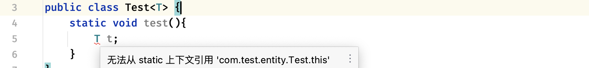
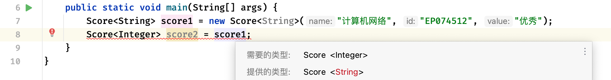

### 一、泛型

> 带问题思考：为了统计学生成绩，要求设计一个Score对象，包括课程名称、课程号、课程成绩，但是成绩分为两种，一种是以优秀、良好、合格 来作为结果，还有一种就是 60.0、75.5、92.5 这样的数字分数，可能高等数学这门课是以数字成绩进行结算，而计算机网络实验这门课是以等级进行结算，这两种分数类型都有可能出现，那么现在该如何去设计这样的一个Score类呢

- 泛型是 Java 5 引入的一个新特性，它允许在编写代码时使用**占位符（也称为类型参数）**来表示具体的类型，而不是具体的类

- 和 TypeScript 中的泛型类似

#### 1.1 泛型类

- 在泛型类中，可以将这个待定类型添加到类名后，它通常也被称为**类型参数**（Type Parameter）

  - 泛型在定义时并不明确是什么类型，而是需要到使用时才会确定具体的类型

```java
public class Score<T> {   // 泛型类需要使用<>，我们需要在里面添加1 - N个类型参数
    String name;
    String id;
    T value;   // T会根据使用时提供的类型自动变成对应类型

    public Score(String name, String id, T value) {   // 这里T可以是任何类型，但是一旦确定，那么就不能修改了
        this.name = name;
        this.id = id;
        this.value = value;
    }
}
```
- 使用

```java
public static void main(String[] args) {
    Score<String> score = new Score<String>("计算机网络", "EP074512", "优秀");
    String value = score.value;
    System.out.println(value);
}
```

> 注意，泛型是将数据类型的确定控制在了编译阶段，在编写代码的时候就能明确泛型的类型，如果类型不符合，将无法通过编译！因为是具体使用对象时才会明确具体类型，所以说静态方法中是不能用的



> 注意，具体类型不同的泛型类变量，不能使用不同的变量进行接收



- 如果要让某个变量支持引用确定了任意类型的泛型，那么可以使用?通配符

```java
public static void main(String[] args) {
    Test<?> test = new Test<Integer>();
    test = new Test<String>();
    // 但是如果使用通配符，那么由于类型不确定，所以说具体类型同样会变成 Object
  	Object o = test.value;
}
```

- 类型参数可以不止有一个

::: code-group
```java [Test]
public class Test<A, B, C> {   //多个类型变量使用逗号隔开
    public A a;
    public B b;
    public C c;
}
```
```java [Main]
public static void main(String[] args) {
    Test<String, Integer, Character> test = new Test<>();  //使用钻石运算符可以省略其中的类型
    test.a = "lbwnb";
    test.b = 10;
    test.c = '淦';
}
```
:::

::: tip
- 泛型只能确定为一个引用类型，基本类型是不支持的

  - 比如上面都没用 `int`，而是使用 `Integer` 这样的包装类

- 但是基本类型的数组是可以的，因为数组本身是引用类型

```java
public static void main(String[] args) {
    Test<int[]> test = new Test<>();
}
```
:::

#### 1.2 泛型与多态

- 不只是类，包括接口、抽象类，都是可以支持泛型的

```java
public interface Study<T> {
    T test();
}
```

- 当子类实现此接口时，可以选择在实现类明确泛型类型，或是继续使用此泛型让具体创建的对象来确定类型

::: code-group
```java [正常版]
public class Main {
    public static void main(String[] args) {
        A a = new A();
        Integer i = a.test();
    }

    static class A implements Study<Integer> {   
        @Override
        public Integer test() {
            return null;
        }
    }
}
```
```java [摆烂版]
public class Main {
    public static void main(String[] args) {
        A<String> a = new A<>();
        String i = a.test();
    }

    static class A<T> implements Study<T> {   
      	//让子类继续为一个泛型类，那么可以不用明确
        @Override
        public T test() {
            return null;
        }
    }
}
```
:::

- 继承也是同样的

```java
static class A<T> {
    
}

static class B extends A<String> {

}
```

#### 1.3 泛型方法

- 当某个方法（无论是是静态方法还是成员方法）需要接受的参数类型并不确定时，也可以使用泛型来表示

  - 泛型方法会在使用时自动确定泛型类型，不需要在方法定义时指定具体的类型

  - 但是，在调用方法时，需要提供具体的类型参数

```java
public class Main {
    public static void main(String[] args) {
        String str = test("Hello World!");
    }

    // 在返回值类型前添加<>并填写泛型变量表示这个是一个泛型方法
    private static <T> T test(T t){   
        return t;
    }
}
```

- 泛型方法在很多工具类中也有，比如说Arrays的排序方法

```java
public static void main(String[] args) {
    Integer[] arr = {1, 4, 5, 2, 6, 3, 0, 7, 9, 8};
    Arrays.sort(arr, (o1, o2) -> o2 - o1);
    System.out.println(Arrays.toString(arr));
}
```
- 包括数组赋值方法

```java
public static void main(String[] args) {
    String[] arr = {"AAA", "BBB", "CCC"};

    // 这里传入的类型是什么，返回的类型就是什么，也是用到了泛型
    String[] newArr = Arrays.copyOf(arr, 3);   
    System.out.println(Arrays.toString(newArr));
}
```

#### 1.4 泛型的界限

- 现在有一个新的需求，现在没有 String 类型的成绩了，但是成绩依然可能是整数，也可能是小数，这时不希望用户将泛型指定为除数字类型外的其他类型，我们就需要使用到泛型的上界定义

  - 和 TypeScript 类型，就是泛型约束

- 只需要在泛型变量的后面添加 `extends` 关键字即可指定上界

```java
public class Score<T extends Number> {   // 设定类型参数上界，必须是Number或是Number的子类
    private final String name;
    private final String id;
    private final T value;

    public Score(String name, String id, T value) {
        this.name = name;
        this.id = id;
        this.value = value;
    }

    public T getValue() {
        return value;
    }
}
```

- 同样的，当我们在使用变量时，泛型通配符也支持泛型的界限：

```java
public static void main(String[] args) {
    Score<? extends Integer> score = new Score<>("数据结构与算法", "EP074512", 60);
    System.out.println(score.getValue()); // 60
}
```

#### 1.5 类型擦除

- 实际上在Java中并不是真的有泛型类型（为了兼容之前的Java版本）因为所有的对象都是属于一个普通的类型，一个泛型类型编译之后，实际上会直接使用默认的类型

- 可以自行去了解 java 里泛型是怎么实现的

#### 1.6 协变、逆变、不变（抗变）

- 协变、逆变、不变，描述的是**「类型转换的方向是否兼容」**，Java 泛型默认【不变】，通过 `? extends` 实现协变，`? super` 实现逆变

> 前置基础：

> 假设：Dog extends Animal

> 子类型关系：Dog ⊂ Animal


- **协变**：方向和原类型继承关系保持一致

  - 如果 Dog 是 Animal 的子类，那么 `Container<Dog>` 也是 `Container<Animal>` 的子类 → 协变

::: tip
- Java 中数组是协变的

  - 但是数组协变有坑：编译不报错，运行异常，**所以泛型设计成不变（抗变）**

```java
Animal[] arr = new Dog[10]; // 数组协变 ✅
arr[0] = new Cat(); // 运行时报 ArrayStoreException
```
:::

- **逆变**：方向和原类型继承关系相反

- **不变 / 抗变**：父子类型互不兼容，不能互相赋值

  - 泛型使用中，`List<Dog>` 不是 `List<Animal>` 的父子类，完全不能直接转换

```java
List<Animal> list = new ArrayList<Dog>(); // 编译报错 ❌
// Java 泛型原生就是【不变】
```

::: info
泛型通配符实现协变 & 逆变

- `? extends`：协变 【上界通配符】

```java
List<? extends Animal> list = new ArrayList<Dog>(); // ✅ 协变
```

- 重要读写限制

  - 可以读，取出一定是 Animal

  - 不能写入（除了 null）

```java
list.add(null); // ✅
list.add(new Dog()); // 编译报错 ❌
```


- `? super`：逆变【下界通配符】

```java
List<? super Dog> list = new ArrayList<Animal>(); // ✅ 逆变
```

- 重要读写限制

  - 不能读取（除了 null）

  - 可以写入（必须是 Dog 或其子类）

```java
list.add(null); // ✅
list.add(new Dog()); // ✅
list.add(new Cat()); // 编译报错 ❌
Dog d = list.get(0);   // 编译报错，只能接收 Object 类型的变量
```
:::

### 二、Java8 函数式接口

- `java.util.function` 包下 4 个核心基础接口，配合 `Lambda` 使用，也是流式 `Stream` 大量用到的底层接口

- 函数式接口 = 只有一个抽象方法（可带多个默认 / 静态方法），可被 `@FunctionalInterface` 标记

- `Consumer<T>`：消费型 —— 有入参，无返回值

- `Supplier<T>`：供给型 —— 无入参，有返回值
- `Predicate<T>`：断言型 —— 有入参，返回 boolean
- `Function<T,R>`：函数型 —— 有入参，有返回值

> 这些接口在使用时必须导入，不能直接裸写

#### 2.1 Consumer 消费型

```java
@FunctionalInterface
public interface Consumer<T> {
    void accept(T t);   // 接收一个参数 T，无返回值
}
```
- `accept` 是 `Consumer` 这个函数式接口里唯一的抽象方法 ，用来"消费"（执行）传入的值

```java
import java.util.function.Consumer;

public class Test {
    public static void main(String[] args) {
        // Lambda 实现Consumer
        Consumer<String> consumer = str -> System.out.println("处理：" + str);
        consumer.accept("Java8 Lambda");

        // 场景：遍历打印
        Consumer<Integer> printNum = num -> System.out.println(num);
        printNum.accept(666);
    }
}
```

- 常见场景：`Stream.forEach(Consumer)`

```java
Stream.of(1,2,3).forEach(num -> System.out.println(num));
```

#### 2.2 Supplier 供给型

```java
@FunctionalInterface
public interface Supplier<T> {
    T get();   // 无参数，返回 T 类型
}
```

- `get` 每次调用才会执行

```java
import java.util.function.Supplier;
import java.util.Random;

public class Test {
    public static void main(String[] args) {
        Supplier<Integer> randomNum = () -> new Random().nextInt(100);
        System.out.println(randomNum.get());

        // 对象生成器
        Supplier<String> strSupplier = () -> "默认字符串";
        System.out.println(strSupplier.get());
    }
}
```

#### 2.3 Predicate 断言型

```java
@FunctionalInterface
public interface Predicate<T> {
    boolean test(T t);   // 有入参 T，返回 boolean
}
```

- `test` 是 `Predicate` 这个函数式接口里唯一的抽象方法 ，用来判断传入的值是否符合某个条件

```java
import java.util.function.Predicate;

public class Test {
    public static void main(String[] args) {
        Predicate<Integer> isGreater5 = num -> num > 5;
        System.out.println(isGreater5.test(10));  // true
        System.out.println(isGreater5.test(3));    // false
    }
}
```

- 高频场景：`Stream.filter(Predicate)`

```java
Stream.of(1,2,3,10).filter(n -> n>2).forEach(System.out::println);
```

#### 2.4 Function 函数型

```java
@FunctionalInterface
public interface Function<T, R> {
    R apply(T t);           // 核心方法：T → R
}
```

- 接收一个参数，做转换/处理，返回另一个值
 
```java
// String → Integer：求字符串长度
Function<String, Integer> lenFunc = s -> s.length();
System.out.println(lenFunc.apply("hello"));  // 5

// Integer → Integer：乘 2
Function<Integer, Integer> doubleFunc = n -> n * 2;
System.out.println(doubleFunc.apply(7));     // 14

// 类型完全可以不同：Student → String：取名字
class Student { String name; }
Function<Student, String> nameGetter = stu -> stu.name;
```

- `Function` 比 `Consumer/Supplier` 多了两个非常实用的默认方法，用来 拼接多个 Function 做流水线处理：


  - `andThen`：先自己，再下一个

  - `compose`：先下一个，再自己

```java
Function<Integer, Integer> f1 = x -> x + 1;     // +1
Function<Integer, Integer> f2 = x -> x * 2;     // ×2

// (10 + 1) × 2 = 22
Function<Integer, Integer> f_then = f1.andThen(f2);
System.out.println(f_then.apply(10));           // 22

// 先 f2，再 f1：(10 × 2) + 1 = 21
Function<Integer, Integer> f_compose = f1.compose(f2);
System.out.println(f_compose.apply(10));        // 21
```

- 高频场景：`Stream.map(Function)`

```java
Stream.of("1","2").map(s -> Integer.valueOf(s));
```

### 三、Java8 判空包装

- Java8 新增了一个非常重要的判空包装类 `Optional`，这个类可以很有效的处理空指针问题

```java
public static void main(String[] args) {
    test(null);   //直接传入值为null，调用方法马上得到空指针异常
}

private static void test(String str){ 
    if(str == null) return;   // 这样就可以防止null导致的异常了
    if(!str.isEmpty()) { 
        System.out.println("字符串长度为："+str.length());
    }
}
```

- 但有了 `Optional`，直接调用 `Optional.ofNullable()` 方法即可：

```java
public static void main(String[] args) {
    Consumer<String> test = (String str) -> {
        String s = Optional.ofNullable(str).get();   // get方法可以获取被包装的对象引用，但是如果为空的话，会抛出异常
        System.out.println(s);
    };
    Consumer<String> test1 = (String str) -> {
        String s = Optional.ofNullable(str).orElse("我是为null的情况备选方案");   // orElse方法返回备选值
        System.out.println(s);
    };
    test.accept("Java8 Lambda");  // Java8 Lambda
    test1.accept(null); // 我是为null的情况备选方案
}
```

- `Optional` 的方法比较多，这里就不一一介绍了


### 四、Java9/10 判空包装增强

- 主要是对 `Optional` 类的增强，新增了一些方法，用来处理空指针问题

- 首先是 `ifPresentOrElse`，可以直接将如果存在和不存在的两种情况都进行处理

```java
Optional.ofNullable(str).ifPresentOrElse(s -> {
    System.out.println("存在: " + s);
}, () -> {
    System.out.println("不存在");
});
```

- 还有快速对Optional进行空值替换的操作 `or`，这个跟 `orElse` 稍微有些区别

```java
Optional<String> op = Optional.ofNullable(str).or(() -> Optional.of("替代值"));
```

- 同时还包含后面要学习的 `Stream` 一键转换方法 `stream()`，它可以直接生成只包含一个值（就是 Optional 包裹的）的 `Stream` 对象

```java
Stream<String> stream = Optional.stream("Java8 Lambda");
```


