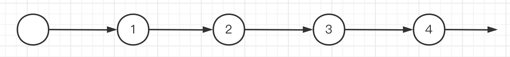
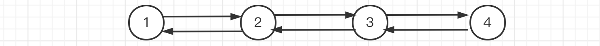
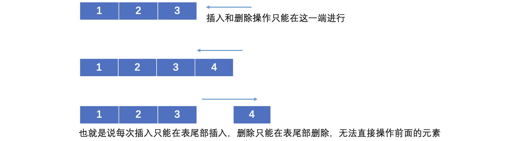
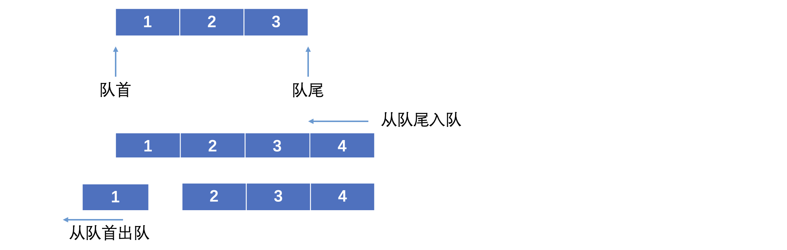
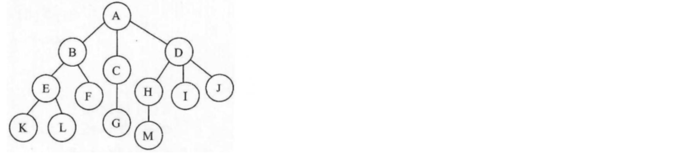
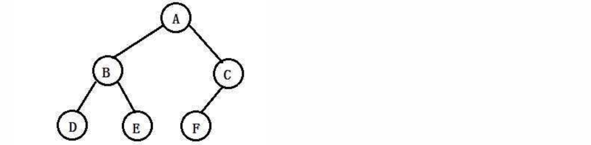
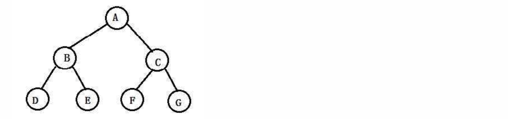
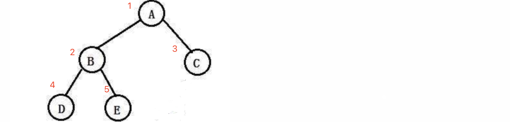

### 一、数据结构基础

- 学习集合类之前，要学习数据结构的基础，包括数组、链表、栈、队列、哈希表等。


### 二、线性表

- 线性表一般需要包含以下功能：

  - 插入指定位置的元素
  - 删除指定位置的元素
  - 查找
  - 清空
  - 遍历
  - 获取长度
  - ...

- 实现线性表的结构一般有两种，一种是顺序存储实现，还有一种是链式存储实现

#### 2.1 线性表：顺序表

- 存放数据还是使用数组，只是在数组中添加了额外的操作

- 其实就是手动编写逻辑，实现插入、删除、查找等操作

- 先定义一个新类型

```java
public class ArrayList<E> {   //泛型E，因为表中要存的具体数据类型待定
    int capacity = 10;   //当前顺序表的容量
  	int size = 0;   //当前已经存放的元素数量
    private Object[] array = new Object[capacity];   //底层存放数据的数组
}
```
::: code-group
```java [添加]
public void add(E element, int index){
    if(index < 0 || index > size)
        throw new IndexOutOfBoundsException("插入位置非法，合法的插入位置为：0 ~ "+size);
    if(capacity == size) {
        int newCapacity = capacity + (capacity >> 1);   //扩容规则就按照原本容量的1.5倍来吧
        Object[] newArray = new Object[newCapacity];    //创建一个新的数组来存放更多的元素
        System.arraycopy(array, 0, newArray, 0, size);   //使用arraycopy快速拷贝原数组内容到新的数组
        array = newArray;   //更换为新的数组
      	capacity = newCapacity;   //容量变成扩容之后的
    }
    for (int i = size; i > index; i--)
        array[i] = array[i - 1];
    array[index] = element;
    size++;
}
```
```java [删除]
@SuppressWarnings("unchecked")
public E remove(int index){
    if(index < 0 || index > size - 1)
        throw new IndexOutOfBoundsException("删除位置非法，合法的插入位置为：0 ~ "+(size - 1));
    E e = (E) array[index];
    for (int i = index; i < size; i++)
        array[i] = array[i + 1];
    size--;
    return e;
}
```
```java [查找]
@SuppressWarnings("unchecked")
public E get(int index){
    if(index < 0 || index > size - 1)   //在插入之前同样要进行范围检查
        throw new IndexOutOfBoundsException("非法的位置，合法的位置为：0 ~ "+(size - 1));
    return (E) array[index];   //直接返回就完事
}

public int size(){   //获取当前存放的元素数量
    return size;
}
```
:::


#### 2.2 线性表：链表

- 分带头节点的链表和不带头节点的链表

  - 带头节点的链接第一个节点是空



```java
public class LinkedList<E> {
  	//链表的头结点，用于连接之后的所有结点
    private final Node<E> head = new Node<>(null);
  	private int size = 0;   //当前的元素数量还是要存一下，方便后面操作
    
    private static class Node<E> {  // 结点类，仅供内部使用
        E element;   // 每个结点都存放元素
        Node<E> next;   // 以及指向下一个结点的引用
      
      	public Node(E element) {
            this.element = element;
        }
    }
}
```

::: code-group
```java [添加]
public void add(E element, int index){
    if(index < 0 || index > size)
        throw new IndexOutOfBoundsException("插入位置非法，合法的插入位置为：0 ~ "+size);
    Node<E> prev = head;
    for (int i = 0; i < index; i++)
        prev = prev.next;
    Node<E> node = new Node<>(element);
    node.next = prev.next;
    prev.next = node;
    size++;
}
```
```java [删除]
public E remove(int index){
    if(index < 0 || index > size - 1)   //同样的，先判断位置是否合法
        throw new IndexOutOfBoundsException("删除位置非法，合法的删除位置为：0 ~ "+(size - 1));
    Node<E> prev = head;
    for (int i = 0; i < index; i++)   //同样需要先找到前驱结点
        prev = prev.next;
    E e = prev.next.element;   //先把待删除结点存放的元素取出来
    prev.next = prev.next.next;  //可以删了
    size--;   //记得size--
    return e;
}
```
```java [查找]
public E get(int index){
    if(index < 0 || index > size - 1)
        throw new IndexOutOfBoundsException("非法的位置，合法的位置为：0 ~ "+(size - 1));
    Node<E> node = head;
    while (index-- >= 0)   //这里直接让index减到-1为止
        node = node.next;
    return node.element;
}

public int size(){
    return size;
}
```
:::

- 还有双向链表，就是每个结点都有指向前后两个结点的引用，实现更复杂的操作




#### 2.3 线性表：栈

- 栈（也叫堆栈，Stack）是一种特殊的线性表，它只能在在表尾进行插入和删除操作，就像下面这样



- 讲究先进后出，就是后进的元素先出，先进进的元素后出，像一个栈一样


- 实现栈也是非常简单的，可以基于前面的顺序表或是链表，需要实现两个新的操作

  - pop：出栈操作，从栈顶取出一个元素。
  - push：入栈操作，向栈中压入一个新的元素。

- 以链表实现为例

```java
public class LinkedStack<E> {

    private final Node<E> head = new Node<>(null);   //大体内容跟链表类似

    private static class Node<E> {
        E element;
        Node<E> next;

        public Node(E element) {
            this.element = element;
        }
    }
}
```


::: code-group
```java [入栈]
public void push(E element){
    Node<E> node = new Node<>(element);   //直接创建新结点
    node.next = head.next;    //新结点的下一个变成原本的栈顶结点
    head.next = node;     //头结点的下一个改成新的结点
}
```
```java [出栈]
public E pop(){
    if(head.next == null)
        throw new IllegalArgumentException("栈空了");
    E e = head.next.element;
    head.next = head.next.next;
    return e;
}
```
:::


#### 2.4 线性表：队列

- 队列也是一种特殊的线性表，但它讲究先进先出



```java
public class LinkedQueue<E> {

    private final Node<E> head = new Node<>(null);

    public void offer(E element){  //入队操作
        Node<E> last = head;
        while (last.next != null)   //入队直接丢到最后一个结点的屁股后面就行了
            last = last.next;
        last.next = new Node<>(element);
    }

    public E poll(){   //出队操作
        if(head.next == null)   //如果队列已经没有元素了，那么肯定是没办法取的
            throw new NoSuchElementException("队列为空");
        E e = head.next.element;
        head.next = head.next.next;   //直接从队首取出
        return e;
    }

    private static class Node<E> {
        E element;
        Node<E> next;

        public Node(E element) {
            this.element = element;
        }
    }
}
```

### 三、树

- 树是一种全新的数据结构，它就像一棵树的树枝一样，不断延伸



- 最上方的结点为树的**根结点（Root）**

- 每个结点连接的子结点数目（分支的数目），我们称为结点的**度（Degree）**，而各个结点度的最大值称为树的度

- 每个结点延伸下去的下一个结点都可以称为一棵**子树（SubTree）**比如结点B及其之后延伸的所有分支合在一起，就是一棵A的子树

- 每个结点的**层次（Level）**按照从上往下的顺序，树的根结点为1，每向下一层+1，比如G的层次就是3，整棵树中所有结点的最大层次，就是这颗树的**深度（Depth）**

- 当然还有父节点、子节点、兄弟节点、叶子节点、祖先节点等概念，这里就不展开了

#### 3.1 树：二叉树

- 二叉树（Binary Tree）它是一种特殊的树，它的度最大只能为 2

- 并且二叉树任何结点的子树是有左右之分的，不能颠倒顺序，比如A结点左边的子树，称为左子树，右边的子树称为右子树



- 在一棵二叉树中，所有分支结点都存在左子树和右子树，且叶子结点都在同一层，这样的二叉树我们称为满二叉树



- 只有最后一层有空缺的二叉树，称为**完全二叉树**


- 二叉树的实现也是靠链式存储的，每个结点都有左右两个子树的引用

```java
public class TreeNode<E> {
    public E element;
    public TreeNode<E> left, right;

    public TreeNode(E element){
        this.element = element;
    }
}

public static void main(String[] args) {
    TreeNode<Character> a = new TreeNode<>('A');
    TreeNode<Character> b = new TreeNode<>('B');
    TreeNode<Character> c = new TreeNode<>('C');
    TreeNode<Character> d = new TreeNode<>('D');
    TreeNode<Character> e = new TreeNode<>('E');
    
    a.left = b;
    a.right = c;
    b.left = d;
    b.right = e;
    ...
}
```


- 比如我们想通过根结点访问到D结点

```java
System.out.println(a.left.left.element);
```

- 然后就是对二叉树的遍历，有四种方式，分别是前序遍历、中序遍历、后序遍历、层序遍历

::: code-group
```java [前序遍历]
private static <T> void preOrder(TreeNode<T> root){
    if(root == null) return;
    System.out.print(root.element + " ");
    preOrder(root.left);    //先走左边
    preOrder(root.right);   //再走右边
}
```
```java [中序遍历]
private static <T> void inOrder(TreeNode<T> root){
    if(root == null) return;
    inOrder(root.left);  
    System.out.print(root.element);  
    inOrder(root.right);  
}
```
```java [后序遍历]
private static <T> void inOrder(TreeNode<T> root){
    if(root == null) return;
    inOrder(root.left); 
    inOrder(root.right); 
    System.out.print(root.element); 
}
```
```java [层序遍历]
private static <T> void levelOrder(TreeNode<T> root){
    LinkedQueue<TreeNode<T>> queue = new LinkedQueue<>();  //创建一个队列
    queue.offer(root);    //将根结点丢进队列
    while (!queue.isEmpty()) {   //如果队列不为空，就一直不断地取出来
        TreeNode<T> node = queue.poll();   //取一个出来
        System.out.print(node.element);  //打印
        if(node.left != null) queue.offer(node.left);   //如果左右孩子不为空，直接将左右孩子丢进队列
        if(node.right != null) queue.offer(node.right);
    }
}
```
:::

#### 3.2 树：二叉查找树和平衡二叉树

- 二叉查找树也叫二叉搜索树或是二叉排序树，它具有一定的规则：

  - 左子树中所有结点的值，均小于其根结点的值。
  - 右子树中所有结点的值，均大于其根结点的值。

  - 二叉搜索树的子树也是二叉搜索树。


> 还有平衡二叉树、红黑树啥的，这里就不展开了，感觉实际业务没遇到过，遇到在学吧


