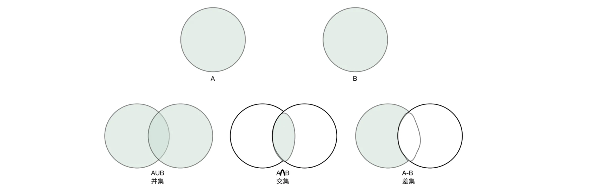
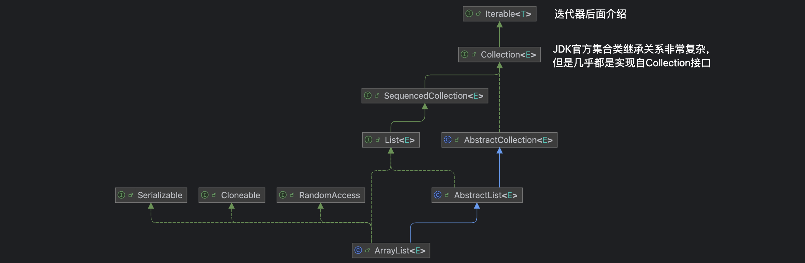

### 一、集合类

- 集合类是 Java 中非常重要的存在，使用频率**极高**

- 集合表示一组对象，每一个对象我们都可以称其为元素

- 不同的集合有着不同的性质

  - 比如一些集合允许重复的元素，而另一些则不允许，一些集合是有序的，而其他则是无序的。



- 集合类其实就是为了更好地组织、管理和操作数据而存在的

- 集合跟数组一样，可以表示同样的一组元素，但有所区别

  - 数组的大小是固定的，**集合的大小是可变的**

  - 数组可以存放基本数据类型，**集合只能存放对象**

  - 数组存放的类型只能是一种，**集合可以有不同种类的元素**

- Java 集合以两大顶层接口为根，分别是 `Collection` 和 `Map`

- **Collection 接口**：单列集合，每个位置只存一个独立元素

  - `List`：有序、可重复、支持索引精准访问
  - `Set`：元素不可重复，大部分实现无序
  - `Queue`：队列结构，遵循先进先出（FIFO）规则

- **Map 接口**：双列集合，存储 Key-Value 键值对，Key 不可重复，Value 可重复


### 二、集合根接口

- Java 中已经将常用的集合类型都实现好了，可以直接使用

  - 集合类基本都是在 `java.util` 包下定义的

- 比如

```java
import java.util.ArrayList;

public class Main {
    public static void main(String[] args) {
        ArrayList<String> list = new ArrayList<>();
        list.add("树脂666");
    }
}
```

- 所有的集合类最终都是实现自集合根接口的，它的祖先就是 `Collection` 接口



- 这个接口定义了集合类的一些基本操作

```java
public interface Collection<E> extends Iterable<E> {
    //-------这些是查询相关的操作----------

   	//获取当前集合中的元素数量
    int size();

    //查看当前集合是否为空
    boolean isEmpty();

    //查询当前集合中是否包含某个元素
    boolean contains(Object o);

    //返回当前集合的迭代器，我们会在后面介绍
    Iterator<E> iterator();

    //将集合转换为数组的形式
    Object[] toArray();

    //支持泛型的数组转换，同上
    <T> T[] toArray(T[] a);

    //-------这些是修改相关的操作----------

    //向集合中添加元素，不同的集合类具体实现可能会对插入的元素有要求，
  	//这个操作并不是一定会添加成功，所以添加成功返回true，否则返回false
    boolean add(E e);

    //从集合中移除某个元素，同样的，移除成功返回true，否则false
    boolean remove(Object o);


    //-------这些是批量执行的操作----------

    //查询当前集合是否包含给定集合中所有的元素
  	//从数学角度来说，就是看给定集合是不是当前集合的子集
    boolean containsAll(Collection<?> c);

    //添加给定集合中所有的元素
  	//从数学角度来说，就是将当前集合变成当前集合与给定集合的并集
  	//添加成功返回true，否则返回false
    boolean addAll(Collection<? extends E> c);

    //移除给定集合中出现的所有元素，如果某个元素在当前集合中不存在，那么忽略这个元素
  	//从数学角度来说，就是求当前集合与给定集合的差集
  	//移除成功返回true，否则false
    boolean removeAll(Collection<?> c);

    //Java8新增方法，根据给定的Predicate条件进行元素移除操作
    default boolean removeIf(Predicate<? super E> filter) {
        Objects.requireNonNull(filter);
        boolean removed = false;
        final Iterator<E> each = iterator();   //这里用到了迭代器，我们会在后面进行介绍
        while (each.hasNext()) {
            if (filter.test(each.next())) {
                each.remove();
                removed = true;
            }
        }
        return removed;
    }

    //只保留当前集合中在给定集合中出现的元素，其他元素一律移除
  	//从数学角度来说，就是求当前集合与给定集合的交集
  	//移除成功返回true，否则false
    boolean retainAll(Collection<?> c);

    //清空整个集合，删除所有元素
    void clear();


    //-------这些是比较以及哈希计算相关的操作----------

    //判断两个集合是否相等
    boolean equals(Object o);

    //计算当前整个集合对象的哈希值
    int hashCode();

    //与迭代器作用相同，但是是并行执行的，我们会在下一章多线程部分中进行介绍
    @Override
    default Spliterator<E> spliterator() {
        return Spliterators.spliterator(this, 0);
    }

    //生成当前集合的流，我们会在后面进行讲解
    default Stream<E> stream() {
        return StreamSupport.stream(spliterator(), false);
    }

    //生成当前集合的并行流，我们会在下一章多线程部分中进行介绍
    default Stream<E> parallelStream() {
        return StreamSupport.stream(spliterator(), true);
    }
}
```

### 三、List 列表

- `List` 属于 Java 集合框架（java.util 包），是**有序、可重复**的单列集合接口，继承自 `Collection`

  -  核心特点：**元素有索引、允许重复元素、存入顺序和取出顺序一致**

- 继承结构

```md
Collection 接口
    ↳ List 接口（有序带索引）
        ├ ArrayList    【最常用】数组实现
        ├ LinkedList   【用的少】双向链表实现
        └ Vector       古老线程安全数组（基本淘汰）
```
|实现类	|底层数据结构	|扩容机制	|线程安全	|适用场景|
|---|---|---|---|---|
|`ArrayList`|动态 Object 数组|	默认初始容量 10，扩容为原容量的 1.5 倍|	不安全|	绝大多数业务场景，以查询、遍历为主|
|`LinkedList`	|双向链表|	无扩容概念，节点按需创建|	不安全|	频繁首尾插入 / 删除、实现栈 / 队列|


```java
import java.util.List;
import java.util.ArrayList;
import java.util.LinkedList;

// 标准写法
List<String> list = new ArrayList<>();

// LinkedList 创建
List<Integer> linkedList = new LinkedList<>();

// Java9+ 快速创建不可变集合（不能增删修改）
List<String> immutable = List.of("A", "B", "C");
// immutable.add("D"); // 报错！
```

#### 3.1 常见核心方法

- 主要是添加、删除、查询、修改、截取、转换方法

  - 乍一看，有些方法像 js 里的字符串或数组方法

::: code-group
```java [Main]
import java.util.ArrayList;
import java.util.List;

public class ListMethodDemo {
    public static void main(String[] args) {
        demoAdd();
        demoRemove();
        demoQueryAndSet();
        demoSubListAndToArray();
    }
```
```java [添加]
    private static void demoAdd() {
        List<String> list = new ArrayList<>();

        // boolean add(E e) 尾部追加，返回是否成功
        boolean addSuccess = list.add("A");
        System.out.println("add(A) 返回值：" + addSuccess);   // true
        list.add("C");
        System.out.println("追加后：" + list); // [A, C]

        // void add(int index, E element) 指定索引插入
        list.add(1, "B");
        System.out.println("索引1插入B：" + list); // [A, B, C]

        // boolean addAll(Collection<? extends E> c) 尾部批量添加
        String[] arr = {"D", "E"};
        List<String> temp1 = Arrays.asList(arr);  // 数组转集合
        list.addAll(temp1);
        System.out.println("尾部批量添加[D,E]：" + list); // [A,B,C,D,E]

        // boolean addAll(int index, Collection<? extends E> c) 指定位置批量插入
        List<String> temp2 = List.of("X", "Y");   // Java 9+ 可用 List.of() 创建不可变集合，元素不可增删改，且不允许存入 null
        list.addAll(2, temp2);
        System.out.println("索引2插入[X,Y]：" + list); // [A,B,X,Y,C,D,E]
    }
```
```java [删除]
    private static void demoRemove() {
        // 前面说 List.of() 创建不可变集合，元素不可增删改
        // 所以这里用 ArrayList 包装不可变集合，才能删除元素
        // 注意：删除元素后，集合的索引会改变，所以删除元素后，后续元素的索引会变化
        List<String> list = new ArrayList<>(List.of("A", "B", "C", "B", "D"));

        // remove(int index) 根据索引删除，返回被删除元素
        String removedVal = list.remove(0);
        System.out.println("删除索引0元素：" + removedVal + "，集合：" + list); // [B,C,B,D]

        // boolean remove(Object o) 删除第一个匹配元素（存在多个时，只删除第一个匹配）
        boolean removeFlag = list.remove("B");
        System.out.println("删除元素B 是否成功：" + removeFlag + "，集合：" + list); // [C,B,D]

        // removeAll：删除和参数集合相交的元素
        List<String> target = List.of("B", "E");
        list.removeAll(target);
        System.out.println("removeAll([B,E])：" + list); // [C,D]

        // retainAll：只保留交集元素
        List<String> list2 = new ArrayList<>(List.of("1","2","3","4"));
        List<String> keep = List.of("2","4");
        list2.retainAll(keep);
        System.out.println("retainAll([2,4])：" + list2); // [2,4]

        // clear() 清空所有元素
        list.clear();
        System.out.println("clear后size：" + list.size()); // 0
    }
```
```java [修改与查询]
    private static void demoQueryAndSet() {
        List<String> list = new ArrayList<>(List.of("苹果", "香蕉", "橙子", "香蕉"));

        // set(index, element) 修改元素，返回旧值
        String old = list.set(1, "葡萄");
        System.out.println("索引1原值：" + old + "，新集合：" + list); // 香蕉 [苹果,葡萄,橙子,香蕉]

        // get(index) 获取元素
        System.out.println("索引2元素：" + list.get(2)); // 橙子

        // indexOf 首次出现索引；找不到返回-1
        int firstIdx = list.indexOf("香蕉");
        System.out.println("香蕉首次索引：" + firstIdx);

        // lastIndexOf 最后出现索引
        int lastIdx = list.lastIndexOf("香蕉");
        System.out.println("香蕉最后索引：" + lastIdx);

        // contains 判断是否存在
        System.out.println("是否包含苹果：" + list.contains("苹果"));

        // size / isEmpty
        System.out.println("集合长度size：" + list.size());
        System.out.println("集合是否为空：" + list.isEmpty());
    }
```
```java [截取与转换]
    private static void demoSubListAndToArray() {
        List<Integer> list = new ArrayList<>(List.of(10,20,30,40,50));

        // subList 左闭右开 [start, end)
        List<Integer> sub = list.subList(1,4);
        System.out.println("subList(1,4)：" + sub); // [20,30,40]
        // ⚠️重点：subList是原集合视图，修改子集会影响原集合！
        sub.set(0, 999);
        System.out.println("修改子集后原list：" + list); // [10,999,30,40,50]

        // toArray() 返回Object[]
        Object[] objArr = list.toArray();
        System.out.println("Object数组：" + objArr[0]); // 10

        // toArray(T[] a) 转为指定类型数组
        Integer[] intArr = list.toArray(new Integer[0]);
        System.out.println("Integer数组第二个元素：" + intArr[1]); // 999
    }
}
```
:::

::: info
- 上面 demo 除了讲了操作方法，还有两个知识点

- `Arrays.asList` 数组转集合，不支持 add/remove 操作，且修改原数组会同步影响集合

```java
String[] arr = {"A", "B", "C"};
List<String> list = Arrays.asList(arr);

list.add("D"); // 运行抛出 UnsupportedOperationException

// 正确转为可修改的标准 ArrayList
List<String> realList = new ArrayList<>(Arrays.asList(arr));
```

- `List.of()` 创建不可变集合，元素不可增删改，且不允许存入 null
```java
List<String> immutable = List.of("A", "B", "C");
```
:::


#### 3.2 常见遍历方法

- 四种遍历方法

- 普通 for 循环

```java
List<String> list = new ArrayList<>(List.of("A", "B", "C", "D", "E"));

for (int i = 0; i < list.size(); i++) {
    String item = list.get(i);
    System.out.println(item);
}
```

- 增强 for 循环（foreach）

```java
for (String item : list) {
    System.out.println(item);
}
```

- Iterator 迭代器

  - 集合框架的标准遍历方式，支持遍历过程中安全删除元素

```java
List<String> list = new ArrayList<>(List.of("A", "B", "C", "D", "E"));

Iterator<String> it = list.iterator();
while (it.hasNext()) {
    String item = it.next();
    if ("B".equals(item)) {
        it.remove(); // 安全删除，不会触发并发修改异常
    }
}
System.out.println("删除B后集合：" + list); // [A,C,D,E]
```

- Java 8+ forEach + Lambda

```java
list.forEach(item -> System.out.println(item));
// 方法引用简化写法
list.forEach(System.out::println);
```

::: tip
常见坑

- 第一个：遍历过程中不能删除元素，否则会触发并发修改异常

  - 删除元素后后续元素整体前移，导致索引错位，跳过下一个元素
```java
for (String item : list) {
    if ("B".equals(item)) {
        list.remove(item); // 运行抛出 ConcurrentModificationException
    }
}
```

- 第二个：subList 是原集合视图，修改子集会影响原集合

- 第三个：方法返回空结果时，推荐用 `Collections.emptyList()` 返回空集合，避免返回 null 导致空指针异常

```java
public List<String> queryData() {
    if (无数据) {
        return Collections.emptyList();
    }
    // 业务逻辑...
}
```
:::


### 四、迭代器

- 先看一个 demo

```java
public static void main(String[] args) {
    List<String> list = Arrays.asList("A", "B", "C");
    for (String s : list) {   //集合类同样支持这种语法
        System.out.println(s);
    }
}
```

- 其实这个 forEach 语法是语法糖，编译后是迭代器 `Iterator` 遍历

```java
public static void main(String[] args) {
    List<String> list = Arrays.asList("A", "B", "C");
    Iterator var2 = list.iterator();   //这里使用的是List的迭代器在进行遍历操作

    while(var2.hasNext()) {
        String s = (String)var2.next();
        System.out.println(s);
    }

}
```

- `Iterator` 迭代器本身也是一个接口，由具体的集合实现类来根据情况实现

  - 通过调用 iterator 方法快速获取当前集合的迭代器

```java
public static void main(String[] args) {
    List<String> list = Arrays.asList("A", "B", "C");

    Iterator<String> iterator = list.iterator();
    while (iterator.hasNext()) {    // 每次循环一定要判断是否还有元素剩余
        System.out.println(iterator.next());  // 如果有就可以继续获取到下一个元素
    }
}
```

- 迭代器每一次 `next` 操作，都会将指针后移一位，直到完成每一个元素的遍历，此时再调用 `next` 将不能再得到下一个元素


- 下面是迭代器接口的源码定义

```java
public interface Iterator<E> {
    // 看看是否还有下一个元素
    boolean hasNext();

    //遍历当前元素，并将下一个元素作为待遍历元素
    E next();

    // 移除上一个被遍历的元素（某些集合不支持这种操作）
    default void remove() {
        throw new UnsupportedOperationException("remove");
    }

    //对剩下的元素进行自定义遍历操作
    default void forEachRemaining(Consumer<? super E> action) {
        Objects.requireNonNull(action);
        while (hasNext())
            action.accept(next());
    }
}
```

- 得益于 Iterable 提供的迭代器生成方法，实际上只要是实现了迭代器接口的类（我们自己写的都行），都可以使用 foreach 语法遍历

  - 和 js 里的迭代器类似，只要继承了 Iterable 接口，就可以使用 foreach 语法遍历

::: code-group
```java
public class Test implements Iterable<String>{   //这里我们随便写一个类，让其实现Iterable接口
    @Override
    public Iterator<String> iterator() {
        return new Iterator<String>() {   //生成一个匿名的Iterator对象
            @Override
            public boolean hasNext() {   //这里随便写的，直接返回true，这将会导致无限循环
                return true;
            }

            @Override
            public String next() {   //每次就直接返回一个字符串吧
                return "测试";
            }
        };
    }
}
```
```java
public static void main(String[] args) {
    Test test = new Test();
    for (String s : test) {
        System.out.println(s);
    }
}
```
:::

- 迭代器还有 `ListIterator`，这个迭代器是针对于List的强化版本，增加了更多方便的操作，可以自行了解。实际业务中，一般使用 `Iterator` 


