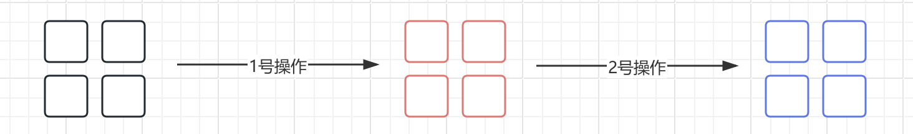

### 一、集合类

- 集合类是 Java 中非常重要的存在，使用频率**极高**

- 集合表示一组对象，每一个对象我们都可以称其为元素

- 不同的集合有着不同的性质

  - 比如一些集合允许重复的元素，而另一些则不允许，一些集合是有序的，而其他则是无序的。


- 集合类其实就是为了更好地组织、管理和操作数据而存在的

- 集合跟数组一样，可以表示同样的一组元素，但有所区别

  - 数组的大小是固定的，**集合的大小是可变的**

  - 数组可以存放基本数据类型，**集合只能存放对象**

  - 数组存放的类型只能是一种，**集合可以有不同种类的元素**

- Java 集合以两大顶层接口为根，分别是 `Collection` 和 `Map`

- **Collection 接口**：单列集合，每个位置只存一个独立元素

  - `List`：有序、可重复、支持索引精准访问
  - `Set`：元素不可重复，大部分实现无序
  - `Queue`：队列结构，遵循先进先出（FIFO）规则

- **Map 接口**：双列集合，存储 Key-Value 键值对，Key 不可重复，Value 可重复


### 二、集合根接口

- Java 中已经将常用的集合类型都实现好了，可以直接使用

  - 集合类基本都是在 `java.util` 包下定义的

- 比如

```java
import java.util.ArrayList;

public class Main {
    public static void main(String[] args) {
        ArrayList<String> list = new ArrayList<>();
        list.add("树脂666");
    }
}
```

- 所有的集合类最终都是实现自集合根接口的，它的祖先就是 `Collection` 接口


- 这个接口定义了集合类的一些基本操作

```java
public interface Collection<E> extends Iterable<E> {
    //-------这些是查询相关的操作----------

   	//获取当前集合中的元素数量
    int size();

    //查看当前集合是否为空
    boolean isEmpty();

    //查询当前集合中是否包含某个元素
    boolean contains(Object o);

    //返回当前集合的迭代器，我们会在后面介绍
    Iterator<E> iterator();

    //将集合转换为数组的形式
    Object[] toArray();

    //支持泛型的数组转换，同上
    <T> T[] toArray(T[] a);

    //-------这些是修改相关的操作----------

    //向集合中添加元素，不同的集合类具体实现可能会对插入的元素有要求，
  	//这个操作并不是一定会添加成功，所以添加成功返回true，否则返回false
    boolean add(E e);

    //从集合中移除某个元素，同样的，移除成功返回true，否则false
    boolean remove(Object o);


    //-------这些是批量执行的操作----------

    //查询当前集合是否包含给定集合中所有的元素
  	//从数学角度来说，就是看给定集合是不是当前集合的子集
    boolean containsAll(Collection<?> c);

    //添加给定集合中所有的元素
  	//从数学角度来说，就是将当前集合变成当前集合与给定集合的并集
  	//添加成功返回true，否则返回false
    boolean addAll(Collection<? extends E> c);

    //移除给定集合中出现的所有元素，如果某个元素在当前集合中不存在，那么忽略这个元素
  	//从数学角度来说，就是求当前集合与给定集合的差集
  	//移除成功返回true，否则false
    boolean removeAll(Collection<?> c);

    //Java8新增方法，根据给定的Predicate条件进行元素移除操作
    default boolean removeIf(Predicate<? super E> filter) {
        Objects.requireNonNull(filter);
        boolean removed = false;
        final Iterator<E> each = iterator();   //这里用到了迭代器，我们会在后面进行介绍
        while (each.hasNext()) {
            if (filter.test(each.next())) {
                each.remove();
                removed = true;
            }
        }
        return removed;
    }

    //只保留当前集合中在给定集合中出现的元素，其他元素一律移除
  	//从数学角度来说，就是求当前集合与给定集合的交集
  	//移除成功返回true，否则false
    boolean retainAll(Collection<?> c);

    //清空整个集合，删除所有元素
    void clear();


    //-------这些是比较以及哈希计算相关的操作----------

    //判断两个集合是否相等
    boolean equals(Object o);

    //计算当前整个集合对象的哈希值
    int hashCode();

    //与迭代器作用相同，但是是并行执行的，我们会在下一章多线程部分中进行介绍
    @Override
    default Spliterator<E> spliterator() {
        return Spliterators.spliterator(this, 0);
    }

    //生成当前集合的流，我们会在后面进行讲解
    default Stream<E> stream() {
        return StreamSupport.stream(spliterator(), false);
    }

    //生成当前集合的并行流，我们会在下一章多线程部分中进行介绍
    default Stream<E> parallelStream() {
        return StreamSupport.stream(spliterator(), true);
    }
}
```

### 三、List 列表

- `List` 属于 Java 集合框架（java.util 包），是**有序、可重复**的单列集合接口，继承自 `Collection`

  -  核心特点：**元素有索引、允许重复元素、存入顺序和取出顺序一致**

- 继承结构

```md
Collection 接口
    ↳ List 接口（有序带索引）
        ├ ArrayList    【最常用】数组实现
        ├ LinkedList   【用的少】双向链表实现
        └ Vector       古老线程安全数组（基本淘汰）
```
|实现类	|底层数据结构	|扩容机制	|线程安全	|适用场景|
|---|---|---|---|---|
|`ArrayList`|动态 Object 数组|	默认初始容量 10，扩容为原容量的 1.5 倍|	不安全|	绝大多数业务场景，以查询、遍历为主|
|`LinkedList`	|双向链表|	无扩容概念，节点按需创建|	不安全|	频繁首尾插入 / 删除、实现栈 / 队列|


```java
import java.util.List;
import java.util.ArrayList;
import java.util.LinkedList;

// 标准写法
List<String> list = new ArrayList<>();

// LinkedList 创建
List<Integer> linkedList = new LinkedList<>();

// Java9+ 快速创建不可变集合（不能增删修改）
List<String> immutable = List.of("A", "B", "C");
// immutable.add("D"); // 报错！
```

#### 3.1 常见核心方法

- 主要是添加、删除、查询、修改、截取、转换方法

  - 乍一看，有些方法像 js 里的字符串或数组方法

::: code-group
```java [Main]
import java.util.ArrayList;
import java.util.List;

public class ListMethodDemo {
    public static void main(String[] args) {
        demoAdd();
        demoRemove();
        demoQueryAndSet();
        demoSubListAndToArray();
    }
```
```java [添加]
    private static void demoAdd() {
        List<String> list = new ArrayList<>();

        // boolean add(E e) 尾部追加，返回是否成功
        boolean addSuccess = list.add("A");
        System.out.println("add(A) 返回值：" + addSuccess);   // true
        list.add("C");
        System.out.println("追加后：" + list); // [A, C]

        // void add(int index, E element) 指定索引插入
        list.add(1, "B");
        System.out.println("索引1插入B：" + list); // [A, B, C]

        // boolean addAll(Collection<? extends E> c) 尾部批量添加
        String[] arr = {"D", "E"};
        List<String> temp1 = Arrays.asList(arr);  // 数组转集合
        list.addAll(temp1);
        System.out.println("尾部批量添加[D,E]：" + list); // [A,B,C,D,E]

        // boolean addAll(int index, Collection<? extends E> c) 指定位置批量插入
        List<String> temp2 = List.of("X", "Y");   // Java 9+ 可用 List.of() 创建不可变集合，元素不可增删改，且不允许存入 null
        list.addAll(2, temp2);
        System.out.println("索引2插入[X,Y]：" + list); // [A,B,X,Y,C,D,E]
    }
```
```java [删除]
    private static void demoRemove() {
        // 前面说 List.of() 创建不可变集合，元素不可增删改
        // 所以这里用 ArrayList 包装不可变集合，才能删除元素
        // 注意：删除元素后，集合的索引会改变，所以删除元素后，后续元素的索引会变化
        List<String> list = new ArrayList<>(List.of("A", "B", "C", "B", "D"));

        // remove(int index) 根据索引删除，返回被删除元素
        String removedVal = list.remove(0);
        System.out.println("删除索引0元素：" + removedVal + "，集合：" + list); // [B,C,B,D]

        // boolean remove(Object o) 删除第一个匹配元素（存在多个时，只删除第一个匹配）
        boolean removeFlag = list.remove("B");
        System.out.println("删除元素B 是否成功：" + removeFlag + "，集合：" + list); // [C,B,D]

        // removeAll：删除和参数集合相交的元素
        List<String> target = List.of("B", "E");
        list.removeAll(target);
        System.out.println("removeAll([B,E])：" + list); // [C,D]

        // retainAll：只保留交集元素
        List<String> list2 = new ArrayList<>(List.of("1","2","3","4"));
        List<String> keep = List.of("2","4");
        list2.retainAll(keep);
        System.out.println("retainAll([2,4])：" + list2); // [2,4]

        // clear() 清空所有元素
        list.clear();
        System.out.println("clear后size：" + list.size()); // 0
    }
```
```java [修改与查询]
    private static void demoQueryAndSet() {
        List<String> list = new ArrayList<>(List.of("苹果", "香蕉", "橙子", "香蕉"));

        // set(index, element) 修改元素，返回旧值
        String old = list.set(1, "葡萄");
        System.out.println("索引1原值：" + old + "，新集合：" + list); // 香蕉 [苹果,葡萄,橙子,香蕉]

        // get(index) 获取元素
        System.out.println("索引2元素：" + list.get(2)); // 橙子

        // indexOf 首次出现索引；找不到返回-1
        int firstIdx = list.indexOf("香蕉");
        System.out.println("香蕉首次索引：" + firstIdx);

        // lastIndexOf 最后出现索引
        int lastIdx = list.lastIndexOf("香蕉");
        System.out.println("香蕉最后索引：" + lastIdx);

        // contains 判断是否存在
        System.out.println("是否包含苹果：" + list.contains("苹果"));

        // size / isEmpty
        System.out.println("集合长度size：" + list.size());
        System.out.println("集合是否为空：" + list.isEmpty());
    }
```
```java [截取与转换]
    private static void demoSubListAndToArray() {
        List<Integer> list = new ArrayList<>(List.of(10,20,30,40,50));

        // subList 左闭右开 [start, end)
        List<Integer> sub = list.subList(1,4);
        System.out.println("subList(1,4)：" + sub); // [20,30,40]
        // ⚠️重点：subList是原集合视图，修改子集会影响原集合！
        sub.set(0, 999);
        System.out.println("修改子集后原list：" + list); // [10,999,30,40,50]

        // toArray() 返回Object[]
        Object[] objArr = list.toArray();
        System.out.println("Object数组：" + objArr[0]); // 10

        // toArray(T[] a) 转为指定类型数组
        Integer[] intArr = list.toArray(new Integer[0]);
        System.out.println("Integer数组第二个元素：" + intArr[1]); // 999
    }
}
```
:::

::: info
- 上面 demo 除了讲了操作方法，还有两个知识点

- `Arrays.asList` 数组转集合，不支持 add/remove 操作，且修改原数组会同步影响集合

```java
String[] arr = {"A", "B", "C"};
List<String> list = Arrays.asList(arr);

list.add("D"); // 运行抛出 UnsupportedOperationException

// 正确转为可修改的标准 ArrayList
List<String> realList = new ArrayList<>(Arrays.asList(arr));
```

- `List.of()` 创建不可变集合，元素不可增删改，且不允许存入 null
```java
List<String> immutable = List.of("A", "B", "C");
```
:::


#### 3.2 常见遍历方法

- 四种遍历方法

- 普通 for 循环

```java
List<String> list = new ArrayList<>(List.of("A", "B", "C", "D", "E"));

for (int i = 0; i < list.size(); i++) {
    String item = list.get(i);
    System.out.println(item);
}
```

- 增强 for 循环（foreach）

```java
for (String item : list) {
    System.out.println(item);
}
```

- Iterator 迭代器

  - 集合框架的标准遍历方式，支持遍历过程中安全删除元素

```java
List<String> list = new ArrayList<>(List.of("A", "B", "C", "D", "E"));

Iterator<String> it = list.iterator();
while (it.hasNext()) {
    String item = it.next();
    if ("B".equals(item)) {
        it.remove(); // 安全删除，不会触发并发修改异常
    }
}
System.out.println("删除B后集合：" + list); // [A,C,D,E]
```

- Java 8+ forEach + Lambda

```java
list.forEach(item -> System.out.println(item));
// 方法引用简化写法
list.forEach(System.out::println);
```

::: tip
常见坑

- 第一个：foreach 遍历过程中不能删除元素，否则会触发并发修改异常

  - 删除元素后后续元素整体前移，导致索引错位，跳过下一个元素
```java
for (String item : list) {
    if ("B".equals(item)) {
        list.remove(item); // 运行抛出 ConcurrentModificationException
    }
}
```

- 第二个：subList 是原集合视图，修改子集会影响原集合

- 第三个：方法返回空结果时，推荐用 `Collections.emptyList()` 返回空集合，避免返回 null 导致空指针异常

```java
public List<String> queryData() {
    if (无数据) {
        return Collections.emptyList();
    }
    // 业务逻辑...
}
```
:::


### 四、迭代器

- 先看一个 demo

```java
public static void main(String[] args) {
    List<String> list = Arrays.asList("A", "B", "C");
    for (String s : list) {   //集合类同样支持这种语法
        System.out.println(s);
    }
}
```

- 其实这个 forEach 语法是语法糖，编译后是迭代器 `Iterator` 遍历

```java
public static void main(String[] args) {
    List<String> list = Arrays.asList("A", "B", "C");
    Iterator var2 = list.iterator();   //这里使用的是List的迭代器在进行遍历操作

    while(var2.hasNext()) {
        String s = (String)var2.next();
        System.out.println(s);
    }

}
```

- `Iterator` 迭代器本身也是一个接口，由具体的集合实现类来根据情况实现

  - 通过调用 iterator 方法快速获取当前集合的迭代器

```java
public static void main(String[] args) {
    List<String> list = Arrays.asList("A", "B", "C");

    Iterator<String> iterator = list.iterator();
    while (iterator.hasNext()) {    // 每次循环一定要判断是否还有元素剩余
        System.out.println(iterator.next());  // 如果有就可以继续获取到下一个元素
    }
}
```

- 迭代器每一次 `next` 操作，都会将指针后移一位，直到完成每一个元素的遍历，此时再调用 `next` 将不能再得到下一个元素


- 下面是迭代器接口的源码定义

```java
public interface Iterator<E> {
    // 看看是否还有下一个元素
    boolean hasNext();

    //遍历当前元素，并将下一个元素作为待遍历元素
    E next();

    // 移除上一个被遍历的元素（某些集合不支持这种操作）
    default void remove() {
        throw new UnsupportedOperationException("remove");
    }

    //对剩下的元素进行自定义遍历操作
    default void forEachRemaining(Consumer<? super E> action) {
        Objects.requireNonNull(action);
        while (hasNext())
            action.accept(next());
    }
}
```

- 得益于 Iterable 提供的迭代器生成方法，实际上只要是实现了迭代器接口的类（我们自己写的都行），都可以使用 foreach 语法遍历

  - 和 js 里的迭代器类似，只要继承了 Iterable 接口，就可以使用 foreach 语法遍历

::: code-group
```java
public class Test implements Iterable<String>{   //这里我们随便写一个类，让其实现Iterable接口
    @Override
    public Iterator<String> iterator() {
        return new Iterator<String>() {   //生成一个匿名的Iterator对象
            @Override
            public boolean hasNext() {   //这里随便写的，直接返回true，这将会导致无限循环
                return true;
            }

            @Override
            public String next() {   //每次就直接返回一个字符串吧
                return "测试";
            }
        };
    }
}
```
```java
public static void main(String[] args) {
    Test test = new Test();
    for (String s : test) {
        System.out.println(s);
    }
}
```
:::

- 迭代器还有 `ListIterator`，这个迭代器是针对于List的强化版本，增加了更多方便的操作，可以自行了解。实际业务中，一般使用 `Iterator` 

### 五、Queue 和 Deque

- `Queue`（单向队列）和 `Deque`（双端队列）是处理线性数据的核心接口，广泛用于任务调度、算法实现、缓冲处理等场景

- `Deque` 是 `Queue` 的**子接口**，属于功能超集：所有 Queue 能做的 FIFO 队列操作，Deque 都能做

  - `Deque` 还能做 `Queue` 不能做的操作，比如额外支持双端增删、栈操作

#### 5.1 Queue 接口（单向队列，FIFO）

- `java.util.Queue` 继承自 `Collection` 接口，遵循**先进先出（FIFO）**原则：元素从队尾入队，从队首出队

- Queue 的操作分为两类：操作失败抛出异常 和 操作失败返回特殊值（null/false）

|操作类型|	抛出异常|	返回特殊值|	说明
|--|--|--|--|
|队尾插入|	`add(E e)`|	`offer(E e)`|	插入失败时 add 抛 IllegalStateException，offer 返回 false|
|队首删除|	`remove()`|	`poll()`|	队列空时 remove 抛 NoSuchElementException，poll 返回 null|
|查看队首|	`element()`|	`peek()`|	队列空时 element 抛 NoSuchElementException，peek 返回 null|

- 一般建议使用 `offer` `poll` `peek` 方法，可以减少异常处理开销


- 常用实现类有三个

  - `LinkedList`：基于双向链表实现，支持 null 元素，同时实现了 List 和 Deque 接口

    - 因为 LinkedList 同时实现了 List 接口，所以也可以作为 List 使用，只是在操作队列时，需要使用 Deque 接口的方法

  - `ArrayDeque`：基于动态循环数组实现，不支持 null 元素，入队出队性能优异，是普通队列的首选实现
  - `PriorityQueue`：优先级队列，**不遵守 FIFO 规则**，元素按自然排序或自定义 Comparator 优先级出队；不支持 null 元素

    - 优先级队列是 Queue 独有，Deque 没有此功能

::: code-group
```java [普通队列（ArrayDeque 实现）]
Queue<String> queue = new ArrayDeque<>();

// 入队
queue.offer("任务1");
queue.offer("任务2");
queue.offer("任务3");

// 查看队首
System.out.println(queue.peek()); // 任务1

// 出队
System.out.println(queue.poll()); // 任务1
System.out.println(queue.poll()); // 任务2

// 队列剩余元素
System.out.println(queue.size()); // 1
```
```java [优先级队列（PriorityQueue）]
// 默认自然排序（升序）
Queue<Integer> priorityQueue = new PriorityQueue<>();
priorityQueue.offer(5);
priorityQueue.offer(2);
priorityQueue.offer(8);

// 按优先级从小到大出队
System.out.println(priorityQueue.poll()); // 2
System.out.println(priorityQueue.poll()); // 5
System.out.println(priorityQueue.poll()); // 8
```
```java [自定义优先级队列]
// 自定义排序
Queue<Integer> priorityQueue = new PriorityQueue<>((a, b) -> b - a);
priorityQueue.offer(5);
priorityQueue.offer(2);
priorityQueue.offer(8);

// 按优先级从小到大出队
System.out.println(priorityQueue.poll()); // 8
System.out.println(priorityQueue.poll()); // 5
System.out.println(priorityQueue.poll()); // 2
```
:::

- 优先级队列只能保证 **出队顺序** 是按照优先级进行的，实际直接打印队列，是按照入队顺序的。


#### 5.2 Deque 接口（双端队列）

- `java.util.Deque`（Double Ended Queue）继承自 `Queue` 接口，支持两端都可以插入、删除、查看元素，功能更灵活

  - 队尾入队、队首出队 → 普通队列（FIFO）

  - 仅队首入队、队首出队 → 栈（FILO），官方推荐用 Deque 替代遗留的 Stack 类

- 队列操作方法：

|操作位置|	类型|	抛出异常|	返回特殊值|
|--|--|--|--|
|队首|	插入|	addFirst(E e)|	offerFirst(E e)|
|队首|	删除|	removeFirst()|	pollFirst()|
|队首|	查看|	getFirst()|	peekFirst()|
|队尾|	插入|	addLast(E e)|	offerLast(E e)|
|队尾|	删除|	removeLast()|	pollLast()|
|队尾|	查看|	getLast()|	peekLast()|

- 栈操作方法：

  - `push(E e)`：压栈，等价于 addFirst(e)

  - `pop()`：弹栈，等价于 removeFirst()
  - `peek()`：查看栈顶，等价于 peekFirst()

- 常见实现类：`ArrayDeque`、`LinkedList`

  - 绝大多数场景下，队列和栈都优先使用 `ArrayDeque`，性能更优；只有当需要同时使用 `List` 接口的能力时，才选择 `LinkedList`

::: code-group
```java [作为栈使用]
Deque<String> stack = new ArrayDeque<>();

// 压栈
stack.push("元素A");
stack.push("元素B");
stack.push("元素C");

// 查看栈顶
System.out.println(stack.peek()); // 元素C

// 弹栈
System.out.println(stack.pop()); // 元素C
System.out.println(stack.pop()); // 元素B
```
```java [作为双端队列使用]
Deque<Integer> deque = new ArrayDeque<>();

// 两端插入
deque.offerFirst(1);
deque.offerLast(2);
deque.offerFirst(0);
// 此时队列：0 -> 1 -> 2

// 两端查看
System.out.println(deque.peekFirst()); // 0
System.out.println(deque.peekLast());  // 2

// 两端删除
deque.pollFirst(); // 删除 0
deque.pollLast();  // 删除 2
System.out.println(deque.peek()); // 剩余 1
```
:::


::: tip
- **抛弃遗留类 Stack**：java.util.Stack 继承自 Vector，方法全加锁性能差，设计不符合接口规范，官方明确推荐用 Deque 替代

- **空队列安全**：不确定队列是否为空时，使用 `poll`/`peek` 系列方法，避免 `remove()`/`element()` 抛出异常

- **null 元素陷阱**：`ArrayDeque`、`PriorityQueue` 不允许插入 null；插入 null 可能导致 poll() 返回 null 时无法区分是「空队列」还是「元素为 null」

- **线程安全**：上述实现类均非线程安全，多线程场景下使用 `LinkedBlockingQueue`、`ArrayBlockingQueue`、`ConcurrentLinkedDeque` 等并发容器
:::

#### 5.3 Queue 与 Deque 的对比

- 本质关系

  - `Deque` 是`Queue` 的子接口，属于功能超集：所有 `Queue` 能做的 FIFO 队列操作，`Deque` 都能做；在此之上还额外支持双端增删、栈操作

- 谁用的多

  - 接口声明维度：`Queue` 更常见

    - 因为普通 FIFO 场景基数最大

  - 实现类维度：`Deque` 的实现是绝对主流

    - 用得最多的两个队列实现 `ArrayDeque` 和 `LinkedList`，**本质都是 `Deque` 的实现类**


### 六、Set 集合

- `java.util.Set` 继承自 `Collection`，Set 支持的功能其实也就和 Collection 中定义的差不多，只不过：

  - 不允许出现重复元素（这是 Set 的核心特征，通常用来去重）

  - 不支持随机访问（不允许通过下标访问）

- 基础操作

|方法|说明|
|--|--|
|boolean add(E e)	|添加元素，元素已存在则返回 false，添加成功返回 true|
|boolean remove(Object o)	|删除指定元素，删除成功返回 true|
|boolean contains(Object o)	|判断元素是否存在，时间复杂度由底层实现决定|
|int size()	|获取集合元素个数|
|boolean isEmpty()	|判断集合是否为空|
|void clear()	|清空集合所有元素|

- Set 通常用于集合运算，可快速完成集合的交、并、差、子集判断，业务中对比数据差异、筛选共同元素时非常常用

  - 并集：`addAll(Collection<?> c)` → 将另一个集合的所有元素加入当前 Set，自动去重

  - 交集：`retainAll(Collection<?> c)` → 仅保留当前 Set 中也存在于另一个集合的元素
  - 差集：`removeAll(Collection<?> c)` → 从当前 Set 中移除所有存在于另一个集合的元素
  - 子集判断：`containsAll(Collection<?> c)` → 判断当前 Set 是否包含另一个集合的全部元素

> 注意：以上操作均会**直接修改原集合**，若需保留原数据需先创建副本

- 有三种主流实现类：`HashSet`、`LinkedHashSet`、`TreeSet`

#### 6.1 HashSet 实现类

- 基于 `HashMap` 实现，元素存储在 HashMap 的 `key` 中，`value` 是一个固定的静态空对象。底层结构为**哈希表**（数组 + 链表 / 红黑树）

```java
public static void main(String[] args) {
    Set<String> set = new HashSet<>();
    System.out.println(set.add("AAA"));   // true
    System.out.println(set.add("AAA"));   // false
    System.out.println(set);   // [AAA]
}
```

- 由于底层采用哈希表实现，所以说无法维持插入元素的顺序

```java
public static void main(String[] args) {
    Set<String> set = new HashSet<>();
    set.addAll(Arrays.asList("A", "0", "-", "+"));
    System.out.println(set);  // [0, A, +, -]
}
```

- 利用 HashSet 去重

```java
List<String> tagList = Arrays.asList("Java", "Spring", "Java", "MySQL", "Spring", "Redis");

// 利用 HashSet 自动去重
Set<String> tagSet = new HashSet<>(tagList);
// 转回 List
List<String> distinctList = new ArrayList<>(tagSet);

System.out.println(distinctList); 
// 输出示例（无序）：[Java, MySQL, Spring, Redis]

// 如果利用下面的 LinkedHashSet 去重，会保留插入顺序
// 输出示例 [Java, Spring, MySQL, Redis]
```

#### 6.2 LinkedHashSet 实现类

- `LinkedHashSet` 底层维护的不再是一个 HashMap，而是 LinkedHashMap，在哈希表基础上额外维护一条双向链表，记录元素的插入顺序

```java
public static void main(String[] args) {
    Set<String> set = new LinkedHashSet<>();
    set.addAll(Arrays.asList("A", "0", "-", "+"));
    System.out.println(set);  // [A, 0, -, +]
}
```

#### 6.3 TreeSet 实现类

- 基于 `TreeMap`（红黑树）实现，实现了 SortedSet / NavigableSet 子接口，元素按指定规则排序存储

- **有序存储**：默认按元素自然排序升序排列，也可通过 Comparator 自定义排序规则

```java
// 默认自然排序（升序）
Set<Integer> set = new TreeSet<>();
set.add(5);
set.add(2);
set.add(8);
// 遍历顺序：2 → 5 → 8

// 自定义排序（降序）
Set<Integer> descSet = new TreeSet<>(Comparator.reverseOrder());
descSet.add(5);
descSet.add(2);
// 遍历顺序：5 → 2
```

::: tip
|维度|HashSet|LinkedHashSet|TreeSet|
|--|--|--|--|
|底层结构|哈希表（HashMap）|	哈希表 + 双向链表 |	红黑树（TreeMap）|
有序性|	无序，不保证顺序	|插入顺序有序	|排序有序（自然 / 自定义）|
null 元素	|允许 1 个|	允许 1 个|不允许|
增删查复杂度|	平均 O (1)	|平均 O (1)|	O(log n)|
核心优势	|性能最高、通用	|去重且保序	|自动排序、支持范围查询|
适用场景|	绝大多数去重场景	|需保留插入顺序的去重	|需排序 + 去重、范围查找|
:::

### 七、Map 映射

- `Map` 在很多语言中都有，存储键值对的

- `java.util.Map` 并不是 `Collection` 体系下的接口，而是单独的一个体系，因为操作特殊

  - 广泛用于快速查找、数据缓存、计数统计、分组聚合等场景

- 基础增删改查

| 方法 | 说明 |
| --- | --- |
| V put(K key, V value) | 插入或覆盖键值对，返回该键对应的旧值（不存在则返回 null） |
| V get(Object key) | 根据键获取对应的值，键不存在则返回 null |
| V remove(Object key) | 删除指定键的映射关系，返回被删除的值 |
| boolean containsKey(Object key) | 判断是否包含指定的键 |
| boolean containsValue(Object value) | 判断是否包含指定的值 |
| int size() | 获取当前键值对的数量 |
| boolean isEmpty() | 判断 Map 是否为空 |
| void clear() | 清空所有键值对 |

- 批量与视图操作

  - `putAll(Map<? extends K, ? extends V> m)`：批量将另一个 Map 的全部键值对存入当前 Map

  - `Set<K> keySet()`：获取所有键的 Set 视图，用于遍历键
  - `Collection<V> values()`：获取所有值的 Collection 视图，用于遍历值
  - `Set<Map.Entry<K, V>> entrySet()`：获取所有键值对的 Set 视图，是同时遍历键和值的最高效方式

- Java 8+ 高频实用默认方法

  - `getOrDefault(Object key, V defaultValue)`：键不存在时返回默认值，直接避免空指针异常

  - `putIfAbsent(K key, V value)`：仅当键不存在时才插入，不覆盖已有值

  - `computeIfAbsent(K key, Function<? super K, ? extends V> mappingFunction)`：键不存在时计算并生成新值插入，常用于分组、懒加载缓存

  - `merge(K key, V value, BiFunction<? super V, ? super V, ? extends V> remappingFunction)`：键存在则合并值，不存在则直接插入，常用于计数累加

> Map中无法添加相同的键，同样的键只能存在一个，即使值不同。如果出现键相同的情况，那么会覆盖掉之前的

- 也有多个实现类，比如 `HashMap`、`LinkedHashMap`、`TreeMap` 等，特性基本和 Set 实现类相似

#### 7.1 HashMap 实现类

- 通用首选，使用频率最高

```java
Map<String, Integer> fruitMap = new HashMap<>();

// 插入
fruitMap.put("苹果", 5);
fruitMap.put("香蕉", 3);
fruitMap.put("苹果", 10); // 覆盖旧值

// 获取
System.out.println(fruitMap.get("苹果")); // 10
System.out.println(fruitMap.getOrDefault("橙子", 0)); // 不存在返回默认值 0

// 判断与删除
System.out.println(fruitMap.containsKey("香蕉")); // true
fruitMap.remove("香蕉");
```

#### 7.2 LinkedHashMap 实现类

```java
public static void main(String[] args) {
    Map<String , String> map = new LinkedHashMap<>();
    map.put("0", "十七张");
    map.put("+", "牌");
    map.put("P", "你能秒我");
    System.out.println(map); // {0=十七张, +=牌, P=你能秒我}
    System.out.println(map.keySet()); // [0, +, P]
    System.out.println(map.values()); // [十七张, 牌, 你能秒我]
}
```


### 八、 比较类相关接口

- Java 中最核心、最常用的比较接口有两个：`java.lang.Comparable`（内部比较器 / 自然排序） 和 `java.util.Comparator`（外部比较器 / 定制排序）

  - 二者共同支撑了集合排序、有序集合（TreeSet/TreeMap）、优先级队列等几乎所有排序相关的场景


#### 8.1 Comparable 接口（内部比较器）

- `Comparable` 是类本身自带的排序能力，让类自己实现比较逻辑，因此也叫「自然排序接口」

  - 一个类实现了 Comparable，就代表它的实例之间可以互相比较大小，支持自然排序


- 接口只定义了一个方法

```java
public interface Comparable<T> {
    int compareTo(T o);
}
```
- 返回值规则（固定约定）：
  - 返回 负整数：当前对象 this 小于传入对象 o

  - 返回 零：当前对象等于传入对象
  - 返回 正整数：当前对象大于传入对象

- 核心特点：

  - 排序逻辑写在类内部，一个类只能有一种默认排序规则

  - 属于 “侵入式” 设计：需要修改类的源码

- 看个 demo，让自定义 `User` 类按用户 ID 升序排列

```java
public class User implements Comparable<User> {
    private Long id;
    private String name;
    private Integer age;

    public User(Long id, String name, Integer age) {
        this.id = id;
        this.name = name;
        this.age = age;
    }

    // 按 id 升序排序
    @Override
    public int compareTo(User other) {
        // 直接调用 Long 的 compare 方法，避免手动相减溢出
        return Long.compare(this.id, other.id);
    }

    // getter 省略
}
```
- 使用效果

```java
List<User> list = new ArrayList<>();
list.add(new User(3L, "张三", 25));
list.add(new User(1L, "李四", 30));
list.add(new User(2L, "王五", 22));

// 直接调用 sort，默认使用 compareTo 的规则
Collections.sort(list);
// 排序后按 id 升序：1 → 2 → 3
```

#### 8.2 Comparator 接口（外部比较器）

- `Comparator` 是独立于类之外的排序策略，相当于一个 “排序工具”，不需要修改目标类的代码，因此也叫「定制排序接口」

```java
public interface Comparator<T> {
    int compare(T o1, T o2);
}
```

- 返回值规则与 compareTo 完全一致

- Java 8 为 Comparator 增加了大量静态工具方法和默认方法，是目前开发的主流写法

| 方法 | 作用 |
| --- | --- |
| Comparator.comparing(Function) | 按指定字段升序排序 |
| Comparator.comparingInt/Long/Double() | 按基本类型字段排序，避免装箱 |
| thenComparing(Function) | 次级排序，前一个相等时按该字段继续比较 |
| reversed() | 反转排序顺序（升序变降序） |
| Comparator.reverseOrder() | 获取自然排序的逆序 |
| Comparator.nullsFirst(comparator) | 空值排到最前面 |
| Comparator.nullsLast(comparator) | 空值排到最后面 |

::: code-group
```java [实例一]
// 按年龄升序排序，无需修改 User 类

List<User> list = ...;

// Lambda 写法
list.sort((u1, u2) -> Integer.compare(u1.getAge(), u2.getAge()));

// 更推荐的写法：comparing 方法，语义更清晰
list.sort(Comparator.comparingInt(User::getAge));
```
```java [实例二]
// 多字段组合排序

list.sort(Comparator
        .comparing(User::getDept)          // 第一优先级：部门升序
        .thenComparingInt(User::getAge)    // 第二优先级：年龄升序
        .reversed()                        // 整体反转 → 部门降序，年龄降序
);

// 更精准的控制：仅年龄降序
list.sort(Comparator
        .comparing(User::getDept)
        .thenComparing(Comparator.comparingInt(User::getAge).reversed())
);
```
:::

### 九、Collections 工具类

- `java.util.Collections` 是 JDK 内置的集合专用工具类，所有方法均为静态方法

- 针对 `Collection（List/Set/Queue` 和 `Map` 提供通用的操作能力

  - 涵盖排序、查找、批量修改、线程安全包装、不可变视图等场景


#### 9.1 排序与顺序调整

- 针对 `List` 集合提供多种顺序操作，是最常用的能力之一

| 方法 | 说明 |
| --- | --- |
| `sort(List<T> list)` | 对列表进行自然升序排序，要求元素实现 Comparable 接口 |
| `sort(List<T> list, Comparator<? super T> c)` | 按自定义比较器规则排序，支持多字段、升降序定制 |
| `reverse(List<?> list)` | 反转列表中元素的顺序 |
| `shuffle(List<?> list)` | 随机打乱列表顺序（洗牌算法），常用于抽奖、随机排序场景 |
| `swap(List<?> list, int i, int j)` | 交换列表中两个索引位置的元素 |
| `rotate(List<?> list, int distance)` | 旋转列表，正数整体右移，负数整体左移 |

```java
List<Integer> list = new ArrayList<>(Arrays.asList(3, 1, 4, 2));

// 自然升序
Collections.sort(list); // [1, 2, 3, 4]

// 自定义降序
Collections.sort(list, Collections.reverseOrder()); // [4, 3, 2, 1]

// 反转
Collections.reverse(list); // [1, 2, 3, 4]

// 随机打乱
Collections.shuffle(list); // 顺序随机
```
::: tip
这些方法直接修改传入的原 List 对象，属于破坏性原地变更，不会返回新集合
:::

#### 9.2 查找、统计与极值计算

- 二分查找：使用二分查找算法快速定位元素索引，前提是列表已经按对应规则排好序，未排序时结果不可预测

  - `binarySearch(List<? extends Comparable> list, T key)`

  - `binarySearch(List<?> list, T key, Comparator<?> c)`

```java
List<Integer> list = new ArrayList<>(Arrays.asList(10, 20, 30, 40, 50));

// 列表必须已升序，才能用二分查找
int index = Collections.binarySearch(list, 30);
System.out.println(index);           // 2，找到元素所在索引

// 找不到时返回 -(插入点) - 1
int notFound = Collections.binarySearch(list, 25);
System.out.println(notFound);        // -3，表示应插入到索引 2 的位置

// 自定义比较器（降序查找需配合降序排序的列表）
int idx2 = Collections.binarySearch(list, 30, Comparator.reverseOrder());
```

- 极值计算

  - `max(Collection<? extends T> coll)`：返回集合自然排序的最大值

  - `max(Collection<T> coll, Comparator<? super T> comp)`：按自定义规则取最大值
  - `min(Collection<? extends T> coll) / min(...)`：返回最小值，规则与 max 一致

```java
List<Integer> list = new ArrayList<>(Arrays.asList(3, 7, 1, 9, 5));

// 自然排序取最大值 / 最小值
Integer max = Collections.max(list);
Integer min = Collections.min(list);
System.out.println(max);    // 9
System.out.println(min);    // 1

// 自定义规则：按字符串长度取最大值
List<String> words = Arrays.asList("apple", "hi", "banana");
String longest = Collections.max(words, Comparator.comparing(String::length));
System.out.println(longest);    // banana
```

- 统计与集合关系

  - `frequency(Collection<?> c, Object o)`：统计指定元素在集合中出现的次数

  - `disjoint(Collection<?> c1, Collection<?> c2)`：判断两个集合是否没有交集，无交集返回 true，有交集返回 false


#### 9.3 批量操作与元素替换

| 方法 | 说明 |
| --- | --- |
| `addAll(Collection<? super T> c, T... elements)` | 批量向集合中添加多个元素，比循环 add 更简洁 |
| `fill(List<? super T> list, T obj)` | 用指定元素覆盖填充列表的所有位置 |
| `replaceAll(List<T> list, T oldVal, T newVal)` | 将列表中所有旧值替换为新值，返回是否发生替换 |
| `copy(List<? super T> dest, List<? extends T> src)` | 将源列表元素拷贝到目标列表，目标列表 size 必须 ≥ 源列表，不会自动扩容 |

```java
List<String> list = new ArrayList<>();

// 批量添加元素
Collections.addAll(list, "苹果", "香蕉", "橙子");

// 全部替换为同一个值
Collections.fill(list, "占位符"); // ["占位符", "占位符", "占位符"]

// 批量替换指定值
Collections.replaceAll(list, "占位符", "默认值");
```

#### 9.4 线程安全包装(同步集合)

- 提供一组方法将非线程安全的普通集合，包装为线程安全的同步集合，原理是对所有操作方法加 synchronized 锁（锁包装对象本身）

  - `synchronizedList(List<T> list)`
  - `synchronizedSet(Set<T> s)`
  - `synchronizedMap(Map<K,V> m)`
  - `synchronizedSortedSet / synchronizedSortedMap`


> 还有很多，不介绍，用时再查


### 十、Java9 集合工厂方法

- 就是快速创建集合对象的方法，比如下面的

```java
List<String> fruit = Arrays.asList("apple", "banana", "orange");
```

- 在Java9之后，官方提供了更加方便的工厂方法进行快速创建

  - 不仅仅是 `List`、包括 `Map`、`Set` 都都被添加了若干个名字为 `of` 的静态方法

```java
List<String> fruits = List.of("apple", "banana", "orange");
Set<String> fruitSet = Set.of("apple", "banana", "orange");
```

- 但是通过 `of` 方法创建的集合是不可变，只读的，不能进行修改操作


### 十一、Java21 有序集合功能

- 对于有序集合类，Java 21 新增了一系列 `SequencedCollection`、`SequencedSet`、`SequencedMap` 掭口，这些接口扩展和规范了所有有序集合的功能

- 自行了解


### 十二、Java8 Stream 流

- `java.util.stream.Stream` 是 Java 8 引入的集合数据处理框架，以 ***声明式、链式调用*** 的方式完成过滤、映射、排序、聚合等操作

- 核心特性

  - **惰性求值**：流操作不会立即执行，直到调用最后一步 `forEach` 或 `collect` 等终端操作方法时，整个流水线才开始运作

  - **不修改源数据**：所有操作都基于新的流进行，不会改动原始集合

  - **一次性消费**：执行终端操作后流自动关闭，无法重复调用

  - **支持并行处理**：通过 `parallelStream` 方法创建并行流，可以自动利用多核处理器的并行计算能力

#### 12.1 流常见创建方式

- 从集合创建

```java
List<String> list = Arrays.asList("a", "b", "c");
// 串行流
Stream<String> stream = list.stream();
// 并行流
Stream<String> parallelStream = list.parallelStream();
```
- 从数组创建

```java
int[] array = {1, 2, 3, 4, 5};
// 串行流
Stream<Integer> stream = Arrays.stream(array);
// 并行流
Stream<Integer> parallelStream = Arrays.stream(array).parallel();

Stream<String> stream2 = Stream.of("a", "b", "c");
```
- 生成无限流（构造测试数据）

```java
// 生成无限个随机数
Stream<Double> randomStream = Stream.generate(Math::random);
// 按规则迭代生成序列：从0开始，每次+2
Stream<Integer> iterateStream = Stream.iterate(0, n -> n + 2);
```

- 空流

```java
Stream<String> emptyStream = Stream.empty();
```

#### 12.2 核心中间操作

- 中间操作返回新的 Stream 对象，支持链式拼接，本身不会触发执行

- 筛选与截断

| 方法 | 作用 |
| --- | --- |
| filter(Predicate) | 按条件过滤，只保留满足条件的元素 |
| distinct() | 元素去重，依赖 equals() 和 hashCode() |
| limit(long n) | 截取前 n 个元素，短路操作（拿到足够元素就停止） |
| skip(long n) | 跳过前 n 个元素 |


```java
import java.util.*;


public static void main(String[] args) {
    List<Integer> list = Arrays.asList(0, 1, 2, 3, 4, 5, 6, 7);
    List<Integer> result = list.stream()
            .filter(num -> num >= 2) // 过滤
            .distinct()                          // 去重
            .skip(1)                             // 跳过第1个
            .limit(2)                            // 取前2个
            .collect(Collectors.toList());      // 收集结果，转换为列表集合

    System.out.println(result);   // [3, 4]
    System.out.println(list);     // [0, 1, 2, 3, 4, 5, 6, 7]
}
```

- 映射转换

  - `map(Function)`： 对每个元素应用函数，返回新的元素 

  - `flatMap(Function)`： 对每个元素应用函数，返回新的流，支持链式调用 


- 排序

  - `sorted()`： 对元素进行自然排序（依赖 Comparable 接口）

  - `sorted(Comparator comparator)`： 对元素进行自定义排序（依赖 Comparator 接口）

```java
List<User> sortedList = userList.stream()
        .sorted(Comparator
                .comparingInt(User::getAge).reversed()
                .thenComparingLong(User::getId)
        )
        .collect(Collectors.toList());
```

- 中间调试，仅执行副作用，比如打印日志

```java
List<String> result = userList.stream()
        .map(User::getName)
        .peek(name -> System.out.println("映射后：" + name)) // 调试打印
        .filter(name -> name.length() > 2)
        .forEach(System.out::println);
```

#### 12.3 核心终端操作

- 终端操作触发流的执行，返回最终的结果或结果集合

- 有很多种终端操作方法，比如

  - 遍历与匹配：`forEach`、`anyMatch`、`allMatch`、`noneMatch`、`findFirst`、`findAny` 等

  - 聚合与归纳：`count`、`reduce`、`min`、`max`等

  - 手机操作： `collect` (用的最多)

::: tip
- 流操作是一个个处理元素的


:::


