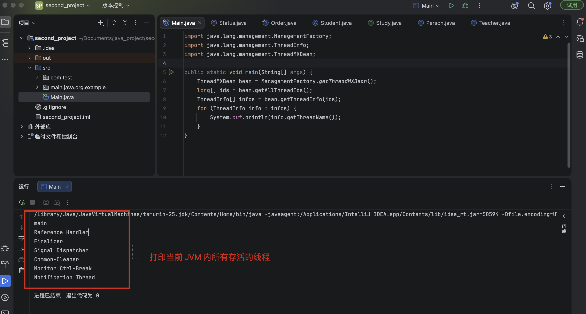
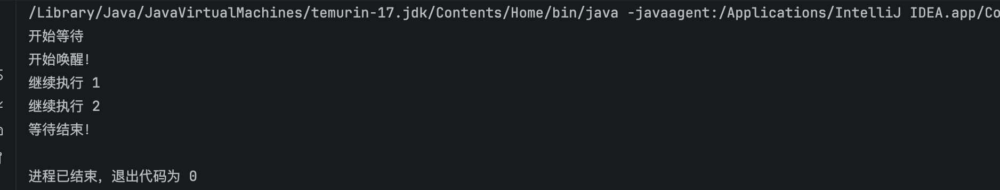

### 一、多线程

- 在之前的学习中，一直以来编写的都是单线程应用程序（运行main()方法的内容），也就是说只能同时执行一个任务

- 如果希望同时执行多个任务（两个方法同时在运行或者是两个计算同时在进行，也就是 ***并发*** 的），就需要用到 Java 多线程框架

- 实际上一个 Java 程序启动后，会创建很多辅助线程，不仅仅只运行一个主线程

  - `main`：用户主线程，默认创建的线程，用户程序从这里开始执行
  - `Reference Handler`：引用处理线程，负责处理对象的引用关系
  - `Finalizer`：终结器线程，负责处理对象的终结器方法
  - `Signal Dispatcher`：信号分发线程，负责处理信号量
  - `Common-Cleaner`：公共清理线程，负责清理对象的终结器方法
  - `Monitor Ctrl-Break`：监控 Ctrl+Break 等信号，负责处理 Ctrl+Break 等信号的处理
  - `Notification Thread`：通知线程，负责处理通知事件



> 关于除了 main 线程默认以外的线程，涉及到 JVM 相关底层原理，在这里不做讲解，后续学习记录


### 二、线程的创建与启动

- 通过创建 `Thread` 对象来创建一个新的线程，`Thread` 构造方法中需要传入一个 `Runnable` 接口的实现

  - 其实就是编写要在另一个线程执行的逻辑

```java
@FunctionalInterface
public interface Runnable {
    public abstract void run();
}
```

- 同时 `Runnable` 接口只有一个未实现方法，因此可以直接使用 `lambda` 表达式来实现：

```java
public static void main(String[] args) {
    Thread t = new Thread(() -> {    //直接编写逻辑
        System.out.println("我是另一个线程！");
    });
    t.start();   //调用此方法来开始执行此线程
}
```

- 创建好线程后，需要调用 `start()` 方法来启动线程，否则线程不会执行逻辑

  - **一个 Thread 实例只能 start 一次，否则会抛出 `IllegalThreadStateException` 异常**

- 创建线程的方式有多种

#### 2.1 继承 Thread 类（最简单）

- 步骤：
  - 自定义类继承 `Thread`

  - 重写 `run()` 方法，写线程任务
  - new 对象，调用 `start()` 启动

```java
// 1. 继承Thread
class MyThread extends Thread {
    @Override
    public void run() {
        System.out.println("子线程执行：" + Thread.currentThread().getName());
    }
}

public class Test {
    public static void main(String[] args) {
        MyThread t = new MyThread();
        t.start(); // 启动新线程，自动执行run
        // t.run(); // 错误！仅普通方法调用，无新线程
    }
}
```

- 缺点：Java 单继承，继承 Thread 后无法再继承其他类，耦合高

- 优化：可直接实现 `Runnable` 接口，避免耦合高问题

#### 2.2 实现 Runnable 接口

- 步骤：
  - 自定义类实现 `Runnable` 接口

  - 实现 `run()` 任务方法
  - 把 Runnable 实例传入 Thread 构造器
  - 调用 `start()`()

```java
// 任务类，和线程本身解耦
class MyTask implements Runnable {
    @Override
    public void run() {
        System.out.println("Runnable子线程");
    }
}

public class Test {
    public static void main(String[] args) {
        Runnable task = new MyTask();
        Thread t = new Thread(task);
        t.start();
    }
}
```

#### 2.3 Lambda 简化写法（实际开发最常用）

```java
public class Test {
    public static void main(String[] args) {
        // 一行创建并启动线程
        new Thread(() -> {
            System.out.println("lambda子线程");
        }).start();
    }
}
```
- 最开始介绍的 demo 就是这种

#### 2.4 Callable + FutureTask（有返回值、可抛异常）

- 自行了解

::: tip
- 线程之间是独立的，同时运行的

- 下面的代码就是交替打印的

```java
public static void main(String[] args) {
    Thread t1 = new Thread(() -> {
        for (int i = 0; i < 50; i++) {
            System.out.println("我是一号线程："+i);
        }
    });
    Thread t2 = new Thread(() -> {
        for (int i = 0; i < 50; i++) {
            System.out.println("我是二号线程："+i);
        }
    });
    t1.start();
    t2.start();
}
```
:::

### 三、线程池

- 生产环境、大量并发任务首选，不手动 `new Thread`

- 业务开发不会频繁手动创建销毁 `Thread`（频繁创建销毁内核线程开销极大）

  - 线程池复用已有线程，降低消耗

  - 可控并发数量，防止无限创建线程导致 CPU / 内存打满、OOM 等问题

- 统一使用线程池：`Executors / ThreadPoolExecutor`

```java
import java.util.concurrent.Executors;
import java.util.concurrent.ExecutorService;

public class PoolTest {
    public static void main(String[] args) {
        // 核心线程5个
        ExecutorService pool = Executors.newFixedThreadPool(5);
        // 提交无返回任务
        pool.execute(() -> System.out.println("固定线程池任务"));
        // 提交有返回任务
        Future<Integer> future = pool.submit(() -> 100 + 200);
        System.out.println(future.get());
        pool.shutdown(); // 关闭线程池
    }
}
```

- 除了使用 `newFixedThreadPool` 创建固定线程池，还可以使用 `newSingleThreadExecutor` 创建单线程池，`newCachedThreadPool` 创建缓存线程池，`newScheduledThreadPool` 创建定时线程池

- **但是，生产标准一般禁止使用 `Executors` 快捷创建线程池**，推荐手动创建 `ThreadPoolExecutor`

```java
import java.util.concurrent.*;

public class ThreadPoolDemo {
    public static void main(String[] args) {
        // 手动创建线程池
        ExecutorService pool = new ThreadPoolExecutor(
                5,                      // 核心线程5
                10,                     // 最大线程10
                60L,                    // 空闲线程存活60秒
                TimeUnit.SECONDS,
                new ArrayBlockingQueue<>(100), // 有界队列，最多存100个等待任务
                Executors.defaultThreadFactory(),
                new ThreadPoolExecutor.CallerRunsPolicy() // 拒绝策略
        );

        // 提交无返回任务 execute
        pool.execute(() -> {
            System.out.println(Thread.currentThread().getName() + " 执行任务");
        });

        // 提交有返回任务 submit
        Future<String> future = pool.submit(() -> {
            return "任务执行完成";
        });
        try {
            String result = future.get(); // 阻塞获取结果
            System.out.println(result);
        } catch (Exception e) {
            e.printStackTrace();
        }

        // 优雅关闭：执行完现有任务再关闭
        pool.shutdown();
    }
}
```

> 关于线程池还有很多内容，就不展开了


### 四、线程的休眠和中断

#### 4.1 线程休眠 sleep

- 让当前线程主动进入阻塞状态，放弃 CPU 时间片，休眠指定毫秒，时间到自动恢复就绪态

- 属于静态方法，永远休眠**当前执行代码的线程**，不是调用者线程

- 核心特点

  - 休眠期间不会释放锁

  - 必须捕获 / 抛出 `InterruptedException`（可中断异常）

  - 时间只是最小等待时长，睡醒后不会立刻运行，需要等待 CPU 调度

```java
public class SleepDemo {
    public static void main(String[] args) throws InterruptedException {
        System.out.println("开始休眠");
        // 当前主线程休眠2秒
        Thread.sleep(2000);
        System.out.println("休眠结束");
    }
}
```

::: tip
- 易错点

```java
Thread t = new Thread(() -> {});
t.sleep(1000); // 坑！静态方法，实际休眠main主线程，不是t
```
:::


#### 4.2 线程中断 interrupt

- `interrupt()` 不是直接杀死线程，它只是给线程打一个「中断标记」，线程要不要停下来，由线程自己判断处理

- 三个核心 API

  - `thread.interrupt()`：给目标线程打中断标记（只是设置布尔标识，设置中断标志位为 true，不会直接杀死线程）

  - `thread.isInterrupted()`：查询线程的中断标记，不清除标记
  - `Thread.interrupted()`：静态方法，查询当前线程中断标记，**查询后清空标记**，把标记重置为 false

- 两种中断响应机制
  - 就是能感知线程被设置了中断，然后可以做一些操作

- 第一种：线程处于阻塞态（sleep/wait/join）

  - 线程状态是 **TIMED_WAITING / WAITING（阻塞休眠）**，它自己没法主动轮询判断 `isInterrupted()`
 
  - 外部调用 `interrupt()`
 
  - **JVM 的内置响应逻辑触发**：
    
    - 立刻唤醒这个阻塞的线程
   
    - **自动把中断标志清空（置为 false）**
   
    - 在阻塞方法内部抛出 `InterruptedException`

```java
Thread t = new Thread(() -> {
    try {
        Thread.sleep(10000);
    } catch (InterruptedException e) {
        // 休眠中被中断，进入这里，标记已自动重置为false
        Thread.currentThread().interrupt();
        System.out.println("线程被中断");
    }
});
t.start();
Thread.sleep(1000);
t.interrupt(); // 1秒后打断sleep
```

- 第二种：线程正常运行，不会抛异常，仅修改中断标记，需要业务代码手动循环判断标记退出

```java
public static void main(String[] args) {
    Thread t = new Thread(() -> {
        System.out.println("线程开始运行！");
        while (true){
            if(Thread.currentThread().isInterrupted()){   // 判断是否存在中断标志
                System.out.println("发现中断信号，复位，继续运行...");
                Thread.interrupted();  // 复位中断标记（返回值是当前是否有中断标记，这里不用管）
            }
        }
    });
    t.start();
    try {
        Thread.sleep(3000);   // 休眠3秒，一定比线程t先醒来
        t.interrupt();   // 调用t的interrupt方法
    } catch (InterruptedException e) {
        e.printStackTrace();
    }
}
```
::: info
- 线程中断用途

  - interrupt 用于**优雅取消耗时 / 异步任务**，尤其针对带有阻塞逻辑的线程；在线程池任务取消、超时控制、应用优雅停机、用户手动终止后台任务这些场景使用，保证线程退出前安全释放连接、文件句柄等资源，避免暴力终止带来的数据异常
:::

### 五、线程优先级

- 实际上，Java 程序中的每个线程并不是平均分配CPU时间的，为了使得线程资源分配更加合理，Java采用的是抢占式调度方式，优先级越高的线程，优先使用CPU资源

- 优先级一般分为三种

  - MIN_PRIORITY 最低优先级

  - MAX_PRIORITY 最高优先级
  - NOM_PRIORITY 常规优先级


```java
public static void main(String[] args) {
    Thread t = new Thread(() -> {
        System.out.println("线程开始运行！");
    });
    t.setPriority(Thread.MIN_PRIORITY);  // 通过使用 setPriority 方法来设定优先级
    t.start();
}
```

- **优先级越高的线程，获得CPU资源的概率会越大，并不是说一定优先级越高的线程越先执行**


### 六、线程的礼让和加入

*   使用 `yield()` 方法来将当前资源让位给其他同优先级线程

```java
public static void main(String[] args) {
    Thread t1 = new Thread(() -> {
        System.out.println("线程1开始运行！");
        for (int i = 0; i < 50; i++) {
            if(i % 5 == 0) {
                System.out.println("让位！");
                Thread.yield();
            }
            System.out.println("1打印："+i);
        }
        System.out.println("线程1结束！");
    });
    Thread t2 = new Thread(() -> {
        System.out.println("线程2开始运行！");
        for (int i = 0; i < 50; i++) {
            System.out.println("2打印："+i);
        }
    });
    t1.start();
    t2.start();
}
```

*   会发现，在让位之后，尽可能多的在执行线程2的内容

*   使用 `join()` 方法来实现线程的加入

    *   等待加入线程执行完毕，继续执行当前线程

```java
public static void main(String[] args) {
    Thread t1 = new Thread(() -> {
        System.out.println("线程1开始运行！");
        for (int i = 0; i < 50; i++) {
            System.out.println("1打印："+i);
        }
        System.out.println("线程1结束！");
    });
    Thread t2 = new Thread(() -> {
        System.out.println("线程2开始运行！");
        for (int i = 0; i < 50; i++) {
            System.out.println("2打印："+i);
            if(i == 10){
                try {
                    System.out.println("线程1加入到此线程！");
                    t1.join();    //在i==10时，让线程1加入，先完成线程1的内容，在继续当前内容
                } catch (InterruptedException e) {
                    e.printStackTrace();
                }
            }
        }
    });
    t1.start();
    t2.start();
}
```

*   会发现，一开始两线程交叉执行，在线程2的第10次打印后，线程1加入到线程2，线程2会等待线程1执行完毕，再继续执行自己的内容

### 七、线程锁和线程同步

*   Java 是多线程的，多线程并发访问共享资源时，会存在线程安全问题，需要使用线程锁来解决线程安全问题

*   比如下面这个代码

```java
private static int value = 0;

public static void main(String[] args) throws InterruptedException {
    Thread t1 = new Thread(() -> {
        for (int i = 0; i < 10000; i++) value++;
        System.out.println("线程1完成");
    });
    Thread t2 = new Thread(() -> {
        for (int i = 0; i < 10000; i++) value++;
        System.out.println("线程2完成");
    });
    t1.start();
    t2.start();
    Thread.sleep(1000);  //主线程停止1秒，保证两个线程执行完成
    System.out.println(value);
}
```

*   `value++` 不是原子操作，分为三步
    *   从内存中读取 value 值
    *   增加 value 值
    *   再将 value 值写入内存中

*   两个线程同时操作共享变量，会发生指令交错，覆盖写，出现线程安全问题，结果几乎跑不出 20000

*   通过 `synchronized` 关键字来创造一个线程锁，来解决线程安全问题

    *   `synchronized` 关键字可以将方法或代码块变成一个线程锁，当一个线程执行到这个方法或代码块时，其他线程就不能执行这个方法或代码块，直到当前线程执行完毕，才会释放锁

    *   接受一个参数，必须是一个对象或一个类，只有传入的是同一个对象或同一个类，才会创建同一个锁，否则会创建多个不同的锁

```java
private static int value = 0;

public static void main(String[] args) throws InterruptedException {
    Thread t1 = new Thread(() -> {
        for (int i = 0; i < 10000; i++) {
            synchronized (Main.class){  // 使用synchronized关键字创建同步代码块
                value++;
            }
        }
        System.out.println("线程1完成");
    });
    Thread t2 = new Thread(() -> {
        for (int i = 0; i < 10000; i++) {
            synchronized (Main.class){
                value++;
            }
        }
        System.out.println("线程2完成");
    });
    t1.start();
    t2.start();
    Thread.sleep(1000);  // 主线程停止1秒，保证两个线程执行完成
    System.out.println(value);
}
```

*   会发现，结果是 20000，线程安全问题得到了解决

*   `synchronized` 关键字也可以作用于方法上，调用此方法时也会获取锁

```java
private static int value = 0;

private static synchronized void add(){
    value++;
}

public static void main(String[] args) throws InterruptedException {
    Thread t1 = new Thread(() -> {
        for (int i = 0; i < 10000; i++) add();
        System.out.println("线程1完成");
    });
    Thread t2 = new Thread(() -> {
        for (int i = 0; i < 10000; i++) add();
        System.out.println("线程2完成");
    });
    t1.start();
    t2.start();
    Thread.sleep(1000);  // 主线程停止1秒，保证两个线程执行完成
    System.out.println(value);
}
```

*   还有**死锁**的概念，当两个线程以上在等待对方释放资源时，就会发生死锁，死锁会导致程序无法继续执行，需要手动解决

```java
public static void main(String[] args) throws InterruptedException {
    Object o1 = new Object();
    Object o2 = new Object();
    Thread t1 = new Thread(() -> {
        synchronized (o1){
            try {
                Thread.sleep(1000);
                synchronized (o2){
                    System.out.println("线程1");
                }
            } catch (InterruptedException e) {
                e.printStackTrace();
            }
        }
    });
    Thread t2 = new Thread(() -> {
        synchronized (o2){
            try {
                Thread.sleep(1000);
                synchronized (o1){
                    System.out.println("线程2");
                }
            } catch (InterruptedException e) {
                e.printStackTrace();
            }
        }
    });
    t1.start();
    t2.start();
}
```

### 八、 wait 和 notify 方法

*   `Object` 类还有三个方法从来没有使用过，分别是 `wait()`、`notify()`以及`notifyAll()`

*   他们是需要配合 `synchronized` 关键字来使用的

    *   实际上锁就是依附于对象存在的，每个对象都应该有针对于锁的一些操作，所以说就这样设计了

    *   只有在同步代码块中才能使用这些方法，正常情况下会报错

*   `wait()` 方法是使当前线程进入等待状态，等待其他线程调用 `notify()` 或 `notifyAll()` 方法来唤醒它

*   `notify()` 方法是随机唤醒一个等待的线程

*   `notifyAll()` 方法是唤醒所有等待的线程

```java
public static void main(String[] args) throws InterruptedException {
    Object o1 = new Object();
    Thread t1 = new Thread(() -> {
        synchronized (o1){
            try {
                System.out.println("开始等待");
                o1.wait();     // 进入等待状态并释放锁
                System.out.println("等待结束！");
            } catch (InterruptedException e) {
                e.printStackTrace();
            }
        }
    });
    Thread t2 = new Thread(() -> {
        synchronized (o1){
            System.out.println("开始唤醒！");
            o1.notify();     // 随机唤醒处于等待状态的线程
          	System.out.println("继续执行 1");
            System.out.println("继续执行 2");
          	// 唤醒后依然需要等待这里的锁释放之前等待的线程才能继续
        }
    });
    t1.start();
    Thread.sleep(1000);
    t2.start();
}
```



### 九、ThreadLocal 使用

*   每个线程都有一个自己的工作内存，可以通过 `ThreadLocal` 类在工作内存中创建变量仅线程自己使用

*   只能创建一个变量，不同的线程访问到 `ThreadLocal` 对象时，都只能获取到当前线程所属的变量

```java
public static void main(String[] args) throws InterruptedException {
    ThreadLocal<String> local = new ThreadLocal<>();  // 注意这是一个泛型类，存储类型为我们要存放的变量类型
    Thread t1 = new Thread(() -> {
        local.set("lbwnb");   // 将变量的值给予ThreadLocal
        System.out.println("变量值已设定！");
        System.out.println(local.get());   // 尝试获取ThreadLocal中存放的变量，是 lbwnb
    });
    Thread t2 = new Thread(() -> {
        System.out.println(local.get());   // 尝试获取ThreadLocal中存放的变量，是 null
    });
    t1.start();
    Thread.sleep(3000);    // 间隔三秒
    t2.start();
}
```

*   即使 t2 线程也创建自己的变量，也不会影响 t1 线程的变量

*   使用 `ThreadLocal` 创建的变量，在父线程中设置，子线程中无法获取到这个变量，只能通过 `InheritableThreadLocal` 来实现

    *   在 `InheritableThreadLocal` 中存放的内容，会自动向子线程传递

```java
public static void main(String[] args) {
    ThreadLocal<String> local = new InheritableThreadLocal<>();
    Thread t = new Thread(() -> {
       local.set("lbwnb");
        new Thread(() -> {
            System.out.println(local.get());    // lbwnb
        }).start();
    });
    t.start();
}
```

### 十、定时器

*   可以使用线程自定义一个定时器类，但是 Java 提供了一个 `Timer` 类，可以直接用来实现定时器的功能

```java
import java.util.Timer;
import java.util.TimerTask;

public static void main(String[] args) {
    Timer timer = new Timer();    // 创建定时器对象
    timer.schedule(new TimerTask() {   // 注意这个是一个抽象类，不是接口，无法使用lambda表达式简化，只能使用匿名内部类
        @Override
        public void run() {
            System.out.println(Thread.currentThread().getName());    // 打印当前线程名称，是 Timer-0
            System.out.println("定时器任务执行！");
            timer.cancel();  // 结束定时器任务
        }
    }, 1000);    // 执行一个延时任务
}
```

*   需要手动调用 `cancel()` 方法来结束定时器任务，否则会一直执行

*   使用 `Timer` 类可以创建任意类型的定时任务，包括延时任务、循环定时任务等

```java
// 循环定时任务
timer.scheduleAtFixedRate(new TimerTask() {
    @Override
    public void run() {
        System.out.println("定时器任务执行！");
        count++;
        if (count >= 3) {       // 执行3次后关闭
            timer.cancel();     // 终止定时器，丢弃所有已安排的任务
        }
    }
}, 1000, 2000);    // 1秒后开始执行，每2秒执行一次
```

### 十一、守护线程

*   Java 线程分两类：

    *   用户线程（非守护线程，默认）：业务工作线程，JVM 必须等所有用户线程全部结束，JVM 才会退出。
    *   守护线程（Daemon）：服务于用户线程的后台线程

*   当 JVM 中所有用户线程全部结束，不管守护线程还跑不跑，JVM 直接退出，守护线程会被粗暴终止，不会正常执行完

```java
public static void main(String[] args) throws InterruptedException{
    Thread t = new Thread(() -> {
        while (true){
            try {
                System.out.println("程序正常运行中...");
                Thread.sleep(1000);
            } catch (InterruptedException e) {
                e.printStackTrace();
            }
        }
    });
    t.setDaemon(true);   // 设置为守护线程（必须在开始之前，中途是不允许转换的）
    t.start();
    for (int i = 0; i < 5; i++) {
        Thread.sleep(1000);
    }
}
```

*   `setDaemon(true)` 必须在线程start()之前，start 之后调用会抛出 `IllegalThreadStateException`

*   main 主线程是用户线程，默认不是守护线程

    *   比如上面的，如果不设置守护线程，Main 执行完后，线程会继续执行，会一直输出 "程序正常运行中..."

    *   但是，如果设置守护线程，守护线程，JVM 会直接退出，不会等待守护线程执行完，会直接终止守护线程

::: tip

*   守护线程**不能保证资源释放、不能保证 finally 执行完毕**。JVM 退出是直接粗暴终止，不会等待守护线程执行完逻辑

*   GC 垃圾回收线程：典型守护线程。应用所有业务线程结束，GC 就没必要继续跑，JVM 直接退出

*   实际业务开发什么时候用守护线程？

    *   业务代码极少自己手动创建守护线程！大部分业务线程都要用用户线程

    *   适合守护线程场景：允许程序退出时直接丢弃，不需要保证做完。

        *   比如：日志线程、定时器线程、垃圾回收线程等

:::

### 十二、再谈集合类

*   因为多线程的加入，之前认识的集合类都废掉了

```java
public static void main(String[] args) throws InterruptedException {
    List<Integer> list = new ArrayList<>();
    new Thread(() -> {
        for (int i = 0; i < 1000; i++) {
            list.add(i);   //两个线程同时操作集合类进行插入操作
        }
    }).start();
    new Thread(() -> {
        for (int i = 1000; i < 2000; i++) {
            list.add(i);
        }
    }).start();
    Thread.sleep(2000);
    System.out.println(list.size());
}
```

*   因为之前的集合类，并没有考虑到多线程运行的情况，如果两个线程同时执行，那么有可能两个线程同一时间都执行同一个方法，导致集合类的不一致状态

*   当然也有专用于并发编程的集合类，比如 JUC 并发集合（`java.util.concurrent`包）

### 十三、JUC 并发集合类

*   包路径：`java.util.concurrent.*`

*   核心前提：
    *   普通集合 `ArrayList`、`HashMap`并发修改会出现数据错乱、ConcurrentModificationException。

    *   老方案 `Vector`、`Hashtable`、`Collections.synchronizedXxx`：全量 synchronized 全局锁，并发性能差，复合操作依然不安全，业务尽量不用。

    *   JUC 并发集合：底层 CAS + 分段锁 / 桶锁 + COW 写时复制，单个方法原子安全，但多方法组合操作仍然需要自己保证原子性

*   常用的四类

    *   `ConcurrentHashMap` （最常用）

    *   `CopyOnWriteArrayList`

    *   `ConcurrentLinkedQueue`

    *   `BlockingQueue`

#### 13.1 ConcurrentHashMap

*   替代 HashMap、Hashtable，多线程共享 Map 首选，本地缓存、多线程计数、共享配置

*   JDK8 实现：取消分段锁，CAS + synchronized 锁单个 hash 桶；读几乎无锁；支持并发扩容；key/value 不能为 null

```java
ConcurrentHashMap<String, Integer> map = new ConcurrentHashMap<>();

// 普通put，单个方法原子
map.put("a", 1);
Integer val = map.get("apple");
map.remove("apple");

// ✅原子API，多线程下优先用这一组
map.putIfAbsent("a", 100);       // key不存在才存入，原子操作
map.compute("count", (k, v) -> v + 1); // 原子更新，适合计数
map.computeIfAbsent("user1", k -> new User()); // key不存在才执行函数初始化
map.merge("count", 1, Integer::sum); // 合并，计数最简写法
```

*   经典坑

```java
// ❌不安全！get + put 两个独立原子方法，组合起来不是原子
if(map.get("key") == null){
    map.put("key", value);
}

// ✅替换为 putIfAbsent / computeIfAbsent
map.putIfAbsent("key", value);
```

*   `putIfAbsent`：key 不存在才 put；如果 key 已经存在，不覆盖，返回旧值。原子操作

    *   用来替代 `if(get==null) put()`，确保线程安全

*   `computeIfAbsent`：key 不存在，执行 lambda 计算 value，再存入；存在直接返回已有 value。适合对象初始化

*   `compute`：对 key 对应的 value 做更新操作，读‑改‑写整个过程原子操作

*   `merge`：key不存在则直接存入1；存在则合并 sum 求和

    *   参数 1：key

    *   参数 2：value（key 不存在时用这个值）

    *   参数 3：合并函数，key 存在时，旧值和新值怎么合并


