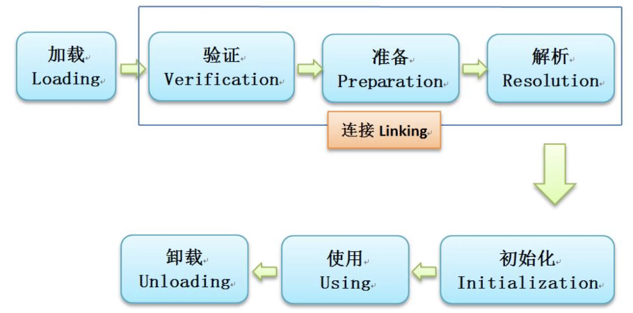

### 一、反射

*   反射（Reflection）是 Java 语言的一种运行时自省能力，允许程序**在运行期间动态地获取类的完整信息**（类名、方法、字段、构造函数等），并能动态创建对象、调用方法、修改字段值，甚至可以访问和操作私有成员

*   正常编码是**编译期**就确定用哪个类、调用哪个方法；反射是**运行期动态拿到类的全部信息，绕开编译期检查**。

    *   正常：写代码直接 `User user = new User(); user.getName();`，编译时就确定类。
    *   反射：运行的时候才知道类叫什么名字，动态创建对象、调用方法、读写属性

#### 1.1 Java 类加载机制



*   在 Java 程序启动时，JVM 会将一部分类（class文件）先加载（并不是所有的类都会在一开始加载），通过 ClassLoader 将类加载，在加载过程中，会将类的信息提取出来（存放在元空间中），同时也会生成一个 Class 对象存放在内存（堆内存），注意此 Class 对象只会存在一个，与加载的类唯一对应

*   Class 对象中包含类的一些信息，包括类里面有哪些方法、哪些变量等等

#### 1.2 Class 对象获取

*   Java 中每一个类，在加载到 JVM 后，都会产生一个**唯一的** `java.lang.Class` 对象，这个对象保存这个类全部元信息（类名、构造器、方法、成员变量、注解、父类、接口）

*   先给个 Class 对象的示例

```java
public class User {
    private String name;
    private int age;
    public static String school = "清华大学";

    // 无参构造
    public User() {
        System.out.println("调用了无参构造");
    }

    // 有参构造
    private User(String name) {
        this.name = name;
        System.out.println("调用了有参构造，name=" + name);
    }

    // 公有方法
    public void sayHello(String msg) {
        System.out.println(name + " 说：" + msg);
    }

    // 私有方法
    private int calculate(int a, int b) {
        return a + b;
    }

    // 静态方法
    public static void printSchool() {
        System.out.println("学校：" + school);
    }

    @Override
    public String toString() {
        return "User{name='" + name + "', age=" + age + "}";
    }
}
```

*   获取 Class 对象三种方式

```java
// 方式1：类名.class 静态获取，不会触发类静态代码块执行
Class<User> clazz1 = User.class;

// 方式2：对象.getClass()，实例已经存在
User user = new User();
Class<? extends User> clazz2 = user.getClass();

// 方式3：Class.forName("全限定类名")，最常用反射写法，运行时动态加载类，会执行静态代码块
Class<?> clazz3 = Class.forName("com.xxx.User");

```

#### 1.3 创建类对象

*   可以通过 Class 对象的 `newInstance()` 方法来创建对象、调用方法、修改变量

```java
// 获取 Class
Class<User> clazz = User.class;

// Java 8 原生方式：直接 newInstance()（无需获取 Constructor）
User user = clazz.newInstance();
System.out.println(user); 
// 输出：调用了无参构造
// 输出：User{name='默认名字', age=0}

// 1. 获取私有构造器（参数类型为 String）
Constructor<User> constructor = clazz.getDeclaredConstructor(String.class);
// 2. 暴力破解（Java 8 必须加这一句才能访问 private）
constructor.setAccessible(true);
// 3. 传入参数创建对象
User user = constructor.newInstance("张三");
System.out.println(user); 
// 输出：调用了私有有参构造，name=张三
// 输出：User{name='张三', age=0}
```

::: tip

*   注意：Java 9 以后，`clazz.newInstance()` 已被标记为废弃，推荐使用构造器方式创建对象

```java
// 获取无参构造器，并实例化
Constructor<?> constructor = clazz.getDeclaredConstructor();
User user = (User) constructor.newInstance();
System.out.println(user); // 输出：User{name='null', age=0}

// 获取私有构造器没变化
```

:::

#### 1.4 调用类方法

*   调用公有方法

```java
User user = clazz.newInstance(); // Java 8 写法

// getMethod：只能获取 public 方法（含继承的）
Method method = clazz.getMethod("sayHello", String.class);
// invoke：第一个参数是实例，后面是方法入参
method.invoke(user, "Java 8 反射真香");
// 控制台输出：默认名字 说：Java 8 反射真香
```

*   调用私有方法

    *   `getMethod` 拿不到私有方法，只能通过 `getDeclaredMethod` 来获取私有方法

```java
User user = clazz.newInstance();

// getDeclaredMethod：可以获取本类任意权限的方法（不含父类）
Method privateMethod = clazz.getDeclaredMethod("calculate", int.class, int.class);
// 暴力破解（Java 8 必须）
privateMethod.setAccessible(true);
// 执行并获取结果
int result = (int) privateMethod.invoke(user, 10, 20);
System.out.println("私有方法计算结果：" + result); // 输出：30
```

*   调用静态方法

```java
// 调用静态方法
Method staticMethod = clazz.getMethod("printSchool");
staticMethod.invoke(null); // 输出：学校：清华大学
```

#### 1.5 修改/获取类属性

*   修改私有实例字段（最常用）

```java
User user = clazz.newInstance(); // 此时 name = "默认名字"

// 1. 获取私有字段
Field nameField = clazz.getDeclaredField("name");
// 2. 暴力破解（Java 8 必须）
nameField.setAccessible(true);
// 3. 重新赋值
nameField.set(user, "李四");
// 4. 获取值
String name = (String) nameField.get(user);
System.out.println(name); // 输出：李四
```

*   修改静态有实例字段

```java
// 获取 public 静态字段
Field schoolField = clazz.getField("school");

// 获取原值（传 null 代表操作静态成员）
System.out.println("修改前：" + schoolField.get(null)); // 清华大学

// 修改静态字段（传 null）
schoolField.set(null, "北京大学");
System.out.println("修改后：" + User.school); // 北京大学
```

#### 1.6 Class 对象与多态

*   一般情况下，使用 `instanceof` 运算符进行类型比较

```java
public static void main(String[] args) {
    String str = "";
    System.out.println(str instanceof String);
}
```

*   但是，在反射中，可以通过 Class 对象来判断一个对象是否是某个类的实例

```java
public static void main(String[] args) {
    String str = "";
    System.out.println(str.getClass() == String.class);
}
```

*   可以使用 `asSubClass()` 方法判断是否为子类或是接口/抽象类的实现

```java
public static void main(String[] args) {
    Integer i = 10;
    i.getClass().asSubclass(Number.class);   // 当Integer不是Number的子类时，会产生异常
}
```

*   通过 `getSuperclass()` 方法，可以获取到父类的 Class 对象

```java
public static void main(String[] args) {
    Integer i = 10;
    System.out.println(i.getClass().getSuperclass());   // class java.lang.Number
}
```

::: tip

*   反射是 Java 生态中"框架的基石"——Spring、Hibernate、MyBatis、Jackson、JUnit 等几乎所有的主流框架和工具都依赖它来实现动态性

*   在日常业务开发中，很少直接编写反射代码，但理解反射能让你更深刻地理解框架的工作原理，在遇到特殊需求（如动态加载类、统一处理多模块、绕过 Setter 等）时，也能多一个解决问题的思路。

⚠️ 一句话建议：框架开发者把反射当利器，业务开发者把反射当备胎——非必要不使用，使用时务必注意性能和可维护性。
:::

### 二、注解

*   Java 注解是一种为代码添加**元数据**（Metadata） 的机制

    *   它本身不直接影响代码逻辑，但能被编译器或运行时环境识别并执行相应操作

    *   可以说是现代Java开发，特别是 **Spring 框架**的基石

*   本质上是一种特殊的接口

    *   注解本质上是一种继承了 `java.lang.annotation.Annotation` 接口的特殊接口。当你定义一个注解时，编译器会自动生成一个实现类

#### 2.1 元注解

*   元注解是专门用来“注解”其他注解的注解，为自定义注解提供“说明书”，决定了其行为和特性

*   最关键的元注解如下

| 元注解           | 作用                         | 可选值（部分）                                                                           |
| ------------- | -------------------------- | --------------------------------------------------------------------------------- |
| `@Retention`  | 定义注解的生命周期，即注解在哪个阶段有效。      | - SOURCE：仅源码中，编译后丢弃。<br>- CLASS：保留在class文件中，但运行时不可见。<br>- RUNTIME：运行时可通过反射获取，最常用。 |
| `@Target`     | 限制注解可以应用的目标，如类、方法、字段等。     | - TYPE：类、接口、枚举。<br>- FIELD：字段。<br>- METHOD：方法。<br>- PARAMETER：参数。                 |
| `@Documented` | 指定该注解信息是否包含在生成的Javadoc文档中。 | 无，仅作标记。                                                                           |
| `@Inherited`  | 允许子类继承父类上的该注解。             | 无，仅作标记。                                                                           |

#### 2.2 注解的工作原理

*   解本身是“被动”的，它的威力来自“处理器”的解析。

*   编译时处理：通过注解处理器（Annotation Processor） 在编译阶段扫描并处理注解，生成新代码或资源文件。

*   运行时处理：通过**反射机制**在程序运行时读取注解信息，并执行相应逻辑。

    *   对于 RUNTIME 注解，其底层实现涉及 **JDK 动态代理和反射**。JVM会为注解动态生成一个代理对象，当通过反射调用注解的方法时，代理对象会从内部存储（如Map）中查询并返回属性值

#### 2.3 业务开发常见注解

*   主要使用来自Java标准库、Spring生态、数据校验等第三方库的注解

*   Java 标准库注解

    *   `@Override`：标记方法重写父类或实现接口的方法，编译器会检查。

    *   `@Deprecated`：标记代码已过时，不建议使用，编译器会警告。

    *   `@SuppressWarnings`：告诉编译器忽略指定的警告信息。

    *   `@FunctionalInterface`：标记接口为函数式接口（只能有一个抽象方法）

*   Spring 生态注解比较多，比如 `@Component`、`@Service`、`@Repository`、`@Controller` 等。

#### 2.4 如果自定义一个注解

*   使用  `@interface` 定义注解

```java
import java.lang.annotation.*;

@Target(ElementType.METHOD) // 目标：只能用于方法
@Retention(RetentionPolicy.RUNTIME) // 生命周期：运行时可见
public @interface LogExecutionTime {
    String value() default ""; // 定义属性，可带默认值
}
```

*   通过AOP或反射处理注解

    *   注解定义后，需编写处理器来赋予其逻辑

    *   最常用的是结合 Spring AOP（面向切面编程），在方法执行前后读取注解并执行相应操作

```java
import org.aspectj.lang.ProceedingJoinPoint;
import org.aspectj.lang.annotation.Around;
import org.aspectj.lang.annotation.Aspect;
import org.springframework.stereotype.Component;

@Aspect
@Component
public class LogExecutionTimeAspect {

    @Around("@annotation(LogExecutionTime)") // 拦截所有标记了 @LogExecutionTime 的方法
    public Object logTime(ProceedingJoinPoint joinPoint) throws Throwable {
        long start = System.currentTimeMillis();
        Object result = joinPoint.proceed(); // 执行原方法
        long timeTaken = System.currentTimeMillis() - start;
        System.out.println("方法 " + joinPoint.getSignature() + " 执行耗时: " + timeTaken + " ms");
        return result;
    }
}
```

*   使用自定义注解

```java
@Service
public class UserService {
    @LogExecutionTime("查询用户") // 使用自定义注解
    public User findUser(Long id) {
        // ... 业务逻辑
        return new User();
    }
}
```

::: tip

*   在实际业务开发中，自定义注解非常常用，但“常用”不等于“天天写”。它更像一把“架构师的利刃”，而非“码农的螺丝刀”

*   只要开始处理通用逻辑（权限、日志、限流、重试），自定义注解就是最高效的方案

*   因为注解是“框架级”的复用工具，它可以在多个项目中复用
    :::
