## Maven快速上手

- Maven 翻译为"专家"、"内行"，是 Apache 下的一个纯 Java 开发的开源项目。基于项目对象模型（缩写：POM）概念，Maven利用一个中央信息片断能管理一个项目的构建、报告和文档等步骤

- Maven 是一个项目管理工具，可以对 Java 项目进行**构建、依赖管理**

    - 项目的自动构建，包括代码的编译、测试、打包、安装、部署等操作

    - 依赖管理，项目使用到哪些依赖，可以快速完成导入，不需要手动导入jar包

- Maven 也可被用于构建和管理各种项目，例如 C#，Ruby，Scala 和其他语言编写的项目


- 在 IDEA 创建 Maven 项目

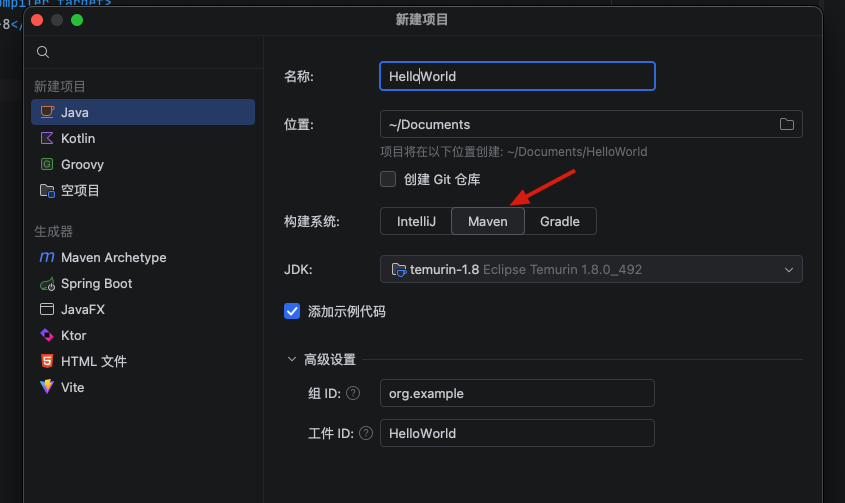
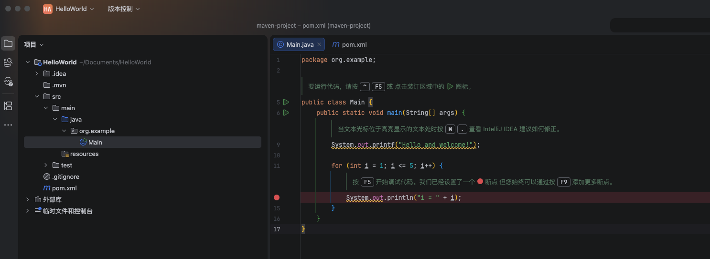


### 一、Maven 项目结构

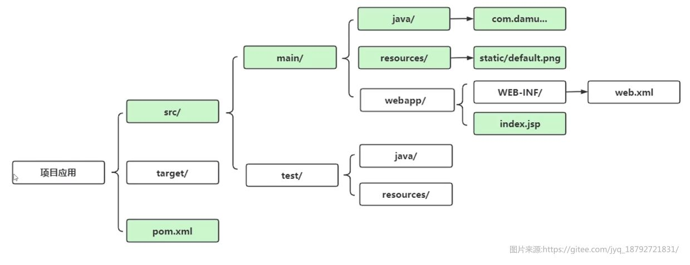


- **src 目录**下存放源代码和测试代码，分别位于 `main` 和 `test` 目录下，而 test 和 main 目录下又具有 `java`、`resources` 目录，它们分别用于存放Java源代码、静态资源（如配置文件、图片等）、很多JavaWeb项目可能还会用到webapp目录

- **target 目录** 用于存放编译后的类文件、测试报告、打包后的文件等

- **pom.xml** 则是 Maven 的核心配置，也是整个项目的所有依赖、插件、以及各种配置的集合，它也是使用XML格式编写的，一个标准的pom配置长这样

```xml
<?xml version="1.0" encoding="UTF-8"?>
<project xmlns="http://maven.apache.org/POM/4.0.0"
         xmlns:xsi="http://www.w3.org/2001/XMLSchema-instance"
         xsi:schemaLocation="http://maven.apache.org/POM/4.0.0 http://maven.apache.org/xsd/maven-4.0.0.xsd">
    <modelVersion>4.0.0</modelVersion>

    <groupId>org.example</groupId>
    <artifactId>HelloWorld</artifactId>
    <version>1.0-SNAPSHOT</version>

    <properties>
        <maven.compiler.source>8</maven.compiler.source>
        <maven.compiler.target>8</maven.compiler.target>
        <project.build.sourceEncoding>UTF-8</project.build.sourceEncoding>
    </properties>

</project>
```

- Maven 的配置文件是以 `project` 为根节点，而 `modelVersion` 定义了当前模型的版本，一般是4.0.0，不用去修改

- `groupId`、`artifactId`、`version` 这三个元素合在一起，用于唯一区别每个项目，别人如果需要将我们编写的代码作为依赖，那么就必须通过这三个元素来定位我们的项目，我们称为一个项目的**基本坐标**，所有的项目一般都有自己的Maven坐标

    - 通过 Maven 导入其他的依赖只需要填写这三个基本元素就可以了，无需再下载 Jar 文件，而是 Maven 自动下载依赖并导入

- `groupId` 一般用于指定组名称，命名规则一般和包名一致，比如这里使用的是 org.example，一个组下面可以有很多个项目。

- `artifactId` 一般用于指定项目在当前组中的唯一名称，也就是说在组中用于区分于其他项目的标记。

- `version` 代表项目版本，随着项目的开发和改进，版本号也会不断更新

- `properties` 中一般都是一些变量和选项的配置，这里指定了JDK的源代码和编译版本为8，同时下面的源代码编码格式为UTF-8，无需进行修改

### 二、Maven 依赖导入

- 需要创建一个`dependencies`的节点，用于存放项目的依赖配置

```xml
<dependencies>
    //里面填写的就是所有的依赖
    <dependency>
        <groupId>org.projectlombok</groupId>
        <artifactId>lombok</artifactId>
        <version>1.18.36</version>
    </dependency>
</dependencies>
```

- 比如这里导入了 lombok 依赖，一般来说有很多依赖，每个依赖都有自己的坐标，这时可以通过 https://central.sonatype.com 进行查询

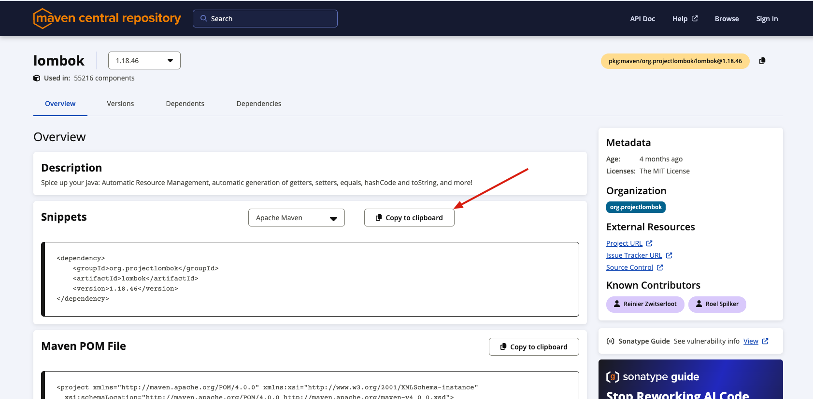

- 导入依赖后，需要在 IDEA 中刷新项目，才能使用依赖，一般来说有导入变更，右侧会有图标提示，当然也可以自己手动在右侧的 Maven 项目视图中刷新项目

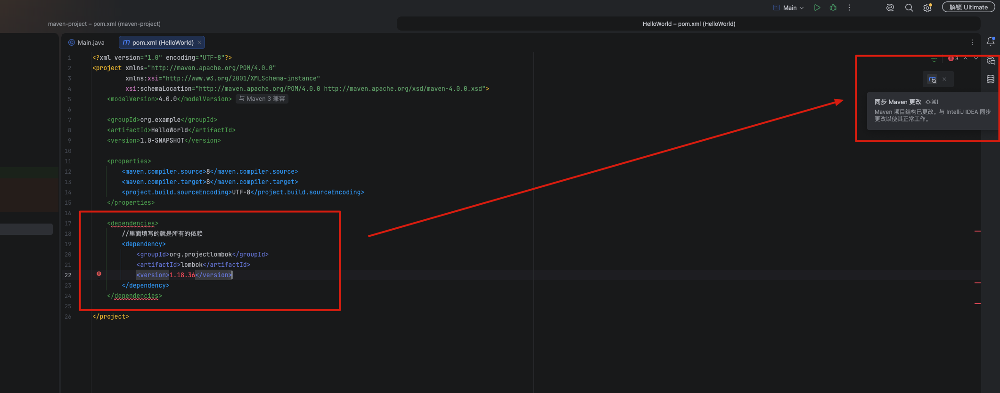
- 或者直接点击刷新按钮

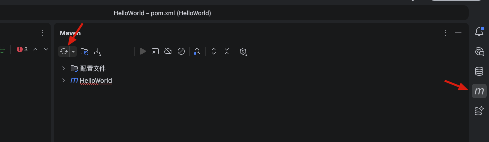

> 上面更新失败，要将图里的那行注释删掉

- 此时就可以使用 lombok 注解了，会有提示直接回车立刻就出来了

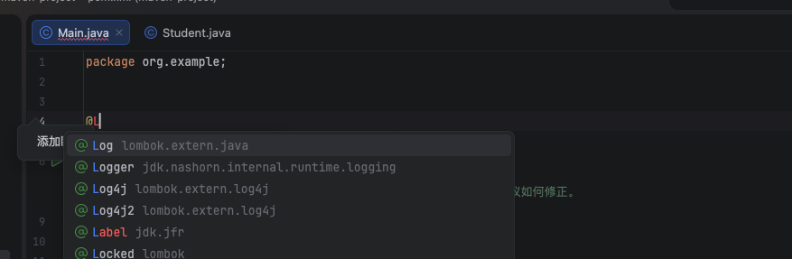
- 直接回车

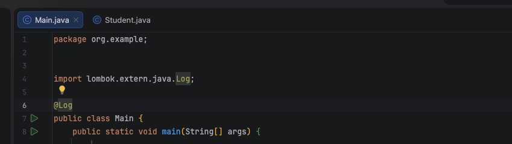

#### 2.1 看一个 demo

- 创建一个 `org.example.entity`，在里面创建一个 `Student` 类

```java
package org.example.entity;

import lombok.AllArgsConstructor;
import lombok.Data;

@Data
@AllArgsConstructor
public class Student {
    String name;
    int age;
}
```
- 然后在 Main 中使用它

```java
package org.example;

import org.example.entity.Student;

public class Main {
    public static void main(String[] args) {
        Student student = new Student("小明", 18);
        System.out.println(student);
    }
}
```
- 运行 Main 类，会输出 `Student(name=小明, age=18)`，这是因为使用了 lombok 注解，所以会自动生成 `toString` 方法

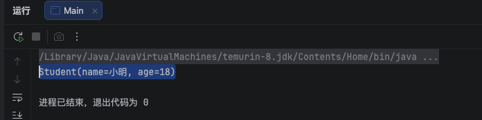


#### 2.2 如果进行依赖管理的

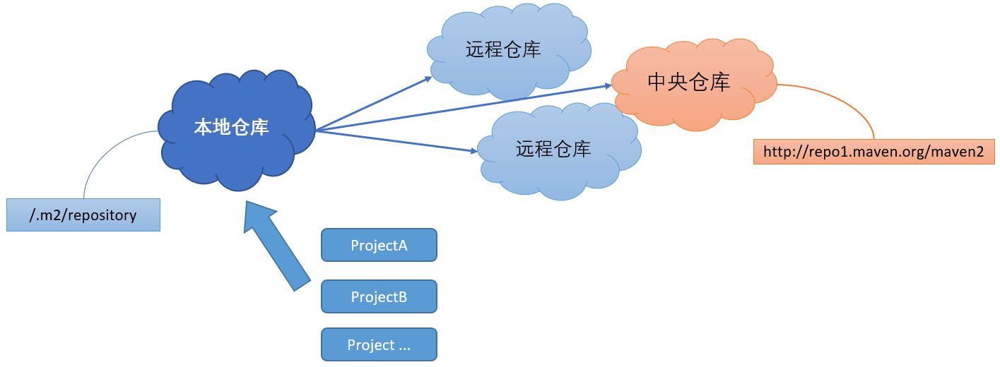

- 通过流程图得知，一个项目依赖一般是存储在中央仓库中，也有可能存储在一些其他的远程仓库（可以自行搭建私服）

    - 几乎所有的依赖都被放到了中央仓库中

- Maven 可以直接从中央仓库中下载大部分的依赖（因此Maven第一次导入依赖是需要联网的，否则无法下载）远程仓库中下载之后 ，会暂时存储在本地仓库

    - 会发现本地存在一个 `.m2` 文件夹，这就是 Maven 本地仓库文件夹

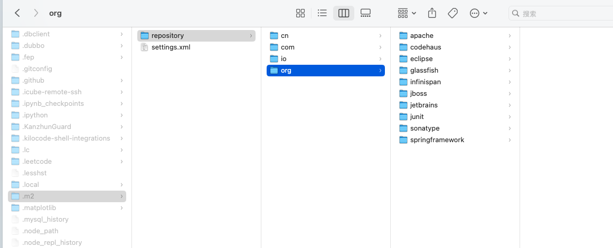

- 这里没有找到 lombok 依赖，是因为我在 `settings.xml` 中配置了本地仓库的位置，不在这里了

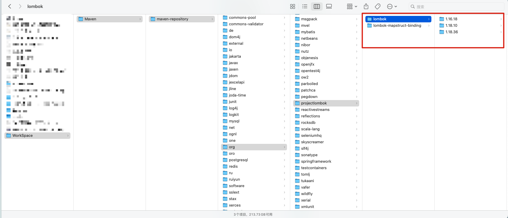

::: tip
- 因为中心仓库服务器位于国外，下载速度缓慢，可能在导入依赖时会出现卡顿等问题

    - 需要使用国内的镜像仓库服务器来加速访问

- 可以在 `settings.xml` 中配置中配置镜像仓库服务器。当然有些公司有自己的私服，具体配置方式在 Java 文档的第一节里有提到
:::


### 三、Maven 依赖作用域

- 除了三个基本的属性用于定位坐标外，依赖还可以添加以下属性：

    - `type`：依赖的类型，对于项目坐标定义的packaging。大部分情况下，该元素不必声明，其默认值为 jar，也可以是 pom 等其他类型

    - `scope`：依赖的范围（作用域）
    - `optional`：标记依赖是否可选
    - `exclusions`：用来排除传递性依赖（一个项目有可能依赖于其他项目，就像我们的项目，如果别人要用我们的项目作为依赖，那么就需要一起下载我们项目的依赖，如Lombok）


- 重来讲解一下 `scope` 属性，它决定了依赖的作用域范围

    - `compile` ：默认的依赖有效范围，如果在定义依赖关系的时候，没有明确指定依赖有效范围的话，则默认采用该依赖有效范围，此范围表示在编译、运行、测试时均有效。

    - `provided` ：仅在编译、测试时有效，但是在运行时无效，也就是说，项目在运行时，不需要此依赖，比如我们上面的Lombok，我们只需要在编译阶段使用它，编译完成后，实际上已经转换为对应的代码了，因此Lombok不需要在项目运行时也存在。
    - `runtime` ：在运行、测试时有效，但是在编译代码时无效。比如JDBC驱动就是典型的只需要运行时使用，因为JDBC驱动由数据库厂商开发，我们使用的始终是JDK中提供的接口，不需要直接使用特定驱动中的类或是方法，因此只需在运行时包含即可。
    - `test` ：只在测试时有效，例如：JUnit框架，我们一般只会在测试阶段使用JUnit，而实际项目运行时，我们就用不到测试了，所以这个选项非常适合测试相关的框架


```xml
<dependency>
    <groupId>org.junit.jupiter</groupId>
    <artifactId>junit-jupiter</artifactId>
    <version>5.8.1</version>
    <scope>test</scope>
</dependency>
```

::: info
- 如果需要的依赖没有上传的远程仓库，而是只有一个Jar怎么办呢？

- `system` ：作用域和 `provided` 是一样的，但是它不是从远程仓库获取，而是直接导入本地Jar包

```xml
<dependency>
     <groupId>javax.jntm</groupId>
     <artifactId>lbwnb</artifactId>
     <version>2.0</version>
     <scope>system</scope>
     <systemPath>C://学习资料/4K高清无码/test.jar</systemPath>
</dependency>
```
:::


### 四、Maven安装、可选和排除

#### 4.1 安装

- 如何在其他项目中引入我们自己编写的 Maven 项目作为依赖使用？

- 很简单，先创建一个 MavenTest 项目，比如这里创建一个测试项目，然后点击右侧 Maven 的 `install` 命令，就会将项目安装到本地仓库中

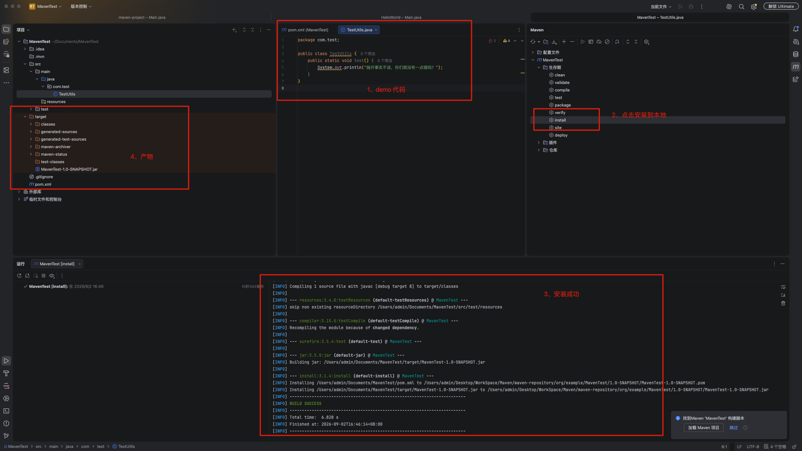

- 然后，在 HelloWorld 项目中引入我们的测试项目作为依赖，就可以在 HelloWorld 项目中使用我们的测试项目的代码了

- 在项目的 `pom.xml` 中引入我们的测试项目作为依赖

```xml
<dependency>
    <groupId>org.example</groupId>
    <artifactId>MavenTest</artifactId>
    <version>1.0-SNAPSHOT</version>
</dependency>
```

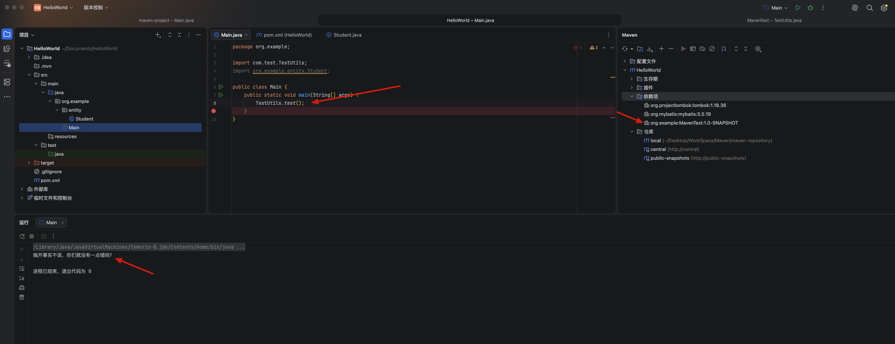


#### 4.2 可选

- 如果 MavenTest 项目导入了一些依赖，比如 lombok，那么在 HelloWorld 项目中引入 MavenTest 项目作为依赖时，也会一并导入 lombok 依赖，即使 HelloWorld 项目中没有使用 lombok 依赖

- 在某些情况下，可能并不希望某些依赖直接被项目连带引入，因此，当项目中的某些依赖不希望被使用此项目作为依赖的项目使用时，可以给依赖添加 `optional` 标签，表示此依赖是可选的，默认在导入依赖时，不会导入可选的依赖

- 比如Mybatis的POM文件中，就存在大量的可选依赖

```xml
<dependency>
  <groupId>org.slf4j</groupId>
  <artifactId>slf4j-api</artifactId>
  <version>1.7.30</version>
  <optional>true</optional>
</dependency>
<dependency>
  <groupId>org.slf4j</groupId>
  <artifactId>slf4j-log4j12</artifactId>
  <version>1.7.30</version>
  <optional>true</optional>
</dependency>
<dependency>
  <groupId>log4j</groupId>
  <artifactId>log4j</artifactId>
  <version>1.2.17</version>
  <optional>true</optional>
</dependency>
 ...
```


#### 4.3 排除

- 如果别人的项目中没有将我们不希望的依赖作为可选依赖，这就导致我们还是会连带引入这些依赖，这个时候我们就可以通过排除依赖来防止添加不必要的依赖，只需添加 `exclusions` 标签即可

```xml
<dependency>
    <groupId>com.test</groupId>
    <artifactId>TestMaven</artifactId>
    <version>1.1-SNAPSHOT</version>
    <exclusions>
        <exclusion>
            <groupId>org.mybatis</groupId>
            <artifactId>mybatis</artifactId>
          	<!--  可以不指定版本号，只需要组名和项目名称  -->
        </exclusion>
    </exclusions>
</dependency>
```


### 五、Maven继承和多模块

- 一个 Maven 项目可以继承自另一个 Maven 项目，比如多个子项目都需要父项目的依赖，就可以使用继承关系来快速配置

    - 在学习到 SpringBoot 或是 SpringCloud 开发时，很多项目往往都会采用这种多模块子项目的形式的去编写，来更加合理地对项目中代码进行职责划分

- 要创建一个子项目非常简单，只需右键左侧栏，新建模块，来创建一个子项目

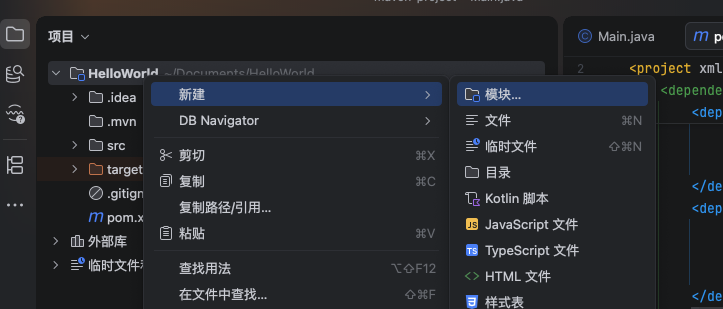

- 这里创建一个 child 子项目

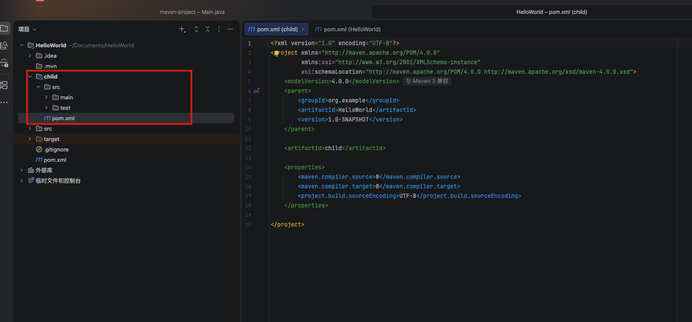

- 观察子模块的 `pom.xml` 文件，会发现默认添加了一个 `parent` 标签，指向父项目的 `pom.xml` 文件

```xml
<?xml version="1.0" encoding="UTF-8"?>
<project xmlns="http://maven.apache.org/POM/4.0.0"
         xmlns:xsi="http://www.w3.org/2001/XMLSchema-instance"
         xsi:schemaLocation="http://maven.apache.org/POM/4.0.0 http://maven.apache.org/xsd/maven-4.0.0.xsd">
    <modelVersion>4.0.0</modelVersion>
    <parent>
        <groupId>org.example</groupId>
        <artifactId>HelloWorld</artifactId>
        <version>1.0-SNAPSHOT</version>
    </parent>

    <artifactId>child</artifactId>

    <properties>
        <maven.compiler.source>8</maven.compiler.source>
        <maven.compiler.target>8</maven.compiler.target>
        <project.build.sourceEncoding>UTF-8</project.build.sourceEncoding>
    </properties>

</project>
```

- 父项目的 `pom.xml` 文件中，也有变化

```xml
...
    <packaging>pom</packaging>
    <modules>
        <module>child</module>
    </modules>
...
```

- 子项目直接继承父项目的 `groupId` 和 `version`，而且子项目会继承父项目的所有依赖，可以直接使用

- 还可以让父 Maven 项目统一管理所有的依赖，包括版本号等，子项目可以选取需要的作为依赖，而版本全由父项目管理

    - 可以将 `dependencies` 全部放入 `dependencyManagement` 中，这样父项目就完全作为依赖统一管理

```xml
<dependencies>
    <dependency>
        <groupId>org.junit.jupiter</groupId>
        <artifactId>junit-jupiter</artifactId>
        <version>5.8.1</version>
        <scope>test</scope>
    </dependency>
</dependencies>

<dependencyManagement>
    <dependencies>
        <dependency>
            <groupId>org.projectlombok</groupId>
            <artifactId>lombok</artifactId>
            <version>1.18.22</version>
            <scope>provided</scope>
        </dependency>
    </dependencies>
</dependencyManagement>
```

- 但有个问题，子项目只能直接继承 `dependencies` 中的依赖，不能继承 `dependencyManagement` 中的依赖

- 如果子项目需要使用 `dependencyManagement` 中的依赖，需要在子项目自己的`pom.xml` 文件 `dependencies` 中添加依赖，才能使用

    - 可以不指定版本号，只需要组名和项目名称 

```xml
<dependencies>
    <dependency>
        <groupId>org.projectlombok</groupId>
        <artifactId>lombok</artifactId>
        <scope>provided</scope>
    </dependency>
</dependencies>
```

### 六、Maven 测试和打包


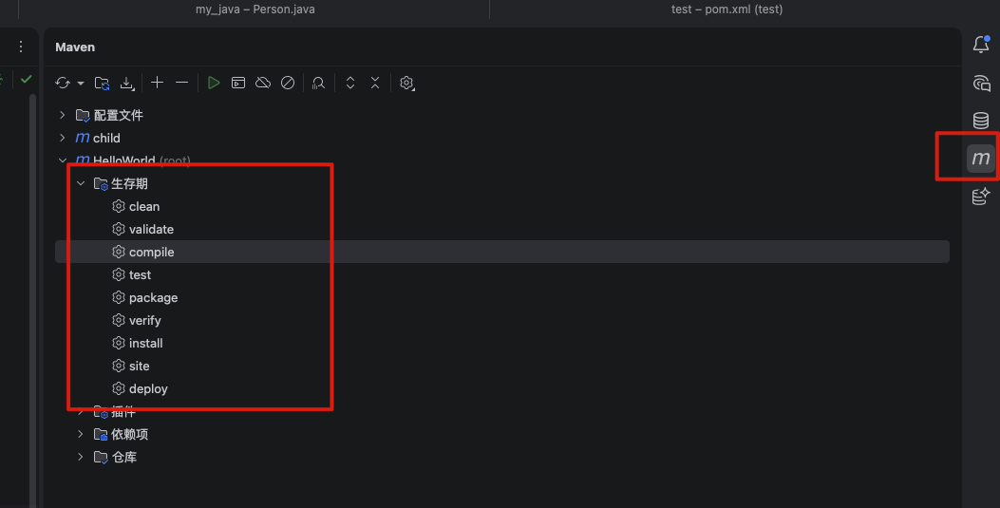

- `clean`命令，执行后会清理整个 target 文件夹，在之后编写 Springboot 项目时可以解决一些缓存没更新的问题。

- `validate`命令可以验证项目的可用性。
- `compile`命令可以将项目编译为.class文件。
- `test`命令，一键测试所有位于test目录下的测试案例
- `package`命令，用于将项目打包为jar文件，以供其他项目作为依赖引入，或是作为一个可执行的Java应用程序运行

    - 打包会在 target 目录下会出现打包完成的jar包，但这个包不能直接使用 `java -jar` 命令来执行，因为并没有包含项目中用到的一些其他依赖，需要在打包过程中提供插件来处理

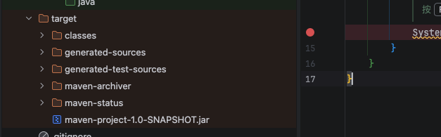

- `verify`命令可以按顺序执行每个默认生命周期阶段（validate，compile，package等）
- `install`命令可以将当前项目安装到本地仓库，以供其他项目导入作为依赖使用

::: tip
- 对于多模块项目，父项目使用相关命令时，会自动执行所有子项目的命令
:::


