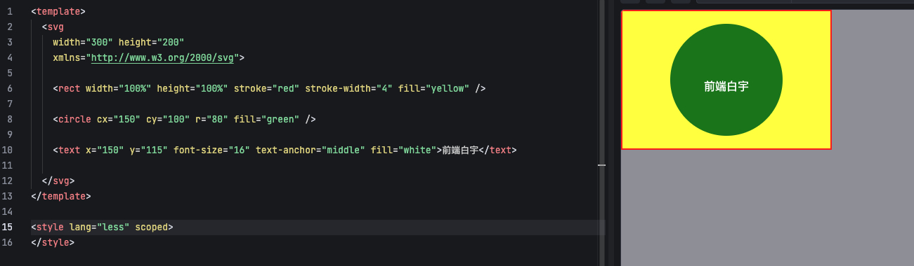
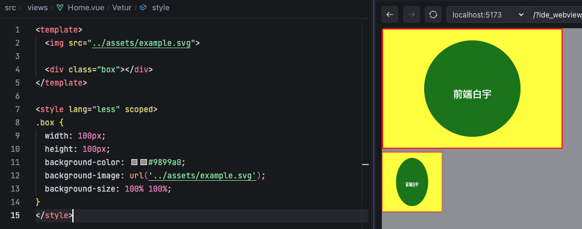
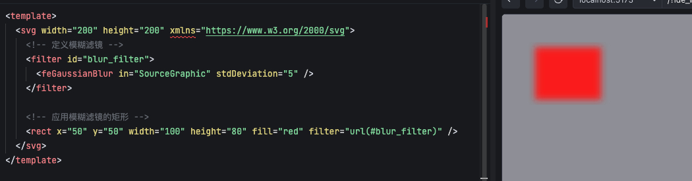

### 一、简介

- SVG 指可伸缩矢量图形（Scalable Vector Graphics），使用 XML 格式定义图像。
- SVG 图像可伸缩而不失真，因为是 XML 文本，所以可以像 DOM 一样被 css 修饰，可以被 js 控制。
- SVG 可以是单独文件（比如 example 目录下的 `example.svg`），也可以是内嵌在 HTML 文档中。

```xml
<svg width="200" height="200" xmlns="http://www.w3.org/2000/svg">
  <circle cx="100" cy="100" r="80" fill="blue" />
</svg>
```

### 二、基本语法

#### 2.1 svg 标签

```xml
<svg
  version="1.1"   <!-- 指定SVG的版本 -->
  baseProfile="full"   <!-- 指定SVG的基本配置 -->
  width="200"     <!-- 指定SVG画布的宽度 -->
  height="200"    <!-- 指定SVG画布的高度 -->
  xmlns="http://www.w3.org/2000/svg">   <!-- 指定SVG命名空间，固定值 -->

  <!-- 绘制图形内容 -->
</svg>
```

- `version`：指定 SVG 的版本，通常为 1.1。
- `baseProfile="full"`  表示该 SVG 文档遵循完整的 SVG 1.1 规范
- 注意，在 SVG 2 规范中，`version` 和 `baseProfile` 已经被废弃，不再需要显式指定，即写成
```xml
<svg
  width="200" 
  height="200"
  xmlns="http://www.w3.org/2000/svg">

  <!-- 绘制图形内容 -->
</svg>
```
#### 2.2 基本图像元素

- `<rect>` 绘制矩形，指定矩形的位置、大小、圆角，以及填充颜色
```xml
<rect x="50" y="50" width="100" height="50" rx="10" ry="10" fill="blue" />
```
- `<circle>` 绘制圆形，指定圆心和半径，以及填充颜色
```xml
<circle cx="100" cy="100" r="50" fill="red" />
```
- `<ellipse>` 绘制椭圆，指定圆心和长轴短轴的半径，以及填充颜色
```xml
<ellipse cx="150" cy="100" rx="75" ry="50" fill="green" />
```
- `<line>` 绘制直线，指定起点和终点，以及线条颜色和宽度
```xml
<line x1="0" y1="0" x2="200" y2="200" stroke="black" stroke-width="5" />
```
- `<polyline>` 绘制折线，指定多个点的坐标
```xml
<polyline points="20,20 40,25 60,40 80,120 120,140 200,180" fill="none" stroke="black" stroke-width="5" />
```
- `<polygon>` 绘制多边形
```xml
<polygon points="50,50 100,100 150,50 100,0" fill="yellow" stroke="black" stroke-width="5" />
```
- `<path>` 绘制路径，指定路径的绘制命令
```xml
<path d="M50,50 L100,100 L150,50 Z" fill="purple" stroke="black" stroke-width="5" />
```
- `<text>` 绘制文本
```xml
<text x="100" y="100" font-size="24" fill="white">Hello, SVG!</text>
```

- 看个例子




### 三、SVG 在 HTML 中的使用

- 直接嵌入到 HTML 中，像上面一样
- 作为独立的 SVG 文件，使用 `` `<object>` `<iframe>` 标签引入

```html


<object data="example.svg" type="image/svg+xml" width="200" height="200">
  Your browser does not support SVG
</object>

<iframe src="example.svg" width="200" height="200"></iframe>
```

*注意：实际体验不咋滴，加载本地svg文件时，只有 `img` 标签正常展示了，其他两个都不行，可能是安全策略问题，所以项目中尽量使用直接插入或者 `img` 标签*

- svg 图像也可以作为背景图片使用，使用 `background-image` 属性

```css
div {
  background-image: url('example.svg');
}
```



### 四、SVG 滤镜

- 滤镜可以应用于 SVG 图形元素，使它们具有特殊的效果。使用 `<filter>` 元素定义滤镜
- 简单了解，具体使用产看相关文档



### 五、svg 渐变

- 与滤镜使用方法类似
- 分别是 `<linearGradient>` `<radialGradient>`，对应线性渐变和径向渐变
- 简单了解，具体使用产看相关文档

### 六、svg 动画

- svg 本身有基础的动画，比如 `<animate>` 元素，也有一些属性方法，比如 `transform`
- svg 是 xml 文本，所以实现动画也可以借助 css 或者 js，此情况仅适用于将 svg 直接嵌入到 html 中使用时
- 简单了解，具体业务具体分析