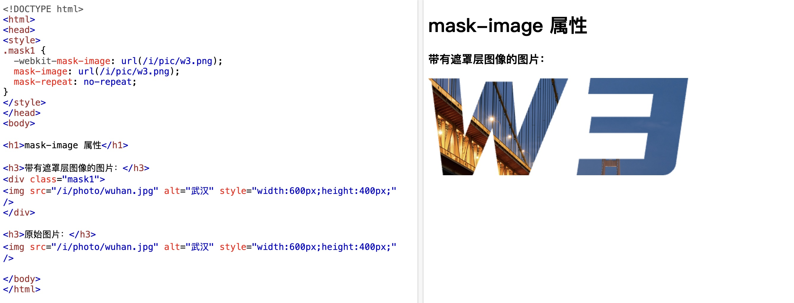
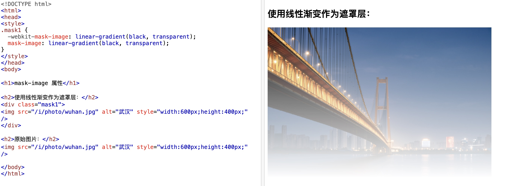

## 一些琐碎的知识点

> 仅记录不常用但可能用到的

---
---

### 1、颜色函数 hsl/hsla ：色相、饱和度、亮度

```css
hsl(0, 100%, 50%)
```

### 2、background-attachment 样式

- `scroll`：默认值，背景图片随元素内容滚动
- `fixed`：背景图片固定

### 3、垂直外边距合并

- `margin` 值为正时，上外边距和下外边距合并，发生在兄弟元素之间、父子元素之间、自身元素
  
### 4、min-width、max-width、width 属性

- `min-width` 默认值为 `auto`、`max-width` 默认值是 `none`，`width` 默认值是 `auto`
- 三者一起使用时
  - 如果 `width` 的值小于 `min-width`，元素的实际宽度将被设置为 min-width
  - 如果 `width` 的值大于 `max-width`，元素的实际宽度将被设置为 max-width
  - 如果 `width` 的值大于 `min-width` 且小于 `max-width`，元素的实际宽度将被设置为 width
  - 如果只有 `min-width、max-width`，元素的实际宽度将被设置为 `min-width`（主流浏览器是这样）
  
### 5、轮廓属性 outline

- `outline` 属性是 `outline-color、outline-style、outline-width` 的简写属性，`outline-offset` 单独使用设置偏移量
- 轮廓不算元素的尺寸，元素之间的轮廓会重叠
  
### 6、超链接的四状态

- `a:link` 未访问
- `a:visited` 已访问
- `a:hover` 鼠标悬停
- `a:active` 鼠标点击

### 7、列表属性

- html 中有两种列表st
  - 无序列表 `ul`
  - 有序列表 `ol`
- css 列表属性
  - `list-style-type` 列表项标记的类型，取值为 `none、disc、circle、square`
  - `list-style-image` 列表项标记的图像，取值为 `url()`
  - `list-style-position` 列表项标记的位置，取值为 `inside、outside`

### 8、border-collapse 属性

- `border-collapse` 属性用于设置表格的边框是否被合并为一个单一的边框，取值为 `collapse`
  - 多用于想自定义 table 时，设置单一边框，挺有用的（之前都是用 border 一个个边处理，挺蠢的～）


### 9、position 定位属性

- 常用 `absolute` 绝对定位、`relative` 相对定位
- 不算常用 `fixed` 固定定位（或者叫相对于视口定位）、`sticky` 粘性定位（一开始位置不变，滚动时到达定位位置不动）

### 10、float 浮动属性

- 常用 `left` 左浮动、`right` 右浮动、`none` 不浮动
- 其实是为了文本环绕设计的，一般配合 `clear` 清除浮动属性使用，取值为 `left`、`right`、`both`、`none`

### 11、css 组合器

- `空格` 后代选择器，选择父元素下的所有指定的子孙元素
- `>` 子选择器，选择父元素下的所有指定的子元素
- `+` 相邻兄弟选择器，选择元素后面相邻的指定兄弟元素，只有一个
- `~` 通用兄弟选择器，选择元素后面的所有指定的兄弟元素

*样式优先级：!important > 行内样式 > ID 选择器 > 类选择器、伪类选择器、属性选择器 > 元素选择器、伪元素 > 通配符选择器 > 继承样式 > 浏览器默认样式*

### 12、部分 css 伪类

- 伪类用于定义元素的特殊状态，这里仅列举比较常用的

- `:first-child` 第一个子元素
- `:last-child` 最后一个子元素
- `:nth-child(n)` 第 n 个子元素
  - 可以选择偶数 `2n`、奇数 `2n+1`，或者前x个 `-n+x`
- `:nth-last-child(n)` 倒数第 n 个子元素
  - 选择后x个 `-n+x`
- `not()` 否定选择器，选择除了指定的元素之外的所有元素
- `:hover` 鼠标悬停

### 13、css 伪元素

- 伪元素用于在元素的特定位置插入内容

- `::after` 在元素之后插入内容
- `::before` 在元素之前插入内容
- `::selection` 选中的文本
- `::first-letter` 第一个字母
- `::first-line` 第一行
- `::placeholder` 表单中 placeholder 属性内容样式
- `::backdrop` 用于全屏或对话框等元素的背景样式
- ...

### 14、css 数学函数

- `calc()` 计算函数
  - `calc(100% - 10px)` 计算 100% - 10px 的值
- `min()` 最小值
  - `min(100px, 50%)` 取 100px 和 50% 的最小值
- `max()` 最大值
- `clamp()` 接受三个值，按最小值、首选值、最大值排序，其实就是`max(MIN, min(VAL, MAX))` 

```css
.element {
  width: clamp(200px, 50%, 1000px);
  /* 等同于 */
  width: max(200px, min(50%, 1000px));
}
```

### 15、边框图像（业务从来没使过）

- `border-image` 边框图像，取值为 `url()`
- `border-image-source` 边框图像的源
- ...

### 16、css 多重背景

- css 允许为一个元素添加多个背景图像，逗号隔开

```css
#example1 {
  background-image: url(flower.gif), url(paper.gif);
  background-position: right bottom, left top;
  background-repeat: no-repeat, repeat;
}
```
- `backgound-size` 背景图像的大小，取值为 `length、percentage、cover、contain`
- `background-clip` 指定背景的绘制区域，取值为 `border-box、padding-box、content-box`
- `background-origin` 指定背景图像的定位区域，规定 `background-position` 属性相对于什么位置来定位，取值为 `border-box、padding-box、content-box`

### 17、box-shadow 盒子阴影

- 与文本阴影 `text-shadow` 类似，都是用逗号隔开多个阴影，取值为 `水平阴影、垂直阴影、模糊距离、颜色`

### 18、加载 web 字体

- `@font-face` 规则用于加载 web 字体，取值为 `font-family、src、font-weight、font-style`
  - 必填项：`font-family`、`src`

```css
@font-face {
  font-family: myFirstFont;
  src: url(sansation_light.woff);
}
```

### 19、css 遮罩

- `mask-image` 属性可以创建一个图像遮罩并将其放置在元素上，以部分或完全隐藏元素的某些部分
- 遮罩图像可以是 PNG、SVG、CSS渐变、SVG `<mark>` 元素



- 使用渐变



- 该属性谨慎使用，要注意浏览器兼容问题

### 20、CSS 变量 var 函数

- var() 函数的语法为 `var(name, value)`
  - `name` 是必需的，指定变量的名称
  - `value` 是可选的，指定变量的默认值

- 配合 `：root` 使用，变量名前必须加 `--`

```css
:root {
  --blue: #1e90ff;
  --white: #ffffff;
}

body { background-color: var(--blue); }
h2 { border-bottom: 2px solid var(--blue); }
```

- 上面的变量是全局变量，也可以在选择器中声明局部变量

```css
button {
  --blue: #0000ff;
  color: var(--blue);
  border: 1px solid var(--blue);
}
```

- 注意：js 可以获取这些变量并修改

### 21、媒体查询

- `@media` 语法，用于根据不同的屏幕尺寸应用不同的样式，一般针对 `screen` 较多，取值还有 `all、print、speech`

```css
@media screen and (min-width: 480px) {
  #leftsidebar {width: 200px; float: left;}
  #main {margin-left: 216px;}
}
```

### 22、@property 规则

- `@property` 规则用于创建自定义属性

```css
@property --myColor {
  syntax: "<color>";
  inherits: true;
  initial-value: lightgray;
}

div {
  background-color: var(--myColor);
}
```

### 23、css 滤镜
- `filter` 属性就是用来给元素添加不同的滤镜，取值为 `blur、brightness、contrast、drop-shadow、grayscale、hue-rotate、invert、opacity、saturate、sepia`，取值基本都是滤镜函数，可以组合使用
- 了解即可，有些滤镜效果有一定的开销，实际项目中用到的滤镜效果不多，但也有

```css
.complex-effect {  
  filter: blur(5px) brightness(50%) contrast(200%) grayscale(50%);  
}
```

- 比如一个常用的就是网页置灰色，就是用到 filter 滤镜，取值是  grayscale 滤镜函数，接收一个参数，表示置灰的程度，取值为 0-100%，0 表示不置灰，100% 表示完全置灰
```css
body {
  filter: grayscale(100%);
}
```