### 一、是什么

> webpack is a static module bundler for modern JavaScript applications.
> <br />
> webpack 是一个静态的模块化打包工具，为现代的 JavaScript 应用程序

- 前端开发中，会用到各种代码写法，比如ES6模块化、commonjs模块化、TypeScript、Less、Sass等等，这些都是不能被浏览器所识别运行的，webpack 打包工具的其中一项功能，就是将这些代码转换成浏览器能识别并运行的静态资源，如 html、css、js、img等

### 二、简单使用

- 中文文档：https://webpack.docschina.org/
- webpack 的运行是依赖 node 环境的，所以需要先安装 node
- 安装 webpack 时建议不要全局安装，在项目内安装即可 


```js
npm install webpack webpack-cli -D
```
- `webpack webpack-cli` 的关系
    - 执行 `webpack` 命令时，会执行 `node_modules` 下的`.bin`目录下的 `webpack` 文件
    - `webpack` 文件的执行是依赖 `webpack-cli` 的，如果没有安装就报错
    - 而 `webpack-cli` 中代码执行时，才是真正的利用 webpack 进行编译和打包的过程

#### *举个例子*

- 在新建的文件夹下初始化一个package.json的文件`npm init -y`
- 然后创建一个 `src` 文件夹，并在该文件夹下创建 `index.js` 文件，输入一些 js 代码
- 然后执行 `npx webpack` 命令


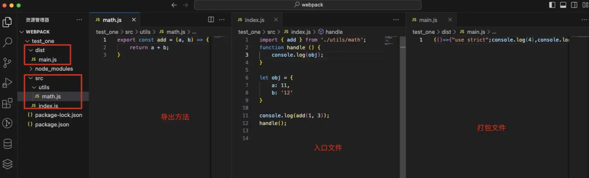

#### *默认打包*

- 上面的例子是默认打包，即没做任何配置，在命令行输入 `npx webpack`
- 原理：
    - 首先，根目录下，必须要有 `src/index.js` 文件，即打包的入口文件
    - 然后，打包会生成一个 `dist` 文件夹，里面存放一个 `main.js` 文件


- 当然，也可以通过配置来制定入口和出口


```js
// entry 指定入口文件 --output 指定出口 -path是路径 -filename是名字
npx webpack --entry ./src/main.js --output-path ./build
```

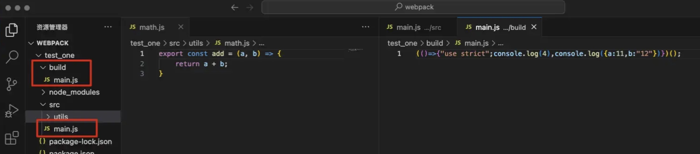

#### *配置文件*

- 通常情况下，webpack 打包是很复杂的，需要配置很多东西，可以在根目录创建一个 `webpack.config.js` 配置文件
- 之后可以在命令行执行 `npx webpack`，但一般是在 `package.json` 文件中添加一个 build 命令，然后 `npm run build` 执行


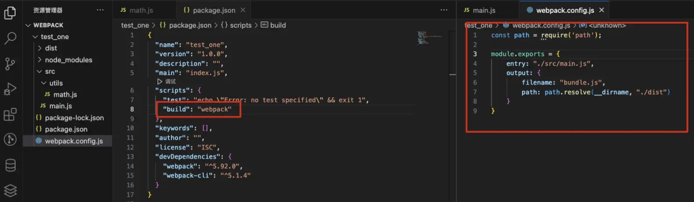

- 也可以取名为 `qita.config.js`，命令编写时给上配置文件信息即可

```js
"build": "webpack --config qita.config.js"
```

### 三、依赖关系图

*webpack 是如何对项目进行打包的呢？*

- webpack在处理应用程序时，它会根据命令或者配置文件找到入口文件
- 从入口开始，会生成一个 `依赖关系图`，这个依赖关系图会包含应用程序中所需的所有模块(比如.js文件、css文件、图片、字体等)
- 然后遍历图结构，打包一个个模块(根据文件的不同使用不同的`loader`来解析，webpack本身只能处理js文件，其他文件需要loader)


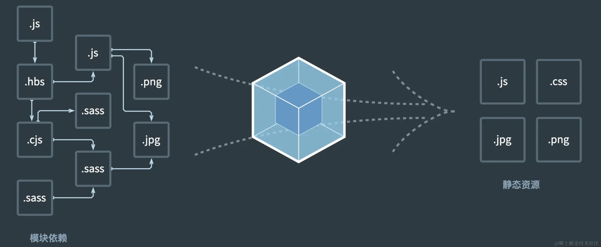

### 四、认识 Loader

> 在Webpack中，Loader 是一种转换器，它使得Webpack能够处理那些非JavaScript文件（例如TypeScript、图片、CSS等）。Webpack 本身只理解JavaScript，Loader 允许Webpack将其他类型的文件加载到依赖图中，并应用相应的转换

- 下面所有的事例都需要在根目录新建一个 index.html 文件，对打包后的 js 文件进行引入，然后就可以直接浏览器访问该 html 文件


```html
<!DOCTYPE html>
<html lang="en">
<head>
  <meta charset="UTF-8">
  <meta name="viewport" content="width=device-width, initial-scale=1.0">
  <title>Document</title>
</head>
<body>
  <!-- 用于 vue 事例 -->
  <div id="app"></div>
  <!-- 引入打包后的 js 文件 -->
  <script src="./dist/bundle.js"></script>
</body>
</html>
```
- 以处理样式相关文件为例

#### *css-loader 使用*

- 举个例子，创建一个 div 标签，并提供样式引入，然后打包


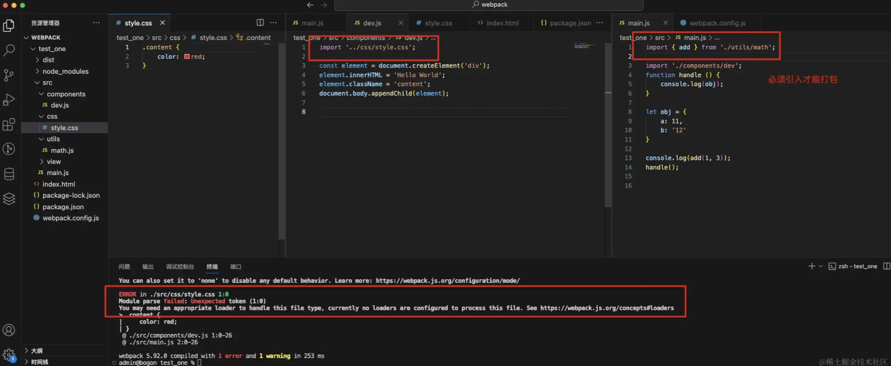

- 会报错，提示需要一个合适的loader处理这个文件类型
- 将css文件看做一个模块，加载时，webpack并不知道如何加载该模块，这时需要 css-loader 来读取css文件
- 安装 css-loader

```js
npm install css-loader -D
```

- 使用方式有三种，内联方式、CLI方式、配置方式，前两种基本不用，可以自行了解
- 配置方式： 一般是在 webpack.config.js 文件中写配置信息，在 `module.rules` 中配置，rules 是一个数组，可以配置多种loader，来完成其他文件的加载，每种文件对应一个对象
- 以css文件处理为例，配置css-loader


```js
const path = require('path');

module.exports = {
    entry: "./src/main.js",
    output: {
        filename: "bundle.js",
        path: path.resolve(__dirname, "./dist")
    },
    module: {
        rules: [
            {
                test: /\.css$/,
                // use: [
                //     {loader: "css-loader"}
                // ]
                use: ["css-loader"] // 简写
            }
        ]
    }
}
```
- 属性介绍：
    - *test属性：* 用于对资源进行匹配，一般设置为正则表达式
    - *use属性：* 是一个数组，可以接收对象和字符串，字符串一般用于简写形式
        - 对象中的loader参数：一个字符串
        - 对象中的options参数：值会传入到loader中
        - 对象中的query参数：目前已经使用options来替代

#### *style-loader 使用*

- 上面已经使用 css-loader 加载css文件了，但是实际页面没有起作用
- 因为 css-loader 只负责将 .css 文件进行解析，并不会将解析后的css插入到页面中
- 这个时候需要 style-loader 来完成插入style的操作

```js
npm install style-loader -D
```
- 在 webpack.config.js 中配置，然后进行打包运行，注意：loader 的执行顺序是从右往左，所以 css-loader 先执行，写在后面


```js
    module: {
        rules: [
            {
                test: /\.css$/,
                // use: [
                //     {loader: "style-loader"},
                //     {loader: "css-loader"}
                // ]
                use: ["style-loader", "css-loader"] // 简写
            }
        ]
    }
```


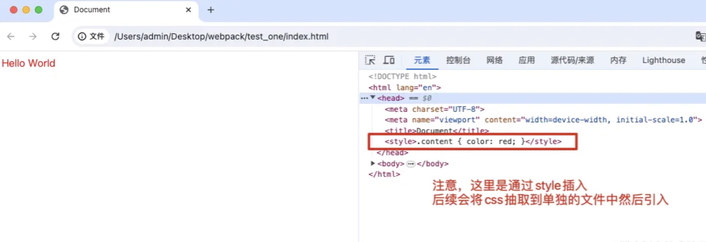

#### *less-loader 使用*

- 在实际开发中，一般会使用less、sass等与处理器来写css样式
- 以less为例，需要借助 less-loader 将其转换成 css


```js
npm install less-loader -D
```
- 注意：要添加新的匹配规则，less-loader 在最右边，先解析成 css，在使用 css-loader

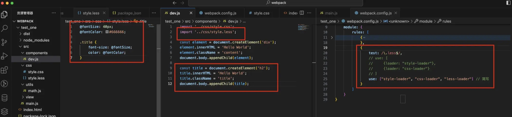


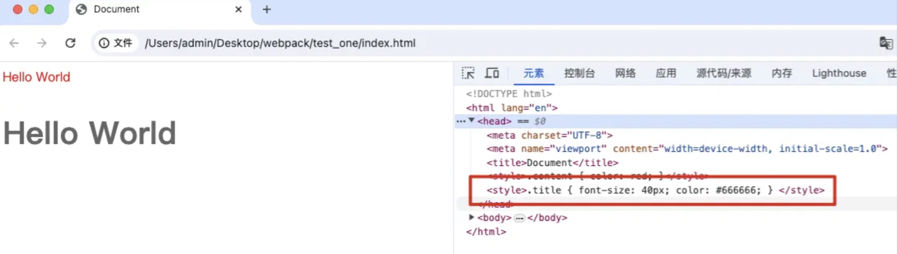

#### *posscss-loader 使用*

- 开发中会用到新的 css 样式，但老版浏览器可能不知道，这就需要添加浏览器前缀
- postcss-loader 可以实现自动添加前缀的功能，postcss-loader 也有其他功能，可自行挖掘学习
- 实现功能时，需要借助对应的 PostCSS 对应的插件
- 以实现自动加前缀为例，先安装 postcss-loader，然后安装对应的功能插件 autoprefixer


```js
npm install postcss-loader autoprefixer -D
```

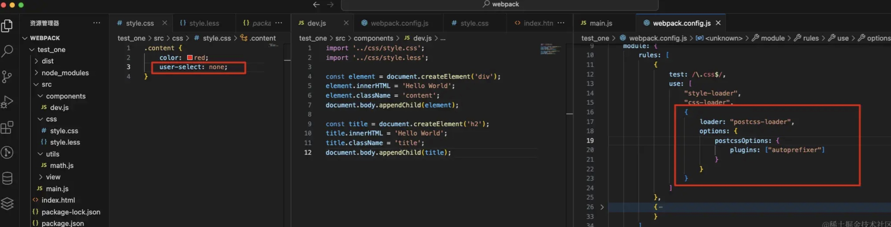


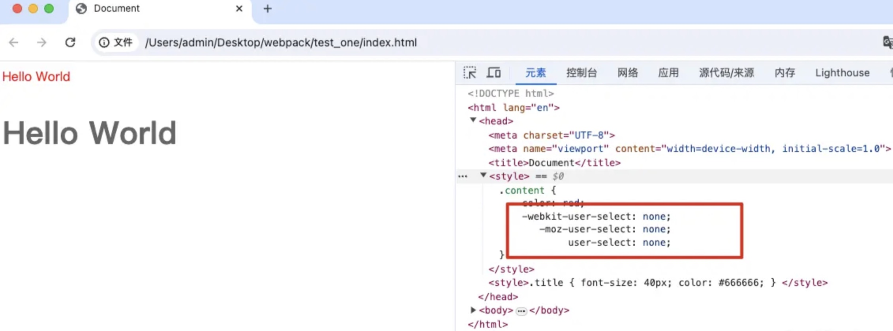

- 该配置除了都写在 webpack.config.js 里外，还可以单独拿出来
- 创建一个 postcss.config.js 文件


```js
module.exports = {
    plugins: ["autoprefixer"]
}
```

```js
{
    test: /\.css$/,
    use: [ "style-loader", "css-loader", "postcss-loader" ]
}
```

- 前面使用 autoprefixer 插件，然而在实际开发中使用 `postcss-preset-env` 插件，使用方式一样，但是它提供了基础的预设能力，包括自动添加前缀

#### *图片资源处理*

- 在 webpack5 之前，加载图片资源需要使用一些loader。比如 url-loader、file-loader等
- 在 webpack5 之后，可以直接使用内置的`资源模块类型 （asset moudle type）`
- 有四种模块类型


*第一种：asset/resource* 会打包成两个图片文件，打包的js文件中是两url链接引入，缺点在页面访问时多了两次网络请求

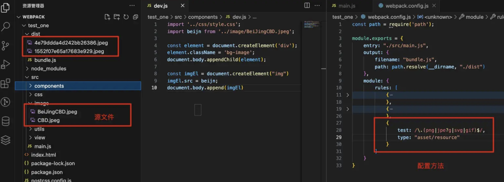

*第二种：asset/inline* 将图片进行 base64 编码，编码后的源码放到打包的js文件中，缺点会造成js文件非常大，下载js文件本身消耗时间非常长, 造成js代码的下载和解析/执行时间过长。实际体验中，有张19MB的图片，页面非常卡顿


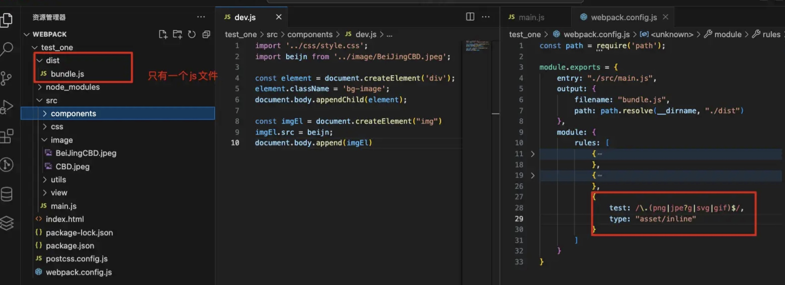

*第三种：asset/source* 导出资源的源代码，基本不用

*第四种：asset* 结合第一第二种，可控制图片进行哪种处理（一般使用该种方式，对于小的文件，可以进行base64编码，对于大的文件，单独的文件打包，形成url地址，单独请求这个url图片）


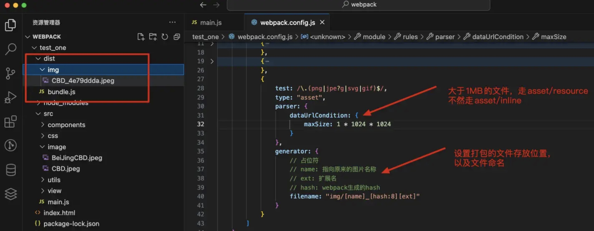
    

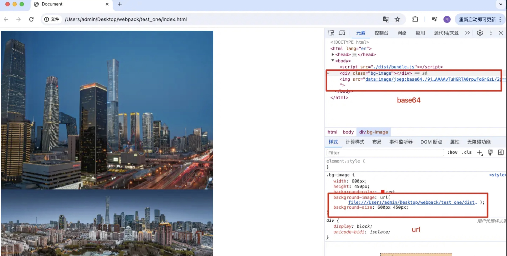

#### *babel 的使用*


> 在Webpack中，Babel 是一个流行的JavaScript编译器，它可以将ES6及以上版本的代码转换为向后兼容的JavaScript版本（通常是ES5）

- 主要功能
    - **语法转换**：将ES6+的语法（例如箭头函数、类、模块等）转换为ES5语法
    - **源码映射**（Source Maps）：生成源码映射文件，帮助开发者在转换后的代码和原始源代码之间进行调试
    - **代码优化**：在转换过程中，Babel 还可以进行代码优化，例如删除死代码（tree-shaking）
    - **TypeScript支持**：可以配合 TypeScript 使用，将 TypeScript 代码转换为 JavaScript
    - **React支持**：转换 JSX 语法为 JavaScript 代码
    - **插件和预设系统**


- babel 本身可以作为一个对立的工具（和postcss一样），实现功能一般需要特定的插件辅助。当然，也有自己的预设，安装`@babel/preset-env`预设


```js
npm install babel-loader -D
npm install @babel/preset-env -D
```

- 然后在构建工具中进行配置，和postcss类似，配置信息可以在 webpack.config.js 中配置，也可以新建 babel.config.js 文件配置


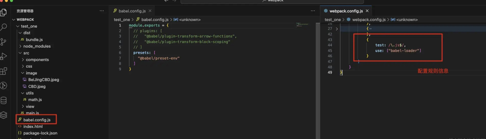

*更多 babel 功能在后面进阶篇在总结*


#### *vue 文件加载*

- 先安装 vue，再创建一个vue文件
- 对 vue 文件的处理需要 vue-loader，且配置时需要 loader 里的 VueLoaderPlugin 插件


```js
npm install vue
npm install vue-loader -D
```

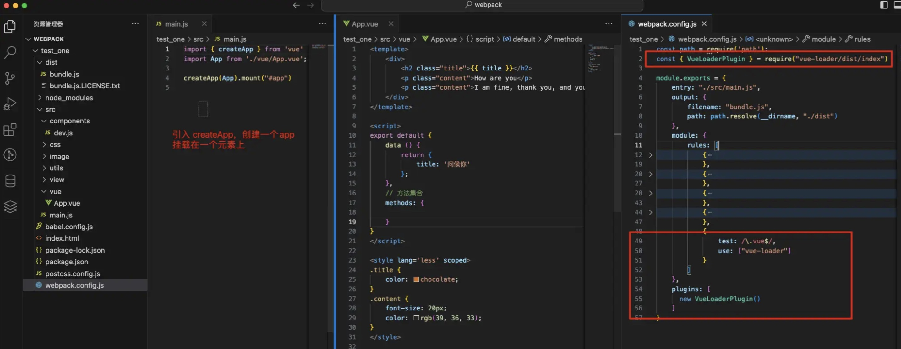

- 除此外，需在 index.html 文件中添加一个元素 `<div id="app"></div>`


### 五、resolve 模块解析

> 在Webpack中，`resolve` 是一个配置选项，它负责配置模块如何被解析。具体来说，`resolve` 定义了Webpack在查找模块时使用的一些规则。通俗的讲，在开发中用 require/import 引入模块时会提供路径，resolve 可以对路径进行解析然后找到合适的模块


- webpack 能解析三种文件路径
    - 绝对路径
    - 相对路径
    - 模块路径
        -  在 resolve.modules中指定的所有目录检索模块，默认值是 ['node_modules']，所以默认会从node_modules中查找文件

#### *extensions 和 alias 配置*

- extensions 是解析到文件时自动添加扩展名
    - 默认值是 `.wasm .mjs .js .json`

- 配置别名 alias
    - 比如当目录结构比较深时，找一个文件会这样 ../../../../
    - 此时就可以给常见的路径起个别名


```js
resolve: {
    extensions: [".js", ".json", ".vue", ".jsx", ".ts", ".tsx"],
    alias: {
      "@": path.resolve(__dirname, "./src")
    }
}
```


### 六、认识 plugin

> 在 Webpack 中，**插件**（Plugin）是一种 JavaScript 对象，这些对象可以扩展 Webpack 的功能。解释为：<br />
> **Loader** 用于特定的模块类型进行转换，通俗的说是只能处理特定的文件，比如css js vue json等文件 <br />
> **Plugin** 可以用于执行更加广泛的任务，比如资源管理、环境变量注入、打包优化等


#### *CleanWebpackPlugin 插件使用*

- 前面打包时，都需要将上次打包的dist文件删除后在打包，该插件可以实现在打包时自动删除上次打包的文件，然后重新生成打包文件


```js
npm install clean-webpack-plugin -D
```
- 安装完后在 webpack.config.json 文件中配置：


```js
const { CleanWebpackPlugin } = require("clean-webpack-plugin")

module.exports = {
    plugins: [
        new CleanWebpackPlugin()
    ]
}
```
- 上面是以前的自动清空打包文件的方式，现在可以不使用 CleanWebpackPlugin 插件，而是在 output 属性中配置 clean 参数


```js
moudle.exports = {
    output: {
        filename: "bundle.js",
        path: path.resolve(__dirname, "./dist"),
        clean: true
      }
}
```
 #### *HtmlWebpackPlugin 插件使用*
 
-  项目在打包后需要将打包的静态文件部署到服务器上，但上面的所有打包中，打包文件夹下都没有 index.html 文件，该文件可以根据给定的 html 文件模板在打包文件夹下自动生成一个 html 文件


```js
npm install html-webpack-plugin -D
```
- 安装完后在 webpack.config.json 文件中配置：


```js
const HtmlWebpackPlugin = require('html-webpack-plugin')

module.exports = {
    plugins: [
        new HtmlWebpackPlugin({
            title: "测试项目",
            template: "index.html"
        })
    ]
}
```
- 该插件在配置时可以添加参数，介绍几个企业项目常用参数：
    - **filename：** 指定生成的 HTML 文件的名称，默认为 `index.html`
    - **template：** 指定一个 HTML 文件作为模板，可以是 HTML、Jade 或 EJS 等类型。如果未指定，将使用默认模板
    - **title：** 设置 HTML 页面的标题，如果指定了 `template`，则此选项将无效，页面标题将由模板文件决
    - **favicon：** 指定页面的 favicon 图标路径
    - **inject：** 控制 script 标签的插入位置，可选值有 `true`、`body`、`head` 和 `false`。`true` 或 `body` 表示在 body 底部插入，`head` 表示在 head 中插入，`false` 表示不插入

- 上面配置生成的实例


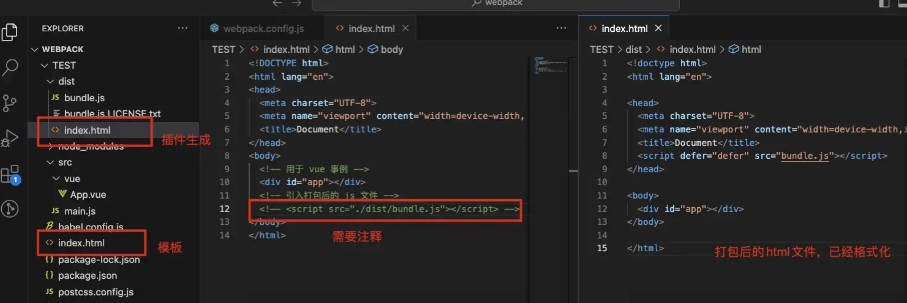


#### *DefinePlugin 插件使用*

- 该插件是 webpack 内置插件，允许在编译时创建全局变量，这些变量在代码中任何地方都可被访问
- 配置方式：


```js
const { DefinePlugin } = require("webpack")

module.exports = {
    plugins: [
        new DefinePlugin({
            TEXT: '学习？学个屁',
            TITLE: '学习圣经',
            NUMBER: '1'
        })
    ]
}
```
- 应用到 vue 文件中


```js
<template>
  <div>
    <!-- 变量不是响应式数据，直接使用无效 -->
    <!-- <div class="title">{{ TITLE }}</div> -->
    <div class="title">{{ title }}</div>
    <div class="text">{{ text }}</div>
    <div>{{add()}}</div>
  </div>
</template>

<script>
export default {
  data () {
    return {
      // 通过赋值的方式，在 tempalte 元素标签中使用
      title: TITLE,
      text: TEXT
    };
  },
  methods: {
    add() {
      console.log(NUMBER);
    }
  }
}
</script>

<style lang="less" scoped>
.title {
  color: red;
  font-size: 30px;
}
.text {
  user-select: none;
}
</style>
```

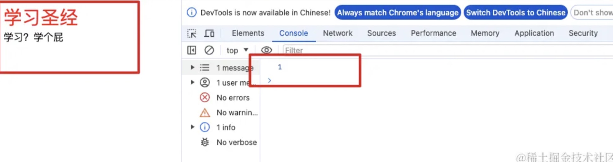

- 有个内置的全局变量 `process.env.NODE_ENV`，配合 mode 使用


### 七、Mode 配置

> `mode` 配置是一个选项，用于指定当前的构建环境是开发环境、生产环境还是自定义环境。这个配置选项告诉 Webpack 应用相应的内置优化和设置

- mode 可以取以下三个值：
    - **`development`**：设置 `DefinePlugin` 中的 `process.env.NODE_ENV` 为 `development`。这将启用模块和 chunk 的有效名称，便于开发时的调试
    - **`production`**：设置 `DefinePlugin` 中的 `process.env.NODE_ENV` 为 `production`。这将启用模块和 chunk 的确定性混淆名称，并应用诸如 `FlagDependencyUsagePlugin`、`FlagIncludedChunksPlugin`、`ModuleConcatenationPlugin`、`NoEmitOnErrorsPlugin` 和 `TerserPlugin` 等插件，以优化生产环境的构建
    - **`none`**：不使用任何默认优化选项，允许你手动配置所有优化


- 如果没有明确设置 `mode`，Webpack 将默认使用 `production` 模式

*上面模糊的概念（比如 chunk）都是进阶篇在讲的内容，这里了解即可*


### 八、开启本地服务器

- 目前开发的代码，都是改完后运行命令打包，然后浏览器打开 index.html 文件。这个过程很影响开发效率，我们希望能完成自动编译并在浏览器打开展示
- 完成自动编译的方式有很多，一般常用`webpack-dev-server`


```js
npm install webpack-dev-server -D
```

- 安装完依赖后，将webpack的 mode 配置为 development，然后在 package.json 配置一条运行命令就可以使用了


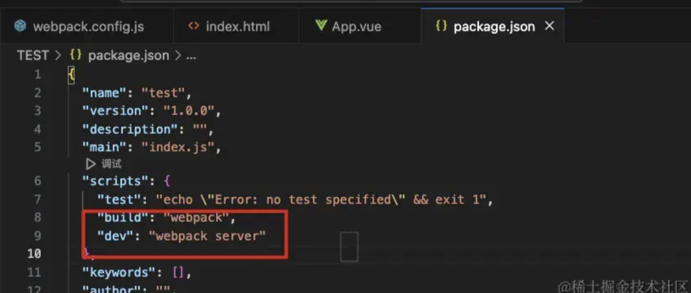

- 执行 `npm run dev` 即可


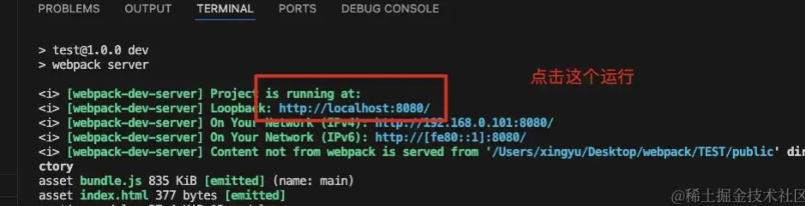

- 上面过程不会生成打包文件，编译后的文件是在内存中


#### *模块热替换 HMR*

> 模块热替换是指在应用程序运行过程中，替换、添加、删除模块，而无需重新刷新整个页面

- 通俗的说，就是在修改源码时，浏览器会自动刷新页面，更新修改的内容
- 默认情况下，webpack-dev-server已经支持HMR，且已经开启，也可手动开启，即 hot 设置为 true


```js
module.exports = {
    // devServer是使用本地服务器时可以提供配置信息的选项
    devServer: {
        hot: true
    }
}
```

- 现在有个问题，更改一个模块的代码，但是整个页面会刷新，全模块会重新加载，效率不高
- 可以指定哪些模块发生更新时，进行 HMR，在入口文件 main.js 中配置


```js
if (module.hot) {
  module.hot.accept("./utils/demo.js", () => {
    console.log("demo模块发生了更新")
  })
}
```
- 但是考虑到一个复杂项目有很多文件，不可能一点点去配置。事实上社区已经针对这些有很成熟的解决方案了
    - 比如vue开发中，使用 vue-loader，此loader支持vue组件的HMR，提供开箱即用的体验
    - react开发中，也有使用 react-refresh


#### *host 配置*

- 像上面执行`npm run dev`命令后，生成的链接，默认是 localhost
- 然而，开发中可以自己配置访问链接


```js
module.exports = {
    devServer: {
        hot: true,
        host: '127.0.0.1'
    }
}
```
#### *port、open、compress、quiet、historyApiFallback 配置*

- port 设置监听的端口，默认是 8080
- open 设置是否自动打开浏览器，默认false，开发中一般设置为 true
- compress 设置是否为静态文件开启 gzip 压缩，默认false，可以设置为true
- quiet 当设置为 true 时，除了初始处理信息外，控制台不在打印任何信息
- historyApiFallback 默认false，当设置为 true 时，任何对非静态资源的请求都会返回 index.html，这在开发单页应用时非常有用


```js
module.exports = {
    devServer: {
        hot: true,
        host: '127.0.0.1',
        port: 8070,
        open: true,
        compress: false,
        quiet: true,
        historyApiFallback: true
    }
}
```

#### *proxy 配置*

- 项目开发中，访问后端接口时，本地的是localhost域名，肯定和接口的域名是不一致的，这个时候就会出现跨域，但是如果有个也是locahost域名的代理服务器，可以接收本地的接口请求，然后在转发到目标接口域名服务，因为代理服务器与目标服务器之间是没有跨域问题的
- **proxy** 就是用来配置代理功能，允许将特定的请求转发到不同的服务器上
- 来个demo


```js
module.exports = {
    devServer: {
        hot: true,
        host: '127.0.0.1',
        port: 8070,
        open: true,
        compress: false,
        quiet: true,
        historyApiFallback: true,
        proxy: [
            {
                context: ['/api'],
                target: 'https://api.test.com',
                secure: false,
                changeOrigin: true
            }
        ]
    }
}
```
- 上面 proxy 代理作用是将任何以 /api 开头的请求都代理到 https://api.test.com
- context 设置需要代理的请求，可接收多个
- target 是代理到的目标地址
- secure 设置为 false 表示不验证 SSL 证书
- changeOrigin 设置为 true 表示在请求头中更改为主机头，比如上面在控制台看接口请求，会显示loaclhost 域名


<br />

*基础篇到这就结束了，后续进阶篇会讲述 模块化原理、source-map、深入解析babel、性能优化、自定义 loader、自定义 plugin*


