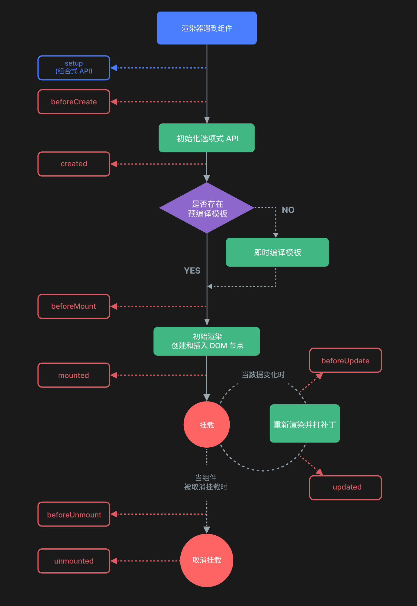

### 一、模版语法

#### 1.1、Attribute 绑定

##### 1.1.1 同名简写

```js
<!-- 与 :id="id" 相同 -->
<div :id></div>

<!-- 这也同样有效 -->
<div v-bind:id></div>
```

##### 1.1.2 动态绑定多个值

```js
<div v-bind="objectOfAttrs"></div>

const objectOfAttrs = {
  id: 'container',
  class: 'wrapper',
  style: 'background-color:green'
}
```

#### 1.2、指令 Directives

##### 1.2.1 动态参数

```js
<a v-bind:[attributeName]="url"> ... </a>
<!-- 简写 -->
<a :[attributeName]="url"> ... </a>

<a v-on:[eventName]="doSomething"> ... </a>

<!-- 简写 -->
<a @[eventName]="doSomething"> ... </a>
```

*   这里的 `attributeName、eventName` 会作为一个 JavaScript 表达式被动态执行，计算得到的值会被用作最终的参数。值应当是一个字符串，或者是 `null`

### 二、响应式基础

#### 2.1、`reactive()` 的局限性

*   **有限的值类型**：它只能用于对象类型 (对象、数组和如 `Map`、`Set` 这样的集合类型）。它不能持有如 `string`、`number` 或 `boolean` 这样的原始类型

*   **不能替换整个对象**：由于 Vue 的响应式跟踪是通过属性访问实现的，因此我们必须始终保持对响应式对象的相同引用

```js
let state = reactive({ count: 0 })

// 上面的 ({ count: 0 }) 引用将不再被追踪
// (响应性连接已丢失！)
state = reactive({ count: 1 })
```

*   **对解构操作不友好**：当我们将响应式对象的原始类型属性解构为本地变量时，或者将该属性传递给函数时，我们将丢失响应性连接

```js
const state = reactive({ count: 0 })

// 当解构时，count 已经与 state.count 断开连接
let { count } = state
// 不会影响原始的 state
count++

// 该函数接收到的是一个普通的数字
// 并且无法追踪 state.count 的变化
// 我们必须传入整个对象以保持响应性
callSomeFunction(state.count)
```

*由于这些限制，建议使用 `ref()` 作为声明响应式状态的主要 API*

#### 2.2、ref 响应式解构

方法一：使用 `toRefs`（推荐）

*   `toRefs` 会将一个 `reactive` 对象的所有属性都转换为对应的 `ref`，这样解构出来的每个变量都是响应式的

```js
import { reactive, toRefs } from 'vue'

const state = reactive({ count: 0 })
const { count } = toRefs(state) // count 现在是一个 ref

count.value++ // 修改这个 ref，会同步更新 state.count，并且触发视图更新
```

方法二：使用 `toRef`

*   如果只需要对象中的某一个属性，可以使用 `toRef`：

```js
import { reactive, toRef } from 'vue'

const state = reactive({ count: 0 })
const count = toRef(state, 'count') // 单独将 count 属性转换为 ref

count.value++ // 同样会更新 state.count
```

方法三：直接使用 `ref` 包装对象

```js
import { ref } from 'vue'

const state = ref({ count: 0 })

// 在模板或 `<script setup>` 中可以直接解构
const { count } = $ref(state.value) // 注意：$ref 是 `<script setup>` 中的编译宏

// 或者在普通的 JS 中： 
const count = computed(() => state.value.count)
```

#### 2.3、额外的 ref 解包细节

*   一个 ref 会在作为响应式对象的属性被访问或修改时自动解包。换句话说，它的行为就像一个普通的属性

```js
const count = ref(0)
const state = reactive({
  count
})

console.log(state.count) // 0

state.count = 1
console.log(count.value) // 1
```

*   当 ref 作为响应式数组或原生集合类型 (如 `Map`) 中的元素被访问时，它**不会**被解包

```js
const books = reactive([ref('Vue 3 Guide')])
// 这里需要 .value
console.log(books[0].value)

const map = reactive(new Map([['count', ref(0)]]))
// 这里需要 .value
console.log(map.get('count').value)
```

### 三、计算属性

**计算属性值会基于其响应式依赖被缓存**。一个计算属性仅会在其响应式依赖更新时才重新计算，这也解释了为什么下面的计算属性永远不会更新，因为 `Date.now()` 并不是一个响应式依赖

```js
const now = computed(() => Date.now())
```

#### 3.1 可写计算属性

*   计算属性默认是只读的，直接修改会有运行时警告。借助 `getter、setter` 可以实现可写

```js
<script setup>
import { ref, computed } from 'vue'

const firstName = ref('John')
const lastName = ref('Doe')

const fullName = computed({
  // getter
  get() {
    return firstName.value + ' ' + lastName.value
  },
  // setter
  set(newValue) {
    // 在这里更爱对应的响应式依赖
    [firstName.value, lastName.value] = newValue.split(' ')
  }
})
</script>
```

*   再运行 `fullName.value = 'John Doe'` 时，setter 会被调用而 `firstName` 和 `lastName` 会随之更新

#### 3.2 获取上一个值

*   仅 3.4+ 支持

```js
<script setup>
import { ref, computed } from 'vue'

const count = ref(2)

// 这个计算属性在 count 的值小于或等于 3 时，将返回 count 的值。
// 当 count 的值大于等于 4 时，将会返回满足我们条件的最后一个值
// 直到 count 的值再次小于或等于 3 为止。
const alwaysSmall = computed((previous) => {
  if (count.value <= 3) {
    return count.value
  }

  return previous
})
</script>
```

### 四、类与样式绑定

*   常见的

```js
<div :class="{ active: isActive }"></div>
<div :class="[isActive ? activeClass : '', 'errorClass']"></div>
<div :style="{ color: red, fontSize: fontSize + 'px' }"></div>
```

*   不常见的，可以直接传参数、对象、计算属性

```js
const isActive = ref(true)
const error = ref(null)

const classObject = computed(() => ({
  active: isActive.value && !error.value,
  'text-danger': error.value && error.value.type === 'fatal'
}))
// 使用
<div :class="classObject"></div>
```

```js
const activeClass = ref('active')
const errorClass = ref('text-danger')

// <div class="active text-danger"></div>
<div :class="[activeClass, errorClass]"></div>
```

### 五、列表渲染 v-for

*   以使用 `of` 作为分隔符来替代 `in`

```js
<div v-for="item of items"></div>
```

*   可以遍历对象

```js
<li v-for="(value, key, index) in myObject">
  {{ index }}. {{ key }}: {{ value }}
</li>

const myObject = reactive({
  title: 'How to do lists in Vue',
  author: 'Jane Doe',
  publishedAt: '2016-04-10'
})
```

### 六、事件处理

*   事件处理器分为内联事件处理器、方法事件处理器

```js
//内联
<button @click="count++">Add 1</button>
<button @click="greet()">Greet</button>
//方法
<button @click="greet">Greet</button>
```

#### 6.1 在内联事件处理器中访问事件参数

```js
<!-- 使用特殊的 $event 变量 -->
<button @click="warn('Form cannot be submitted yet.', $event)">
  Submit
</button>

<!-- 使用内联箭头函数 -->
<button @click="(event) => warn('Form cannot be submitted yet.', event)">
  Submit
</button>

function warn(message, event) {
  // 这里可以访问原生事件
  if (event) {
    event.preventDefault()
  }
  alert(message)
}
```

#### 6.2 事件修饰符

*   `.stop`
*   `.prevent`
*   `.self`
*   `.capture`
*   `.once`
*   `.passive`

```js
<!-- 单击事件将停止传递 -->
<a @click.stop="doThis"></a>

<!-- 提交事件将不再重新加载页面 -->
<form @submit.prevent="onSubmit"></form>

<!-- 修饰语可以使用链式书写 -->
<a @click.stop.prevent="doThat"></a>

<!-- 也可以只有修饰符 -->
<form @submit.prevent></form>
```

#### 6.3 按键修饰符

*   `.enter`
*   `.tab`
*   `.delete` (捕获“Delete”和“Backspace”两个按键)
*   `.esc`
*   `.space`
*   `.up`
*   `.down`
*   `.left`
*   `.right`

#### 6.4 鼠标修饰符

*   `.left`
*   `.right`
*   `.middle`

### 七、输入绑定 v-model

*   修饰符
    *   `.lazy`：默认情况下，`v-model` 会在每次 `input` 事件后更新数据。添加 `lazy` 修饰符来改为在每次 `change` 事件后更新数据

    *   `.number`：让用户输入自动转换为数字

    *   `.trim`：自动去除用户输入内容中两端的空格

### 八、侦听器 watch

#### 8.1 watch()

*   监听 ref 数据

```js
const count = ref(0)
watch(count, (newVal, oldVal) => {})

const user = ref({ name: '张三', age: 20 })
// 监听 ref 对象中的一个参数
watch(() => user.value.name, (newVal, oldVal) => {})
// 监听 ref 对象（手动开启深度监听） 
watch(user, (newVal, oldVal) => {}, { deep: true })
```

*   监听 reactive 对象

```js
// 定义 reactive 对象 
const user = reactive({ name: '张三', age: 20, address: { city: '北京' } }) 

// 监听单个属性（name） 
watch(() => user.name, (newVal, oldVal) => {})
// 监听整个对象（默认会开启深度监听）
watch(user, (newVal) => {})
// 同时监听 name 和 age 
watch([() => user.name, () => user.age], ([newName, newAge], [oldName, oldAge]) => {})
```

#### 8.2 watchEffect()

*   允许我们自动跟踪回调的响应式依赖

```js
// todoId 每次变化都会自动执行回调
watchEffect(async () => {
  const response = await fetch(
    `https://jsonplaceholder.typicode.com/todos/${todoId.value}`
  )
  data.value = await response.json()
})
```

#### 8.3 watch 的第三个参数

*   配置项，部分也可用于 watchEffect

    *   `immediate: true`

    *   `deep: true`

    *   `once: true`

    *   `flush: 'post'`

        *   取值为 post，指监听回调在DOM更新后执行（一般子组件watch在父组件数据更新后，父组件dom更新后，子组件更新前执行）
        *   取值为 sync，它会在 vue 进行任何更新前触发

#### 8.4 副作用清理

*   `onWatcherCleanup` 仅在 Vue 3.5+ 中支持。下面代码防止 id 多次变更，前面的请求使用旧 id 值，直接终止过期请求

```js
import { watch, onWatcherCleanup } from 'vue'

watch(id, (newId) => {
  const controller = new AbortController()

  fetch(`/api/${newId}`, { signal: controller.signal }).then(() => {
    // 回调逻辑
  })

  onWatcherCleanup(() => {
    // 终止过期请求
    controller.abort()
  })
})
```

#### 8.5 停止侦听器

*   可以手动停止一个侦听器，调用 `watch` 或 `watchEffect` 返回的函数

```js
const unwatch = watchEffect(() => {})

// ...当该侦听器不再需要时
unwatch()
```

### 九、模版引用

*   先看一下模版

```js
<template> 
    <Child ref="child" /> 
</template>
```

*   引用分两种

```js
// 3.5 版本之前
<script setup>
import { ref } from 'vue'

const child = ref(null)
</script>

// 3.5版本后
<script setup>
import { useTemplateRef } from 'vue'

const childRef = useTemplateRef('child')
</script>
```

*   3.5 版本后推荐 `useTemplateRef` 写法，但是也兼容老的写法

### 十、组件基础

这里仅是基础，有深入组件的笔记

#### 10.1 传递 props

*   vue3 中分两种，在 `<script setup>` 中，使用 `defineProps`，无需显式导入，会返回一个对象

```js
const props = defineProps(['title'])
console.log(props.title)

// 还有更多复杂写法，这里不记录
```

*   没有使用 `<script setup>` 时，props 必须以 `props` 选项的方式声明，props 对象会作为 `setup()` 函数的第一个参数被传入

```js
export default {
  props: ['title'],
  setup(props) {
    console.log(props.title)
  }
}
```

#### 10.2 抛出事件

*   `defineEmits`，也是无需导入，仅在 `<script setup>` 中使用，它返回一个等同于 `$emit` 方法的 `emit` 函数

```js
<script setup>
const emit = defineEmits(['enlarge-text', 'success'])

emit('enlarge-text')
emit('success')
</script>
```

*   没有使用 `<script setup>` 时

```js
export default {
  emits: ['enlarge-text'],
  setup(props, ctx) {
    ctx.emit('enlarge-text')
  }
}
```

#### 10.3 动态组件

```js
<component :is="tabs[currentTab]"></component>
```

*   当使用 `<component :is="...">` 来在多个组件间作切换时，被切换掉的组件会被卸载。
*   可以通过 `<KeepAlive>` 组件强制被切换掉的组件仍然保持“存活”的状态

```js
<KeepAlive>
    <component :is="tabs[currentTab]"></component>
<KeepAlive/>
```

#### 10.4 DOM 内模板解析注意事项

```js
// JavaScript 中的 camelCase
const BlogPost = {
  props: ['postTitle'],
  emits: ['updatePost'],
  template: `
    // 这里属于 DOM 内模板解析
    <blog-post>{{ postTitle }}</blog-post>
  `
}
```

*   注意事项有两个，一是使用 kebab-case (短横线连字符) 形式；二是必须显式地写出关闭标签

```js
// 有问题
<MyComponent />

// 正确
<my-component></my-component>
```

### 十一、生命周期

*   vue3 中有两类风格： 选项式API、组合式API

| 选项式           | 组合式             |
| ------------- | --------------- |
| beforeCreate  | 使用 `setup()` 替代 |
| created       | 使用 `setup()` 替代 |
| beforeMount   | onBeforeMount   |
| mounted       | onMounted       |
| beforeUpdate  | onBeforeUpdate  |
| updated       | onUpdated       |
| beforeUnmount | onBeforeUnmount |
| unmounted     | onUnmounted     |
| activated     | onActivated     |
| deactivated   | onDeactivated   |


