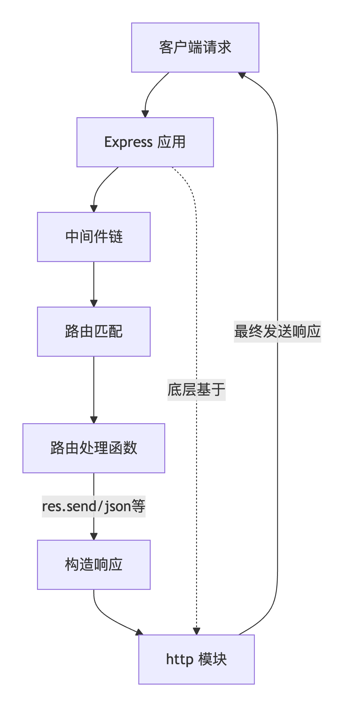

### 一、基本使用

*   先创建文件文件夹，然后`npm init`初始化 package.json，安装 express，手动新建入口文件 app.js，手动配置路由、中间件、视图引擎等

```bash
npm install express
```

```js
const express = require('express')
const app = express()
const port = 3000

app.get('/', (req, res) => {
  res.send('Hello World!')
})

app.listen(port, () => {
  console.log(`Example app listening on port ${port}`)
})
```

::: tip
Node.js中 http 模块与 express 关系

*   express 是一个基于 Node.js 的 Web 应用框架，它基于 http 模块，提供了更简单、更便捷的方式来创建 Web 应用，并提供了路由、中间件、模板引擎等功能

*   因此，express 可以看作是 http 模块的封装和扩展，它提供了更高级的 API 和功能，使得开发者可以更轻松地构建

*   实际运行流程图


:::

### 二、应用生成器

*   使用 express-generator 生成器，快速生成一个 express 应用。类似 vue 脚手架

```bash
npm install express-generator -g

express myapp
```

*   默认生成的项目结构

```bash
├── app.js
├── bin
│   └── www
├── package.json
├── public
│   ├── images
│   ├── javascripts
│   └── stylesheets
│       └── style.css
├── routes
│   ├── index.js
│   └── users.js
└── views
    ├── error.jade
    ├── index.jade
    └── layout.jade

8 directories, 9 files
```

*   views 文件夹现在模版生成的文件仍是 jade 文件，官网已经变更为 pug 文件了，不过现代的 Pug 库仍然支持解析 .jade 文件

### 三、基本路由

*   路由是由一个 URI（或路径）和一个特定的 HTTP 方法（GET、POST 等）组成的，它决定了应该使用哪个函数或代码段来处理请求

*   路由的定义通常包括以下几个部分：

    *   请求方法：指定了请求的 HTTP 方法，例如 GET、POST、PUT、DELETE 等

    *   路由路径：指定了请求的 URI 路径，例如 /users 或 /users/:id

    *   处理函数：指定了当请求匹配到该路由时应该执行的代码或函数

```js
app.METHOD(PATH, HANDLER)
```

*   路由可以配置多个处理函数，通过 `next` 方法链接

| 情况               | 行为                     |
| ---------------- | ---------------------- |
| 调用 next()        | 继续执行下一个处理函数            |
| 不调用 next()       | 也不返回响应	请求会挂起，客户端一直等待   |
| 调用 next('route') | 跳过当前路由的剩余处理函数，匹配下一个路由  |
| 调用 next(err)     | 跳过所有后续处理函数，直接进入错误处理中间件 |

*   比如身份验证 + 权限检查 + 日志记录

```js
// 验证用户登录
const checkAuth = (req, res, next) => {
  if (!req.session.userId) {
    return res.status(401).json({ error: '未登录' });
  }
  next();
};

// 检查管理员权限
const checkAdmin = (req, res, next) => {
  if (req.session.role !== 'admin') {
    return res.status(403).json({ error: '需要管理员权限' });
  }
  next();
};

// 记录操作日志
const logAction = (req, res, next) => {
  console.log(`[${new Date().toISOString()}] ${req.method} ${req.url}`);
  next();
};

// 组合使用
app.delete('/admin/user/:id', 
  checkAuth,      // 先验证登录
  checkAdmin,     // 再验证管理员
  logAction,      // 记录日志
  (req, res) => { // 最后执行真正的删除逻辑
    // 删除用户的代码
    res.json({ message: `用户 ${req.params.id} 已删除` });
  }
);
```

### 四、静态文件

*   当需要提供静态文件，例如图片、css文件时，要使用 Express 中的 `expres.static()` 内置中间件函数

```js
express.static(root, [options])

app.use(express.static(root, [options]))
```

*   `root` 参数指定提供静态资源的根目录，当指定文件找不到时，不会发送404响应，而是继续向下匹配，`options` 参数可以参考[指定文档](https://express.nodejs.cn/en/5x/api.html#express.static)

*   使用例子

```js
app.use(express.static('public'))

// 可以有多个静态资源目录
app.use(express.static('public'))
app.use(express.static('files'))

// 可以创建虚拟路径前缀
app.use('/static', express.static('public'))

// 一般在工程项目里，这样使用
const path = require('path')
app.use('/static', express.static(path.join(__dirname, 'public')))
```

*   实际访问如下：

```text
http://localhost:3000/images/kitten.jpg

http://localhost:3000/static/images/kitten.jpg
```
