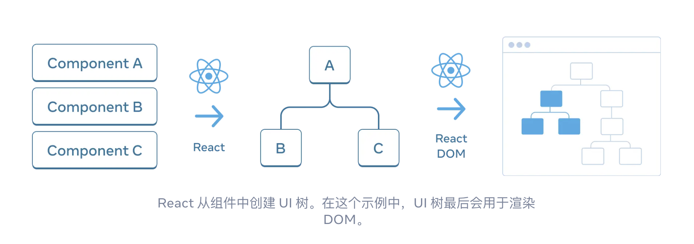
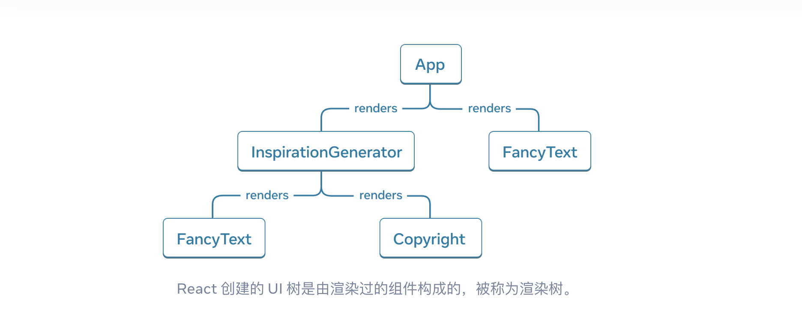
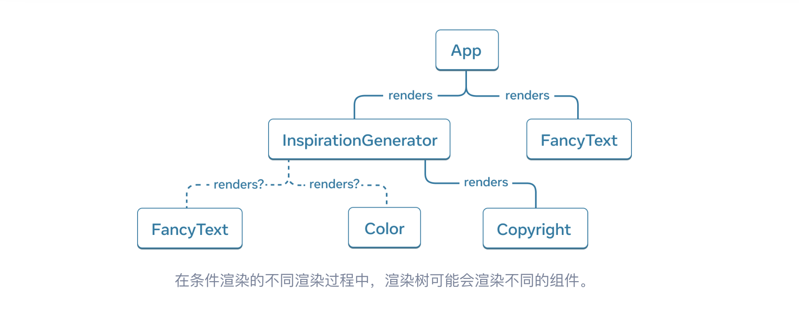

::: tip
react 笔记都是在有丰富的 vue 经验基础上进行记录，所以只记录一些差异化的内容
:::

### 一、你的第一个组件

**React 组件是一段可以使用标签进行扩展的 JavaScript 函数**

```jsx
function Action({content, style}) {
  return (
    <>
      <div style={style}>{content}</div>
    </>
  )
}

export default function Main() {
  return (
    <>
      <h1>标题</h1>
      <Action content="你好啊" style={{color: "red"}}></Action>
    </>
  )
}
```

*   这里定义了两个组件 Action 和 Main

*   编写基础组件有几个需要注意的地方

    *   单个 jsx 文件必须有一个 `export default` 或 `export` 导出的组件，其他组件都是子组件，当然子组件也可以单独在一个 jsx 文件导出，然后引入到父组件中

    *   使用 `function Main() { }` 定义名为 Main 的 JavaScript 函数。要求组件的名称**必须以大写字母开头**

        *   可以和 html 标签进行区别，html 标签是小写开头，而组件是大写开头

    *   return 语句返回的看起来像是 HTML，但实际上是 JavaScript。这种语法是 **JSX**

    *   如果 return 后返回的是多行，必须使用括号`()`包裹起来，不然会自动在 return 后添加分号，标签就没用了

    *   必须返回一个根元素，可以使用`<></>`包裹

::: tip
组件可以渲染其他组件，但是 请不要嵌套他们的定义

```jsx
export default function Gallery() {
  // 永远不要在组件中定义组件
  function Profile() {
    // ...
  }
  // ...
}
```

*   上面这段代码 非常慢，并且会导致 bug 产生
:::

::: info
其实 React 组件就是常规的 JavaScript 函数，除了名字总是以大写字母开头，必须返回 JSX 标签
:::

### 二、组件的导入与导出

*   其实和 ES 模块的导入与导出没有区别

::: code-group

```jsx [Profile.jsx]
// 这里演示下具名导出
export function Action({content, style}) {
  return (
    <>
      <div style={style}>{content}</div>
    </>
  )
}

export default function Main() {
  return (
    <>
      <h1>标题</h1>
      <Action content="你好啊" style={{color: "red"}}></Action>
    </>
  )
}
```

```jsx [app.jsx]
import Main, {Action} from "./Profile";

export default function App() {
  return (
    <>
      <Main></Main>
    </>
  )
}
```

::: tip
同一个文件可以具名导出也可以默认导出，但是只能有一个默认导出

*   企业级 React 项目标准

    *   一个文件一个组件，使用默认导出
    *   只有工具函数、hooks、公共类型使用具名导出
:::

### 三、使用 JSX 书写标签语言

*   JSX 不是 HTML，它是 JavaScript 的语法拓展，最终会被编译成 `React.createElement` 方法调用

*   JSX 的通用规则如下

    *   **只能返回一个根元素**，可以使用 div 包裹，如果不想产生额外的标签，使用`<></>`包裹

    *   **标签必须闭合**，比如 `、<div></div>`

    *   **使用驼峰式命名法给 *大部分* 属性命名**

        *   比如 `className`、`onClick`

        *   为什么说是大部分而不是全部，因为历史原因，`aria-*` 和 `data-*` 属性是以带 `-` 符号的 HTML 格式书写的

    *   **注释写法不同**

        *   JSX结构内： `{/* 这是一个注释 */}`

        *   JSX结构外： `// 这是一个注释`

    *   **JSX 只支持表达式，不支持语句**

        *   语句比如 `if`、`for` 等，不能在 JSX 中使用，使用`三元表达式、&& 逻辑判断、map 循环`代替

    *   **行内样式必须是对象**，不能是字符串

        *   比如 `style=\{\{color: "red"\}\}`，不能是 `style="color: red"`

    *   ...

::: tip
解释下为什么需要被一个根元素包裹

*   JSX 在底层其实被转换为了 JavaScript 对象，你不能在一个函数中返回多个对象，除非将其变成一个对象，也就是用一个根元素包裹
:::    

### 四、在 JSX 中通过大括号使用 JavaScript

*   其实就是插入 JavaScript 表达式

*   在 JSX 中，只有在以下两种场景中使用大括号

    *   用作 JSX 标签内的文本

    *   用作紧跟在 `=` 符号后的属性

::: tip
常见的四大坑

*   引号 + 大括号 = 纯字符串

```jsx
src="{url}"
```

*   JSX 里不能写语句，只能写表达式

```jsx
// 错误
{ if (isShow) return <p>123</p> }

// 正确
{ isShow ? <p>123</p> : null }
```

*   内联样式 style 必须再包一层对象

```jsx
style={{color: "red"}}
```

*   大括号不能嵌套大括号

```jsx
const obj = {name:'xxx'}
// 错误
<div>{{ obj.name }}</div>
// 正确
<div>{obj.name}</div>
```

:::

### 五、将 Props 传递给组件

*   和 vue 中的一样，props 是只读的

#### 5.1 基础使用

*   将 props 传递给子组件

```jsx
export default function Profile() {
  return (
    <Avatar
      person={{ name: 'Lin Lanying', imageId: '1bX5QH6' }}
      size={100}
    />
  );
}
```

*   在子组件中读取

```jsx
function Avatar({ person, size }) {
  console.log(person)
}
// 或
function Avatar(props) {
  console.log(props.person)
}
```

*   也可以给 prop 指定一个默认值

```jsx
function Avatar({ person, size = 100 }) {
  console.log(person)
}
```

*   使用解构时，可以重命名 props 避免命名冲突

```jsx
function Avatar({ person, size: avatarSize }) {
  console.log(person)
}
```

#### 5.2 children prop 的特殊性

*   `children` 是一个特殊 prop，它表示组件的子元素，用于组件嵌套

```jsx
import Avatar from './Avatar.js';

function Card({ children }) {
  return (
    <div className="card">
      {/* 这里会展示子组件的渲染结果 */}
      {children}
    </div>
  );
}

export default function Profile() {
  return (
    <Card>
      <Avatar
        person={{ name: 'Lin Lanying', imageId: '1bX5QH6' }}
        size={100}
        />
    </Card>
  );
}
```

### 六、条件渲染

*   虽然说 JSX 中不能使用 `if` 语句，但可以使用 JavaScript 来控制返回 JSX 表达式。也可以选择性地将一些 JSX 赋值给变量，然后用大括号将其嵌入到其他 JSX 中

::: code-group

```jsx [例子一]
function Item({ name, isPacked }) {
  if (isPacked) {
    return name || null;
  }
  return <li className="item">{name}</li>;
}
```

```jsx [例子二]
function Item({ name, isPacked }) {
  let itemContent = name;
  if (isPacked) {
    itemContent = (
      <del>
        {name + " ✅"}
      </del>
    );
  }
  return (
    <li className="item">
      {itemContent}
    </li>
  );
}
```

:::

*   上面的方式是比较冗长的，但也是最灵活的。当然也有下面的简洁方式（两种方式没有优劣之分，看个人喜好）

*   使用三目运算符`?:` 或者 `&&` 运算符

::: code-group

```jsx [三目运算符]
function Item({ name, isPacked }) {
  return (
    <li className="item">
        {isPacked ? name + ' ✅' : name}
    </li>
  );
}
```

```jsx [&& 运算符]
function Item({ name, isPacked }) {
  return (
    <li className="item">
        {name}{isPacked && ' ✅'}
    </li>
  );
}
```

:::

::: tip
切勿将数字放在 && 左侧

如果左侧是 0，整个表达式将变成左侧的值（0），而不是我们想的 0 是 false，不展示
:::

### 七、渲染列表

*   主要是介绍 `map()` 方法和 `filter()` 方法的使用

```jsx
export default function List() {
  const chemists = people.filter(person =>
    person.profession === '化学家'
  );
  const listItems = chemists.map(person =>
    <li key={person.id}>
      <p>
        <b>{person.name}闻名世界</b>
      </p>
    </li>
  );
  return <ul>{listItems}</ul>;
}
```

*   和 vue 中的一样，`key` 是必须的，用于唯一标识列表中的每个元素，避免性能问题

### 八、保持组件纯粹

*   一个组件必须是纯粹的，就意味着

    *   **只负责自己的任务**。它不会更改在该函数调用前就已存在的对象或变量

    *   **输入相同，则输出相同**。给定相同的输入，组件应该总是返回相同的 JSX

        *   就像 y = 2x 这样的函数，输入 2，输出的永远都是 4

::: tip
React 提供了 严格模式，用于检测组件是否是纯粹的

*   通过重复调用组件函数，来查看组件函数输出是否一致（一般是本地开发重复调用两次）

*   严格模式在生产环境下不会生效，因为会增加性能开销

*   用 `<React.StrictMode>` 包裹根组件，就可以开启严格模式，一些框架默认这样做
:::

### 九、将 UI 视为树

*   React 把 UI 抽象成树

    *   和浏览器用 DOM 树标识页面一样，React 用树表示组件嵌套关系

    *   树能清晰表达：谁渲染谁、父子关系、数据流向



*   渲染树 Render Tree

    *   描述的是组件之间的嵌套关系。在一个具体的渲染过程中，父组件如何包含子组件，就构成了这棵树。条件渲染不同，树就不同

    *   用途：主要用于**理解和调试渲染性能问题**

        *   顶级组件：离根节点近，影响其下所有组件的渲染性能

        *   叶子组件：位于树底部，没有子组件，但可能会频繁重新渲染



*   模块依赖树 Dependency Tree

    *   描述文件之间的 import 关系，节点是模块，不是组件

    *   作用：主要用于**分析和优化应用打包后的文件大小**


