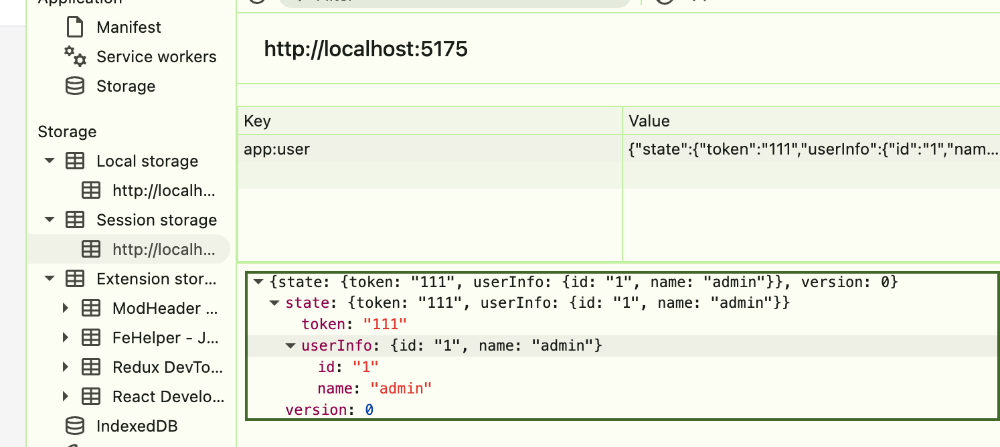

### 一、persist

*   **核心作用**：自动将 Store 状态序列化并持久化到存储介质（默认 localStorage），页面刷新 / 应用重启后自动恢复状态

*   支持 `partialize` 只持久化部分字段，避免不必要的数据存储

```tsx
import { create } from 'zustand'
import { persist, createJSONStorage } from 'zustand/middleware'

interface UserState {
  token: string | null
  userInfo: { id: string; name: string } | null
  setUser: (userInfo: any, token: string) => void
  logout: () => void
}

export const useUserStore = create<UserState>()(
  persist(
    (set) => ({
      token: '321321',
      userInfo: null,
      setUser: (userInfo, token) => set({ userInfo, token }),
      logout: () => set({ token: null, userInfo: null }),
    }),
    {
      name: 'app:user', // 必填：存储键名，建议加项目前缀避免冲突
      storage: createJSONStorage(() => sessionStorage)
    }
  )
)
```

*   `persist`：中间件本身，用于包装 store 创建函数。第二个参数是配置对象

*   `createJSONStorage`：存储引擎包装器，内置 JSON 序列化 / 反序列化能力，默认封装 localStorage

::: tip

*   自动工作流程

    *   初始化水合：Store 创建时，先使用代码中的初始状态 → 自动从本地存储读取持久化数据 → 合并到 Store → 完成水合

    *   更新自动保存：每次调用 set() 修改状态后，自动序列化新状态并写入存储

    *   全量同步：默认持久化 Store 中的所有字段，可通过配置过滤部分字段
        :::



#### 1.1 核心配置项

*   persist 的第二个参数是配置对象

*   `name`：必填，存储键名，建议加项目前缀避免冲突

*   `storage`：可选，自定义存储引擎，默认 localStorage

    *   默认值：`createJSONStorage(() => localStorage)`。上面指定的是 sessionStorage

*   `partialize`：过滤需要持久化的字段，只保留核心数据

```ts
{
  name: 'app:user',
  partialize: (state) => ({
    token: state.token,
    userInfo: state.userInfo,
  })
}
```

*   `version`：可选，版本号，持久化数据的结构版本号，配合 migrate 实现版本升级时的数据平滑迁移

*   `migrate`：当本地存储的数据版本低于当前 version 时，自动执行迁移函数，升级旧数据结构

```ts
{
  version: 1, // 当前最新版本
  migrate: (persistedState, version) => {
    // v0 旧结构：{ username: "张三", token: "xxx" }
    // v1 新结构：{ userInfo: { name: "张三" }, token: "xxx" }
    if (version === 0) {
      return {
        ...persistedState,
        userInfo: { name: persistedState.username },
      }
    }
    return persistedState
  }
}
```

*   还有 `merge`、`skipHydration`、`onRehydrateStorage`，用于水合相关

#### 1.2 实例 API（store.persist）

*   被 persist 包装后的 Store，会挂载一个 persist 对象，提供手动控制持久化的方法

*   `clearStorage()`：清空当前 Store 在存储介质中的所有持久化数据，不会影响内存中的当前状态

```ts
logout: () => {
  set({ token: null, userInfo: null })
  // 同时清空本地存储，避免残留
  useUserStore.persist.clearStorage()
}
```

*   `getOptions() / setOptions()`：获取当前 persist 配置项，或设置新的配置项。

*   `rehydrate()`：手动触发水合，从存储中重新读取数据并更新 Store

*   `hasHydrated()`：判断当前 Store 是否已完成水合，即是否从存储中读取了数据

#### 1.3 进阶场景

*   加密存储敏感数据

```ts
import { encrypt, decrypt } from '@/utils/crypto' // 你的加密工具

{
  storage: createJSONStorage(() => localStorage, {
    // 自定义序列化：存储前加密
    serialize: (state) => encrypt(JSON.stringify(state)),
    // 自定义反序列化：读取后解密
    deserialize: (str) => JSON.parse(decrypt(str)),
  })
}
```

### 二、devtools

*   **核心作用**：集成 Redux DevTools 浏览器扩展，支持状态回溯、时间旅行调试、Action 命名追踪

    *   也就是使用前需要在浏览器中安装 Redux DevTools 扩展，才能生效。

*   建议给每个 Store 设置独立 `name`，调试时可快速区分

```ts
import { create } from 'zustand'
import { devtools } from 'zustand/middleware'

interface CounterState {
  count: number
  increment: () => void
  decrement: () => void
  reset: () => void
}

export const useCounterStore = create<CounterState>()(
  devtools(
    (set) => ({
      count: 0,
      increment: () => set((state) => ({ count: state.count + 1 })),
      decrement: () => set((state) => ({ count: state.count - 1 })),
      reset: () => set({ count: 0 }),
    }),
    {
      name: 'CounterStore', // DevTools 面板中显示的 Store 名称
      enabled: import.meta.env.DEV, // 仅开发环境启用（Vite 写法）
    }
  )
)
```

### 三、immer

*   **核心作用**：允许用「直接修改」的可变语法编写状态更新逻辑，底层自动转为不可变更新，省去层层展开对象的繁琐代码

*   需要额外安装依赖：`npm install immer`

```ts
import { create } from "zustand";
import { immer } from "zustand/middleware/immer";

interface TodoState {
  todos: { id: number; text: string; done: boolean }[];
  addTodo: (text: string) => void;
  toggleTodo: (id: number) => void;
  clearDone: () => void;
}

export const useTodoStore = create<TodoState>()(
  immer((set) => ({
    todos: [],

    // 新增：直接 push
    addTodo: (text) =>
      set((state) => {
        state.todos.push({
          id: Date.now(),
          text,
          done: false,
        });
      }),

    // 修改：找到目标后直接改属性
    toggleTodo: (id) =>
      set((state) => {
        const todo = state.todos.find((t) => t.id === id);
        if (todo) todo.done = !todo.done;
      }),

    // 删除：直接重新赋值数组
    clearDone: () =>
      set((state) => {
        state.todos = state.todos.filter((t) => !t.done);
      }),
  }))
);
```

*   不使用 immer 时，需要手动展开对象，编写更复杂的更新逻辑

```ts
// ❌ 原生写法：修改深层属性，层层展开，可读性差、易漏字段
set((state) => ({
  user: {
    ...state.user,
    profile: {
      ...state.user.profile,
      address: {
        ...state.user.profile.address,
        city: "上海",
      },
    },
  },
}));
```

*   使用后

```ts
// ✅ 使用 immer 写法：直接修改可变对象，底层自动转为不可变更新
set((state) => {
  state.user.profile.address.city = "上海";
});
```

### 四、redux

*   **核心作用**：让 Zustand 支持 Redux 风格的 reducer + dispatch 写法，兼容 Redux 的编程模式

*   典型使用场景：从 Redux 迁移到 Zustand 的过渡项目、团队极度习惯 reducer 模式

*   实际使用频率低，在新项目中基本不用

### 五、combine

*   **核心作用**：将「初始状态」和「业务逻辑」拆分为两部分传入，自动合并成完整的 Store 创建器

*   属于语法糖

```ts
// combine 写法
combine(initialState, (set) => ({ actions }))

// 等价于原生写法
(set) => ({
  ...initialState,
  ...actions,
})
```

*   看一个实际例子对比

::: code-group

```ts [原生写法]
// 状态和方法混在一起
const useCounterStore = create<CounterState>((set) => ({
  // 数据字段
  count: 0,
  step: 1,
  // 业务方法
  increment: () => set((s) => ({ count: s.count + s.step })),
  reset: () => set({ count: 0 }),
}))
```

```ts [combine 写法]
// 数据与逻辑物理分层
const useCounterStore = create(
  combine(
    // 第一层：纯初始数据
    { count: 0, step: 1 },
    // 第二层：只写业务方法
    (set) => ({
      increment: () => set((s) => ({ count: s.count + s.step })),
      reset: () => set({ count: 0 }),
    })
  )
)
```

:::

### 六、subscribeWithSelector

*   V5 中已原生内置，不需要单独使用，`store.subscribe()` 直接支持
