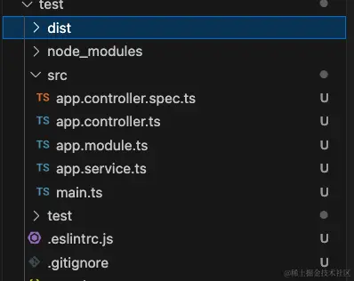
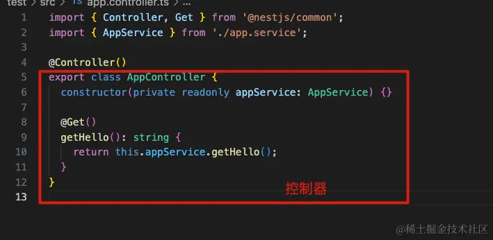
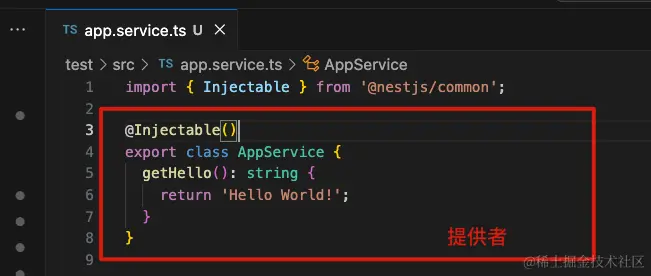
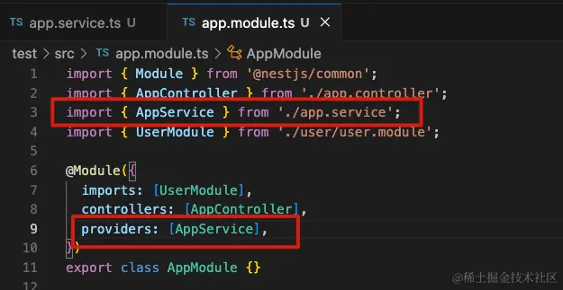
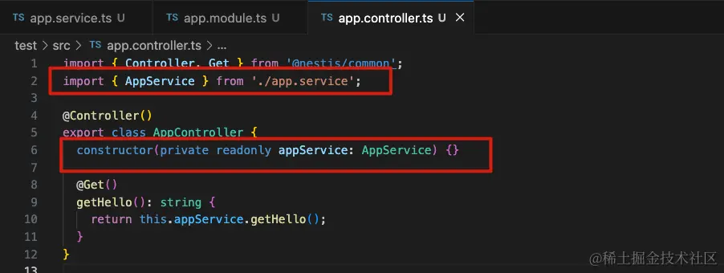
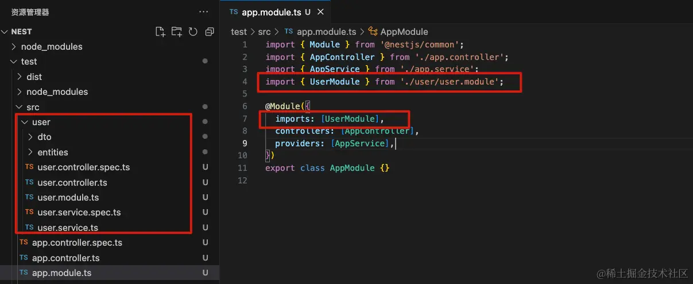
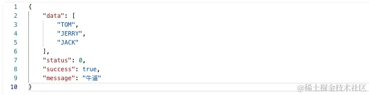
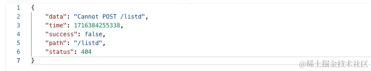
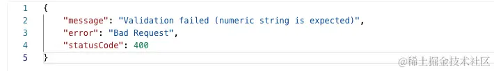
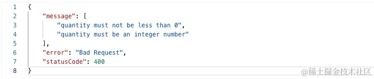

### 一、介绍

- Nestjs 是一个用于构建高效可扩展的一个基于 Nodejs 服务端应用程序开发框架。完全支持 ts ，结合了 AOP 面向切面的编程方式
- [英文官网](https://nestjs.com/) [中文网站 ](https://docs.nestjs.cn/)
- 内置框架 Express（默认），维二内置框架 Fastify

### 二、设计模式：IOC 控制反转 DI 依赖注入

#### 2.1 控制反转（IOC）

- 控制反转是一种设计原则，目的是将对象的创建和依赖关系的管理从代码中分离出来。传统的编程方式是对象主动去获取它所需要的依赖，而控制反转则是由外部容器来管理对象的创建和依赖的注入，这样可以使代码更加模块化、可测试和可维护
 
#### 2.2 依赖注入（DI）

- 依赖注入是实现控制反转的一种具体方式。通过依赖注入，组件所需的依赖对象由外部提供，而不是组件自己创建。依赖注入可以通过构造函数注入、属性注入或者方法注入来实现


```js
// 未使用控制反转和依赖注入的代码
class A {
    name: string
    constructor(name: string) {
        this.name = name
    }
}
class B {
    age:number
    entity:A
    constructor (age:number) {
        this.age = age;
        this.entity = new A('小满')
    }
}
 
const c = new B(18)
c.entity.name
```

```js
// 使用了 IOC 容器
class A {
    name: string
    constructor(name: string) {
        this.name = name
    }
}
 
 
class C {
    name: string
    constructor(name: string) {
        this.name = name
    }
}
//中间件用来收集依赖，用于解耦
class Container {
    modeuls: any
    constructor() {
        this.modeuls = {}
    }
    provide(key: string, modeuls: any) {
        this.modeuls[key] = modeuls
    }
    get(key) {
        return this.modeuls[key]
    }
}
 
const mo = new Container()
mo.provide('a', new A('小满1'))
mo.provide('c', new C('小满2'))
 
class B {
    a: any
    c: any
    constructor(container: Container) {
        this.a = container.get('a')
        this.c = container.get('c')
    }
}
 
new B(mo)
```

### 三、前置知识：装饰器

> 装饰器是一种特殊的类型声明（一个函数），他可以附加在类，方法，属性，参数上面


- 类装饰器：把构造函数传入到装饰器的第一个参数 target


```js
function decotators (target:any) {
    target.prototype.name = '小满'
}
 
@decotators
class Xiaoman {
    constructor () {
    }
}
 
const xiaoman:any = new Xiaoman()
console.log(xiaoman.name) // 小满
```

- 属性装饰器：返回两个参数： 原型对象、属性的名称


```js
const currency: PropertyDecorator = (target: any, key: string | symbol) => {
    console.log(target, key) // {} name
}
 
class Xiaoman {
    @currency
    public name: string
    constructor() {
        this.name = ''
    }
    getName() {
        return this.name
    }
}
```

- 参数装饰器：返回三个参数：原型对象、方法的名称、参数的位置（从0开始）


```js
const currency = (target: any, key: string | symbol,index:number) => {
    console.log(target, key,index) // {} getName 1
}
 
class Xiaoman {
    public name: string
    constructor() {
        this.name = ''
    }
    getName(name:string, @currency age:number) {
        return this.name
    }
}
```

- 方法装饰器：返回三个参数：原型对象、方法的名称、属性描述符（可写对应writable，可枚举对应enumerable，可配置对应configurable）


```js
const currency: MethodDecorator = (target: any, key: string | symbol, descriptor:any) => {
    // {} getName {
    //   value: [Function: getName],  value 即是对应的方法 getName
    //   writable: true,
    //   enumerable: false,
    //   configurable: true
    // }
    console.log(target, key, descriptor)
}
 
class Xiaoman {
    public name: string
    constructor() {
        this.name = ''
    }
    @currency
    getName(name:string,age:number) {
        return this.name
    }
}
```

### 四、装饰器：实现一个 get 请求

- 简单了解下，后续 nestjs 写法和这类似

```js
import axios from 'axios'
 
const Get = (url: string): MethodDecorator => {
    return (target, key, descriptor: PropertyDescriptor) => {
        const fnc = descriptor.value;
        axios.get(url).then(res => {
            fnc(res, {
                status: 200,
            })
        }).catch(e => {
            fnc(e, {
                status: 500,
            })
        })
    }
}
 
//定义控制器
class Controller {
    constructor() {
 
    }
    @Get('https://api.apiopen.top/api/getHaoKanVideo?page=0&size=10')
    getList (res: any, status: any) {
        console.log(res.data.result.list, status)
    }
  
}
```

### 五、Nestjs 脚手架

- 通过 cli 创建 Nestjs 项目


```js
npm i -g @nestjs/cli

nest new [项目名称]
```
- 使用`npm run start:dev`启动，具备热更新，简单访问地址`http://localhost:3000/`

#### 5.1 目录介绍




- dist 文件夹是运行时就会打包生成的
- `.spec.ts` 是测试用的文件
- `.controller.ts` 是控制器，类似 vue 的路由
    - `private readonly appService: AppService` 这一行代码就是依赖注入不需要实例化，appService 内部会自己实例化

- `.module.ts` 是模块文件，Nestjs 使用模块打包特定功能，每个模块是高度封装的，只暴露必要的接口，它可以包含一些组件，如控制器、服务等
- `.service.ts` 是实现业务逻辑的文件，当然也可以放在控制器文件里实现，但拿出来是为了实现复用
- `main.ts` 入口文件
    - 通过 `NestFactory.create(AppModule)` 创建一个app
    - `app.listen(3000)` 监听一个端口


### 六、RESTful 风格设计

> RESTful 是一种软件架构风格、设计风格，也是一种开发规范，其核心是面向资源（Resource）进行设计

HTTP 方法（GET、POST、PUT、DELETE，etc.）作为通用接口方法，被用来对资源进行操作，可以表示对资源的增删改查。

例如一个用户资源的 CRUD 操作的 RESTful 设计可能是：

- 创建用户：POST /users
- 获取用户：GET /users/{id}
- 更新用户：PUT /users/{id}
- 删除用户：DELETE /users/{id}

即用一个接口完成对资源的增删改查，只是通过不同的请求方式来区分。上面生成的 user.controller.ts 文件中就是这样实现的

RESTful 也可以实现版本控制，在接口路由前加上 v1 标识，例如`http://localhost:3000/v1/user`

*当然，这仅是一种设计风格，开发中可以不按照这个风格来写，大部分服务端接口还是 get post 请求，定义不同的接口来实现 CRUD*

### 七、Nestjs 控制器

> 在编程中，控制器是一种设计模式，通常在实现模型-视图-控制器（MVC）架构时使用

> 在NestJS框架中，控制器主要负责接收特定路由的请求，根据请求进行处理，然后返回响应。主要表现是`@Controller()`修饰的类




常见的控制器（我自己理解就是一类功能的组合）：

- CRUD控制器：处理基本的Create、Read、Update和Delete操作请求
- Auth控制器：负责处理与用户身份验证相关的请求
- User控制器：管理与用户账号相关的请求，比如获取用户信息、更新用户信息等
- File控制器：处理与文件上传、下载相关的请求
- Admin控制器：管理与管理员用户相关的请求，例如管理员登陆、管理用户账号等

#### 7.1 控制器中常见的参数装饰器


| 装饰器 | 能力 |
| --- | --- |
| @Request() | req |
|@Response()| res |
| @Next() | next |
| @Session() | req.session |
|@Param(key?: string)| req.params / req.params[key] |
| @Body(key?: string) | req.body / req.body[key] |
| @Query(key?: string) | req.query / req.query[key] |
| @Headers(name?: string) | req.headers / req.headers[name] |
| @HttpCode | 控制接口返回的状态码 |


```js
import { Controller, Get, Post, Param, Request, Body } from '@nestjs/common';
import { UserService } from './user.service';

@Controller('user')
export class UserController {
  constructor(private readonly userService: UserService) {}

  @Get()
  findAll(@Request() req) {
    console.log(req); // 输出的是req对象，里面有query参数
    return { code: 200, messge: 'get请求' };
  }

  @Get(':id')
  findOne(@Param('id') id) {
    console.log(id); // 读取的动态id值
    return { code: 200 };
  }

  @Post()
  create(@Body() body) {
    console.log(body);  // post 请求的body信息，类似 { id: 11111, name: '小阿' }
    return { code: 200, messge: 'post请求' };
  }
}
```

### 八、Session 实例

[跳转博客](https://xiaoman.blog.csdn.net/article/details/126327047)

### 九、Nestjs 提供者

> Provider 只是一个用 `@Injectable()` 装饰器注释的类




- 基本用法：在模块 .module.ts 文件中引入 service，在 providers 注入




- 在 .controller.ts 文件就可以使用注入好的 service




#### 9.1 service 第二种用法（自定义名称）

- 上面那种写法是预发糖
- 第二种写法


```js
import { Module } from '@nestjs/common';
import { UserService } from './user.service';
import { UserController } from './user.controller';
 
@Module({
  controllers: [UserController],
  providers: [{
    provide: "Xiaoman", // 自定义名称
    useClass: UserService
  }]
})
export class UserModule { }
```
- 自定义名称后，需要用对应的 `Inject` 取用，不然找不到


```js
import { Controller, Inject } from '@nestjs/common';
import { UserService } from './user.service';

@Controller('user')
export class UserController {
  constructor(@Inject('Xiaoman') private readonly userService: UserService) {}
}
```

- 自定义注入值


```js
import { Module } from '@nestjs/common';
import { UserService } from './user.service';
import { UserController } from './user.controller';
 
@Module({
  controllers: [UserController],
  providers: [{
    provide: "Xiaoman",
    useClass: UserService
  }, {
    provide: "JD",
    useValue: ['TB', 'PDD', 'JD']
  }]
})
export class UserModule { }
```


```js
import { Controller, Inject } from '@nestjs/common';
import { UserService } from './user.service';

@Controller('user')
export class UserController {
  constructor(
      @Inject('Xiaoman') private readonly userService: UserService,
      @Inject('JD') private shopList: string[]
  ) {}
}
```

#### 9.2 工厂模式

- 如果服务之间有相互的依赖或者逻辑处理，可以使用 `useFactory`


```js
import { Module } from '@nestjs/common';
import { UserService } from './user.service';
import { UserService2 } from './user.service2';
import { UserService3 } from './user.service3';
import { UserController } from './user.controller';
 
@Module({
  controllers: [UserController],
  providers: [{
    provide: "Xiaoman",
    useClass: UserService
  }, {
    provide: "JD",
    useValue: ['TB', 'PDD', 'JD']
  },
    UserService2,
  {
    provide: "Test",
    inject: [UserService2],
    useFactory(UserService2: UserService2) {
      return new UserService3(UserService2)
    }
  }
  ]
})
export class UserModule { }
```
```js
import { Controller, Inject } from '@nestjs/common';
import { UserService } from './user.service';

@Controller('user')
export class UserController {
  constructor(
      @Inject('Xiaoman') private readonly userService: UserService,
      @Inject('JD') private shopList: string[],
      @Inject('Test') private readonly Test: any,
  ) {}
}
```

#### 9.3 异步模式


```js
import { Module } from '@nestjs/common';
import { UserService } from './user.service';
import { UserService2 } from './user.service2';
import { UserService3 } from './user.service3';
import { UserController } from './user.controller';
 
@Module({
  controllers: [UserController],
  providers: [{
    provide: "Xiaoman",
    useClass: UserService
  }, {
    provide: "JD",
    useValue: ['TB', 'PDD', 'JD']
  },
    UserService2,
  {
    provide: "Test",
    inject: [UserService2],
    useFactory(UserService2: UserService2) {
      return new UserService3(UserService2)
    }
  },
  {
    provide: "sync",
    async useFactory() {
      return await  new Promise((r) => {
        setTimeout(() => {
          r('sync')
        }, 3000)
      })
    }
  }
  ]
})
export class UserModule { }
```

### 十、Nestjs 模块

> 每个 Nest 应用程序至少有一个模块，即根模块。根模块是 Nest 开始安排应用程序树的地方

#### 10.1 基本用法

- 当使用 `nest g res user`创建一个新的CURD模块时，nestjs 会自动帮我们引入模块




#### 10.2 共享模块

- 例如 user 的 Service 想暴露给其他模块使用就可以使用 exports 导出该服务


```js
import { Module } from '@nestjs/common';
import { UserService } from './user.service';
import { UserController } from './user.controller';

@Module({
  controllers: [UserController],
  providers: [UserService],
  exports: [UserService],
})
export class UserModule {}
```
- 由于 App.moudles 已经引入过该模块，就可以直接使用了


```js
import { Controller, Get } from '@nestjs/common';
import { AppService } from './app.service';
import { UserService } from './user/user.service';

@Controller()
export class AppController {
  constructor(
    private readonly appService: AppService,
    private readonly userService: UserService,
  ) {}

  @Get()
  getHello(): string {
        return this.userService.findAll(); // 自动生成的模块里有这个方法
  }
}
```

#### 10.3 全局模块

- 给 user 模块添加 `@Global()` 他便注册为全局模块


```js
import { Global, Module } from '@nestjs/common';
import { UserService } from './user.service';
import { UserController } from './user.controller';

@Global()
@Module({
  controllers: [UserController],
  providers: [UserService],
})
export class UserModule {}
```

- 在其他模块使用时无须在module文件 import 导入


```js
import { Controller, Get } from '@nestjs/common';
import { AppService } from './app.service';
import { UserService } from './user/user.service';

@Controller()
export class AppController {
  constructor(
    private readonly appService: AppService,
    private readonly userService: UserService,
  ) {}

  @Get()
  getHello(): string {
    return this.userService.findAll();
  }
}
```

#### 10.4 动态模块

> 动态模块主要就是为了给模块传递参数 可以给该模块添加一个静态方法用来接受参数

- 创建一个 config.module.ts


```js
import { Module, DynamicModule, Global } from '@nestjs/common'
 
interface Options {
    path: string
}
 
@Global()
@Module({
})
export class ConfigModule {
    static forRoot(options: Options): DynamicModule {
        return {
            module: ConfigModule,
            providers: [
                {
                    provide: "Config",
                    useValue: { baseApi: "/api" + options.path }
                }
            ],
            exports: [
                {
                    provide: "Config",
                    useValue: { baseApi: "/api" + options.path }
                }
            ]
        }
    }
} 
```
- 在 app.module.ts 文件引入


```js
import { Module } from '@nestjs/common';
import { AppController } from './app.controller';
import { AppService } from './app.service';
import { UserModule } from './user/user.module';
import { ListModule } from './list/list.module';
import { ConfigModule } from './config/config.module';

@Module({
  imports: [UserModule, ListModule, ConfigModule.forRoot({
    path: '/xiaoman'
  })],
  controllers: [AppController],
  providers: [AppService],
})
export class AppModule {}
```

- 因为是全局的动态模块，可以在任意模块使用


```js
import { Controller, Get, Inject } from '@nestjs/common';
import { UserService } from './user.service';

@Controller('user')
export class UserController {
  constructor(
    private readonly userService: UserService,
    @Inject('Config') private readonly base: any,
  ) {}

  @Get()
  findAll() {
    return this.base; // 接口请求返回 {"baseApi": "/api/Xiaoman"}
  }
}
```

### 十一、Nestjs 中间件

> 中间件是在路由处理程序之前调用的函数，中间件函数可以访问请求和响应对象

中间件函数可以执行以下任务：

-   执行任何代码。
-   对请求和响应对象进行更改。
-   结束请求-响应周期。
-   调用堆栈中的下一个中间件函数。
-   如果当前的中间件函数没有结束请求-响应周期, 它必须调用 `next()` 将控制传递给下一个中间件函数。否则, 请求将被挂起。

#### 11.1 创建一个依赖注入中间件


```js
import {Injectable,NestMiddleware } from '@nestjs/common'
import {Request,Response,NextFunction} from 'express'
 
@Injectable()
export class Logger implements NestMiddleware{
  use (req:Request,res:Response,next:NextFunction) {
    console.log(req)
    next()
  }
}
```
- 使用方法在模块里面，实现`configure`返回一个消费者`consumer`，通过`apply`注册中间件，通过`forRoutes`指定Controller路由


```js
import { Module,NestModule,MiddlewareConsumer } from '@nestjs/common';
import { UserService } from './user.service';
import { UserController } from './user.controller';
import { Logger } from 'src/middleware';
@Module({
  controllers: [UserController],
  providers: [UserService],
  exports:[UserService]
})
export class UserModule implements NestModule{
  configure (consumer:MiddlewareConsumer) {
    consumer.apply(Logger).forRoutes('user')
  }
}
```

- 也可以指定拦截的方法，比如拦截GET POST 等 forRoutes 使用对象配置


```js
consumer.apply(Logger).forRoutes({path:'user',method:RequestMethod.GET})
```

- 甚至可以直接把 UserController 塞进去


```js
consumer.apply(Logger).forRoutes(UserController)
```

#### 11.2 全局中间件

- 全局中间件只能使用函数模式，案例可以做白名单拦截之类的


```js
import { NestFactory } from '@nestjs/core';
import { AppModule } from './app.module';

const whiteList = ['/list']
 
function middleWareAll  (req,res,next) {
   
     console.log(req.originalUrl,'我收全局的')
 
     if(whiteList.includes(req.originalUrl)){
         next()
     }else{
         res.send('小黑子露出鸡脚了吧')
     }
}
 
async function bootstrap() {
  const app = await NestFactory.create(AppModule);
  app.use(middleWareAll)
  await app.listen(3000);
}
bootstrap();
```

#### 11.3 接入第三方中间件

- 例如 cors 处理跨域


```js
npm install cors
npm install @types/cors -D
```


```js
import { NestFactory } from '@nestjs/core';
import { AppModule } from './app.module';
import * as cors from 'cors'
 
const whiteList = ['/list']
 
function middleWareAll  (req,res,next) {
   
     console.log(req.originalUrl,'我收全局的')
 
     if(whiteList.includes(req.originalUrl)){
         next()
     }else{
         res.send({code:200})
     }     
}
 
async function bootstrap() {
  const app = await NestFactory.create(AppModule);
  app.use(cors())
  app.use(middleWareAll)
  await app.listen(3000);
}
bootstrap();
```


### 十二、RxJs 与 Nestjs

> RxJS（Reactive Extensions for JavaScript）是一个用于异步编程的库，它基于可观察对象（Observables）来处理异步事件和数据流。RxJS 提供了强大的操作符来处理和转换这些数据流，使得代码更加简洁和可维护。RxJS 的核心理念是响应式编程，它强调数据流和变化传播

#### 12.1 基本概念

- Observable: 可观察对象，用于表示一个异步数据流
- Observer: 观察者，对可观察对象发出的数据进行处理
- Subscription: 订阅，通过订阅可以开始接收可观察对象发出的数据
- Operators: 操作符，用于对数据流进行转换、过滤等操作
- Subject: 特殊类型的可观察对象，可以同时作为数据生产者和消费者

以下是一个简单的 RxJS 示例，用于演示如何创建一个 Observable 并订阅它


```js
import { Observable } from 'rxjs';

const observable = new Observable(subscriber => {
  subscriber.next(1);
  subscriber.next(2);
  subscriber.next(3);
  subscriber.complete();
});

observable.subscribe({
  next(x) { console.log('Received value: ' + x); },
  error(err) { console.error('Error: ' + err); },
  complete() { console.log('Complete'); }
});

// Received value: 1
// Received value: 2
// Received value: 3
// Complete
```

#### 12.2 在 NestJS 中使用 RxJS

- NestJS 深度集成了 RxJS，使得处理异步操作更加方便


```js
import { Injectable } from '@nestjs/common';
import { Observable, of } from 'rxjs';
import { map } from 'rxjs/operators';

@Injectable()
export class ListService {
  findAll(): Observable<string[]> {
    const cats = ['Tom', 'Jerry', 'Luxi'];
    return of(cats);
  }

  findOne(): Observable<string[]> {
    const cats = ['Tom', 'Jerry', 'Jack'];
    return of(cats).pipe(
      map((catsArray) => catsArray.map((cat) => cat.toUpperCase())),
    );
  }
}
```

```js
import { Controller, Get, Post, Body, Patch, Param, Delete } from '@nestjs/common';
import { ListService } from './list.service';
import { Observable } from 'rxjs';

@Controller('list')
export class ListController {
  constructor(private readonly listService: ListService) {}

  @Get()
  findAll(): Observable<string[]> {
    return this.listService.findAll();
  }

  @Post()
  findOne(): Observable<string[]> {
    return this.listService.findOne();
  }
}
```
- RxJS 是一个功能强大的库，有很多方法，用于处理异步事件和数据流。


### 十三、Nestjs 响应拦截器

- 拦截器具有一系列有用的功能，这些功能受面向切面编程（AOP）技术的启发。它们可以：
    - 在函数执行之前/之后绑定额外的逻辑
    - 转换从函数返回的结果
    - 转换从函数抛出的异常
    - 扩展基本函数行为
    - 根据所选条件完全重写函数 (例如, 缓存目的)

- 创建拦截器的基本步骤：需要创建一个类，它实现了 nest.js 提供的 `NestInterceptor` 接口


```js
// 创建一个ts文件，然后在main.ts文件引入
import { Injectable, NestInterceptor, CallHandler } from '@nestjs/common';
import { map } from 'rxjs/operators';
import { Observable } from 'rxjs';

interface data<T> {
  data: T;
}
@Injectable()
export class Response<T = any> implements NestInterceptor {
  intercept(context, next: CallHandler): Observable<data<T>> {
    // 使用了`rxjs`的`pipe`方法和`map`操作符来转换返回的数据
    return next.handle().pipe(
      map((data) => {
        return {
          data,
          status: 0,
          success: true,
          message: '牛逼',
        };
      }),
    );
  }
}
```

```js
import { NestFactory } from '@nestjs/core';
import { AppModule } from './app.module';
import { Response } from './common/response';

async function bootstrap() {
  const app = await NestFactory.create(AppModule);
  app.useGlobalInterceptors(new Response());
  await app.listen(3000);
}
bootstrap();
```




### 十四、Nestjs 异常过滤器

> 异常过滤器是用于捕获和处理抛出的异常，并生成适当的 HTTP 响应的类。通过使用异常过滤器，你可以将异常处理逻辑从控制器或服务中分离出来


```js
import { ExceptionFilter, Catch, ArgumentsHost,HttpException } from '@nestjs/common'
import {Request,Response} from 'express'
 
@Catch(HttpException)
export class HttpFilter implements ExceptionFilter {
    catch(exception:HttpException, host: ArgumentsHost) {
        const ctx = host.switchToHttp()
        const request = ctx.getRequest<Request>()
        const response = ctx.getResponse<Response>()
 
        const status = exception.getStatus()
 
        response.status(status).json({
           data:exception.message,
           time:new Date().getTime(),
           success:false,
           path:request.url,
           status
        })
    }
}
```

```js
import { NestFactory } from '@nestjs/core';
import { AppModule } from './app.module';
import { Response } from './common/response';
import { HttpFilter } from './common/filter';

async function bootstrap() {
  const app = await NestFactory.create(AppModule);
  app.useGlobalInterceptors(new Response());
  app.useGlobalFilters(new HttpFilter());
  await app.listen(3000);
}
bootstrap();
```
- 随便访问一个错误的路由





### 十五、Nestjs 管道

> 在 NestJS 中，管道（Pipes）是一种用于处理传入请求数据的机制。管道主要有两个用途：**转换**和**验证**。转换指的是将输入数据转换为所需的类型，验证指的是检查输入数据是否符合预期的格式或规则

#### 15.1 内置管道

- NestJS 提供了几个内置的管道：

-   `ValidationPipe`：用于验证输入数据
-   `ParseIntPipe`：将输入数据解析为整数
-   `ParseBoolPipe`：将输入数据解析为布尔值
-   `ParseArrayPipe`：将输入数据解析为数组
-   `ParseUUIDPipe`：将输入数据解析为 UUID
-   ...


#### 15.2 使用内置管道进行转换

- 有一个路由需要接收一个 ID 参数，并且希望将其转换为整数


```js
import { Controller, Get, Param, ParseIntPipe } from '@nestjs/common';

@Controller('p')
export class ItemsController {
  @Get(':id')
  findOne(@Param('id', ParseIntPipe) id: number) {
    return `Item #${id}`;
  }
}
```
- `ParseIntPipe` 将把传入的 `id` 参数从字符串转换为整数。如果传入的 `id` 不能转换为整数，管道会抛出一个 `BadRequestException`
- 比如请求 `http://localhost:3000/p/123a`




#### 15.3 使用内置管道进行验证

- 使用 `ValidationPipe` 验证请求体的数据
- 首先需要定义一个 DTO（数据传输对象），并使用 class-validator 提供的装饰器来定义验证规则


```js
//安装验证器
npm i --save class-validator
```
- 创建一个dto文件

> 在Nestjs项目中，DTO（Data Transfer Object）文件是用于数据传输的对象。DTO是一个对象，它定义了如何通过网络将数据传输到方法。简单来说，它是用来定义接口数据类型或传输数据的载体
```js
import { IsInt, IsString, Min, MaxLength } from 'class-validator';

export class CreatePDto {
  @IsString()
  @MaxLength(50)
  name: string;

  @IsInt()
  @Min(0)
  quantity: number;
}
```
- 然后在控制器中使用 `ValidationPipe`：


```js
import { Body, Controller, Post, UsePipes, ValidationPipe } from '@nestjs/common';
import { CreatePDto } from './dto/create-p.dto';

@Controller('p')
export class PController {
  @Post()
  @UsePipes(new ValidationPipe())
  create(@Body() createPDto: CreatePDto) {
    return `Item created: ${createPDto.name} (${createPDto.quantity})`;
  }
}
```
- `ValidationPipe` 将验证传入的请求体是否符合 `CreateItemDto` 中定义的规则。如果验证失败，管道会抛出一个 `BadRequestException`




#### 15.4 全局使用管道

- 在整个应用程序范围内使用管道，以便所有请求都经过该管道处理

```js
import { NestFactory } from '@nestjs/core';
import { AppModule } from './app.module';
import { ValidationPipe } from '@nestjs/common';

async function bootstrap() {
  const app = await NestFactory.create(AppModule);
  app.useGlobalPipes(new ValidationPipe());
  await app.listen(3000);
}
bootstrap();
```

#### 15.5 自定义管道

> 自定义管道需要实现 `PipeTransform` 接口，并实现其 `transform` 方法

- 在对应模块下执行 `nest g pi p` 生成 `.pipe.ts` 文件


```js
import { ArgumentMetadata, Injectable, PipeTransform } from '@nestjs/common';

@Injectable()
export class PPipe implements PipeTransform {
  transform(value: any, metadata: ArgumentMetadata) {
    return value;
  }
}
```
- 将输入的字符串转换为大写


```js
import { ArgumentMetadata, Injectable, PipeTransform, BadRequestException } from '@nestjs/common';

@Injectable()
export class PPipe implements PipeTransform {
  transform(value: any, metadata: ArgumentMetadata) {
    if (typeof value !== 'string') {
      throw new BadRequestException('Validation failed');
    }
    return value.toUpperCase();
  }
}
```

```js
import {Get, Body, Controller, Post, UsePipes, ValidationPipe, Query } from '@nestjs/common';
import { PPipe } from './p/p.pipe';

@Controller('p')
export class PController {

  @Get()
  @UsePipes(new PPipe())
  findAll(@Query('search') search: string) {
    return `Searching for items with keyword: ${search}`;
  }
}
```

### 十六、Nestjs 守卫

> 守卫（Guards）是一种用于实现权限控制和身份验证的机制。它们可以在请求被处理之前拦截并执行一些逻辑，以决定是否允许请求继续进行。守卫类似于中间件，但它们专注于授权逻辑

> 守卫是一种可以用于控制请求流的类。它实现了 `CanActivate` 接口，该接口定义了一个 `canActivate` 方法。这个方法接受 `ExecutionContext` 作为参数，并返回一个布尔值或 Promise/Observable，如果返回 `true` 则允许请求继续，否则拒绝请求

- 可以在模块下执行 `nest g gu [name]`创建


```js
import { CanActivate, ExecutionContext, Injectable } from '@nestjs/common';
import { Observable } from 'rxjs';

@Injectable()
export class GGuard implements CanActivate {
  canActivate(
    context: ExecutionContext,
  ): boolean | Promise<boolean> | Observable<boolean> {
    return true;
  }
}
```
#### 16.1 基本使用

- 创建一个简单的身份验证守卫


```js
import { Injectable, CanActivate, ExecutionContext } from '@nestjs/common';
import { Observable } from 'rxjs';

@Injectable()
export class AuthGuard implements CanActivate {
  canActivate(
    context: ExecutionContext,
  ): boolean | Promise<boolean> | Observable<boolean> {
    const request = context.switchToHttp().getRequest();
    const user = request.user;
    
    // 示例：简单的身份验证逻辑
    return !!user;
  }
}
```

#### 16.2 模块内全路由使用


```js
import { Module } from '@nestjs/common';
import { GuardService } from './guard.service';
import { GuardController } from './guard.controller';
import { GGuard } from './g/g.guard';
import { APP_GUARD } from '@nestjs/core';

@Module({
  controllers: [GuardController],
  providers: [
    GuardService,
    {
      provide: APP_GUARD,
      useClass: GGuard,
    },
  ],
})
export class GuardModule {}
```

#### 16.3 控制器级别使用

- 在控制器上使用 `@UseGuards()` 装饰器


```js
import { Controller, Get, UseGuards } from '@nestjs/common';
import { GGuard } from './g/g.guard';

@Controller('guard')
@UseGuards(GGuard)
export class CatsController {
  @Get()
  findAll() {
    return 'This action returns all cats';
  }
}
```

#### 16.4 方法级别的使用

- 在控制器的方法上使用 `@UseGuards()` 装饰器


```js
import { Controller, Get, UseGuards } from '@nestjs/common';
import { GGuard } from './g/g.guard';

@Controller('guard')
export class CatsController {
  @Get()
  @UseGuards(GGuard)
  findAll() {
    return 'This action returns all cats';
  }
}
```

#### 16.5 全局使用


```js
app.useGlobalGuards(new RoleGuard())
```


### 十七、自定义装饰器

-   **自定义参数装饰器**：用于提取和处理参数
-   **自定义方法装饰器**：用于在方法执行前后添加逻辑
-   **自定义类装饰器**：用于在类级别添加元数据或逻辑

### 十八、中间件、守卫、拦截器、管道、dto、自定义参数装饰器、控制器

- 执行顺序

  - **中间件**：最先执行，用于处理请求和响应的预处理

  - **守卫**：中间件之后执行，用于实现权限控制和身份验证，主要作用是决定请求是否被允许继续执行
  - **拦截器**：守卫之后执行，用于在请求和响应的处理过程中进行额外的逻辑处理。拦截器分请求前和响应后两个阶段
  - **管道**：用于验证和转换请求数据，会在路由处理程序处理请求之前运行
      - **DTO验证**：如果使用了验证管道（如：`ValidationPipe`），则管道会对传入的 DTO 数据进行验证
  - **自定义参数装饰器**
  - **控制器方法**：在所有的预处理之后，实际的控制器方法被执行，处理业务逻辑


> 在 NestJS 中，虽然中间件、守卫、拦截器、管道、DTO、装饰器和控制器有各自的职责和最佳实践用法，但在某些情况下，它们的功能是可以重叠和兼容的。例如，数据转换和验证可以在多个地方实现，但每个组件在架构中的位置和职责是不同的


