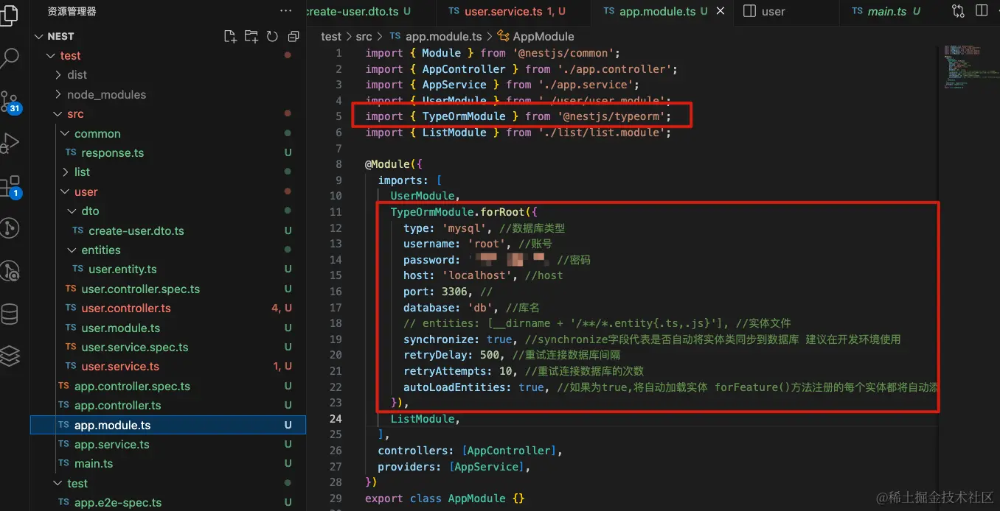
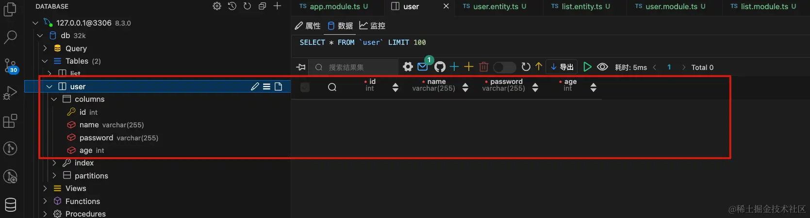
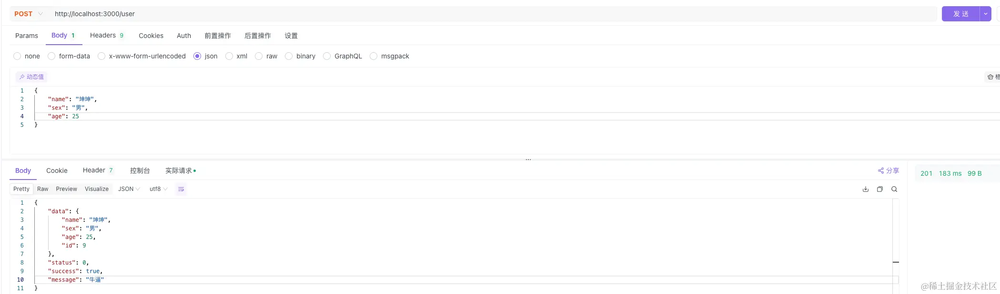
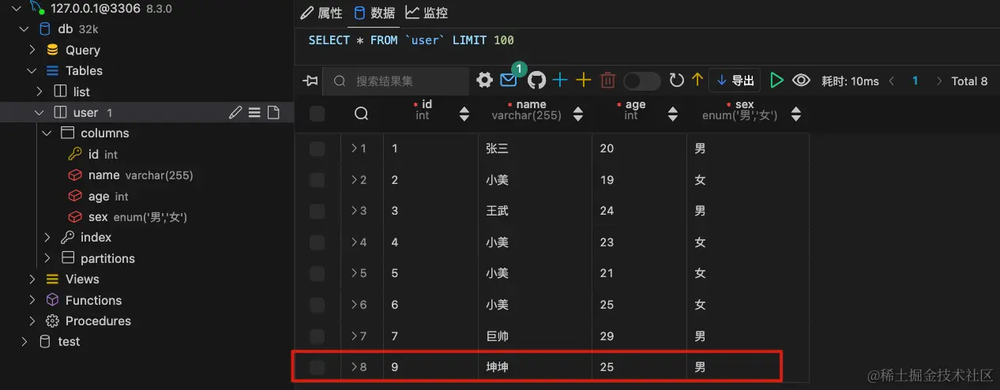
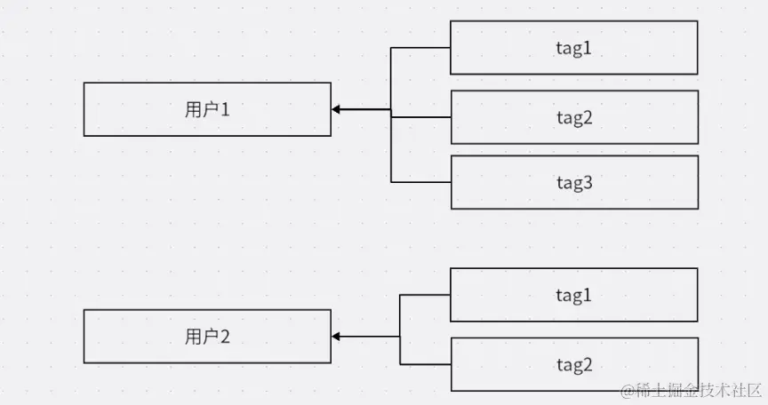
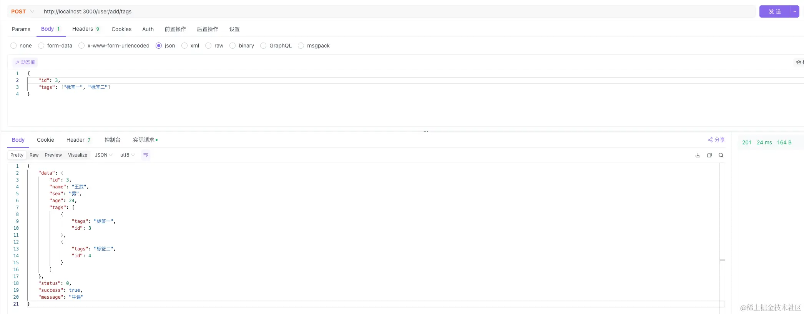
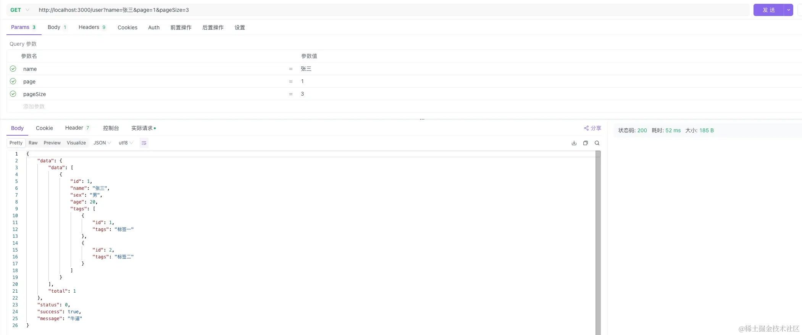

### 一、什么是 ORM

> ORM 是 "Object-Relational Mapping" 的缩写，中文意思是 "对象关系映射"。这是一种在编程中用于将对象模型表示的程序中的数据与关系数据库中的数据进行映射的技术。ORM 允许开发者使用面向对象的方式来操作数据库——创建、查询、更新和删除数据，而不需要编写复杂的 SQL 语句

- ORM 工具主要优点：
    - **简化数据库操作**：使用面向对象的方法来操作数据库，而不必编写 SQL 语句
    - **提高代码的可维护性**：将数据库操作封装在对象中，ORM 有助于保持代码的清晰和组织
    - **减少重复代码**：可以自动处理一些常见的数据库操作，减少需要编写的代码量
    - **数据库无关性**：允许开发者编写不依赖于特定数据库系统的代码，提高了应用的可移植性
    - **数据模型的一致性**：数据模型可以更一致地在应用程序中使用

- ORM 工具通常提供了以下功能：
    - **实体映射**：将数据库表映射为应用程序中的类（Entity）
    - **字段映射**：将数据库表的列映射为类的属性
    - **关系映射**：处理表之间的关联，如一对一、一对多和多对多关系
    - **查询构建**：提供构建 SQL 查询的高级接口，例如方法链或构造器模式
    - **数据验证和转换**：在将数据保存到数据库之前，自动验证和转换数据类型

- TypeORM 是什么
    - 在Node.js中，有多种ORM工具可供选择，比如 Sequelize、TypeORM、Prisma、Mongoose、Knex.js
    - Sequelize 和 TypeORM 因为它们的成熟度和广泛的社区支持，可能是用户量较多的ORM工具

### 二、连接数据库

> 本章以 mysql 数据库为例，[Mac安装MySQL](https://juejin.cn/post/7328224233284337714?searchId=20240401141933D8A3F35AB96ADB150B6B "https://juejin.cn/post/7328224233284337714?searchId=20240401141933D8A3F35AB96ADB150B6B")

> 在 vscode 中可以安装 Database Client 插件配合使用

- 安装依赖


```js
npm install --save @nestjs/typeorm typeorm mysql2
```

- 在 app.module.ts 文件中进行引入




```js
TypeOrmModule.forRoot({
      type: 'mysql', //数据库类型
      username: 'root', //账号
      password: 'XXXXXXX', //密码
      host: 'localhost', //host
      port: 3306, //
      database: 'db', //库名
      // entities: [__dirname + '/**/*.entity{.ts,.js}'], //实体文件
      synchronize: true, //synchronize字段代表是否自动将实体类同步到数据库 建议在开发环境使用
      retryDelay: 500, //重试连接数据库间隔
      retryAttempts: 10, //重试连接数据库的次数
      autoLoadEntities: true, //如果为true,将自动加载实体 forFeature()方法注册的每个实体都将自动添加到配置对象的实体数组中
})
```
- 然后通过`nest g res user`创建一个应用程序，`/user/entities` 即是存放实体的地方，后面会介绍实体
- 在 user.entity.ts 文件中定义实体


```js
import { Entity, Column, PrimaryGeneratedColumn } from 'typeorm';

@Entity()
export class User {
  @PrimaryGeneratedColumn()
  id: number;

  @Column()
  name: string;

  @Column()
  password: string;

  @Column()
  age: number;
}
```
- 在 user.module.ts 文件中关联实体 `TypeOrmModule.forFeature([User])`


```js
import { Module } from '@nestjs/common';
import { UserService } from './user.service';
import { UserController } from './user.controller';
import { User } from './entities/user.entity';
import { TypeOrmModule } from '@nestjs/typeorm';

@Module({
  imports: [TypeOrmModule.forFeature([User])],
  controllers: [UserController],
  providers: [UserService],
})
export class UserModule {}
```
- 重新启动服务，就可以在数据库中创建一个表




### 三、什么是实体

> 实体（Entity）是一个核心概念，它代表数据库中的一个表。实体是ORM中映射数据库表的类，它允许你以面向对象的方式与数据库进行交互


```js
import { Entity, Column, PrimaryGeneratedColumn } from 'typeorm';

@Entity()
export class User {
  @PrimaryGeneratedColumn()
  id: number;

  @Column()
  name: string;

  @Column()
  password: string;

  @Column()
  age: number;
}
```
- 在上面 demo 中，`User` 类是一个实体，映射到数据库中的 `user` 表
- **主列**，自动递增的主键


```js
@PrimaryGeneratedColumn()
id:number

// 自动递增的 uuid
@PrimaryGeneratedColumn("uuid")
id:number
```
- **列类型**，和 sql 类型一致


```js
@Column({type:"varchar",length:200})
password: string
 
@Column({ type: "int"})
age: number
 
@CreateDateColumn({type:"timestamp"})
create_time:Date
```
- **自动生成列**

```js
@Generated('uuid')
uuid:string
```
- **枚举列**


```js
  @Column({
    type:"enum",
    enum:['1','2','3','4'],
    default:'1'
  })
  xx:string
```
- **列选项**


```js
    @Column({
        type:"varchar",
        name:"ipaaa", //数据库表中的列名
        nullable:true, //在数据库中使列NULL或NOT NULL。 默认情况下，列是nullable：false
        comment:"注释",
        select:true,  //定义在进行查询时是否默认隐藏此列。 设置为false时，列数据不会显示标准查询。 默认情况下，列是select：true
        default:"xxxx", //加数据库级列的DEFAULT值
        primary:false, //将列标记为主要列。 使用方式和@ PrimaryColumn相同。
        update:true, //指示"save"操作是否更新列值。如果为false，则只能在第一次插入对象时编写该值。 默认值为"true"
        collation:"", //定义列排序规则。
    })
    ip:string
```
- **simple-array** 列类型，可以将原始数组值存储在单个字符串列中，所有值都以逗号分隔


```js
@Entity()
export class User {
    @PrimaryGeneratedColumn()
    id: number;
 
    @Column("simple-array")
    names: string[];
}
```

- **simple-json** 列类型，可以存储任何可以通过 JSON.stringify 存储在数据库中的值


```js
@Entity()
export class User {
    @PrimaryGeneratedColumn()
    id: number;
 
    @Column("simple-json")
    profile: { name: string; nickname: string };
}
```

### 四、第一个CURD

- 创建一个实体


```js
import { Entity, Column, PrimaryGeneratedColumn } from 'typeorm';

@Entity()
export class User {
  @PrimaryGeneratedColumn()
  id: number;

  @Column()
  name: string;

  @Column({
    type: 'enum',
    enum: ['男', '女'],
    default: '男',
  })
  sex: string;

  @Column()
  age: number;
}
```

- 实现增删改查，分别对应 save delete update find


```js
import { Injectable } from '@nestjs/common';
import { CreateUserDto } from './dto/create-user.dto';
import { Repository, Like } from 'typeorm';
import { InjectRepository } from '@nestjs/typeorm';
import { User } from './entities/user.entity';

@Injectable()
export class UserService {
  constructor(
    @InjectRepository(User) private readonly user: Repository<User>,
  ) {}
  // 添加
  create(createUserDto: CreateUserDto) {
    const data = new User();
    data.name = createUserDto.name;
    data.sex = createUserDto.sex;
    data.age = createUserDto.age;
    return this.user.save(data);
  }
  // 查询
  async findAll(query: { name: string, page: number, pageSize: number }) {
    const data = await this.user.find({
      where: {
        // Like 用于模糊搜索
        name: Like(`%${query.name}%`),
      },
      order: {
        id: 'DESC',
      },
      skip: (query.page - 1) * query.pageSize,
      take: query.pageSize,
    });
    const total = await this.user.count({
      where: {
        name: Like(`%${query.name}%`),
      },
    });
    return {
      data,
      total,
    };
  }
  // 修改
  update(id: number, updateUser: any) {
    return this.user.update(id, updateUser);
  }
  // 删除
  remove(id: number) {
    return this.user.delete(id);
  }
}
```
- create-user.dto.ts 文件，用于请求数据验证，当然也可以实现其他功能，比如数据转换等


```js
export class CreateUserDto {
  name: string;

  sex: string;

  age: number;
}
```

- 实现控制器部分


```js
import { Controller, Get, Post, Body, Query, Param, Delete } from '@nestjs/common';
import { UserService } from './user.service';
import { CreateUserDto } from './dto/create-user.dto';

@Controller('user')
export class UserController {
  constructor(private readonly userService: UserService) {}

  @Post()
  create(@Body() createUserDto: CreateUserDto) {
    return this.userService.create(createUserDto);
  }

  @Get()
  findAll(@Query() query: { name: string, page: number, pageSize: number }) {
    return this.userService.findAll(query);
  }

  @Post('/update')
  update(@Body('id') id: string, @Body('updateUser') updateUser: any) {
    return this.userService.update(+id, updateUser);
  }

  @Get('/remove')
  remove(@Query('id') id: string) {
    return this.userService.remove(+id);
  }
}
```
- 然后启动服务，就可以通过`http://localhost:3000/user`对接口进行访问，使用 Apifox 工具
- 调用添加数据的接口








### 五、多表连查

- 现设计一个表 Tags ，与 User 关联，对应关系如下




- 设计对应的实体
- User 对 Tags 是一对多的关系，需使用 `OneToMany`


```js
import { Entity, Column, PrimaryGeneratedColumn, OneToMany } from 'typeorm';
import { Tags } from './tags.entity';

@Entity()
export class User {
  @PrimaryGeneratedColumn()
  id: number;

  @Column()
  name: string;

  @Column({
    type: 'enum',
    enum: ['男', '女'],
    default: '男',
  })
  sex: string;

  @Column()
  age: number;

  @OneToMany(() => Tags, (tags) => tags.user)
  tags: Tags[];
}
```
- Tags 对 User 是多对一的关系，需使用 `ManyToOne`


```js
import { Entity, Column, PrimaryGeneratedColumn, JoinColumn, ManyToOne } from 'typeorm';
import { User } from './user.entity';

@Entity()
export class Tags {
  @PrimaryGeneratedColumn()
  id: number;

  @Column()
  tags: string;

  @ManyToOne(() => User, (user) => user.tags)
  @JoinColumn()
  user: User;
}
```
- Tags 实体也需要对其引入


```js
import { Module } from '@nestjs/common';
import { UserService } from './user.service';
import { UserController } from './user.controller';
import { User } from './entities/user.entity';
import { TypeOrmModule } from '@nestjs/typeorm';
import { Tags } from './entities/tags.entity';

@Module({
  imports: [TypeOrmModule.forFeature([User, Tags])],
  controllers: [UserController],
  providers: [UserService],
})
export class UserModule {}
```
- 对应的服务能力


```js
import { Injectable } from '@nestjs/common';
import { CreateUserDto } from './dto/create-user.dto';
import { Repository, Like } from 'typeorm';
import { InjectRepository } from '@nestjs/typeorm';
import { User } from './entities/user.entity';
import { Tags } from './entities/tags.entity';

@Injectable()
export class UserService {
  constructor(
    @InjectRepository(User) private readonly user: Repository<User>,
    @InjectRepository(Tags) private readonly tag: Repository<Tags>
  ) {}
  
  // 查询
  async findAll(query: { name: string, page: number, pageSize: number }) {
    const data = await this.user.find({
      //查询的时候如果需要联合查询需要增加 relations
      relations: ['tags'],
      where: {
        name: Like(`%${query.name}%`),
      },
      order: {
        id: 'DESC',
      },
      skip: (query.page - 1) * query.pageSize,
      take: query.pageSize,
    });
    const total = await this.user.count({
      where: {
        name: Like(`%${query.name}%`),
      },
    });
    return {
      data,
      total,
    };
  }

  //通过前端传入的id 查到当前id 的用户信息，然后拿到前端传入的tags [tag1,tag2,tag3]
  // 进行遍历 给tag实例进行赋值 然后调用保存方法添加tag 添加完之后 通过 tagList 保存该tag类
  // 最后把tagList 赋给 user类的tags属性 然后重新调用save 进行更新

  async addTags(params: { tags: string[], id: number }) {
    const userInfo = await this.user.findOne({ where: { id: params.id } });
    const tagList: Tags[] = [];
    for (let i = 0; i < params.tags.length; i++) {
      const T = new Tags();
      T.tags = params.tags[i];
      await this.tag.save(T);
      tagList.push(T);
    }
    userInfo.tags = tagList;
    return this.user.save(userInfo);
  }
}
```
- 对应的控制器


```js
import { Controller, Get, Post, Body, Query, Param, Delete } from '@nestjs/common';
import { UserService } from './user.service';
import { CreateUserDto } from './dto/create-user.dto';

@Controller('user')
export class UserController {
  constructor(private readonly userService: UserService) {}

  @Get()
  findAll(@Query() query: { name: string, page: number, pageSize: number }) {
    return this.userService.findAll(query);
  }

  @Post('/add/tags')
  addTags(@Body() params: { tags: string[], id: number }) {
    return this.userService.addTags(params);
  }
}
```

- 给用户添加 tag




- 查询对应的用户





